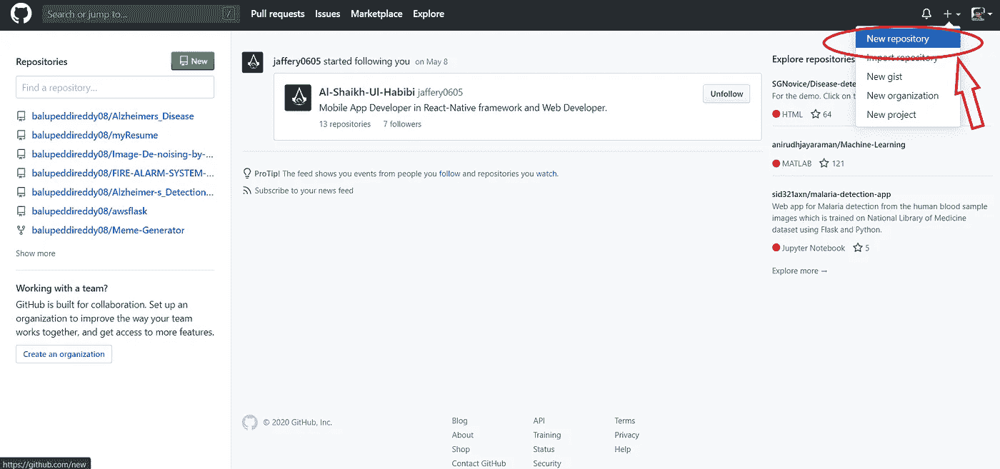
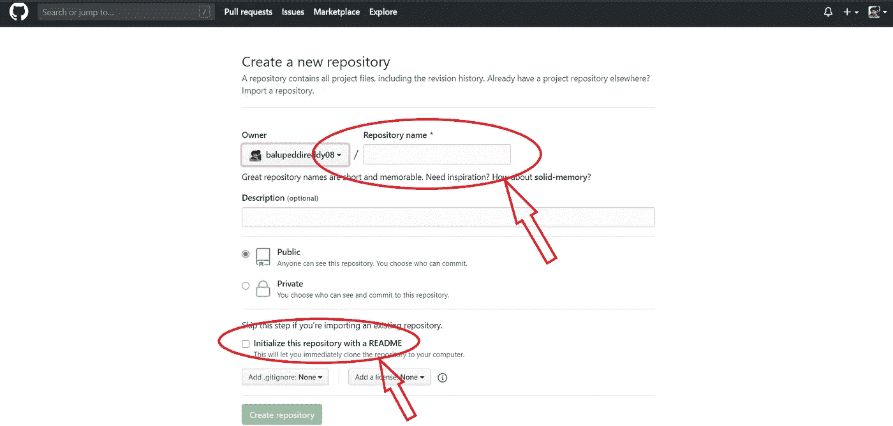
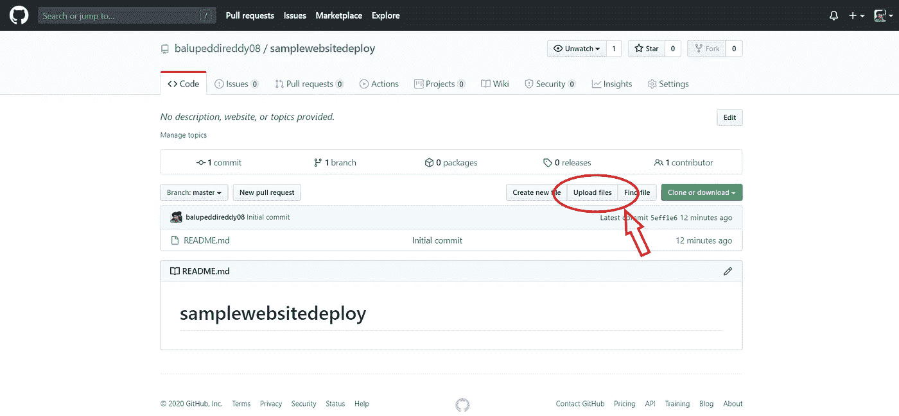
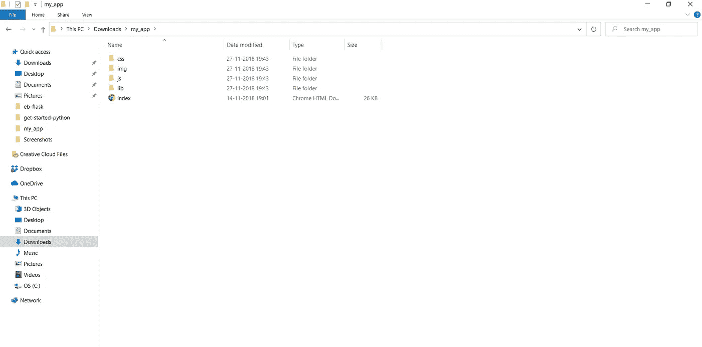
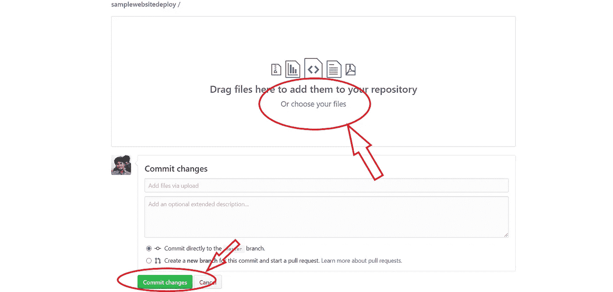
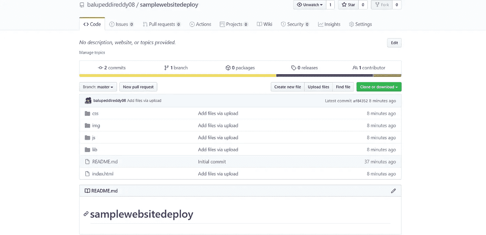
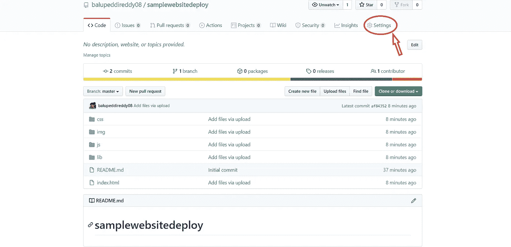
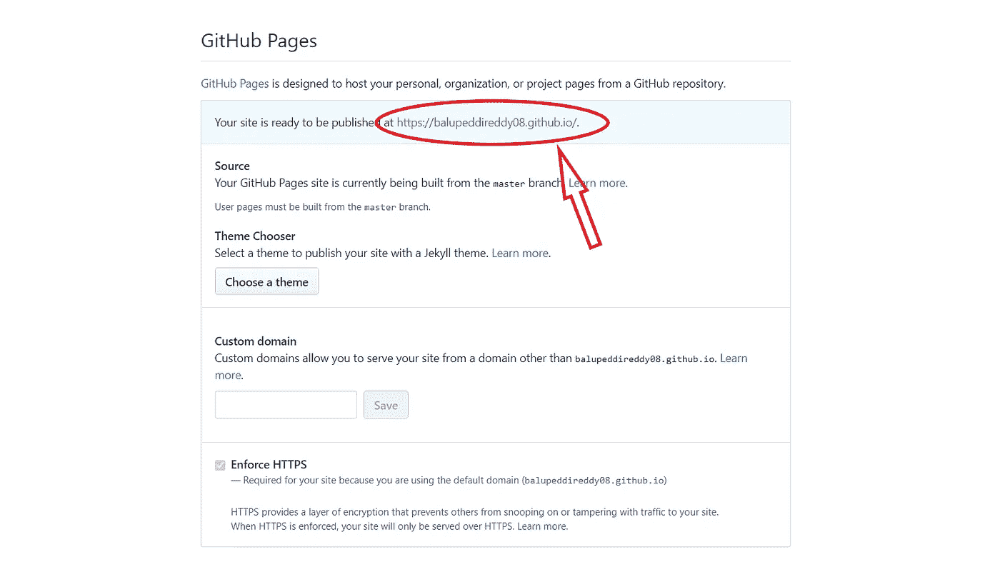
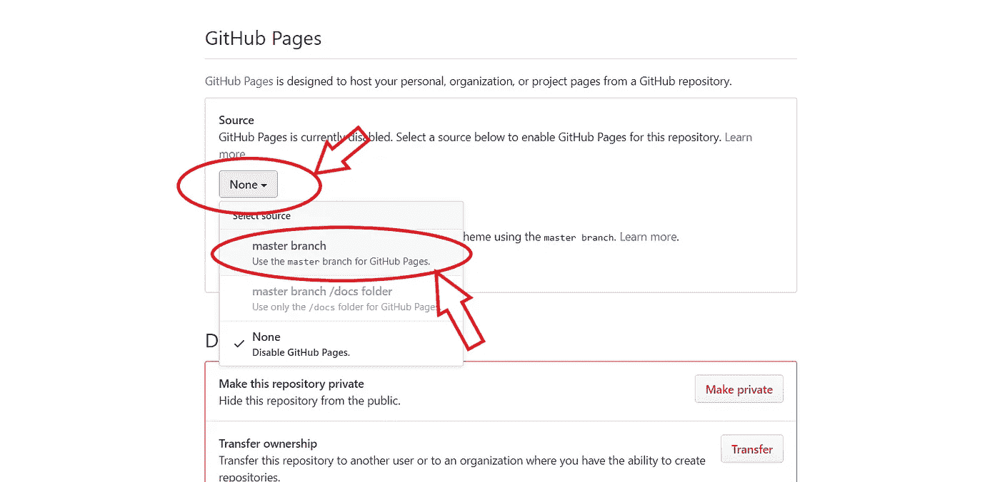
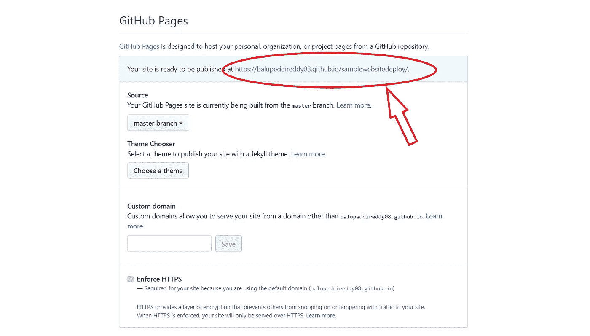

# 使用 Github 部署静态网站

> 原文：<https://pub.towardsai.net/how-to-deploy-a-static-website-using-github-58c9df22127?source=collection_archive---------0----------------------->

## [编程](https://towardsai.net/p/category/programming)

## 立即制作您的网站并公开分享。

## 什么是 Github？

GitHub 是一个软件开发平台。它提供无限的云存储，支持所有编程语言。
GitHub 是一个开源平台，任何人都可以访问它。很多人分享和下载 GitHub 中的作品，他们已经这样做了。

如果项目是通过公共存储库上传的，那么全世界都可以看到它。
在 GitHub 上可以获得大量曝光。这样你就可以找到其他人的代码并在你的项目中使用。

## 这篇文章是关于什么的？

这篇文章完全是关于使用 GitHub 以两种方式部署静态网站的:

> 使用主分支
> 
> 不使用主分支

任何复杂的网站都可以链接这么多 CSSJavaScript 文件可以部署在 GitHub 中。

## 突出

文件夹的对齐至关重要。
HTML 页面名称必须是“index . HTML”。
在 Github 中，一个资源库只能部署一个静态 HTML 文件。HTML 文件可以与许多 CSS、JavaScript、Bootstrap 和 Jquery 文件链接。

## 部署网站背后的意图

每个人都想要一个网址来与世界分享他们的网站。你可能需要一个网站来展示你对自己风格的想法。你可以设计一个网站来展示你的作品集和组织你的项目。

## 我们开始吧

在本文中，我将向您展示如何在 GitHub 上部署网站，在那里您可以获得一个公共 URL 来共享您的网站。

## 1.创建 GitHub 帐户

确保您有一个 GitHub 帐户。在 GitHub 中注册创建一个帐户。如果您有 Github 帐户，请忽略此步骤。通过创建这个 Github 帐户，你将获得无限的空间来上传数据。

## 2.创建新的 GitHub 资源库

点击屏幕右上角的+按钮，创建一个新的存储库。根据 GitHub 的术语，一个文件夹被称为存储库。

## 3.命名您的 GitHub 存储库

您需要命名您的存储库。这是最关键的一步。根据存储库的名称，将生成您的网站 URL。

> 如果您以[username].github.io
> 的形式输入“名称”，那么您的网站链接将生成为[https://[username]. github . io/](/[username].github.io/)

## 推荐:

> 如果您根据所需的存储库名称
> 输入“Name”，那么您的网站链接将生成为[https://[username]. github . io/[给定的](https://[username].github.io/[given)存储库名称]/

这完全是基于您对使用自述文件初始化存储库的兴趣，这将让您立即将存储库克隆到您的计算机上。在描述部分写下你的项目。存储库应处于公共模式，以获得 URL 访问权限。

## 4.上传你的 GitHub 文件

您已经看到了在我的本地(计算机)打开的网站。在将文件上传到 GitHub 时，不应更改已有的对齐方式。
您可以随意命名文件。但是，上传时请遵循标准格式。
HTML 文件的名称必须是“index.html”

这是我的本地(计算机)中“samplewebsitedeploy”文件的对齐方式。

逐个拖放所有文件，然后单击“提交更改”按钮。

在同样的排列中，你应该把它们上传到 GitHub 中

## 5.发布您的网站

这是你最期待的部分。点击“设置”按钮。

向下滚动，直到您看到“GitHub 页面”，如果您输入的“名称”是[username].github.io

如果您按照所需的存储库名称输入“Name ”,现在单击“Source”下拉菜单，然后单击“master branch”按钮。

冷静一下，等一会儿，刷新页面，直到看到网站的网址。

恭喜你，你的网站已经准备好了！！！🔥😉

## 6.共享您的网站

您可以使用生成的 URL 查看您的网站。点击链接后，您将访问该网站。

如果你想对你的网站进行修改，你只需要提交修改并将文件推送到你的存储库中。您的更改将自动显示。

# 快乐学习！😎