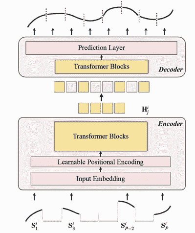
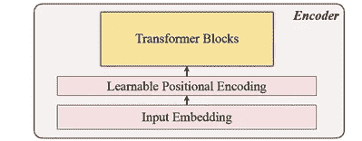
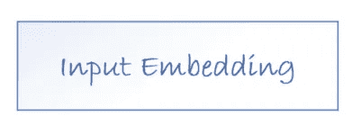
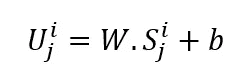
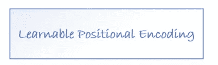
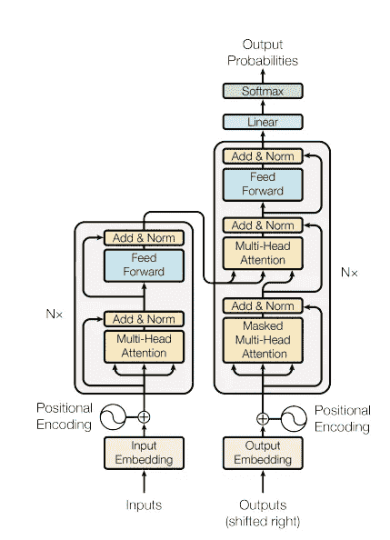
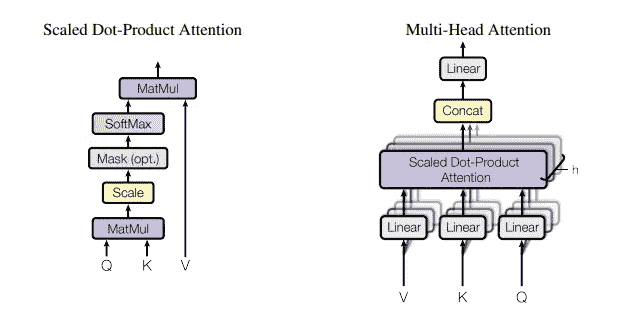
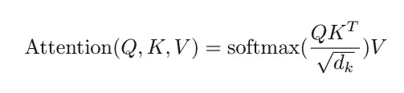
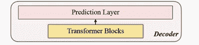
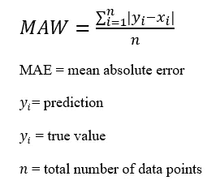

# 如何为时间序列设计一个预训练模型(TSFormer)？

> 原文：<https://pub.towardsai.net/how-to-design-a-pre-training-model-tsformer-for-time-series-c2a177ebb51d?source=collection_archive---------1----------------------->

## 最近，在 NLP(自然语言处理)任务中有许多尝试，其中大多数都利用了预先训练的模型。NLP 任务的提要大部分是由人类创造的数据，充满了丰富和优秀的信息，几乎可以被认为是一个数据单元。在时间序列预测中，我们可以感觉到缺乏这样的预训练模型。为什么不能像在 NLP 中那样在时间序列中利用这种优势？！本文是提出这种模型的详细说明。该模型是通过考虑两个观点开发的，从输入到输出有 4 个部分。此外，为了更好地理解，还添加了 Python 代码。

# t 变压器

*   它是一个基于**rans****原**ts 原*****的*无监督预训练*模型***
*   *这个模型能够捕捉我们数据中非常长的依赖关系。*

# **NLP 和时间序列:**

*在某种程度上，NLP 信息和时间序列数据是**同**。它们都是**顺序数据**和**局部敏感数据，**表示与其下一个/前一个数据点相关。顺便说一下，有一些**差异**我将在下面说:*

*正如我们为 NLP 任务所做的那样，在提出我们的**预训练模型**时，我们应该考虑两个事实(事实上，这些是差异):*

1.  *时间序列数据中的密度比自然语言中的密度低得多*
2.  *我们需要一个比 NLP 数据更长序列长度的时间序列数据*

# ****t 从零开始转换****

*它的过程和其他所有模型一样，就像一次旅行(没什么新意，但视角很好)。正如我给你讲过的 ***MAE*** 的策略，主要架构是经过一个**编码器**然后处理成一个**解码器**，最后只是重构目标。*

*您可以在图 1 中看到它的架构:*

**

*图 1 |【[来源](https://ui.adsabs.harvard.edu/abs/2022arXiv220609113S/abstract)*

> *就这样，伙计！！没有比这个数字更多的了。😆然而；如果您想知道它是如何工作的，我将在下一节中举例说明:*

*流程:1。**2*掩蔽*2**。 ***编码*** 3。 ***解码*** 4。 ***重建目标****

## *1.掩饰*

**

*图 2 | [来源](https://ui.adsabs.harvard.edu/abs/2022arXiv220609113S/abstract)*

*这是为下一步(编码器)提供输入的第一步。我们可以看到，**输入序列**(*)已经被分配成长度为***【l】***的 ***P* 面片**。因此，用于预测下一时间步的**滑动窗口**的长度为***P***x***L***。**

****制作比** ( ***r*** )是 **75** % ( *比较高吧？);*这仅仅是关于制作一个**自监督任务**并使**编码器**更**高效**。**

**这样做的主要原因(*我指的是修补输入序列*)是:**

1.  ****段**(即补丁)比**分离点**更好**。****
2.  **利用**下游模型**使得**更简单**(stg nn 将一个单元段作为输入)**
3.  **这样，我们可以**减小编码器**输入**的**尺寸**。****

## **2.编码**

****

**图 3 | [ [来源](https://ui.adsabs.harvard.edu/abs/2022arXiv220609113S/abstract) ]**

**如你所见，这是一个 ***输入嵌入、位置编码和变换块*** 的顺序。编码器可以只在**未屏蔽的补丁**上执行。*等等！！那是什么？？***

*****输入嵌入*****

****

*****Q)*** 上一步是关于遮罩，现在我说我们需要无遮罩的？？！！**

*****A)* 输入嵌入**。**

*****问)*** 如何？**

**a)它实际上是一个**线性投影**，将未遮掩转换为**潜在空间**。其公式如下所示:**

****

**Eq 1。**

*****W*** 和 ***b*** 是**可学习参数**和 ***U*** 是 ***d* 隐藏维度**中的**模型输入向量**。**

****位置编码****

****

**简单的**位置编码层**用于附加**新的顺序信息**。添加了术语“**可学习的**”，这有助于显示**比 ***正弦*** 性能更好。同样，**可学习的位置**嵌入显示了时间序列的良好**结果**。****

****变压器块****

****

**研究人员使用了 **4 层变形金刚**，仅低于计算机视觉和 NLP 任务中的常见量。此处所示的变压器类型是最常用的变压器架构。你可以在 2017 年出版的《[注意力是你所需要的全部](https://arxiv.org/pdf/1706.03762)》中通读。顺便说一下，我要给你一个总结(这个简短的说明来自我以前的一篇文章，[Informer:Beyond Efficient Transformer for Long Sequence Time-Series Forecasting’](https://rezayazdanfar.medium.com/informer-beyond-efficient-transformer-for-long-sequence-time-series-forecasting-4eeabb669eb)):**

**变形金刚是新的深度学习模型，呈现的速度越来越快。他们采用了**自我关注**的机制，并在 NLP 和计算机视觉的挑战性任务中显示出模型性能的显著提高。变压器架构可以设想成两部分，称为 ***编码器*** 和 ***解码器****，如图 4 所示，如下:***

******

***图 4。变压器架构| [ [来源](https://arxiv.org/abs/1706.03762) ]***

***变形金刚的要点是独立于地域。与 CNN 等其他流行模式相比，《变形金刚》不受本地化的限制。此外，我们不建议在《变形金刚》中使用任何 CNN 架构；相反，我们在《变形金刚》中使用基于注意力的结构，这让我们能够完成更好的结果。
注意力架构可以概括在图 5 中:***

******

***图 5(左)缩放的点积注意力。(右)多头注意力由几个并行运行的注意力层组成。|[来源](https://arxiv.org/abs/1706.03762)***

***比例点积注意力的函数是 Eq。2***

******

***情商。2 [ [来源](https://arxiv.org/abs/1706.03762)***

***q(查询)，K(键)，V(向量)是我们注意力的输入。***

***对于变形金刚完整的基本实现，请看"*。"它让你对注意力和变形金刚有了很大的了解；事实上，我第一次通过这篇论文完整地理解了这个重要的模型。****

> ***我觉得这个总结量足够变形金刚用了***

## ***3.解码***

******

***图 6 | [ [来源](https://ui.adsabs.harvard.edu/abs/2022arXiv220609113S/abstract)***

***解码器包括一系列变换器块。它适用于所有补丁集(屏蔽令牌等)。).相比之下， **MAEs** ( *屏蔽自动编码器*)，由于补丁已经有位置信息，所以没有位置嵌入。**层数**正好是**一层**。之后，简单的 **MLPs** (多层感知)被使用(*我想确定没有必要说明 MLPs😉*)，使得**输出长度*等于*** 到**每个面片**。***

## **4.重建目标**

****

**图 7 | [ [来源](https://ui.adsabs.harvard.edu/abs/2022arXiv220609113S/abstract) ]**

**并行地，**计算**超过**被遮蔽的面片**是针对**的每个数据点** ( ***i*** )。另外，选择 **mae** ( ***平均绝对误差*** )作为**主序列**和**重建序列**的**损失函数**。**

****

**Eq 3。**

> **就是这样！！你做到了！不太难，是吗？？！😉😉**
> 
> **现在，让我们来看看架构:**

****

**图 8 |【[来源](https://ui.adsabs.harvard.edu/abs/2022arXiv220609113S/abstract)**

# **结束了**

> ****代码**和**架构**的来源分别是[这个](https://github.com/zezhishao/STEP)和[这个](https://ui.adsabs.harvard.edu/abs/2022arXiv220609113S/abstract)。**
> 
> ***可以在****Twitter***[*这里*](https://twitter.com/reza__yazdanfar) *或者****LinkedIn***[*这里*](http://www.linkedin.com/in/rezayazdanfar) *联系我。最后，如果你觉得这篇文章有趣又有用，可以在* ***中*** *上* ***关注*** *我，获取更多来自我的文章。***