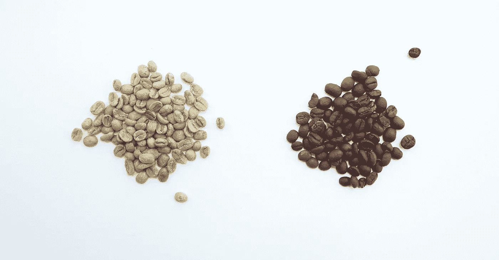
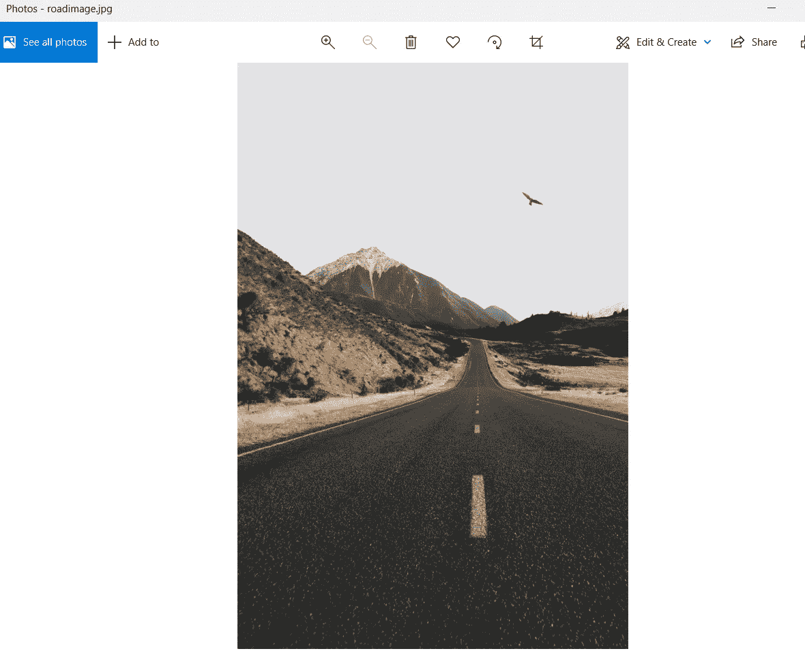
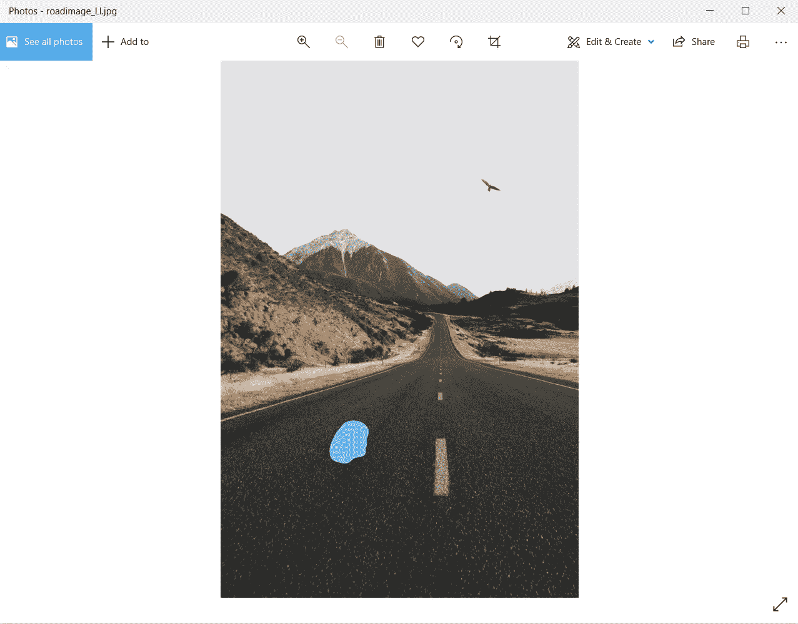

# 如何用 Python 检测图像差异

> 原文：<https://pub.towardsai.net/how-to-detect-image-differences-with-python-9ea04859084c?source=collection_archive---------0----------------------->

## [计算机科学](https://towardsai.net/p/category/computer-science)



由[咖啡极客](https://unsplash.com/@coffeegeek?utm_source=unsplash&utm_medium=referral&utm_content=creditCopyText)在 [Unsplash](https://unsplash.com/s/photos/compare?utm_source=unsplash&utm_medium=referral&utm_content=creditCopyText) 上拍摄的照片

## I .下载您的图像

## 二。导入您的数据

## 二。侦查

## 三。结论

## I .下载您的图像

请点击此链接下载图片。

[](https://unsplash.com/photos/iIrB37J5yfA) [## 迈克尔·香农在 Unsplash 上拍摄的照片

### 下载这个免费的高清照片的道路，阿瑟的通行证，山和新西兰在阿瑟的通行证，新西兰由迈克尔…

unsplash.com](https://unsplash.com/photos/iIrB37J5yfA) 

我下载了它，并在我的电脑上保存为 roadimage.jpg。一旦我打开它，它看起来是这样的:



道路图像

然后我拍了这张照片，并复制了一份。然后我把它保存为 roadimage_Li。

此时，我通过在上面画一个点来编辑图像:



## 二。导入您的数据

启动您的 Python 编辑器。

您将要用来导入图像的包是 cv2。

为了安装这个包，我使用了一条蟒蛇。使用 anaconda 时，我必须打开 anaconda 命令提示符并键入:

```
conda install -c menpo opencv
```

如果使用另一个 python 编辑器，可以使用常规命令提示符和以下语法:

```
pip install opencv-python
```

现在，返回 Python 编辑器，键入以下内容来导入包:

```
import cv2
```

最后，是时候引入图像了:

```
img = cv2.imread(r'C:\...\Pictures\roadimage.jpg')
img2 = cv2.imread(r'C:\...\Pictures\roadimage_LI.jpg')
```

## 二。侦查

好的，现在让我们开始检测。让我们导入 numpy:

```
import numpy as np
```

如果您打印(img ),它看起来会像这样:

[[[229 227 226]
【229 227 226】
【229 227 226】
…
【229 227 226】
【229 227 226】
【229 227 226】]

[[229 227 226]
【229 227 226】
【229 227 226】
…
【229 227 226】
【229 227 226】
【229 227 226】]

[[229 227 226]
【229 227 226】
【229 227 226】
…
【229 227 226】
【229 227 226】
【229 227 226】]

…

[[72 84 84]
【71 83 85】
【64 76 78】
…
【42 40 39】
【42 40 39】
【42 40 39】]

[[68 80 80]
【67 79 81】
【64 76 78】
…
【42 40 39】
【42 40 39】
【42 40 39】]

[[68 80 80]
【67 79 81】
【65 77 79】
…
【42 40 39】
【42 40 39】
【42 40 39】]]

让我们把它变平:

```
features = img.ravel()features2 = img2.ravel() 
```

现在让我们比较一下这些平面特征:

```
print((features==features2).all())
```

您将得到以下输出:

假的

正如你所看到的，这两个图像之间存在差异。

## 三。结论

图像变化检测的应用非常广泛。人们拍摄一条道路的卫星图像，观察这条道路随着时间的推移发生了什么变化，并从中得出一些结论。

图像的变化也让我们能够检测到其他环境中的变化，这些环境在很大程度上是静态的，以查看随着时间的推移是否有任何变化。

感谢阅读，

灰