# 如何使用可视化工具和统计方法检测异常值

> 原文：<https://pub.towardsai.net/how-to-detect-outliers-using-visualization-tools-and-statistical-methods-f475b6d99849?source=collection_archive---------0----------------------->

## 使用 Python 代码


Emile Perron 在 [Unsplash](https://unsplash.com?utm_source=medium&utm_medium=referral) 上的照片

## 什么是离群值？

离群值是距离其他数据值太远的数据值。数据异常值可能是自然发生的，也可能是由于不准确的测量、打字错误或系统故障造成的。与缺失值类似，离群值会破坏数据科学项目，并返回错误的结果或预测。

异常值也可能出现在倾斜的数据中，这些异常值是自然异常值。

## 离群值如何影响数据分布？

异常值会影响数据的平均值、标准差和四分位间距。如果我们在剔除异常值之前和之后计算这些统计数据，我们会发现不同的值。

## 离群值如何影响机器学习模型？

如果我们认为我们的异常值是自然的，而不是由于测量误差，我们应该将它们保留在我们的数据集中，并执行数据转换以规范化数据。此外，如果我们有一个包含一些异常值的大型数据集，我们应该保留它们，因为它们不会显著影响结果。

否则，如果我们非常确定异常值是由测量误差引起的，我们应该将它们从数据集中删除。剔除异常值的结果是，我们将减少数据集的大小，并将模型的适用性限制在所包含的测量范围内。丢弃自然异常值也可能导致模型不准确。

## 使用可视化工具检测异常值

“肉眼”很难发现异常值，除非您正在分析的数据是您非常擅长的领域。幸运的是，有一些可视化工具可以帮助完成这项任务。最常见的是箱线图和直方图。我们将看到每一个的例子。一如既往，第一步是加载库并导入/加载数据集。我们将使用[保险. csv.](/insurance.csv.)

```
import numpy as np
import pandas as pd
import seaborn as sns
import statistics
#Load dataset:
df = pd.read_csv('insurance.csv')
df
```

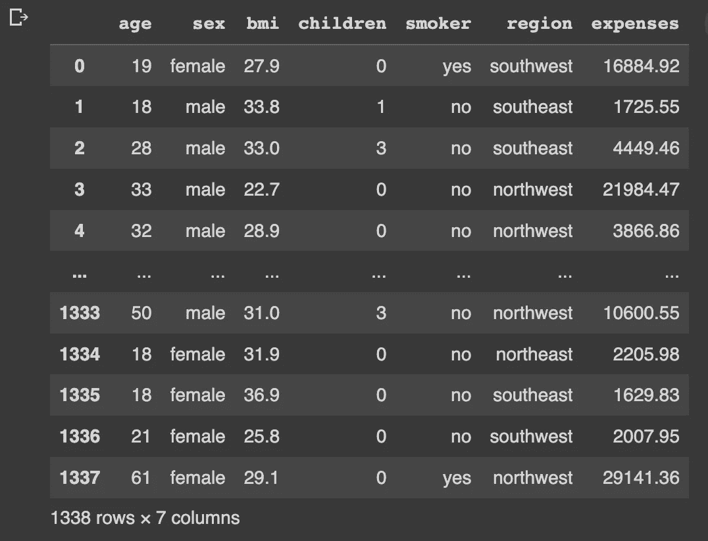

我们将检查年龄、身体质量指数和费用等变量的异常值。第一种方法是使用箱线图来表示数据分布:

```
**#BoxPlot for age, bmi and expenses:**
sns.boxplot(y="age", data=df)
sns.boxplot(y="bmi", data=df)
sns.boxplot(y="expenses", data=df)
```

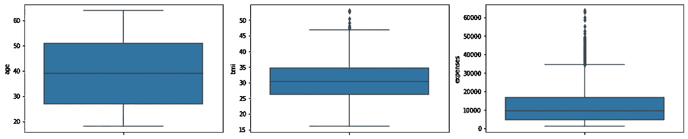

通过查看箱线图，我们可以看到，可变年龄没有异常值，可变身体质量指数在上界中有一些异常值，可变费用在上界中有几个异常值，这表明是一个偏态分布。为了检查偏斜分布，我们将使用直方图。

```
**#Histograms for age, bmi and expenses:**
sns.histplot(df, x="age", kde=True)
sns.histplot(df, x="bmi", kde=True)
sns.histplot(df, x="expenses", kde=True)
```

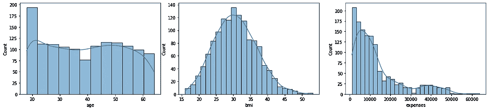

通过直方图，我们可以看到年龄变量具有均匀分布，身体质量指数具有接近正态分布，而费用具有偏斜分布。通过分析这两个图形表示，我们可以决定要排除哪些数据。对于年龄，我们不会排斥任何价值观。对于身体质量指数，我们将排除大于 47 的值，对于费用，我们将排除大于 50000 的值。

```
**#Drop outliers for bmi and expenses:**
df.drop(df[df['bmi'] >= 47].index, inplace = True)
df.drop(df[df['expenses'] >= 50000].index, inplace = True)
```

现在，如果我们再次检查箱线图和直方图:

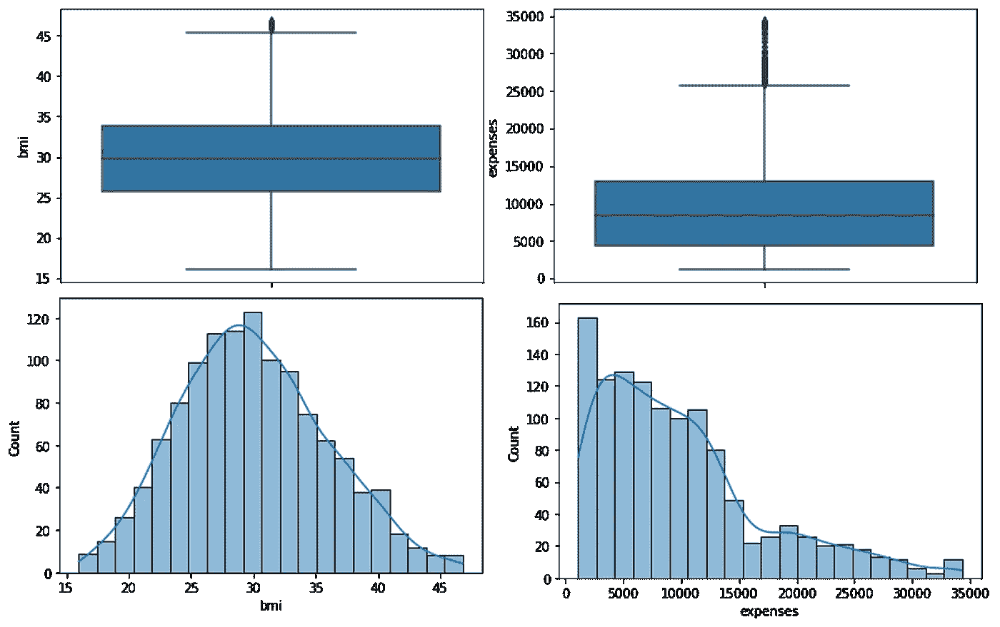

## 用统计方法检测异常值

检测异常值有两种主要的统计方法:使用 z 分数和使用四分位间距。我们将学会应用这两者。

***用 z 值检测异常值***

z 得分是一种数学变换，它根据每个观察值与平均值的距离对其进行分类。与平均值的距离以标准偏差(SD)来衡量。这样，如果我们有一个值是 1.59，我们知道观察值是平均值的 1.59 倍标准差。同样，如果我们的 z 得分值为-2.4，我们知道观察值低于平均值-2.4 个标准差。高于平均值±3SD 或低于平均值±3SD 的观察值被视为异常值。

我们将重新加载数据集，因为我们必须在前面的示例中对其进行更改。第一步是将我们的变量转换成 z 分数:

```
**#Reload dataset:**
df = pd.read_csv('insurance.csv')**#Compute mean and SD for variable age:** mean_age = statistics.mean(df['age'])
stdev_age = statistics.stdev(df['age'])**#Compute z score for variable age:** age_z_score = (df['age']-mean_age)/stdev_age**#Add the new age_z_score variable to df:** df['age_z_score'] = age_z_score.tolist()
```

现在，我们将检查是否有高于或低于-3SD 的值:

```
**#Check for values bellow -3SD:**
df.sort_values(by=['age_z_score'], ascending=True)
```

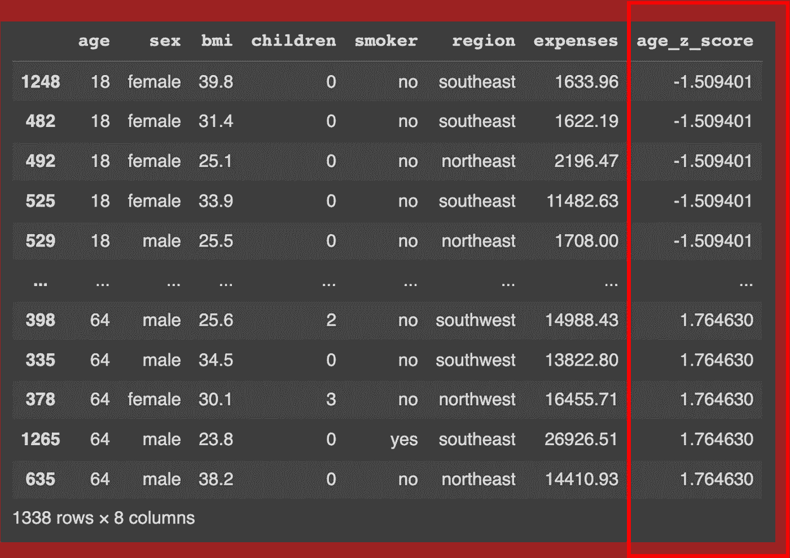

我们可以看到没有低于-3SD 的值。我们现在将检查大于 3SD 的值:

```
**#Check for values above 3SD:**
df.sort_values(by=['age_z_score'], ascending=False)
```

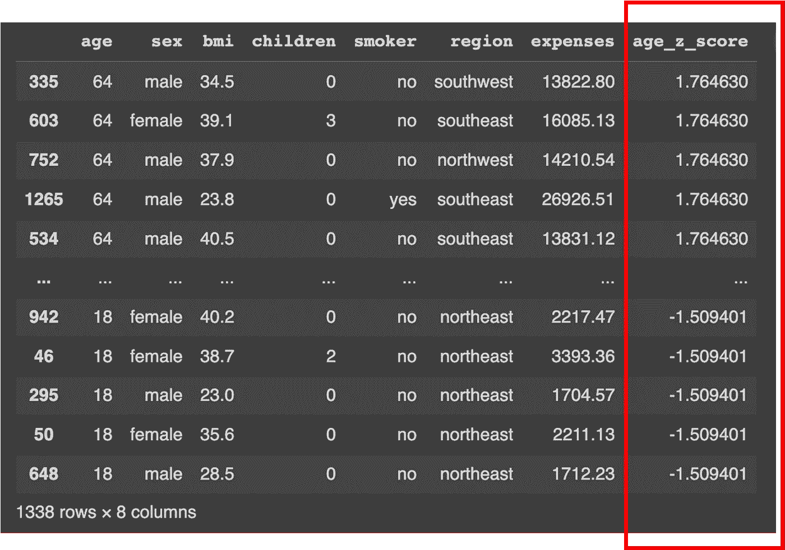

我们可以看到没有高于 3SD 的值。可变年龄没有异常值。现在我们将对变量身体质量指数做同样的处理:

```
**#Compute mean and SD for variable bmi:**
mean_bmi = statistics.mean(df['bmi'])
stdev_bmi = statistics.stdev(df['bmi'])**#Compute z score for variable bmi:**
bmi_z_score = (df['bmi']-mean_bmi)/stdev_bmi**#Add the new age_z_score variable to df:** df['bmi_z_score'] = bmi_z_score.tolist()**#Check for z-score bellow -3SD:**
df.sort_values(by=['bmi_z_score'], ascending=True)**#Check for z-score above 3SD:** df.sort_values(by=['bmi_z_score'], ascending=False)
```

这一次，我们将找到一些高于 3SD 的值:

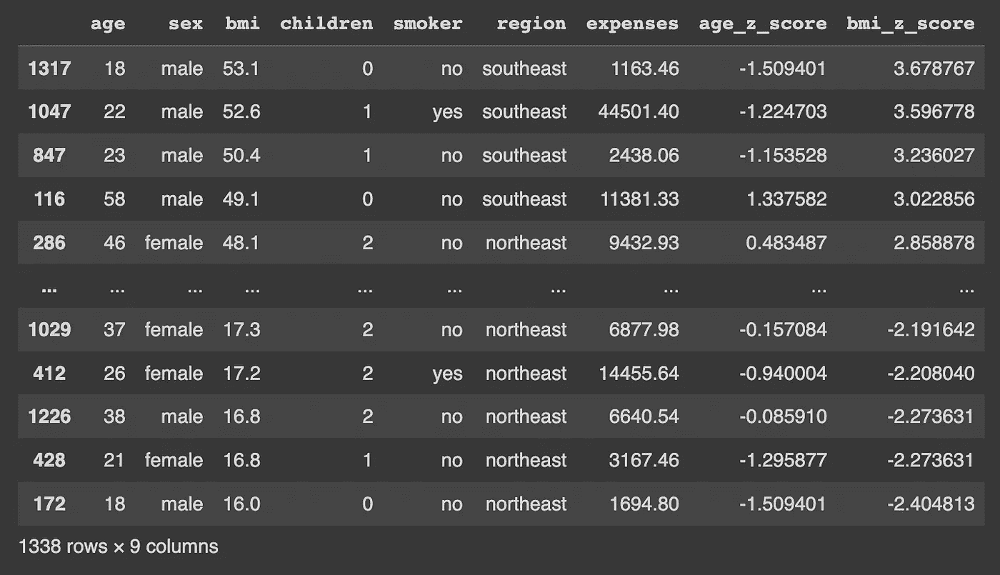

我们需要放弃它:

```
**#Drop values above 3SD:**
df.drop(df[df[‘bmi_z_score’] >= 3].index, inplace = True)
```

我们将把同样的技巧应用于费用:

```
**#Compute mean and SD for variable expenses:** mean_expenses = statistics.mean(df['expenses'])
stdev_expenses = statistics.stdev(df['expenses'])**#Compute z score for variable expenses:** expenses_z_score = (df['expenses']-mean_expenses)/stdev_expenses**#Add the new age_z_score variable to df:** df['expenses_z_score'] = expenses_z_score.tolist()**#Check for z-score bellow -3SD:**
df.sort_values(by=['expenses_z_score'], ascending=True)**#Check for z-score above 3SD:** df.sort_values(by=['expenses_z_score'], ascending=False)**#Drop values above 3SD:**
df.drop(df[df[‘expenses_z_score’] >= 3].index, inplace = True)
```

如果我们再次检查盒状图和直方图，我们将得到:

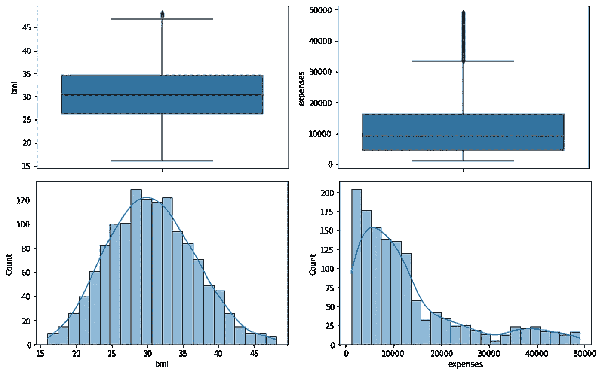

***用四分位范围检测异常值***

四分位数范围将数据按从低到高的顺序分为四个部分，如下图所示，每个部分包含相同数量的样本。第一个四分位数(Q1)是边界中数据点的值。这同样适用于 Q2 和第三季度。四分位范围(IQR)是两个中间部分的数据点(代表 50%的数据)。四分位数范围包含所有高于 Q1 但低于第三季度的数据点。如果该点高于 Q3 + (1.5 倍 IQR)，则存在较高的异常值，如果 Q1(1.5 倍 IQR)，则存在较低的异常值。

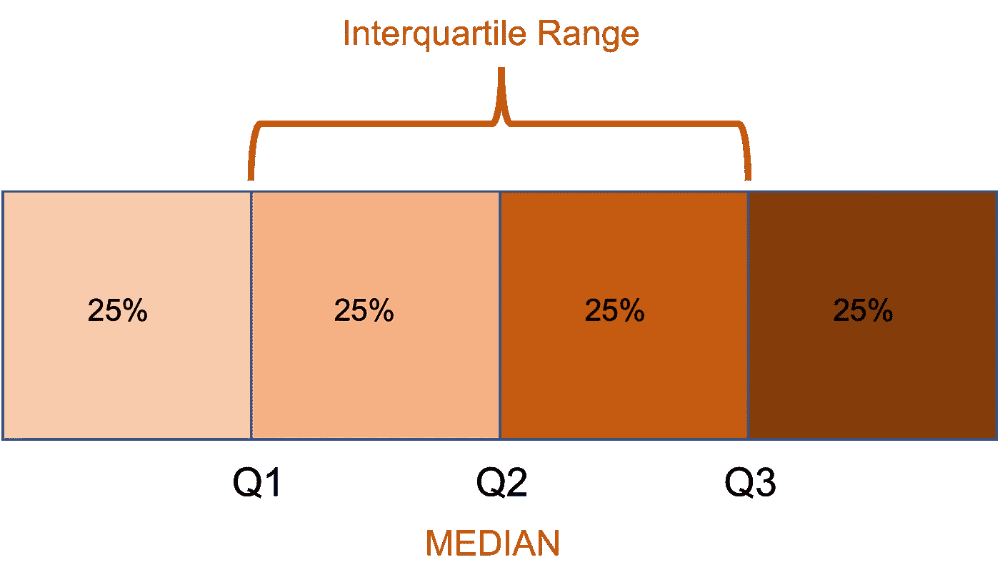

让我们用一些代码来练习:

```
**#Reload dataset:**
df = pd.read_csv('insurance.csv')**#calculate interquartile range of values in the 'age' column** q75_age, q25_age = np.percentile(df['age'], [75 ,25])
iqr_age = q75_age - q25_age
iqr_age**#Compute the boundaries for outlier detection:** age_h_bound = q75_age+(1.5*iqr_age)
age_l_bound = q25_age-(1.5*iqr_age)
print(age_h_bound)
print(age_l_bound)
```

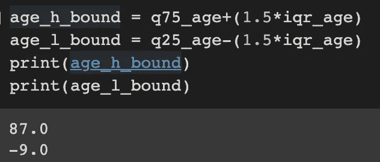

我们知道我们的异常值位于 87 以上或-9 以下:

```
**#Check for lower outliers:**
df.sort_values(by=['age'], ascending=True)
```

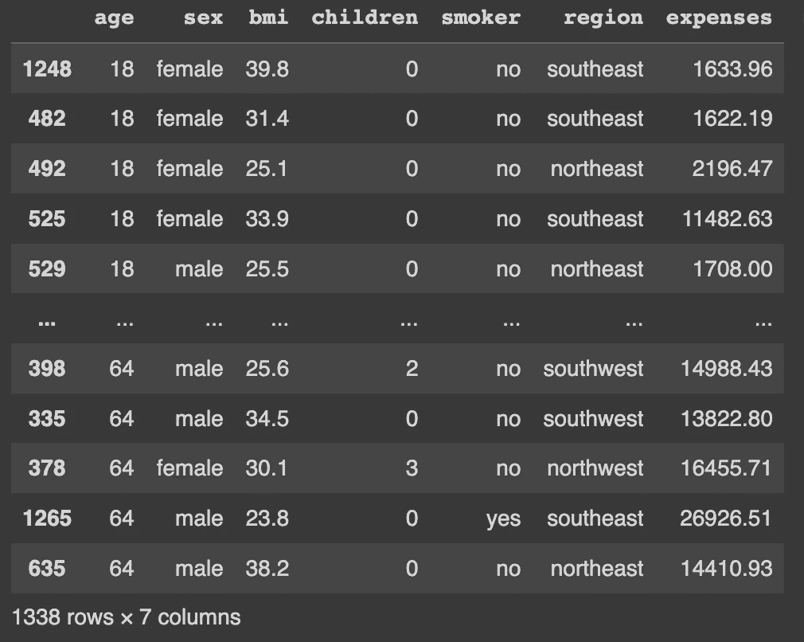

我们没有低异常值，现在我们将检查高异常值:

```
**#Check for upper outliers:**
df.sort_values(by=['age'], ascending=False)
```

我们看到我们也没有异常值上限。现在是时候对变量身体质量指数执行相同的操作了:

```
**#calculate interquartile range of values in the 'bmi' column:** q75_bmi, q25_bmi = np.percentile(df['bmi'], [75 ,25])
iqr_bmi = q75_bmi - q25_bmi
iqr_bmi**#Compute the boundaries for outlier detection:**
bmi_h_bound = q75_bmi+(1.5*iqr_bmi)
bmi_l_bound = q25_bmi-(1.5*iqr_bmi)
print(bmi_h_bound)
print(bmi_l_bound)**#Check for upper and lower outliers:**
df.sort_values(by=['bmi'], ascending=True)
df.sort_values(by=['bmi'], ascending=False)**#Drop outliers:**
df.drop(df[df['bmi'] >= 47.3].index, inplace = True)
df.drop(df[df['bmi'] <= 13.7].index, inplace = True)
```

我们只需要对可变费用做同样的操作，我们将得到以下箱线图和直方图:

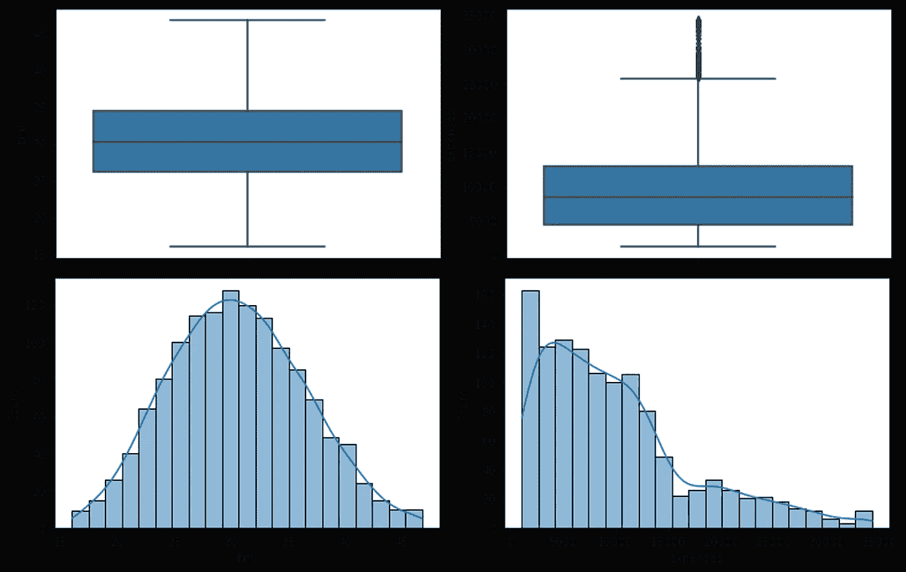

感谢您的阅读！如果您有建议要添加到这个列表中，请告诉我，不要忘记订阅以接收关于我未来出版物的通知。

如果:你喜欢这篇文章，别忘了关注我，这样你就能收到所有关于新出版物的更新。

否则如果:你想了解更多，你可以通过[我的推荐链接](https://cdanielaam.medium.com/membership)订阅媒体会员。这不会花你更多的钱，但是你要付我一杯咖啡的钱。

Else:谢谢！