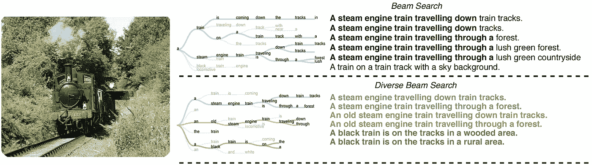
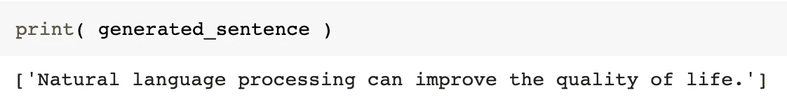
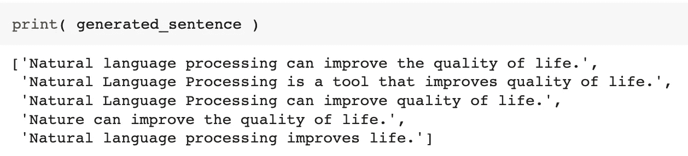

# 如何使用 Huggingface 和多样化的波束搜索进行有效的释义？(T5，飞马座，…)

> 原文：<https://pub.towardsai.net/how-to-do-effective-paraphrasing-using-huggingface-and-diverse-beam-search-t5-pegasus-229ca998d229?source=collection_archive---------0----------------------->

可用的解释模型通常并不像宣传的那样有效。然而，有些技巧可以帮助你轻松地从中获得最大收益。

由[格伦·凯莉](https://unsplash.com/@glencarrie?utm_source=medium&utm_medium=referral)在 [Unsplash](https://unsplash.com?utm_source=medium&utm_medium=referral) 拍摄的照片

你曾经尝试过一个解释模型，并且得到了和你输入的文本一样的输出，没有任何改变吗？你并不孤单！有很多模型在它们的自述文件中显示了很好的结果，但是会让你失望。这并不意味着他们是坏模型。我将要写的是**多样波束搜索** [1】解码方法，可以释放这些模型的力量。

# 分集波束搜索

生成文本的首选方法是使用波束搜索(图 1)，这意味着并行解码多条路径(top-k)而不是一条路径(greedy)。它表现得相当好。然而，它也有一些缺点。尽管它正在开发多条路径，但它们最终都相当相似。它倾向于只支持最后两三个单词有微小差异的一条路径。这意味着没有多样性！

为什么这是一个问题？这根本不是人类书写的方式。描述一个场景，总结一篇文章，或者翻译一句话，总有多种方式。没有正确的方法！只是看每个人的创造力。这就是自动评估生成性任务困难的原因。这是另一个话题，但是如果有一种像人类一样生成文本的方法不是很好吗？不同的波束搜索可能是解决办法。(图 1)

图一。波束搜索(上)和多样波束搜索(下)之间的比较产生图像的标题。[1]

分集波束搜索方法有两个主要参数:组和路径的数量。每组都经过挑选，以确保在内部执行常规光束搜索时，与其他组相比足够明显。在图 1 中，有 3 组和 2 条路径。这些组足够多样，并且完美地描述了图像，而我们在每个组中都有两种变化可供选择。

# 改写

在解释的过程中，我们输入一段文本，并期望模型在保持其含义的同时生成它的变体。比如我们输入一句“自然语言处理可以提高生活质量。”预期的输出可能类似于“NLP 可以帮助人类生活得更好。”

使用不同的解码方法来生成有多个选项可供选择的多样化文本是非常合理的。更像人类了！

在[拥抱脸中心](https://huggingface.co/models?pipeline_tag=text2text-generation&sort=downloads&search=paraphrase)有几个微调过的模型可用于解释任务。众所周知的选择是 T5 [2]和飞马座[3]。这里没有最佳选择；你只需要用它们做实验，找出哪一种最适合你的情况。我们来看看如何实现。

# 代码

我将使用 Prithivi Da 的 T5 模型的微调版本(名为[Parrot parasper](https://huggingface.co/prithivida/parrot_paraphraser_on_T5))。第一步是通过使用波束搜索解码策略来看看它能做什么，并通过将其与不同的波束搜索算法进行比较来跟进。和往常一样，我们应该从加载模型开始。

上面的代码从 Huggingface 代码库加载模型架构，并从 hub 加载微调过的权重。它还负责加载模型的标记器。(如果有兴趣，可以在这里和这里进一步了解这个过程[。)现在我们有了模型，接下来的步骤就简单了。I)对输入句子进行标记化，将单词转换为标记 id，以便模型能够理解；ii)将 id 传递给模型，以生成条件输出；最后，iii)将标记 id 转换为单词，以便我们能够读取它们。](https://nlpiation.medium.com/how-to-use-huggingfaces-transformers-pre-trained-tokenizers-e029e8d6d1fa)

图二。使用波束搜索的模型输出。

在这个测试中，我们要求模型转述句子“*自然语言处理可以提高生活质量。*"和模型生成的句子一模一样。(只是小写几个字)有一些参数，我不打算详细介绍。例如，*温度*可以控制模型对低概率标记的敏感程度，以生成更连贯的文本。这是你可以尝试的事情。相比之下，是时候看看多样化的波束搜索代码了。

图 3。使用不同波束搜索的模型输出。

上面提到的代码使用 5 个组`num_beam_groups`进行推理，我们要求从每个组`num_return_sequences`中查看一个，并且`diversity_penalty`参数意味着这些组必须有多么不同。同样，这些参数是您应该尝试的，以获得关于您的用例的最佳输出。

参见图 3，很明显，使用分集波束搜索技术，在解释输出方面有很大的改进。当然可以！我们仍然看到几个没有改变的项目，但它是一个整体的成功。以上示例可以在任何应用程序中用作释义！

# 最后的话，

在这个故事中，我谈到了多样化的波束搜索算法，它可以帮助使用基于 transformer 的模型生成更高质量的释义句子。完整的代码可以在 GitHub 账户上找到。令人印象深刻的是，如何通过使用不同的解码策略来提高模型性能。

> 我每周给 NLP 的书呆子发一份时事通讯。如果您想了解自然语言处理的最新发展，可以考虑订阅。
> [阅读更多，订阅](https://nlpiation.github.io/) —加入酷孩子俱乐部，立即报名！

**参考文献**

[1] Vijayakumar，A. K .，Cogswell，m .，Selvaraju，R. R .，Sun，q .，Lee，s .，Crandall，d .，& Batra，D. (2016)。不同的波束搜索:从神经序列模型解码不同的解决方案。 *arXiv 预印本 arXiv:1610.02424* 。
【2】raff El，c .，Shazeer，n .，Roberts，a .，Lee，k .，Narang，s .，Matena，m .，… &刘，P. J. (2020)。用统一的文本到文本转换器探索迁移学习的局限性。 *J .马赫。学习。第*、 *21* (140)，1–67 号决议。
[3]张，j .，赵，y .，萨利赫，m .，T18 刘，P. (2020，11 月)。Pegasus:用提取的空白句子进行抽象概括的预训练。在*机器学习国际会议*(第 11328–11339 页)。PMLR。