# 如何在 Rasa 中进行模糊字符串匹配

> 原文：<https://pub.towardsai.net/how-to-do-fuzzy-string-matching-in-rasa-a9b3a26e866?source=collection_archive---------1----------------------->

## [编程](https://towardsai.net/p/category/programming)

## 关于如何将 fuzzywuzzy 库集成到 Rasa 的 NLU 管道中的教程

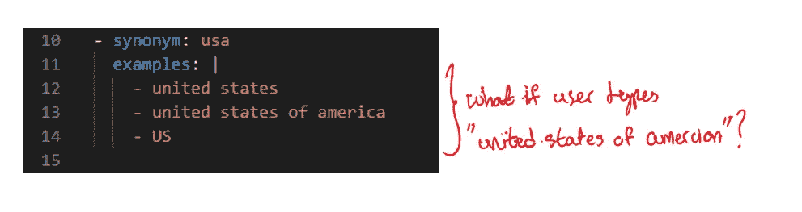

# 介绍

在这篇文章中，我将分享如何在 r [asa](https://rasa.com/) 中创建一个[定制组件](https://rasa.com/docs/rasa/components#custom-components)，以使实体提取对输入错误更加健壮。更具体地说，我们将使用 [fuzzywuzzy](https://github.com/seatgeek/fuzzywuzzy) 库进行模糊字符串匹配，根据相似性得分自动更正一个实体。

复制本文中描述的机器人的代码可以在[这里](https://github.com/hsm207/rasa_fuzzy)找到。

# 问题陈述

假设期望机器人从话语中提取代表一个国家的实体，并将其规范化为某种规范形式。这可以通过 rasa 的[同义词](https://rasa.com/docs/rasa/nlu-training-data/#synonyms)功能来实现:

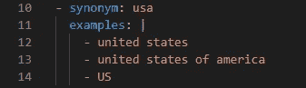

图 1:美国的一些同义词

因此，类似“我来自美国”的话语将被 NLU 管道处理为:

图 2:从“我来自美国”中提取国家实体

然而，如果用户打错了，例如“我来自美利坚合众国”，结果是:

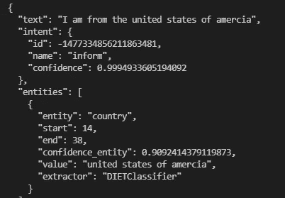

图 3:提取一个输入错误的国家

我们看到，DIET 分类器设法将`united states of amercia`识别为一个国家实体，但是由于在所提供同义词列表中没有精确匹配，所以它没有映射到`usa`,这与图 2 中的话语不同。这真的很烦人，因为这是一个[常见的错别字](https://en.wikipedia.org/wiki/Wikipedia:Lists_of_common_misspellings/A)，如果不能将其规范化为某种规范形式，将会干扰依赖于正确的国家实体被提取的下游任务。

一个潜在的解决方案是在同义词列表中包含所有可能的错别字(或者至少是常见的错别字)。这并不理想，因为不仅列表会不必要的长并且难以维护，而且我们还必须预见到用户可能会犯的错误！

一个更好的解决方案是构建一个定制组件，该组件检查提取的实体，并将它们与已知实体列表进行模糊匹配。如果提取的实体和列表中的元素之间的相似性超过了某个阈值，我们就断定提取的实体中可能有拼写错误，并将其自动更正到该元素。下一节将描述如何构建这个解决方案。

# 解决方案:构建自定义组件

## 步骤 1:决定定制组件的全限定类名

我们将在名为`my_custom_components.py`的文件中的名为`EntityTypoFixer`的类中实现我们的定制组件，该文件保存在相对于项目根目录名为`addons`的文件夹中。

因此，如果在项目的根目录下启动 python，组件的全限定类名就是`addons.my_custom_components.EntityTypoFixer`。

## 步骤 2:实现定制组件的参数

将阈值分数作为定制组件的参数会很方便，这样我们[可以比较不同阈值](https://rasa.com/docs/rasa/testing-your-assistant/#comparing-policy-configurations)和`rasa test`的效果。我们将这个参数称为`score_cutoff`，并给它一个默认值 80。

我们需要做的第一件事是定义一个名为`defaults`的类属性，它将存储默认参数值的字典:

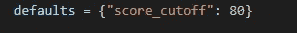

图 4:`EntityTypoFixer`的默认参数值字典

接下来，我们定义如何在`EntityTypoFixer`的`__init__`方法中使用默认的`score_cutoff` 参数:

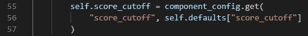

图 5:使用 score_cutoff 的默认值，如果它没有在 config.yml 中定义

## 步骤 3:定义培训时发生的事情

训练 NLU 管道时，我们希望将所有同义词中列出的所有实体收集到一个列表中，以便我们可以在推理时查找它们:

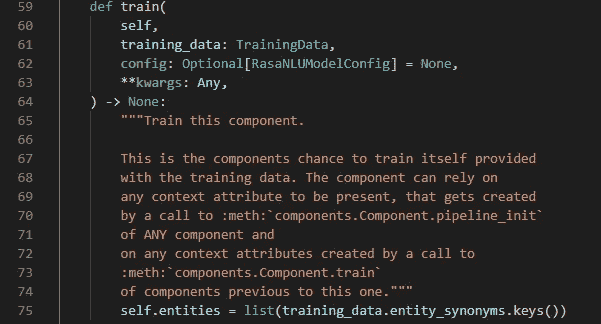

图 6:在训练期间获取同义词列表中的所有实体

## 步骤 4:定义推理时发生的事情

在推理时给定一条消息，我们将把所有实体提取到一个列表中，并遍历每个元素，将它们与`self.entities`中的实体进行模糊匹配:

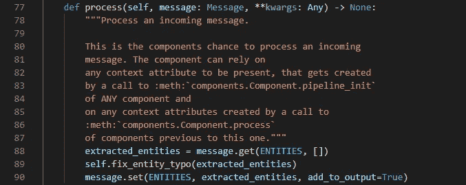

图 7:如何使用模糊匹配更新实体

实际的模糊匹配是在对`self.fix_entity_typo`的调用中完成的，定义如下:

图 8:实现模糊匹配

图 8 显示，如果在`self.entities`中针对一个提取的实体的最佳匹配的分数超过了`score_cutoff`并且不是 100，那么用最佳匹配的值更新该提取的实体的值，并且还将该组件添加到`processors`的列表中，以便我们知道在处理一个话语时使用了该组件。

## 步骤 5:定义如何保存和加载定制组件

因为该组件需要在训练期间提取的实体列表才能正常工作，所以让我们定义保存和加载该信息的函数:

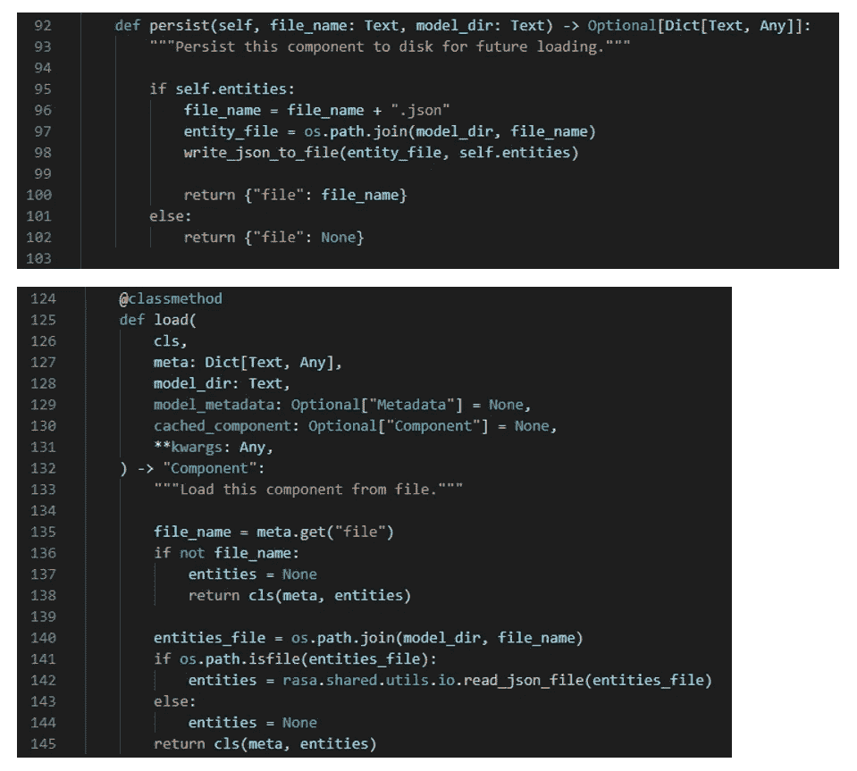

图 9:保存和加载定制组件

## 步骤 6:将自定义组件添加到 config.yml 中

最后，我们将这个组件添加到`config.yml`的`pipeline` 部分。因为我们希望这个组件在提取实体之后、映射到同义词之前运行，所以它应该放在`DIETClassifier` 和`EntitySynonymMapper` 组件之间:

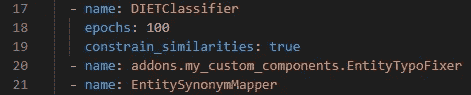

图 10:在 NLU 管道中放置 EntityTypoFixer 的位置

请注意，我们使用了组件的完全限定类名，这是我们在步骤 1 中弄清楚的。

# 结果

在用新的`config.yml`重新训练模型之后，话语“我来自美利坚合众国”的结果是:

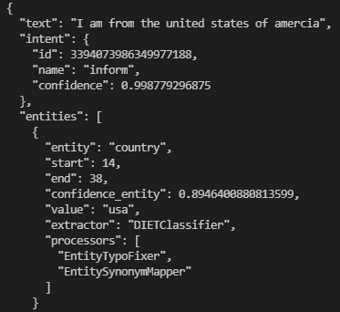

图 11:使用 EntityTypoFixer 处理带有拼写错误的实体的结果

与图 3 相比，我们看到提取的实体的值现在是我们想要的`usa`。我们还看到`EntityTypoFixer`在`processors`的列表中，表明它是作为提取过程的一部分被调用的。

处理“我来自美国”的输出不变，因为在这个话语中没有打字错误:

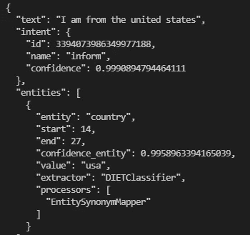

图 12:使用 EntityTypoFixer 提取没有拼写错误的国家实体

# 结论

本文展示了如何使用 fuzzywuzzy 库对 rasa 中提取的实体进行模糊匹配。本文中描述的步骤可用于构建其他定制组件，这些组件执行任意的预处理或后处理任务。

我希望你已经发现这是有用的。