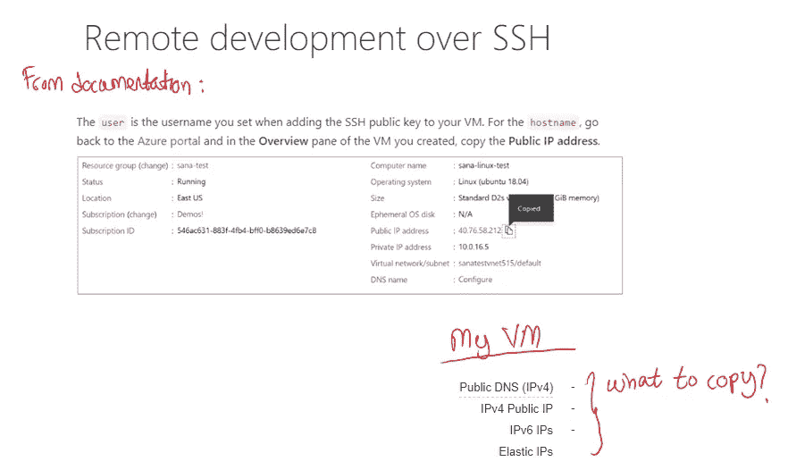
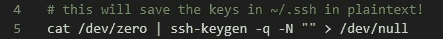
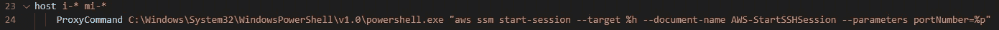
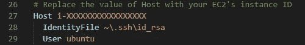

# 如何使用 AWS SSM 用 VS 代码做远程开发

> 原文：<https://pub.towardsai.net/how-to-do-remote-development-with-vs-code-using-aws-ssm-415881d249f3?source=collection_archive---------0----------------------->

## [云计算](https://towardsai.net/p/category/cloud-computing)，[软件工程](https://towardsai.net/p/category/software-engineering)

## 当您的 IT 部门禁止创建公共 EC2 实例时

# 介绍

在本文中，我将分享一种使用 [VS 代码](https://code.visualstudio.com/)连接私有 EC2 实例的方法，即没有公共 IP 地址的实例。主要思想是使用由 [AWS SSM](https://docs.aws.amazon.com/systems-manager/latest/userguide/ssm-agent.html) 管理的 SSH 连接来连接到该实例。

我假设读者对用 VS 代码编码和在 AWS 上创建 EC2 实例有基本的了解。

可以在[这里](https://github.com/hsm207/vscode_remote_ssm)找到重现运行 AWS 命令的环境的代码。

让我们先来理解为什么有人想要将 VS 代码连接到远程机器上。

# 为什么？

从 VS 代码内部连接到远程 EC2 实例允许您在该机器上编辑代码，就像在您的本地机器上一样，并享受 VS 代码附带的所有高级编辑特性和插件。

作为一名数据科学家，VS Code 对远程开发的支持在以下情况下会派上用场:

1.  你需要一台强大的机器来快速迭代你的原型。想象在任何计算机视觉任务中使用高分辨率图像。在消费级笔记本电脑上，即使处理少量图像也会非常慢。
2.  你想要一个新的库或框架，但是它需要安装许多依赖项。在一台短暂的机器上进行试验比安装这些依赖项来搞乱本地机器更方便。

# 动机

VS 代码通过 SSH 连接支持[远程开发](https://code.visualstudio.com/docs/remote/ssh-tutorial)。这需要创建一个 SSH 公共/私有密钥对，并且您希望连接的机器有一个公共 IP 地址。

一些公司有一个策略，禁止创建和存储 SSH 密钥对和具有公共 IP 地址的机器，以此来降低安全风险(这有助于减少攻击面)。

因此，需要寻找从 VS 代码内部连接到那些远程机器的替代方法。

# 先决条件

如果您想跟进，您需要设置以下内容:

1.  一个没有公共 IP 地址的 EC2 实例，其 IAM 角色中至少有**amazonsmsmanagedinstancecore**和**amazonsmsmfullaccess**策略。对于**amazonsmsmfullaccess**策略，您实际上只需要运行 **ssm:SendCommand** 的权限。
2.  EC2 实例应该运行当前的 AMI。在本文中，我使用的是`Deep Learning AMI (Ubuntu 18.04) Version 33.0` AMI。
3.  EC2 必须由 AWS 系统经理管理。这仅仅需要创建几个 VPC 端点。点击[此处](https://aws.amazon.com/premiumsupport/knowledge-center/ec2-systems-manager-vpc-endpoints/)获取如何操作的说明。
4.  安装了[会话管理器插件](https://docs.aws.amazon.com/systems-manager/latest/userguide/session-manager-working-with-install-plugin.html)的当前 [AWS CLI](https://docs.aws.amazon.com/cli/latest/userguide/cli-chap-install.html) 。

# 步伐

## 步骤 1:生成 SSH 密钥对

使用`[ssh-keygen](https://www.ssh.com/ssh/keygen/)`在本地机器上生成一个 SSH 密钥对。

有一种方法可以做到:

## 步骤 2:向 EC2 实例发送公钥

使用 SSM 的`send-command`实用程序将上一步生成的公钥包含到 EC2 实例的`authorized_keys`文件中:

根据您的设置，您需要修改`instance_id`和`region`的值。

## 步骤 3:更新 SSH 配置

在 VS 代码中，调用[命令面板](https://code.visualstudio.com/docs/getstarted/userinterface#_command-palette)并运行`Remote-SSH:Open Configuration File`命令打开`~/.ssh`文件夹中的`config`文件。

添加以下几行:

前面一行是针对 Windows 的。点击[此处](https://docs.aws.amazon.com/systems-manager/latest/userguide/session-manager-getting-started-enable-ssh-connections.html)查看 Linux/Mac 的相应设置。

另外，添加以下几行:

## 步骤 4:连接到 EC2 实例

要使用 VS 代码连接到 EC2 实例，只需调用命令面板来执行`Remote-SSH:Connect to Host`命令。

当要求选择哪个主机时，选择名称是 EC2 的实例 ID 的主机。

# 结论

本文解释了一种通过 VS 代码连接到私有 EC2 实例的方法，以便在该实例上进行远程开发。

我希望你已经发现这是有用的。