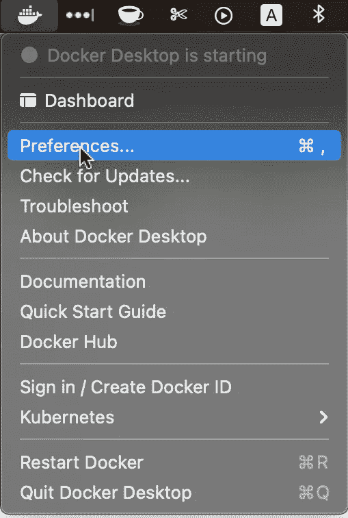

# 如何对您的数据科学项目进行分类——快速指南

> 原文：<https://pub.towardsai.net/how-to-dockerize-your-data-science-project-a-quick-guide-b6fa2d6a8ba1?source=collection_archive---------1----------------------->

## [数据科学](https://towardsai.net/p/category/data-science)

## 我每次都是如何通过这些简单易行的步骤进行部署的！


图片来自[旅游来源](https://unsplash.com/@travelsourced?utm_source=medium&utm_medium=referral)在 [Unsplash](https://unsplash.com?utm_source=medium&utm_medium=referral)

在[之前的文章](https://towardsdatascience.com/a-guide-to-streamlit-frontend-for-data-science-made-simpler-c6dda54e3183?source=your_stories_page-------------------------------------)中，我详细描述了使用 fastai 从我们的图像分类模型制作一个完整的交互式 web 应用程序的所有步骤。在这里，我们将探讨如何使应用程序独立于平台并便于共享。

## 首先，简单介绍一下…

[**Docker**](https://www.docker.com) 是一款软件开发工具，通过在一个名为**容器**的整洁包中管理我们应用程序的代码和所有必需的库及其依赖项，使我们的生活变得更加轻松。

> **这意味着:**
> 
> 你只需拿起你的项目，在一个 **Dockerfile** 的帮助下，用一行代码将其转换成 docker 映像，然后可以在任何机器上简单地运行，用另一行代码执行应用程序，而无需手动运行任何其他命令或安装任何其他东西。Docker 自动完成这一切。

在您的机器上安装 Docker 的步骤最多不会超过五分钟，可在[这里的](https://www.docker.com/get-started)简单步骤中找到。

对于大多数用例来说，Docker Desktop 已经足够了，所以继续安装吧。



docker 桌面的首选项

**一个重要的注意事项:**在你第一次启动 Docker Desktop 之后，确保点击 *preferences* 并为 Docker 运行选择最低**3GB**的内存，否则有时，它可能会给你将来安装的机器学习或深度学习库带来一些问题，最终需要更多内存。它发生在我身上，我把这个小提示放在这里，以确保你不会也面临它。:)

## 现在，让我们继续讨论如何为我们的应用程序构建 docker 文件

该应用程序的完整代码库位于这个 GitHub 存储库中。如果您想在学习本教程的过程中全面了解一下代码，欢迎您。

我承诺了简单易行的步骤，所以我来了。我们走吧:

## 构建您的需求文件

我虔诚地使用 **pipenv** 来管理我所有的 python 项目和环境。我承认这是一个方便的工具，而且学习曲线也很短。设置您的数据科学环境应该尽可能容易和轻松，我在我的一篇文章[中也详细谈到了这一点。](https://medium.com/this-code/5-step-guide-to-setting-up-a-new-python-environment-for-data-science-fcae3c3951c7?source=your_stories_page-------------------------------------)

我们将使用 **pip freeze** 命令为我们的图像分类应用程序构建文件。在终端中，键入并输入:

```
pipenv run pip freeze > requirements.txt
```

在您的根项目目录中，您将看到新文件已经创建。这是一个重要的步骤，因为它定义了我们构建 docker 映像时将包含的每个库和依赖项。

下一步需要实际构建 Dockerfile 文件。

## 写下你的文档

在向您展示构建它的代码之前，让我先重申一下项目结构的重要性，以及我的结构在整个项目中的表现。


我使用的项目结构

确保当**在上面显示的**到**应用程序**目录之外时，制作你的 docker 文件。

```
touch Dockerfile
```

在您最喜欢的文本编辑器中打开该文件，将以下代码片段粘贴到其中并保存该文件:

```
FROM python:3.9.1
EXPOSE 8501
COPY ./requirements.txt /requirements.txt
WORKDIR /
RUN pip3 install -r requirements.txt
COPY . /
ENTRYPOINT ["streamlit", "run"]
CMD ["start.py"]
WORKDIR /app
```

现在让我们一行一行地检查这些指令。

*   **FROM** 是每个 Dockerfile 文件的开头。它陈述了我们的映像将在其中构建和运行的环境，在我们的例子中是 Python 环境。在其他情况下，这也可以是已经存在的 docker 映像，如 Ubuntu 等操作系统的映像，nginx 等服务器的映像。
*   **EXPOSE** 表示我们的应用程序将要运行的端口。在前一篇文章中，我们看到我们的 streamlit 应用程序总是在端口 8501 上运行，因此我们在 Dockerfile 中公开了它。
*   **复制**命令在文件中使用了两次。它的基本功能是将所有重要的代码和其他文件复制到 docker 镜像中。**。(点)**表示我们想要将整个应用程序目录复制到 docker 映像中。
*   正如你可能已经猜到的，WORKDIR 声明我们的应用程序将从哪个工作目录运行。为了运行下一行→ `**pip3 install -r requirements.txt**` **,我们首先将它更改到 app 目录之外。**在最后一行，我们将它改回 app 目录，因为我们的应用程序将要执行的 **start.py** 文件就在那里。
*   最后， **CMD** 和 **ENTRYPOINT** 是两个关键字，用于描述在终端上运行的命令，以从容器内启动应用程序。运行我们 app 的行是: **streamlit run start.py.** 这个也可以简单写成:`**CMD [“streamlit”, “run”, “start.py”]**`。在很多情况下，CMD 和 ENTRYPOINT 的结合是 Docker 容器的最佳解决方案。在这种情况下，**可执行文件是用 ENTRYPOINT 定义的，而 CMD 指定默认参数，**就像我们在上面的代码片段中所做的一样。

我们快完了！最后一步是构建并运行这个 Dockerfile 文件。

## **构建并运行 docker 映像**

我承诺这一步有两行代码，所以我们开始吧！

首先，我们使用以下命令构建映像:

```
docker build --tag rps:1.0 .
```

`— tag`仅用于确保我们的 docker 图像附带有名称和版本。这只是我们图像的人类可读形式。在这里，我把象征*石头剪刀布*的*‘RPS’*作为这张图片的标签。

在运行这个命令的时候，你一定注意到下载了很多“层”。这是因为我们正在构建 python 3.9.1 环境，并安装 docker 文件中用 RUN 命令指定的所有依赖项。因此，我们的基本 Python 映像要么从 docker hub 下载，要么从本地机器获取(如果可用的话)。最重要的是，我们的库将从需求文件中安装。

`docker build`命令末尾的`.`表示 Docker 应该在我们当前的目录中寻找 Dockerfile。

## 最后一步是运行我们构建的容器映像

```
docker run --publish 8501:8501 -it rps:1.0
```

`— it`用于确保终端命令等其他迭代过程可以从 docker 容器中运行。此外，`—- publish`帮助我们在 8501 端口的浏览器中运行我们的 streamlit web 应用程序。

导航至:`localhost:8501`查看应用程序的运行情况！

我们做到了！


由[安东·舒瓦洛夫](https://unsplash.com/@a8ka?utm_source=medium&utm_medium=referral)在 [Unsplash](https://unsplash.com?utm_source=medium&utm_medium=referral) 上拍摄的照片

## 结束…

构建数据科学项目需要付出很多努力，而让外部人员可以使用我们的工作是所有工作之上的一些额外工作。在这一系列文章中，我们看到了将我们的图像分类引擎打包到一个 web 应用程序中，然后确保它也可以由其他人在不同的机器上极其轻松地运行。

依我拙见，Docker 的多功能性绝对令人惊叹，如果你想在我接下来的项目中探索更多，并在我记录更多关于它们的内容时，请继续关注。

**您可以利用以下资源扩展您的知识:**

*   用这个[栈溢出 post](https://stackoverflow.com/questions/21553353/what-is-the-difference-between-cmd-and-entrypoint-in-a-dockerfile) 比较 Dockerfile 中的 ENTRYPOINT 和 CMD 命令。
*   Docker 在他们的官方页面上构建并运行流程概述[。](https://docs.docker.com/get-started/overview/)

感谢您的阅读！😁

> 我所有文章的 github 代码库都在这里:

[](https://github.com/yashprakash13/data-another-day#ml-mini-projects-because-crash-courses-are-the-best) [## yashprakash 13/data-另一天

### 我在我的…上学习和撰写的所有数据科学项目、概念、工具和资源的主存储库

github.com](https://github.com/yashprakash13/data-another-day#ml-mini-projects-because-crash-courses-are-the-best) 

在 [Twitter](https://twitter.com/csandyash) 上与我联系。