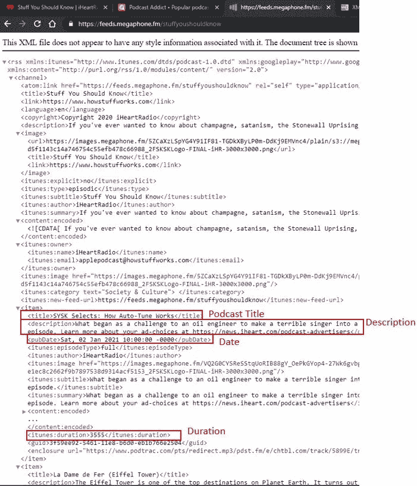
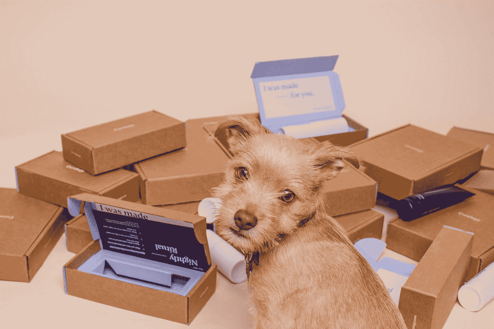
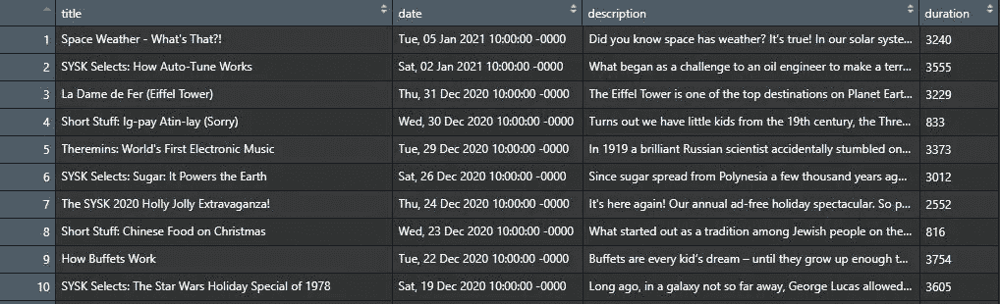
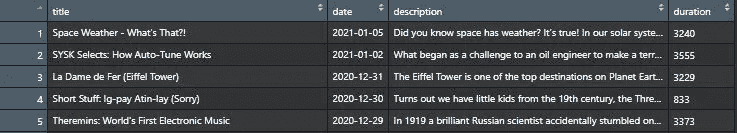

# 如何使用 RSS 源轻松抓取播客数据

> 原文：<https://pub.towardsai.net/how-to-easily-scrape-podcast-data-using-rss-feeds-e864710cb62?source=collection_archive---------2----------------------->

## [网页抓取](https://towardsai.net/p/category/web-scraping)

## 访问 RSS 提要——使用 R 获取播客数据很简单，只需 5 个简单的步骤


由[杰森·罗斯韦尔](https://unsplash.com/@jasonrosewell?utm_source=medium&utm_medium=referral)在 [Unsplash](https://unsplash.com?utm_source=medium&utm_medium=referral) 上拍摄的照片

***免责声明:*** *本文仅出于教育目的。我们不鼓励任何人抓取网站，尤其是那些可能有条款和条件反对此类行为的网站。*

当涉及到从网站或数字平台(如播客存档)抓取或收集数据时，您通常有两种选择:

1.  使用平台提供的**应用编程接口** (API)
2.  构建一个定制的 **web scraper** 来处理特定的网站

使用 API 通常是最简单的，因为它可以让您直接访问您想要的数据，但这种访问可能是有限的。另一方面，当您希望提取 API 可能不提供的特定数据(或者根本不存在 API)时，构建 web scraper 可能是有益的。

然而，编写网络抓取程序的一个主要缺点是，如果网站固有的 HTML/CSS 结构发生变化，它可能会过时或不再正常工作，这意味着你必须更新代码才能与网站的未来新版本一起工作。

如果我告诉你有一个*排序的*快乐的中间解决方案来抓取你最喜欢的**播客剧集描述**不需要那么多定制代码，会怎么样？这种解决方案仍然需要创建一个 web scraper 程序，但是代码要简单得多，而且不易更改，因为它使用了简单的标准格式 RSS 提要。本文将通过 5 个步骤向您展示如何使用 R 轻松地为数据科学和分析应用程序收集、预处理和准备播客数据。

接下来——你所需要的就是安装最新版本的 [R](https://www.r-project.org/) 和 [R Studio](https://rstudio.com/) 。

## **第一步:理解播客 RSS 提要的结构及其数据**

首先定义你想从播客中提取什么数据特征或元素是很重要的。出于一般分析和自然语言处理(NLP)的目的，我发现以下元素对于提取很有价值:

*   标题
*   出版日期
*   发作持续时间
*   描述

在这次演练中，我们将收集一个最受欢迎、持续时间最长的播客，**你应该知道的东西(SYSK)。**我们将导航到页面上的“ **RSS Feed** ”链接/图标，因为这是我们正在寻找的。

[](https://www.iheart.com/podcast/105-stuff-you-should-know-26940277/) [## 你应该知道的事情

### 如果你曾经想了解香槟，撒旦崇拜，石墙起义，混沌理论，迷幻药，厄尔尼诺，真正的犯罪…

www.iheart.com](https://www.iheart.com/podcast/105-stuff-you-should-know-26940277/) 

默认情况下，点击 [RSS 提要链接](https://feeds.megaphone.fm/stuffyoushouldknow)(使用 Google Chrome)将生成一个可读的树形结构的 XML 文件。这使得在`<item>`节点下挑选出我们感兴趣的各种元素标签变得很容易，比如`<title>`、`<description>`、`<pubDate>`、&、`<itunes:duration>`。



你应该知道的东西的 RSS 提要 XML 文件(在谷歌浏览器中)

对数据的结构有了很好的理解，接下来我们可以开始构建 scraper 程序。

***注意*** *:大部分播客网站在各自的播客登陆页面上都有明显的 RSS Feed 链接。* [*播客 Addic*](https://podcastaddict.com/) *t 是我觉得最简单的一个。*

## 步骤 2:装入必要的 R 包

让我们确保在 R Studio 中安装了以下 R 包，我们将出于各种目的需要这些包:

*   **dplyr** —数据操作
*   **润滑** —处理日期
*   **rvest**—负责网页抓取
*   **stringr**—处理文本
*   **文本系统**——用于标记化
*   **tible**—帮助以表格格式存储抓取的数据
*   **TM**—用于文本挖掘预处理



[Curology](https://unsplash.com/@curology?utm_source=medium&utm_medium=referral) 在 [Unsplash](https://unsplash.com?utm_source=medium&utm_medium=referral) 上拍照

如果您还没有安装它们，您可以通过 R Studio 中的控制台使用下面的命令安装它们。

```
install.packages(“rvest”)
```

一旦所有都安装好了，就把它们放进去。

```
library(dplyr)
library(lubridate)
library(rvest)
library(stringr)
library(textstem)
library(tibble)
library(tm)packages <- c(‘dplyr’, ‘lubridate’, ‘rvest’, ‘stringr’, 
              ‘textstem’,    ‘tibble’, ‘tm’)
loaded_packages <- sapply(packages, require, character.only = TRUE)
loaded_packages
```

## 第三步:收集原始数据

加载了正确的包后，我们现在可以构建代码来从每个播客剧集中获取数据。

我们要做的第一件事是定义指向 RSS XML 文件的 URL，以及我们感兴趣的 CSS 元素。这些元素将成为我们最终数据集中的列名。

```
# define url for RSS feed XML file 
URL <- ‘[http://feeds.megaphone.fm/stuffyoushouldknow.xml'](http://feeds.megaphone.fm/stuffyoushouldknow.xml')# define XML tags of interest
css_tags <- c(‘title’, ‘pubDate’, 
              ‘description’, ‘itunes\\:duration’) col_names <- c(‘title’, ‘date’, ‘description’, ‘duration’)
```

接下来，我们将加载 XML 提要并收集所有条目节点及其保存在`items`中的底层元素。

```
# load XML feed and extract items nodes
podcast_feed <- read_xml(URL)
items <- xml_nodes(podcast_feed, ‘item’)
```

因为一个条目包含许多元素，所以我们只想提取上面定义的那些元素。一个简单的方法是创建一个助手函数来帮助我们把它们取出来，放到一个向量或列表中。

```
# extracts from an item node the content defined by the css_tags
extract_element <- function(item, css_tags) {
   element <- xml_node(item, css_tags) %>% xml_text
   element
}
```

然后，我们需要遍历每个条目，创建一个 tibble，并将其合并到一个数据框中。

```
podcast_df <- sapply(css_tags, function(x) { 
                 extract_element(items, x)}) %>% as_tibble()names(podcast_df) <- col_names # set new column names
View(podcast_df)
```



R Studio 中原始数据帧的片段

开始看起来不错了。我们现在在一个数据框中有了抓取的原始数据，其中每个记录代表来自 RSS 提要的一个播客片段。

## 步骤 4:预处理抓取的数据

尽管我们可以在这里停下来，但是我们可以在这里做一些理想的预处理步骤来最终确定我们的数据集。

我们要做的第一件事是对日期和持续时间进行一些改变。

*   对于`date`,默认抓取的数据包括很多细节，包括星期几、时间和时区。然而，对我们来说最有用的部分只是日期本身，所以我们将更新它，只保留日期格式的那些字符。
*   对于`duration`,我们将简单地将其转换为数字格式，因为默认情况下所有列都是字符类型。

```
podcast_df <- podcast_df %>%
         mutate(date = stringr::str_sub(date, 5, 16)) %>% 
         mutate(date = lubridate::dmy(date), 
                duration = as.numeric(duration)) 
View(podcast_df)
```



现在我们有了 YYYY-MM-DD 格式的日期和存储为数字的持续时间值。

## 步骤 5:创建感兴趣的新的附加列

下一步是针对选定的播客内容和我们未来的数据分析目标或计划。*如果你抓取了另一个播客，请记住这一点，因为你可能需要根据自己的需要进行修改。*

对于 SYSK 的播客，制作人通常会发布之前播出过的重复剧集。这些通常被标记为*【SYSK 精选】**【SYSK 分心播放列表】*。此外，他们的一些剧集是被称为*“短片”的较短剧集。*所有这些标签都体现在剧集标题中。

假设这些标签出现在标题中，我们可以很容易地创建两个新列，使用`if_else` 条件检查这些关键子字符串，将每个剧集分类为(重复/原创)和/或(短/普通)剧集。下面的突变将为我们完成这个任务。

```
podcast_df <- podcast_df %>%
   mutate(episode_type = if_else(stringr::str_detect(title,   
                         “Short Stuff”), “Short”, “Normal”),
          initial_release = if_else(stringr::str_detect(title,  
                            “SYSK Selects|SYSK Distraction  
                             Playlist”),FALSE, TRUE ))
```

我们要添加的最后一个附加列是一串标记，代表属于每集“描述”的重要上下文单词。换句话说，我们将对描述文本应用**标记化**，这可以让我们进行 NLP 和机器学习任务，如**情感分析**或**主题建模**。

在应用标记化之前，我们需要清除文本中的任何标点符号或干扰。我们要做的第一件事是删除任何存在于每集描述结尾的普通文本，就像这样。

```
generic_string = "\n Learn more about your ad-choices at [https://news.iheart.com/podcast-advertisers](https://news.iheart.com/podcast-advertisers)"podcast_df <- podcast_df %>%
    mutate(description = stringr::str_remove(description,  
           generic_string))
```

接下来，我们将定义一些辅助函数，以帮助确保我们删除所有非字母数字字符以及任何包含 2 个字符或更少字符的单词。

```
# function to strip all non-alphanumeric characters
removeNonAlnum <- function(x){
                  gsub(“[^[:alnum:]^[:space:]]”,” “, x)
}# function to remove any words with 2 characters or less 
removeShortWords <- function(x){
                    gsub(‘\\b\\w{1,2}\\b’,’’, x)
}
```

我们还想定义我们的自定义停用词。**停用词**是常用词，本身并不能提供多少有意义的上下文。这让我们可以专注于重要的单词。这个`tm`包有一个广泛的标准停用词集合供我们使用，但是有时你会想要根据你正在处理的文本上下文添加你自己的额外停用词。在这种情况下，我从浏览中知道，以下单词在这个播客的描述中重复出现，并没有增加多少价值或剧集之间的区别，所以我将它们定义为这样。

```
# define stop words including custom stop words
custom_stopwords = c( “sysk”, “stuff”, “you”, “episode”, “week”,  
                      “tune”, “”, “today”, “podcast”,   
                      “howstuffworks”, “com”, “listen”, “should”,  
                      “know”, “learn”, “josh”, “chuck”)
```

然后，最后一步需要应用我们所有的助手函数、停用词和方便的文本挖掘清理函数，为整个数据集生成有用标记的语料库向量。

```
# create corpus vector of descs and apply preprocessing steps 
corpus <- Corpus(VectorSource(podcast_df$description))
corpus <- tm_map(corpus, removeNumbers)
corpus <- tm_map(corpus, content_transformer(tolower))
corpus <- tm_map(corpus, content_transformer(removeNonAlnum))
corpus <- tm_map(corpus, content_transformer(removeShortWords))
corpus <- tm_map(corpus, removeWords, c(stopwords(‘english’),   
                 custom_stopwords))
corpus <- tm_map(corpus, textstem::lemmatize_strings)
corpus <- tm_map(corpus, stripWhitespace)
```

***注:****`*lemmatize_strings*`*函数对我们的单词应用词条化，这是一种通过使用单词的形态分析将单词转换成它们的词条或词典形式的方法。例如，* ***学*** *，* ***学*** *，* ***学*** *就会转换成* ***学*** *。要了解更多信息，请参考* [*此处*](https://blog.bitext.com/what-is-the-difference-between-stemming-and-lemmatization/) *。**

*为了将语料库向量添加到我们的数据框架中，我们将使用`sapply`并创建一个`tokens`列。*

```
*podcast_df <- podcast_df %>%
                   mutate(tokens = sapply(corpus, identity))
View(podcast_df)*
```

**

*我们做到了！我们现在有了一个完整的预处理数据集，包括令牌和其他有用的信息。👌*

*让我们将 CSV 文件保存到这个文件中，以便将来对预处理后的数据进行任何分析或工作。*

```
*write.csv(podcast_df,”preprocessed_podcast_episodes.csv”, 
          row.names = FALSE, fileEncoding = “UTF-8”)*
```

*[完成刮刀笔记本代码](https://github.com/bicachu/podcast-scraper/blob/master/podcast_scraper_notebook.Rmd)*

# *摘要*

*如图所示，访问 RSS 提要使得只需几个简单的步骤就可以非常容易地抓取播客数据。*

*希望这个演练是有用的和令人愉快的。就使用 scraper 而言，只要您能够找到关键的标准 RSS 提要 XML 文件，您应该能够运行它来为您选择的任何播客收集数据。对于接下来的步骤和未来的应用，这里有一些想法，我可能会在以后的文章中发布，敬请关注:*

*   *应用各种主题建模机器学习算法*

*[](/tweet-topic-modeling-part-3-using-short-text-topic-modeling-on-tweets-bc969a827fef) [## Tweet 主题建模第 3 部分:在 tweet 上使用短文本主题建模

### 这是一个多部分的系列，展示了如何为任何集合抓取、预处理、应用和可视化短文本主题建模…

pub.towardsai.net](/tweet-topic-modeling-part-3-using-short-text-topic-modeling-on-tweets-bc969a827fef) 

*   执行情感分析

# 资源

*   RSS 如何工作—【https://rss.com/blog/how-do-rss-feeds-work/ 
*   XML 文档结构如何工作—【https://www.w3schools.com/xml/xml_tree.asp 
*   播客上瘾平台(包括 RSS 源)——[https://podcastaddict.com/](https://podcastaddict.com/)*