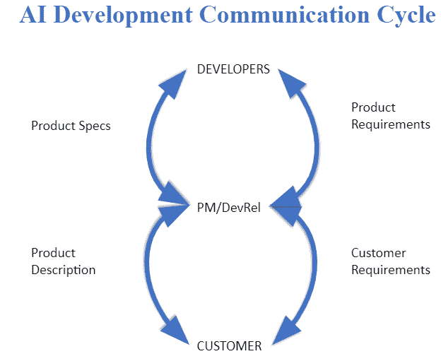
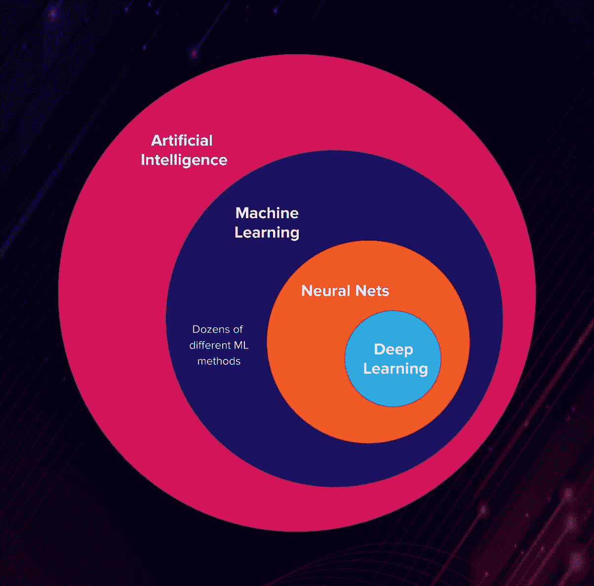

# 如何确保你正在设计的人工智能适合它的用途(第二部分)

> 原文：<https://pub.towardsai.net/how-to-ensure-the-ai-you-are-designing-is-fit-for-its-purpose-part-2-d6dca5391643?source=collection_archive---------2----------------------->

## [人工智能](https://towardsai.net/p/category/artificial-intelligence)，[产品管理](https://towardsai.net/p/category/product-management)

我们看到的人工智能应用程序的问题不是糟糕的设计、不良意图或疏忽的结果。是沟通问题。这些问题需要软技能来解决。具体来说，产品管理(PM)和开发人员关系(DevRels)处于独特的位置来协调对话，这将允许创建适合其预期目的的人工智能。人工智能开发交流周期为这些对话提供了一个框架:

[本讨论的第一部分](https://medium.com/towards-artificial-intelligence/how-to-ensure-the-ai-you-are-designing-is-fit-for-its-purpose-part-1-48660f03a822)探讨了人工智能开发交流周期的基本前提，以及一些例子，说明了人工智能的使用会在哪些方面极大地影响一些高端应用程序的适用性。讨论的剩余部分将集中在人工智能开发交流周期的具体细节上。以下系列文章旨在为如何在日常实践中使用这一循环提供指导，组织如下:

*   客户与预防性维护沟通——客户要求
*   PM 与开发人员的沟通——产品要求
*   开发人员与项目经理/开发人员的沟通——产品规格
*   PM/开发人员与客户的沟通——产品描述

这些文章将追踪人工智能开发交流周期的每个阶段。本文将关注沟通的第一阶段:客户到项目经理。

# 客户与预防性维护沟通——客户要求

为了提高效率，项目经理必须能够理解客户的需求，并在产品设计中考虑这些需求。为了获得授权，客户需要理解将影响最终产品的各种决策，允许他们有效地传达他们的需求。作为讨论中的技术专家，项目经理完全有资格引导讨论。在提出促进对预期产品深入探索的问题时，项目经理能够让客户了解在设计过程中需要做出的各种决策。PM 还能够收集有价值的信息，这些信息可以在下一阶段的交流中使用——当客户需求需要转化为开发团队的产品需求时。好的讨论往往从基础开始。在这个讨论中，基本问题是“为什么是人工智能？”

# AI 是合适的工具吗？

虽然人工智能拥有非凡的能力，但它的潜力是无限的。人工智能，特别是深度学习，是贪婪、脆弱、不透明和浅薄的(参见[贪婪、脆弱、不透明和浅薄:深度学习的缺点](https://www.wired.com/story/greedy-brittle-opaque-and-shallow-the-downsides-to-deep-learning/))。它有一定的局限性，特别是需要理解上下文的问题，而不是通用的模式识别。因此，项目经理向客户提出的第一个问题应该是“人工智能是这项工作的合适工具吗？”答案要求对正在解决的问题类型进行评估，并确定所需数据的类型和数量是否实际可访问。具体来说，以下问题很有帮助:

*   你想解决什么问题？

很明显，AI 在分类问题上是很优秀的。但是所有的客户问题都不是分类问题。许多问题需要理解我们还没有找到算法定义的环境。有些问题，尤其是那些涉及预测人类行为的问题，有太多未知或未定义的因素，我们无法在其上设置统计界限。有些问题并不复杂，不需要人工智能的强大功能来自动解决问题。仅仅因为客户正在考虑人工智能，并不意味着他们完全精通它的含义和工作方式。在这次讨论中，项目经理是人工智能主题专家，他应该与客户合作，确保充分了解技术，以及它如何做或不做客户希望它做的事情。

*   为什么这个需要 AI？

这个后续问题旨在探索人工智能、机器学习和深度学习之间经常被误解的关系(见 [AI in Plain English](https://medium.com/ai-in-plain-english/artificial-intelligence-vs-machine-learning-vs-deep-learning-whats-the-difference-dccce18efe7f) )。虽然人工智能是一个总括术语，但准确理解客户对该术语的理解非常重要。

对解决这个问题所需的客户设想的工具的复杂性的任何初步理解将在 PM 和开发人员团队之间的未来讨论中有用。这种讨论还将帮助客户确定他们是否需要为复杂的系统付费，或者问题是否可以用简单得多的方法来充分解决。

*   你用什么样的数据来诊断这个问题？

这个问题是决定使用人工智能的最后一道关卡。如果数据集非常有限，从其中做出的推断可能无法扩展到更大的受众。换句话说，你可能希望建立一个完整的人工智能系统来解决一个不常见的异常，而不是一个真正可重复的问题。此外，由于人工智能是一种数据饥渴的操作，所以尽早知道是否有足够的数据来实际制作人工智能解决方案是很好的。是否有足够的数据来划分成训练集和测试集？将传入的数据整合到生产中，数据管道需要有多复杂？必要时，客户是否拥有对数据的必要权利和许可，以使其可供开发团队使用？

*   关于你的数据你能告诉我什么？

一个 AI 应用只和它的数据一样好(见[如果你的数据不好，你的机器学习工具就没用了](https://hbr.org/2018/04/if-your-data-is-bad-your-machine-learning-tools-are-useless))。虽然最初的讨论可能不会深入到一些更复杂的数据问题，因为数据是项目成功的关键，但应该在过程中尽可能早地探索数据。您必须考虑您可以访问的数据是否适合您试图解决的问题。数据清理的范围和预算是什么？考虑到您试图解决的问题类型，是否有可能清理数据中的有害偏见？

如果在这种初步探索之后，这似乎是人工智能的一个好问题，并且如果有一种信念认为必要数据的类型和数量是可访问的，那么是时候开始询问与设计相关的问题了。这些问题始于对上下文的理解。为了正确地设计工具，我们必须探索工具将被使用的环境。

# 语境

上下文是项目经理带给开发团队设计讨论的核心信息。这是内部团队中项目经理的专业领域，应该在整个设计和部署过程中广泛探索。具体来说，对话应该从讨论工具的使用环境开始。

*   你能告诉我这个系统吗？

该应用程序是一个独立的系统吗？它是否进入一个更大的系统，又是如何进入的？在任何时候都有人在回路中吗？这些问题让你开始了解确保系统设计正确所需的检查和平衡的种类。它们也构成了更深入的风险管理讨论的基础(见[人应该是控制循环的一部分？](http://faculty.washington.edu/sburden/_papers/NothwangRobinson2016resil.pdf))。相关系统中的错误会导致下游系统的意外故障。独立系统中的错误会给最终用户带来灾难性的后果。“人在回路”有助于减轻这些风险，但这是有代价的。

此外，您应该讨论所部署系统的硬件和连接要求。它需要多久给家里打一次电话，目的是什么？当系统断开时，可以做出什么样的决策？现场可以存储多少数据？这些问题应该在设计过程的早期讨论，以避免代价高昂且容易预防的失败(见[谷歌的医疗人工智能在实验室中超级准确。现实生活是一个不同的故事。](https://www.technologyreview.com/2020/04/27/1000658/google-medical-ai-accurate-lab-real-life-clinic-covid-diabetes-retina-disease/))

# 价值观念

为了确保构建的应用程序符合其目的，我们需要探索如何衡量成功和失败。目前使用什么 KPI 来跟踪这一领域？这将为开发团队提供他们应该探索的度量类型的初步理解(参见[机器学习、偏见和法则](https://www.linkedin.com/pulse/machine-learning-bias-law-masheika-allen/))。这也可以提供对客户来说最重要的因素的一瞥，这将为开发人员提供他们应该考虑的特性类型的理解。此外，了解客户和最终用户将如何评估产品将有助于开发人员确定应该使用什么类型的算法。具体来说，需要的可解释性和透明度的级别(参见[理解可解释 AI](https://www.forbes.com/sites/cognitiveworld/2019/07/23/understanding-explainable-ai/#35bd4e5b7c9e) )。在价值观讨论中发现的信息将提供开发人员在确定如何减轻整个系统中的偏差时将考虑的基线信息(参见[这就是人工智能偏差如何真正发生以及为什么如此难以修复)](https://www.technologyreview.com/2019/02/04/137602/this-is-how-ai-bias-really-happensand-why-its-so-hard-to-fix/)。

# 界限/约束

调查的最后一个领域是讨论设计中需要考虑的任何硬性界限或限制。什么样的错误是可以容忍的？是精度优先还是特异性优先？然后，还有容错问题——什么级别的故障是可接受的？有没有什么方法可以让你*不会*失败——绝对没有容错？这一领域目前是否有客户或行业标准？此外，还有一个特性选择的问题——在对这个问题的分析中，行业是否明确排除了任何类型的特性？是否有任何特征被认为是不合理的偏见、不可靠或不受欢迎的？如果有，为什么？

# 结论

项目经理/客户关系是成功人工智能的基础。双方之间的讨论为项目经理提供了一个论坛，告知客户在生产“好的”人工智能中所涉及的无数决策。客户共享的信息允许项目经理设计出符合预期目的的产品。它还使 PM 能够在与开发团队的设计、范围和权衡讨论中代表客户的声音。

项目经理和开发人员之间的讨论将在本系列的第 3 部分中讨论:项目经理与开发人员的沟通——产品需求。