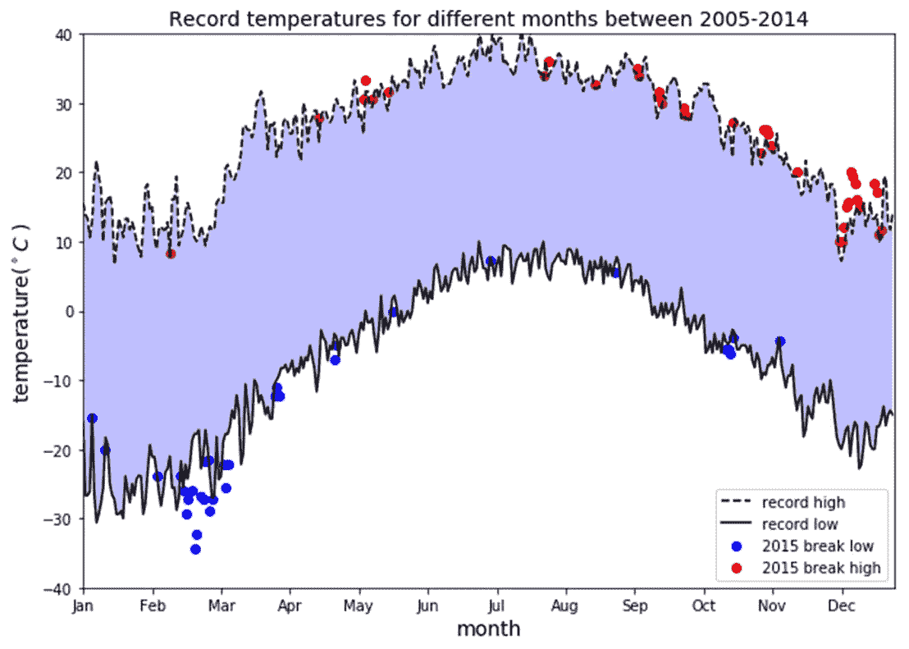
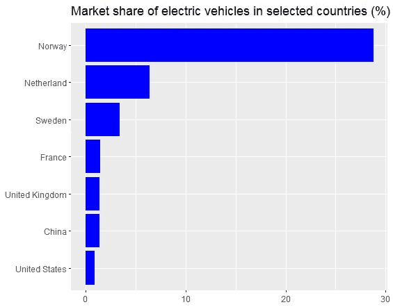
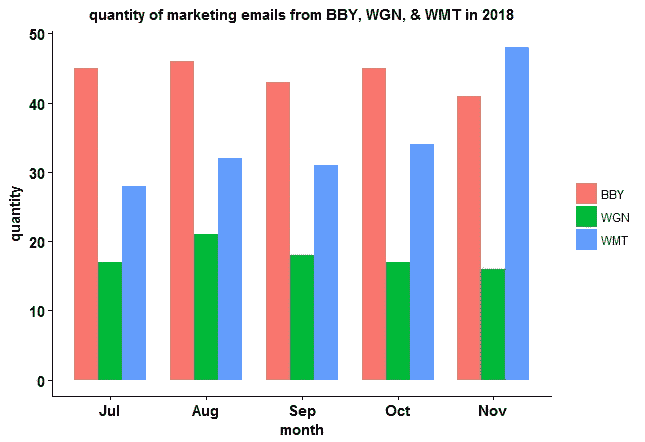
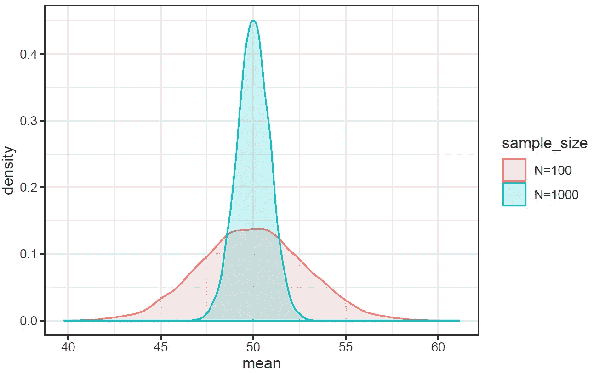
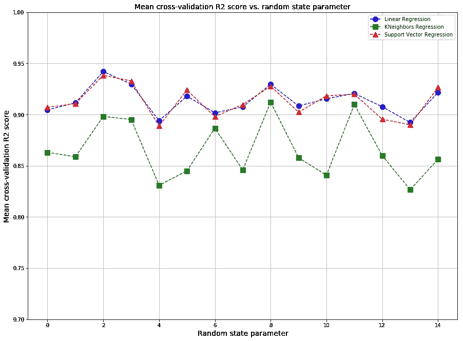
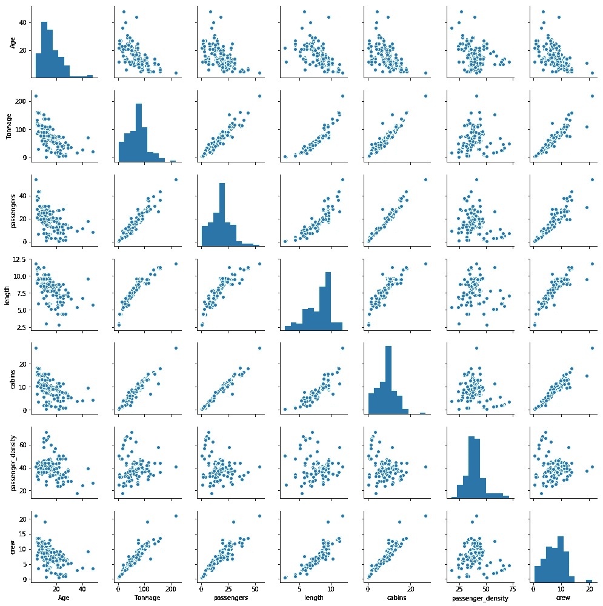
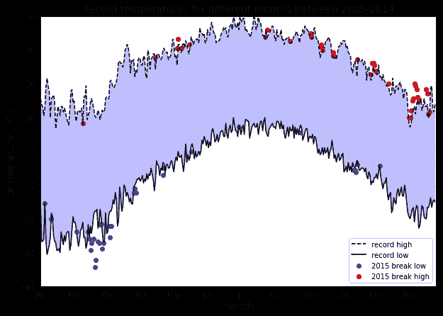

# 如何评估数据可视化

> 原文：<https://pub.towardsai.net/how-to-evaluate-a-data-visualization-e04f75e5ae78?source=collection_archive---------2----------------------->

Benjamin O. Tayo 的图片

## [数据可视化](https://towardsai.net/p/category/data-visualization)

## 一个好的数据可视化应该具备所有必要的组件

# 一.导言

数据可视化是数据科学最重要的分支之一。它是用来分析和研究不同变量之间关系的主要工具之一。数据可视化可用于描述性分析。数据可视化也用于数据预处理和分析过程中的机器学习；特征选择；模型构建；模型测试；和模型评估。

在机器学习(预测分析)中，有几个指标可用于模型评估。例如，监督学习(连续目标)模型可以使用 R2 分数、均方误差(MSE)或平均绝对误差(MAE)等指标进行评估。此外，监督学习(离散目标)模型，也称为分类模型，可以使用诸如准确度、精确度、召回率、f1 分数、ROC 曲线下面积(AUC)等度量来评估。

与可以通过使用单个性能指标来评估的机器学习模型不同，数据可视化不能通过仅查看单个指标来评估。相反，可以基于数据可视化的特征或组件来评估良好的数据可视化。

在本文中，我们将讨论良好的数据可视化的基本组件。在第二节中，我们介绍了良好的数据可视化的各个组成部分。在第三节中，我们研究了一些好的数据可视化的例子。一个简短的总结结束了这篇文章。

# 二。良好的数据可视化的组成部分

一个好的数据可视化由几个组件组成，这些组件必须组合在一起才能产生最终产品:

a) **数据组件**:决定如何可视化数据的第一个重要步骤是了解数据的类型，例如分类数据、离散数据、连续数据、时间序列数据等。

b) **几何组件:**在这里您可以决定哪种可视化适合您的数据，例如散点图、线形图、条形图、直方图、QQ 图、平滑密度、箱线图、对线图、热图等。

c) **映射组件:**这里你需要决定用什么变量作为你的 *x 变量(自变量或预测变量)*，用什么作为你的 *y 变量(因变量或目标变量)*。这一点非常重要，尤其是当数据集是包含多个要素的多维数据集时。

d) **秤组件:**在这里您可以决定使用哪种秤，例如线性秤、对数秤等。

e) **标签组件:**这包括轴标签、标题、图例、使用的字体大小等。

f) **道德成分**:在这里，你要确保你的可视化讲述真实的故事。在清理、汇总、操作和生成数据可视化时，您需要意识到您的行为，并确保您没有使用您的可视化来误导或操纵您的受众。

# 三。良好的数据可视化示例

## **三. 1 柱状图**

***III.1.1 简单条形图***

**图 1** 。 [2016 年选定国家电动汽车市场份额](https://medium.com/towards-artificial-intelligence/tutorial-on-barplots-using-rs-ggplot-package-b7f86104a974)。图像由本杰明·欧·塔约拍摄。

***三. 1.2 带分类变量的柱状图***

**图二**。[2018 年百思买(BBY)、沃尔格林(WGN)和沃尔玛(WMT)的广告邮件数量。](https://medium.com/towards-artificial-intelligence/tutorial-on-barplots-using-rs-ggplot-package-b7f86104a974)图像为本杰明·欧·塔约。

***三. 1.3 对比柱状图***

**图 3** 。 [2020 年全球使用 LinkedIn 搜索工具的技能岗位数量](https://medium.com/towards-artificial-intelligence/top-10-tech-skills-in-2020-worldwide-ecef27c8d8ad)。图像由本杰明·欧·塔约拍摄。

## 三. 2 密度图

**图 4** 。[使用蒙特卡罗模拟的均匀分布样本均值的概率分布](https://towardsdatascience.com/proof-of-central-limit-theorem-using-monte-carlo-simulation-34925a7bc64a)。图像由本杰明·欧·塔约拍摄。

## III.3 散点图和线图

***三. 3.1 简单散点图***

**图 5** 。[使用多元回归分析的机组变量的理想图和拟合图](https://medium.com/towards-artificial-intelligence/role-of-data-visualization-in-machine-learning-a6dd62ad1082)。图像由本杰明·欧·塔约拍摄。

***三. 3.2 对比散点图***

**图 6** 。[不同回归模型的平均交叉验证分数](https://medium.com/towards-artificial-intelligence/role-of-data-visualization-in-machine-learning-a6dd62ad1082)。图像由本杰明·欧·塔约拍摄。

***三. 3.3 多重散点图***

**图 7** 。[使用不同学习率参数值](http://Regression analysis using different values of the learning rate parameter.)的回归分析。图像由本杰明·欧·塔约拍摄。

***III.3.4 散点图***

**图 8** 。 [Pairplot 显示数据集中特征之间的关系](https://medium.com/towards-artificial-intelligence/role-of-data-visualization-in-machine-learning-a6dd62ad1082)。图片来源:Benjamin O. Tayo。

## III.4 热图图

**图 9** 。[协方差矩阵图，显示数据集中特征之间的相关系数](https://medium.com/towards-artificial-intelligence/role-of-data-visualization-in-machine-learning-a6dd62ad1082)。图片来源:Benjamin O. Tayo。

## 三。5 天气数据图

**图十**。[记录 2005 年至 2014 年间不同月份的温度](https://medium.com/towards-artificial-intelligence/tutorial-on-data-visualization-weather-data-52efa1bef183)。图像由本杰明·欧·塔约拍摄。

# 四。总结和结论

总之，我们已经讨论了良好的数据可视化的基本组件。与使用单一评估指标评估模型的预测建模不同，在数据可视化中，评估是通过分析可视化来执行的，以确保它包含良好数据可视化的所有基本组件。

# 其他数据科学/机器学习资源

[数据科学最低要求:开始做数据科学你需要知道的 10 项基本技能](https://towardsdatascience.com/data-science-minimum-10-essential-skills-you-need-to-know-to-start-doing-data-science-e5a5a9be5991)

[数据科学课程](https://medium.com/towards-artificial-intelligence/data-science-curriculum-bf3bb6805576)

[机器学习的基本数学技能](https://medium.com/towards-artificial-intelligence/4-math-skills-for-machine-learning-12bfbc959c92)

[进入数据科学的 5 个最佳学位](https://towardsdatascience.com/5-best-degrees-for-getting-into-data-science-c3eb067883b1)

[数据科学的理论基础——我应该关心还是仅仅关注实践技能？](https://towardsdatascience.com/theoretical-foundations-of-data-science-should-i-care-or-simply-focus-on-hands-on-skills-c53fb0caba66)

[机器学习项目规划](https://towardsdatascience.com/machine-learning-project-planning-71bdb3a44349)

[如何组织你的数据科学项目](https://towardsdatascience.com/how-to-organize-your-data-science-project-dd6599cf000a)

[大型数据科学项目的生产力工具](https://medium.com/towards-artificial-intelligence/productivity-tools-for-large-scale-data-science-projects-64810dfbb971)

[数据科学作品集比简历更有价值](https://towardsdatascience.com/a-data-science-portfolio-is-more-valuable-than-a-resume-2d031d6ce518)

***如有疑问，请发邮件给我***:benjaminobi@gmail.com