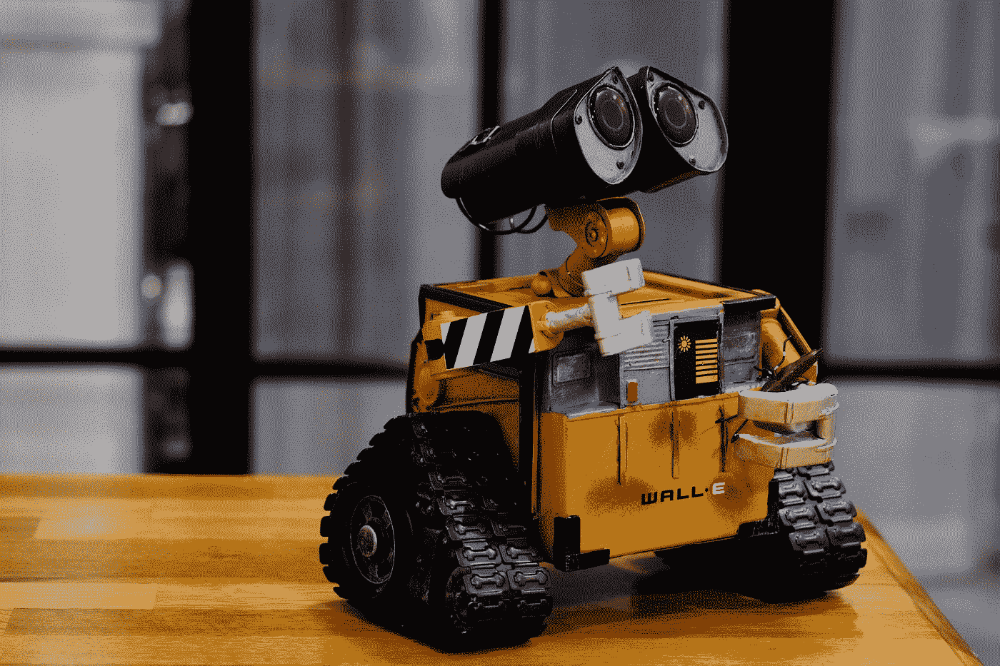

# 如何向你的经理解释机器学习？

> 原文：<https://pub.towardsai.net/how-to-explain-machine-learning-to-your-manager-7b983e7ed3cb?source=collection_archive---------1----------------------->

## [机器学习](https://towardsai.net/p/category/machine-learning)

## 用不到 1000 个单词描述 10000 英尺高的景色

学习机。[雷锐](https://unsplash.com/@ray30?utm_source=medium&utm_medium=referral)在 [Unsplash](https://unsplash.com?utm_source=medium&utm_medium=referral) 上拍照

> 人工智能不会取代经理，但使用人工智能的经理会取代不使用人工智能的经理。

机器学习(ML)是这些天你经常听到的大量使用的流行词汇之一。大多数经理想使用它，但不知道从哪里开始，甚至不知道它的实际含义。乍一看，这似乎很神秘，很专业，也很吓人。但是在这篇文章中，我将分解什么是 ML，它的应用，ML 是如何构建的，以及你在一个非常高的“管理”水平上开发 ML 所需要的技能。

# ML 是什么？

> 用最简单的话来说，机器学习是某些类型的计算机程序从经验中学习的能力，就像我们人类从经验中学习一样。

从经验中学习。照片由 [Aaron Burden](https://unsplash.com/@aaronburden?utm_source=medium&utm_medium=referral) 在 [Unsplash](https://unsplash.com?utm_source=medium&utm_medium=referral) 上拍摄

为了详细说明这一点，让我们回顾一下你蹒跚学步的时候，学习区分哪些动物是狗，哪些是猫。你的父母会给你看一张拉布拉多犬的照片，然后说“狗”然后他们会给你看一张波斯猫的照片，说“猫”他们会经常在不同的狗和猫的图像上重复这个动作，比如德国牧羊犬、牛头犬、腊肠犬、暹罗猫、美国短毛猫等等。

有一天，你看到一只你从未见过的狗，比如小猎犬，并正确地识别出它是一只“狗”。这是怎么发生的？没有人专门给你看一张小猎犬的照片，告诉你这是一只狗。但是根据你观察其他狗的经验，你仍然能够正确地对它进行分类。

ML 的工作方式大致相同。我们可以通过给程序输入许多狗和猫的示例图像，来教会一些计算机程序将图像分类为狗或猫。有了足够多的例子可以学习，这个计算机程序可以很好地在以前看不到的图像上识别狗和猫，甚至可以在这项任务中击败我们人类！

# ML 的应用

真正的英雄。照片由[联合国新冠肺炎回应](https://unsplash.com/@unitednations?utm_source=medium&utm_medium=referral)在 [Unsplash](https://unsplash.com?utm_source=medium&utm_medium=referral)

尽管区分你的猫和你的狗有很大的价值，但我们可以在其他领域使用同样的技术，例如分类胸部 x 光片是健康的肺部图像还是患有癌症的图像。谷歌在数千张胸部 x 光图像上训练了一个 ML 系统，并取得了与大多数训练有素的医生相当的结果，以准确识别肺癌[ [链接](https://www.nature.com/articles/s41591-019-0447-x)。你可以想象这项技术在缺少医生和内科医生的农村地区会有多么的革命性。拯救生命的潜力是巨大的！

被称为深度学习(DL)的 ML 子集已经彻底改变了计算机视觉(CV)领域，该领域使用计算机来理解和解释图像和视频。计算机视觉的一些应用包括

1.  医学图像分类
2.  苹果的 FaceID
3.  谷歌的反向图片搜索
4.  脸书的图像标记
5.  Youtube 的内容审核
6.  智能手机相机场景识别
7.  视频游戏中的分辨率增强，称为深度学习超级采样(英伟达的 DLSS)
8.  无人驾驶汽车
9.  还有很多很多！

# 如何构建 ML

大多数 ML 系统有两个主要阶段。

1.  培训阶段
2.  推理/测试阶段

培训。照片由 [Meghan Holmes](https://unsplash.com/@yellowteapot?utm_source=medium&utm_medium=referral) 在 [Unsplash](https://unsplash.com?utm_source=medium&utm_medium=referral) 上拍摄

在训练阶段，人类向 ML 系统展示他/她希望系统学习的任务的许多“数据”示例。这个阶段类似于人类父母向一个蹒跚学步的孩子展示几幅狗和猫的图片。

测试。[绿色变色龙](https://unsplash.com/@craftedbygc?utm_source=medium&utm_medium=referral)在 [Unsplash](https://unsplash.com?utm_source=medium&utm_medium=referral) 上拍摄的照片

在推理或“测试”阶段，我们使用在训练阶段通过经验学习的 ML 系统来预测以前没有见过的新例子。这个阶段类似于一个蹒跚学步的人正确地识别出一只小猎犬是一只狗，尽管他/她以前从未见过。另一个例子是在成千上万的其他人的胸部 x 光片上训练一个 ML 系统，以识别你的胸部 x 光片是否健康。

尽管有其革命性的力量，ML 仍然依赖于看到比人类学习特定任务所需的更多的例子。但是，一旦 ML 系统学会了它试图学习的工作，它就可以在这项工作中与最优秀的人相媲美，甚至更好。一个很好的例子是谷歌的 Alpha Go 系统，它在一场围棋比赛中击败了世界上最好的棋手。Alpha Go 变得如此之好，以至于它实现的一些获胜策略甚至让专家们感到困惑，一些围棋选手开始从 Alpha Go 系统中学习技巧！

# 所需技能

现在您已经了解了 ML 的强大之处，那么如何开始构建自己的 ML 应用程序呢？以下是你需要学习的技术:

1.  数学和统计学
2.  逻辑和编程:尤其是在 Python 中
3.  AI 框架:Tensorflow，Pytorch，Numpy，Pandas，Sklearn，Matplotlib

数学:宇宙的语言。JESHOOTS.COM 在 [Unsplash](https://unsplash.com?utm_source=medium&utm_medium=referral) 上[的照片](https://unsplash.com/@jeshoots?utm_source=medium&utm_medium=referral)

有时候用 Python 学习统计学是有优势的，这样可以把理论和实践结合起来。Python 和 R 编程语言之间也有一些争论。如果你有时间，一定要学习两种语言！但是根据我的经验，现在大多数生产 ML 解决方案都使用 Python。因此，如果你时间有限，专注于 Python 将会给你在这个领域找到工作的最高机会，如果你是一个个人贡献者，或者如果你是一个经理，雇佣一些人可以为你建立生产 ML。

这就是我今天给你的全部。我希望这篇文章能够稍微揭开 ML 的面纱，让你走上更多的学习之路。下一集再见。感谢您的阅读！