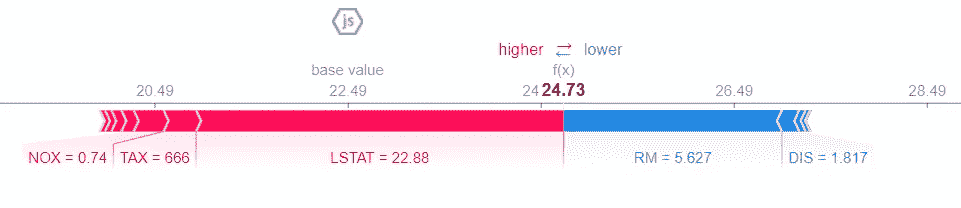
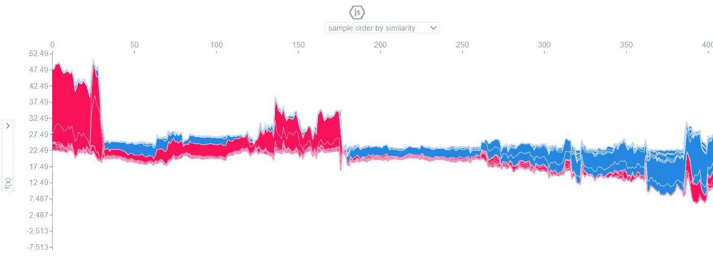
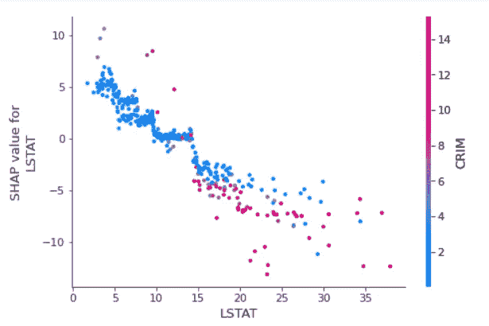
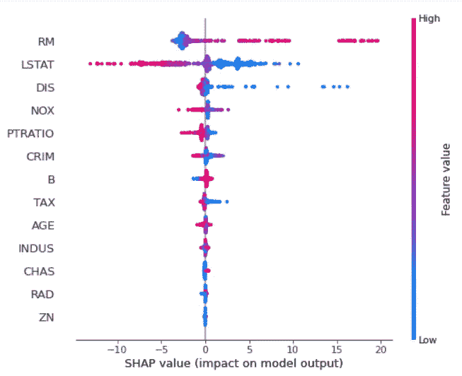
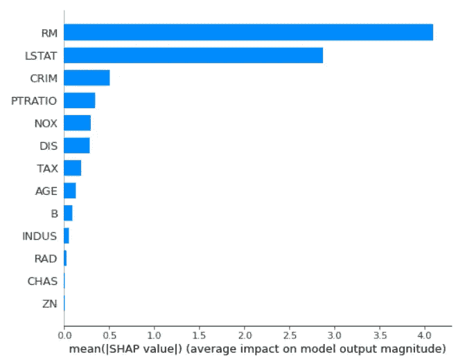

# 用树 SHAP 解释你的机器学习预测

> 原文：<https://pub.towardsai.net/how-to-explain-your-machine-learning-predictions-with-shap-values-a8332c3e5a11?source=collection_archive---------0----------------------->

## [数据科学](https://towardsai.net/p/category/data-science)，[机器学习](https://towardsai.net/p/category/machine-learning)

## SHapley 加法解释


来源: [SHAP](https://github.com/slundberg/shap)

可解释人工智能(XAI)是人工智能领域的一个热门话题。它指的是可以用来让任何黑盒机器学习被人类专家理解的工具和技术。市场上有很多这样的工具，如 LIME、SHAP、ELI5、Interpretml 等。

本文的目的是了解什么是沙普利价值，SHAP 价值是如何从沙普利价值中产生的。然后，我们将使用 SHAP 值来解释和说明任何机器学习预测。让我们开始吧。

# 什么是 SHAP

正如作者在 [Github](https://github.com/slundberg/shap) 页面— *上所说，“SHAP(SHapley Additive explaints)是一种解释任何机器学习模型输出的博弈论方法。它使用博弈论的经典 Shapley 值及其相关扩展将最优信用分配与本地解释联系起来。*

## 沙普利值

如上所述，沙普利值是基于经典博弈论。有许多游戏类型，如合作/非合作、对称/非对称、零和/非零和等。但是 Shapley 值是基于合作(联盟)博弈理论的。

在联盟博弈理论中，一群玩家聚集在一起创造一些价值。你可以想象一群人一起成立一个公司来创造一些利润。Shapley 值是一种在玩家之间分配利润的方法。我们希望根据玩家的贡献在他们之间公平分配利润。

## **通过示例了解 Shapley 值**

假设您已经训练了模型来预测房价。例如，该模型预测房价为 10 万美元。房子的大小是 2400 平方英尺，位于 HSR 布局，有 3 间卧室。现在，我们的目标是解释这个预测。假设$85，000 是给定数据集的平均房价。Shapley 值解释了与平均预测相比，每个特征值对预测的贡献有多大？

在上面的例子中，特征值`Size`、`Area`、`City,`、`BedRooms`一起工作以实现 100，000 美元的预测。目标是解释实际预测值(100，000 美元)和平均预测值(85，000 美元)之间的差异:15，000 美元的差异。一种可能的解释是，`size`贡献了 3 万美元，`Area`贡献了 2.5 万美元，`City`贡献了-2.5 万美元，`BedRooms`贡献了-1.5 万美元。捐款加起来是 15，000 美元——这只不过是最终预测减去平均预测房价。

如何计算一个特征的 Shapley 值？

> Shapley 值是一个特性值在所有可能的联合中的平均边际贡献。

对于这个例子，我们将研究特性`Bedrooms`在添加到`Size`、`Area`和`City`特性的联合中时的贡献。我们模拟只有`Size`、`Area`、`City`和`Bedrooms`是一个联盟。

**第一步:**第一步，我们从数据中随机抽取一个实例，不使用`Bedrooms`特征计算房价。我们可以多次执行此活动，然后取平均值。

**第二步:**第二步，我们取所有特征`Size`、`Area`、`City`、`Bedrooms`时的房价平均值。在这里，我们也可以多次执行采样步骤并取平均值。

我们对所有可能的联盟重复这两个步骤。您可能已经注意到，如果要素数量增加，计算时间会呈指数增长。你如何处理这个问题？解决这个问题的一个方法是从每个联盟的数据中抽取一些样本。这样我们可以控制计算时间。

以下列表显示了当考虑`Size`、`Area`、`City`和`Bedrooms`联合时，确定`Bedrooms`的 Shapley 值所需的所有特征值联合。

*   没有特征值
*   大小
*   面积
*   城市
*   尺寸+面积
*   大小+城市
*   区域+城市
*   规模+面积+城市

对于这些联盟中的每一个，边际贡献是通过计算有和没有特色价值卧室的房价之间的差异来计算的。最后，通过加权平均计算 Shapley 值。我们对所有的特征重复这个过程以获得 Shapley 值。

这是 Shapley 值如何用于解释模型预测的核心概念。然而，SHAP 库的实现方式可能会有一些变化。对于好奇的读者，我建议您浏览一下实现细节或各自的研究论文。

## **从沙普利值到 SHAP 值**

SHAP 值基于沙普利值。受几种方法的启发，SHAP 的作者提出了一种解释模型预测的统一方法。请注意，在计算 SHAP 值时，沙普利值的核心概念仍然保持不变。对于好奇的读者来说，数学形式的细节可以在[这里](https://papers.nips.cc/paper/2017/file/8a20a8621978632d76c43dfd28b67767-Paper.pdf)和[这里](https://christophm.github.io/interpretable-ml-book/shap.html)找到。

因此，简而言之，SHAP 的目标是通过计算每个特征对预测的贡献来解释任何机器学习模型实例的预测。

既然我们已经理解了联盟博弈论，它与沙普利值和 SHAP 值的关系，以及它如何帮助机器学习模型的可解释性，现在是动手的时候了。

# 装置

```
pip install shap
**Or**
conda install -c conda-forge shap
```

# 使用

下面是 SHAP 的用法示例。我们将不得不使用不同的解释方法或情节类型。

```
import shap
explainer = shap.***TreeExplainer***(model)
shap_values = explainer.shap_values(X)shap.***force_plot***(explainer.expected_value, shap_values[0,:], X.iloc[0,:])
```

SHAP 提供了以下计算 SHAP 值的方法/算法。每种方法都适合于你试图得到解释的模型类型。

*   **TreeExplainer —** 该方法实现了TreeSHAP 算法，适用于决策树、随机森林等基于树的算法。
*   **DeepExplainer —** 该方法实现了 DeepLIFT 算法，用于深度学习模型。
*   **GradientExplainer —** 此方法使用预期梯度来逼近 SHAP 值，用于深度学习模型。
*   **LinearExplainer —** 顾名思义，这种方法非常适合线性模型。
*   **KernelExplainer —** 这个方法是一个模型不可知的方法。意味着它可以用于解释任何模型——线性模型、树模型或深度学习模型。

# 例子

让我们试着去理解 TreeExplainer 和在 SHAP 可用于解释模型预测的不同绘图。请参考[此处的](https://github.com/slundberg/shap#sample-notebooks)获取官方样品笔记本。

## 力图

力图用于解释个别情况的预测。以下示例显示了测试数据集中第三个实例的力图。

```
# load JS visualization code to notebook
shap.initjs()# visualize the first prediction’s explanation
shap.force_plot(explainer.expected_value, shap_values[2,:], X.iloc[2,:])
```



*   `f(x)`是模型预测(24.73)。
*   `base value`是整个测试数据集的平均预测值。这是在我们不知道当前输出的任何特征的情况下预测的值。
*   将预测值推高的要素显示为红色，将预测值推低的要素显示为蓝色。
*   `LSTAT`特征对房价有很高的正面影响，推动预测正确。推动房价上涨的其他重要因素还有`TAX` & `NOX`。*您还可以注意到，这三个值高于它们在训练数据中的平均值。*
*   `RM`特征对房价有较高的负面影响，其次是`DIS`特征。

上面的图是一个例子。如果我们采用如上所示的许多解释，将它们旋转 90 度，然后水平堆叠，我们可以看到整个数据集的解释如下*(注意，该图在笔记本中是交互式的)。*

```
# load JS visualization code to notebook
shap.initjs()# visualize the training set predictions
shap.force_plot(explainer.expected_value, shap_values, X)
```



## 依赖图

为了理解单个特征如何影响模型的输出，可以使用依赖图。部分相关图说明了一个或多个特征与目标变量之间的关系。这种关系可以是线性的或非线性的(指数、二次等)。).注意，`dependence_plot()`方法会自动添加另一个与给定特性交互最多的特性。

在下图中，`LSTAT`特征与`CRIM`特征交互最多。从图中还可以看出,`LSTAT`和目标变量之间存在线性关系(负)。

```
shap.dependence_plot('LSTAT', shap_values, X_train)
```



## 汇总图

摘要图用于找出对模型最重要的特征。在下面的示例中，我们绘制了每个样本的每个要素的 SHAP 值。然后，根据所有样本的 SHAP 值的总和对该图进行排序。

```
shap.summary_plot(shap_values, X_train)
```



*   特征按`feature importance`降序排列。
*   `Color`表示该变量在该观察中是高(红色)还是低(蓝色)。
*   每个特征水平线上的每个点显示了该值*的影响是与更高(红色)还是更低(蓝色)的预测*相关联。
*   我们还可以看到每个特征和目标变量之间的`correlation`。一个*高*水平的“RM”对房价有着高*正*的影响。请注意，“高”来自红色，而“积极”影响显示在 X 轴上。同样，我们可以说“DIS”的高值与目标变量负相关。

带`plot_type='bar'`的汇总图将给出变量重要性图。预测能力高的特征显示在顶部，预测能力低的特征显示在底部。

```
shap.summary_plot(shap_values, X_train, plot_type='bar')
```



这里，我们只是通过 TreeExplainer 方法来解释模型。您可以探索其余的方法/算法— DeepExplainer、kernelExplainer、LinearExplainer 和 GradientExplainer。

# 完全码

您可以在下面找到完整的代码。请注意，下面的代码中加载了一些可视化效果，因为它需要加载 javascript。

# 结论

在这篇文章中，你已经理解了一个流行的可解释的人工智能框架 SHAP。在这个过程中，你已经理解了它是如何与联盟博弈论、Shapley 值、Shap 值等联系起来的。对于好奇的读者，我建议你进一步探索 SHAP 图书馆以获得最大的收获，并浏览参考资料部分提到的链接。

*阅读更多关于 Python 和数据科学的此类有趣文章，* [***订阅***](https://pythonsimplified.com/) *到我的博客*[***www.pythonsimplified.com***](http://www.pythonsimplified.com)***。*** 你也可以通过 [**LinkedIn**](https://www.linkedin.com/in/chetanambi/) 联系我。

为了节省你的时间，我列出了你可能会感兴趣的相同主题的文章，即可解释的人工智能。

[](https://towardsdatascience.com/5-explainable-ai-xai-frameworks-92359b661e33) [## 5 个可解释的人工智能(XAI)框架

### …您可以开始在您的机器学习项目中使用

towardsdatascience.com](https://towardsdatascience.com/5-explainable-ai-xai-frameworks-92359b661e33) [](https://medium.com/towards-artificial-intelligence/lime-explaining-any-machine-learning-prediction-d663c457a740) [## LIME 解释任何机器学习预测

### 用石灰向可解释的人工智能迈出第一步

medium.com](https://medium.com/towards-artificial-intelligence/lime-explaining-any-machine-learning-prediction-d663c457a740) 

# 参考

[](https://christophm.github.io/interpretable-ml-book/shap.html) [## 5.10 SHAP (SHapley 附加解释)|可解释的机器学习

### 本章目前仅在此网络版本中可用。电子书和印刷品将紧随其后。SHAP(沙普利添加剂…

christophm.github.io](https://christophm.github.io/interpretable-ml-book/shap.html) [](https://github.com/slundberg/shap) [## slundberg/shap

### SHAP 是一种博弈论的方法来解释任何机器学习模型的输出…

github.com](https://github.com/slundberg/shap)