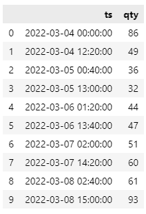
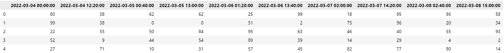
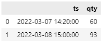
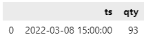
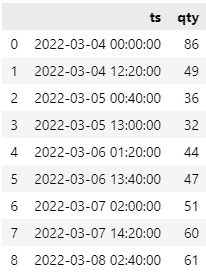
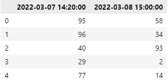
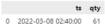
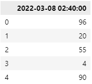
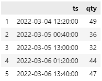
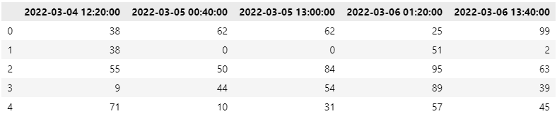

# 如何按时间筛选熊猫数据帧

> 原文：<https://pub.towardsai.net/how-to-filter-pandas-dataframe-by-time-81509d3adee9?source=collection_archive---------0----------------------->

## 按时间过滤数据帧的简单熊猫方法


托马斯·博尔曼斯在 [Unsplash](https://unsplash.com?utm_source=medium&utm_medium=referral) 上拍摄的照片

# 介绍

带有时间戳的数据集很常见，我们可能需要按时间过滤数据帧。在本文中，我们研究了如何使用 Pandas 版本 1.4.1 中的`.between_time()`、`.at_time()`和`.loc`方法按时间过滤 Pandas 数据帧。

我们创建了两个数据帧，`df_row`和`df_col`，用于说明如何跨不同的轴按时间进行过滤。

```
ts = pd.date_range('2022-03-04', periods=10, freq='12h20min')
df_row = pd.DataFrame({'ts': ts, 'qty': [np.random.randint(10, 100) for i in range(10)]})
df_col = pd.DataFrame(np.random.randint(0,100,size=(5, 10)), columns = ts)
```

`df_row`有一个名为`ts`的时间戳列



作者图片

而`df_col`将列标题作为时间戳



作者图片

# 在时间之间

`.between_time()`是一个 Pandas DataFrame 方法，用于过滤 Pandas DataFrame 中开始和结束时间之间的行。这些参数是:

*   `start_time` : datetime.time 或 str
*   `end_time` : datetime.time 或 str
*   `inclusive` : { "两者"、"两者都不是"、"左"、"右" }，默认为"两者"。包括边界；将每个绑定设置为封闭还是开放。
*   `axis` : {0 或'索引'，1 或'列' }，默认为 0

该方法用于过滤`DateTimeIndex`，因此我们必须确保使用`set_index()`方法将`ts`列设置为索引。`start_time`和`end_time`参数排除 24 小时和 12 小时时间格式。注意`.between_time()`仅过滤**时间**而不考虑日期。

```
# 24 hour format
df_row.set_index('ts').between_time('14:20', '16:00').reset_index()# 12 hour format
df_row.set_index('ts').between_time('2:20PM', '4:00PM').reset_index()
```



作者图片

默认情况下，`start_time`和`end_time`是包含的。我们可以通过定义`inclusive`参数将左右边界设置为开放或封闭。

```
df_row.set_index('ts').between_time('2:20PM', '4:00PM', inclusive = 'right').reset_index()
```



作者图片

时间为 14:20:00 的行被删除，因为不包括左边界。

如果我们希望得到不在和`start_time`之间的所有时间**，我们只需将`start_time`设置为晚于`end_time`。**

```
# swap the start_time and end_time
df_row.set_index('ts').between_time('16:00', '14:20').reset_index()
```



作者图片

`.between_time()`也允许我们跨列按时间过滤数据帧。我们可以通过将`axis`参数定义为`1`来实现。

```
df_col.between_time('14:20', '16:00', axis = 1)
```



作者图片

# 有时

`.at_time()`是一个 Pandas DataFrame 方法，它选择具有确切时间而不是时间范围的行。这些参数是:

*   `time` : timedatetime.time 或 str
*   `axis` : {0 或'索引'，1 或'列' }，默认为 0

该方法用于过滤一个`DateTimeIndex`，因此我们必须确保通过使用`set_index()`方法将`ts`列设置为索引。参数`time`接受 24 小时和 12 小时时间格式。注意`.at_time()`仅过滤**时间**而不考虑日期。

```
# 24 hour format
df_row.set_index('ts').at_time('02:40').reset_index()# 12 hour format
df_row.set_index('ts').at_time('2:40 AM').reset_index()
```



作者图片

`.at_time()`还允许我们按时间跨列而不是行过滤数据帧。我们可以通过简单地将轴参数定义为`1`来实现。

```
df_col.at_time('02:40', axis = 1)
```



作者图片

# 在日期和时间之间筛选

上面的例子演示了如何按时间过滤，而不考虑日期。以下示例显示了如何在两个时间戳之间进行过滤，同时考虑日期和时间，例如在`2022-03-04 12:00`和`2022-03-06 15:00`之间。让我们将开始和结束日期时间定义为`datetime.datetime`类型。

```
from datetime import datetimestart_datetime = datetime.strptime('2022-03-04 12:00:00', '%Y-%m-%d %H:%M:%S')
end_datetime = datetime.strptime('2022-03-06 15:00:00', '%Y-%m-%d %H:%M:%S')
```

筛选行

```
df_row.loc[(df_row['ts'] >= start_datetime) & (df_row['ts'] <= end_datetime)]
```



作者图片

要筛选列

```
df_col.loc[:, [i for i in df_col.columns if i >= start_datetime and i <= end_datetime]]
```



作者图片

# 结论

在这篇文章中，我们研究了 3 种方法来过滤熊猫数据帧的时间和日期和时间的组合。`.between_time()`和`.at_time`是应用在`DateTimeIndex`上的简单优雅的方法，只过滤时间，不过滤日期。要过滤日期和时间组合，我们可以使用`.loc`并将开始和结束范围定义为`datetime.datetime`类型。