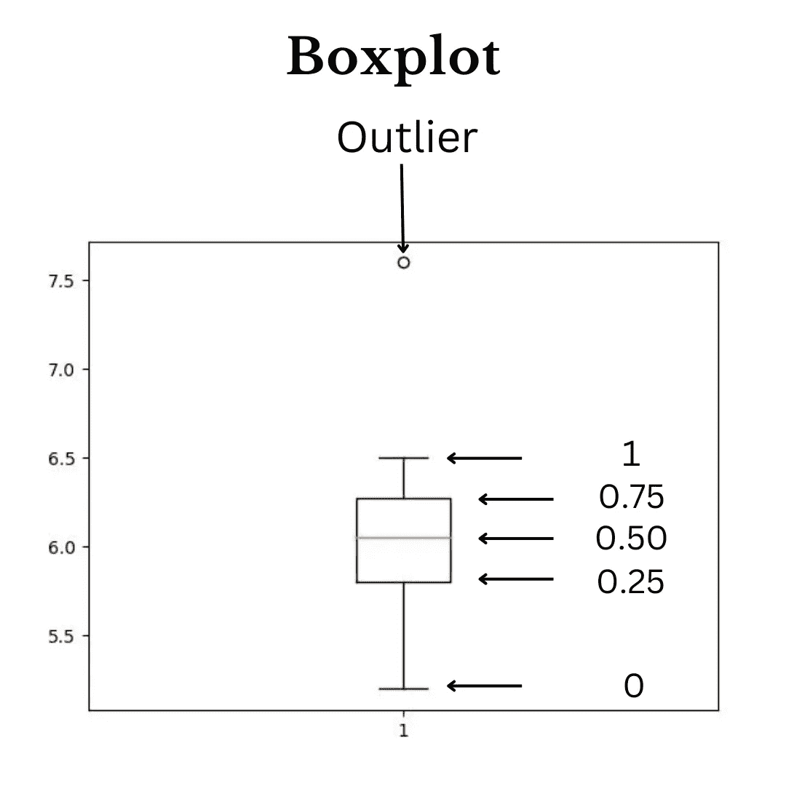

# 找出数据中异常值的不同方法，以及如何使用四分位间距统计消除异常值

> 原文：<https://pub.towardsai.net/how-to-find-outliers-in-the-data-using-interquartile-range-statistics-in-python-266704600964?source=collection_archive---------5----------------------->

离群值是远离其他数据点或与其他数据点非常不同的数据点或观察值。


约书亚·索蒂诺在 [Unsplash](https://unsplash.com/s/photos/data-science?utm_source=unsplash&utm_medium=referral&utm_content=creditCopyText) 上拍摄的照片

# 为什么要删除数据中的异常值

当我们对数据进行统计时，异常值会导致大量的误算；假设我们有许多异常值的数据，我们取这些数据的平均值，一些数据点比其余的数据点大得多，那么我们的平均值将与实际平均值有很大的不同，例如没有异常值的平均值是 5.6。由于离群值，它变成 6.1，但这是一个例子。想象一下，当使用不同的统计数据时会得到误算的值，因此检查异常值并尝试删除它们是非常重要的。

# 使用箱线图发现数据中的异常值

箱线图是查看数据中大量统计信息的好方法，例如 0、25、50、75 和 100 百分位值，也称为五个汇总统计；

五个汇总统计数据也称为分位数，它们提供数据集的汇总，如数据集的方差、最小值、最大值和中值，还可以帮助我们发现数据中的异常值。

我们经常使用平均值来寻找数据的中心，但有时我们的数据集包含如此多的值，这些值与其余的值有很大的不同，这些值也被称为异常值。

假设我们有数据 2，3，4，6。如果我们找到平均值，它将为我们提供 3.75 的权重，因此这是一个代表所有数据集的优秀值。尽管如此，如果数据是 2，3，4，6，38 呢？那么，在这种情况下，平均值在 10.6 附近。这不是表示数据的好方法，因此在这种类型的数据中，平均值不起作用。我们需要使用中间值。所以让我们看看什么是中位数，中位数如何帮助我们计算另一个四分位数。所以四分位数只是一个值，比如 0.25 或 0.75 等。

让我们看看这五个统计数字是什么

这五个统计数据是

1.  0(最小值)
2.  0.25(数据前半部分的中值)
3.  0.50(总数据的中位数)
4.  0.75(数据后半部分的中值)
5.  1(最大值)

三个基本的四分位数是 0.25、0.50 和 0.75，所以让我们讨论一下这些四分位数，以及它如何帮助我们计算数据中的方差。所以有些人可能会想，为什么不用标准差来计算方差呢？我们可以用 std 来计算，但是这给了我们数据中的方差。我们不想那样。我们只想要第 25 百分位数据和第 75 百分位数据之间的方差，因为我们不想在数据中包含异常值。

如果你对方差不熟悉，那么方差告诉我们数据集中的值紧密地排列在一起或者彼此相距很远，比如 1，2，3，4。这个数据的方差很小，但是在 1、3、6 和 9 中，这个数据的方差比前一个数据的方差大。

那么如何计算 0.25 或 25 百分位呢？假设我们有之前的数据 2，3，4，6，38。中间值 4 是中间值。然后把数据分成两部分 2，3，4 和 4，6，38。取数据第一部分的中间值。这样我们得到 3，所以 3 是第 25 个百分位值，取第二部分数据的中间值得到我们 6。这个值是第 75 个百分位数。

中值代表总数据的中心；第 25 个百分位数表示数据前半部分的中心，第 75 个百分位数表示数据后半部分的中心。

我们还通过简单地从第 75 个百分点中减去第 25 个百分点来使用这两个统计量计算四分位间距。这给了我们一个 IQR 值。如果 IQR 是一个有意义的值，我们会说方差与 IQR 成正比。如果 IQR 值增加，方差也会增加，因此下面的箱线图使用图表显示了我们的汇总统计数据。



Boxplot |来源:作者图片

这就是箱线图的样子。我们可以很容易地发现数据和四分位数值中的异常值，黄色水平线表示中值，其他四分位数值如 0.25、0.75、1 等。

# 因此，让我们使用四分位数间统计从数据中移除这些异常值。

四分位间统计是一种使用第 25 和第 75 百分位值来发现数据中异常值的方法，我们已经讨论过了。那么，我们如何找到包含异常值的行呢？

所以要提取离群值，我们需要两个值
1。第 25 百分位值
2。第 75 百分位值

为什么我们需要这两个值，因为四分位数范围是第 25 百分位和第 75 百分位值之间的距离，所以让我们先找出这两个值；我们需要导入 Numpy 库，它用于在 python 中做数值工作。

```
# importing numpy libraries as np
import NumPy as np
```

我们在理论上详细讨论了第 25 和第 75 个四分位数；让我们看看如何使用 NumPy 库找到这些值，下面是两个代码。NumPy 中有一个方法，叫做 quantile()。该方法用于查找四分位数的值，例如，在我们的例子中，我们需要身高列的第 25 和第 75 个百分位的值。

```
# Finding values of 25th percentile value
Q1 = np.quantile(data['Height'],0.25)
# Finding the value of the 75th percentile value
Q3 = np.quantile(data['Height'],0.75)
```

上面的语法只是对 Height 列进行排序，并将第 25 个百分位值存储在 Q1，将第 75 个百分位值存储在 Q3，以找到四分位间统计(IQR)值；我们需要找出 Q3 和 Q1 的区别。

```
# Finding the difference between Q3 and Q1
IQR = Q3 - Q1
```

现在我们计算了(IQR)下一步是计算两个阈值，thresh1 和 thresh2，使用 IQR 这些阈值用于发现异常值；任何小于阈值 1 或大于阈值 2 的值都被视为异常值。

```
# Calculating thresh1 value
thresh1 = Q1 - 1.5*IQR
# Calculating thresh2 value
thresh2 = Q3 + 1.5*IQR
```

现在我们得到了阈值 1 和阈值 2 的值。下一步是对 Height 列小于 thresh1 或大于 thresh2 的行进行子集划分，就这样

```
# Extracting the outlier from our data 
[( data['Height'] < thresh1 ) | ( data['Height'] > thresh2)]
```

现在我们成功地从数据中提取了异常值。感谢您阅读这篇文章。您也可以在 [LinkedIn 上与我联系。](https://www.linkedin.com/in/ashbabkhan/)