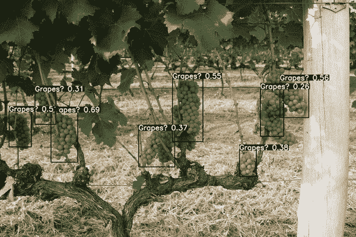
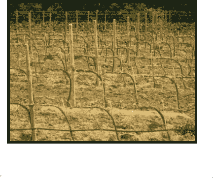
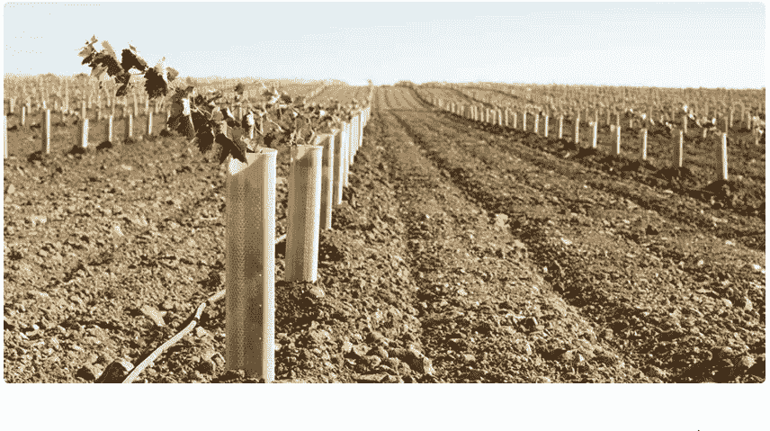
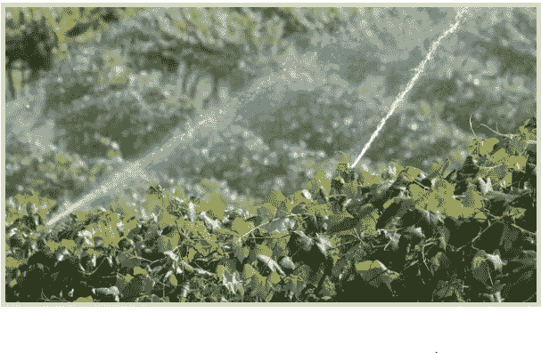
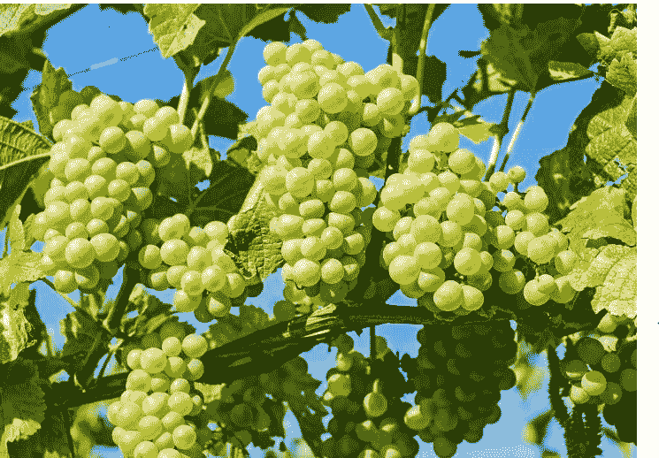
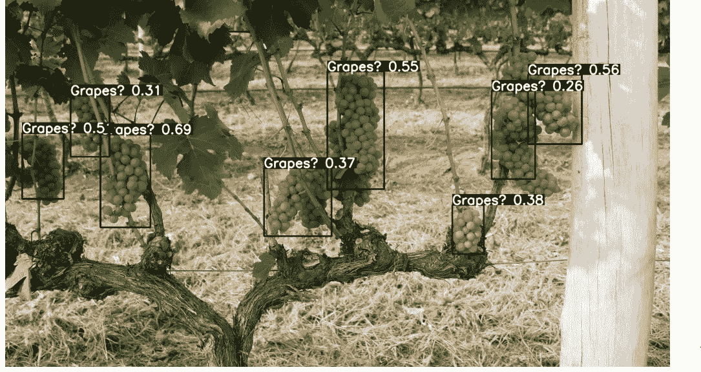
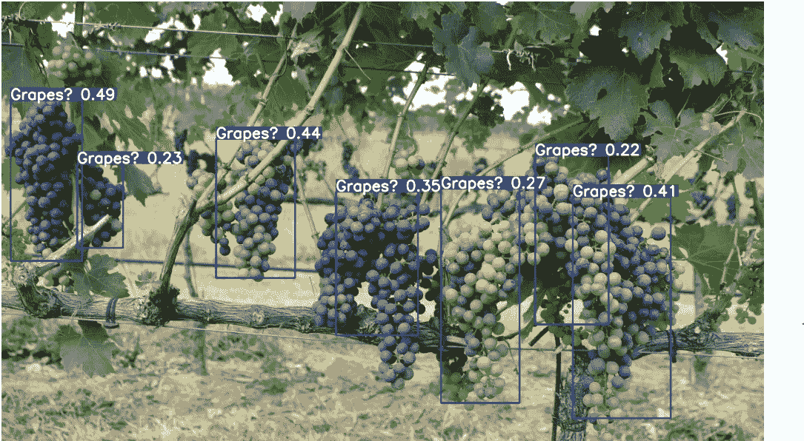

# 如何利用 YoloV3 在葡萄种植中获利

> 原文：<https://pub.towardsai.net/how-to-get-profits-in-grape-farming-using-yolov3-70d366387e60?source=collection_archive---------3----------------------->

## 使用 Monk，低代码深度学习工具和计算机视觉的统一包装器，使计算机视觉变得简单。



葡萄检测

# YoloV3 训练秘密

好了，你已经决定了作物(自定义对象，在我们的例子中是葡萄)，现在你需要使用 YoloV3 来培养(训练)它。这是一个简单的“即时赚钱”任务，就像运行一些类似其他流行的 python 机器学习库的`fit()`和`eval()`方法的变体(例如 *Scikit Learn* 、 *Keras* )。

我们先看一下大图，然后放大每一步。让我们后退一步，看看一个典型的 ML 过程可能是什么样子。事情是这样的

1.  加载和预处理数据
2.  定义模型，优化器
3.  训练模型
4.  推断模型

# 1.加载和预处理数据



参考:[谷歌图片](https://www.google.com/search?q=watering+grape+plants&rlz=1C1GCEA_enIN887IN887&source=lnms&tbm=isch&sa=X&ved=2ahUKEwj72uKFwOnnAhUWyzgGHcj6DdkQ_AUoAnoECBEQBA&biw=1366&bih=608#imgrc=49fUBCE6gtyVNM)

这里我们使用的是 [Grapes](https://github.com/thsant/wgisd) 数据集。

```
!git clone [https://github.com/thsant/wgisd](https://github.com/thsant/wgisd)
!mkdir wgisd/data/labels
!mkdir wgisd/data/imagesf = open("wgisd/data/classes.txt", 'w')
f.write("Grapes**\n**")
f.close()
```

**所需的 YOLO 格式**

```
wgisd/data (root)       
|       
|-------------images (img_dir)       
|              |       
|              |------------------img1.jpg       
|              |------------------img2.jpg       
|              |------------------.........(and so on)       
|       
|-----------labels (label_dir)       
|              |       
|              |------------------img1.txt       
|              |------------------img2.txt       
|              |------------------.........(and so on)       |       |------------classes.txt
```

**类文件**

每个新行中的类列表。该顺序对应于注释文件中的 id。

例如。

类别 1(—————→将为 0)

类别 2(—————→将为 1)

第三类(— — — — — →将是第二类)

第四类(— — — — →将是第三类)

**注释文件格式**

*   所有的坐标都应该归一化。
*   x 坐标除以图像的宽度，Y 坐标除以图像的高度。

《出埃及记》(图像中检测到的对象的每个边界框一行)

CLASS _ ID-BOX _ X _ CENTER-BOX _ Y _ CENTER WIDTH-BOX _ WIDTH-BOX _ HEIGHT

class_id- x1 -y1- w1- h1

class_id -x2- y2- w2- h2…..(以此类推)

**加载数据集**

```
gtf = Detector()
gtf.set_train_dataset(img_dir, label_dir, class_list_file, batch_size=2)
gtf.set_val_dataset(img_dir, label_dir)
```

# 2.定义模型，优化器



参考:[谷歌图片](https://learn.winecoolerdirect.com/life-cycle-of-a-wine-grape/)

很好，现在您已经准备好开始定义您的模型了。你可以从下面选择一个。

*   "约洛夫 3 "
*   “约洛夫 3s”
*   " yolov3-spp "
*   " yolov3-spp3 "
*   " yolov3-tiny "
*   " yo lov 3-spp-矩阵"
*   " csresnext50-panet-spp "

但是现在，我们只选择“yolov3”

```
gtf.set_model(model_name="yolov3")
```

接下来，定义优化器。您可以从以下选项中选择一个

*   "新加坡元"
*   “亚当”

每个优化器都有不同的参数，但是大多数至少需要一个学习率，称为`lr`

这里我们将选择“sgd”，经过几次实验我们发现 lr =0.00579 作为良好的起点。

```
gtf.set_hyperparams(optimizer="sgd", lr=0.00579, multi_scale=**True**, evolve=**True**, num_generations=10)
```

# 3.训练模型



参考: [Goodfriut](https://www.goodfruit.com/key-to-watering-concord-grapes/)

好了，现在你开始真正的耕作了。训练步骤类似于 *sklearn* 或者 *keras。*

```
gtf.Train(num_epochs=10)
```

# 4.推断模型



参考:[https://pixabay.com/](https://pixabay.com/)

训练完模型后，最后一步是预测。

```
gtf = Infer()
gtf.Model(model_name, class_list, weights, use_gpu=**True**, input_size=416)
gtf.Predict(img_path, conf_thres=0.2, iou_thres=0.5)
```

一些形象的推论，你可以看到:



推论 1



推论 2

这篇文章的灵感来自于

[](https://towardsdatascience.com/how-to-cook-neural-nets-with-pytorch-7954c1e62e16) [## 如何用 PyTorch 烹饪神经网络

### 使用 PyTorch 训练神经网络的方法

towardsdatascience.com](https://towardsdatascience.com/how-to-cook-neural-nets-with-pytorch-7954c1e62e16) 

你可以在 [Github](https://github.com/Tessellate-Imaging/Monk_Object_Detection/blob/master/application_model_zoo/Example%20-%20Wine%20Grape%20Instance%20Detection%20Dataset.ipynb) 中找到完整的 jupyter 笔记本。

如有疑问，可联系 [Abhishek](https://www.linkedin.com/in/abhishek-kumar-annamraju/) 和 [Akash](https://www.linkedin.com/in/akashdeepsingh01/) 。请随意联系他们。

我对计算机视觉和深度学习充满热情。我是 [Monk](https://github.com/Tessellate-Imaging/Monk_Object_Detection) 库的开源贡献者。

你也可以在以下网址看到我的其他作品:

[](https://medium.com/@akulahemanth) [## 阿库拉·赫曼思·库马尔培养基

### 阅读阿库拉·赫曼思·库马尔在媒介上的作品。计算机视觉爱好者。每天，阿库拉·赫曼思·库马尔和…

medium.com](https://medium.com/@akulahemanth)