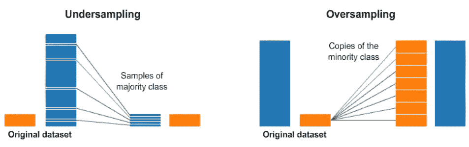

# 机器学习中如何处理不平衡数据

> 原文：<https://pub.towardsai.net/how-to-handle-imbalanced-data-in-machine-learning-9fe1334e9dff?source=collection_archive---------0----------------------->

## [数据科学](https://towardsai.net/p/category/data-science)，[机器学习](https://towardsai.net/p/category/machine-learning)

## 解决分类任务时处理不平衡数据的不同方法

照片由[巴拉蒂·坎南](https://unsplash.com/@bk010397?utm_source=medium&utm_medium=referral)在 [Unsplash](https://unsplash.com/?utm_source=medium&utm_medium=referral) 上拍摄

# 什么是不平衡数据

处理分类任务时最常见的问题之一是数据不平衡，即一个类支配另一个类。例如，在信用卡欺诈检测任务中，与非欺诈交易(负类)相比，欺诈交易(正类)将非常少。有时，甚至有可能 99.99%的交易是非欺诈交易，只有 0.01%的交易是欺诈交易。

在二元分类任务和多类分类任务中，你可能会遇到类不平衡的问题。然而，我们在这里将要学习的技术可以应用于这两者。

# 你为什么要担心不平衡的数据呢？

考虑同样的信用卡欺诈交易检测的例子，其中欺诈和非欺诈交易的比率分别为 99%和 1%。这是一个高度不平衡的数据集。如果您要在这个数据集上训练模型，您将获得高达 99%的准确性，因为分类器将挑选流行类中的模式，并预测几乎所有交易都是非欺诈交易。因此，该模型将无法对新数据进行归纳。这也是为什么在处理不平衡数据时，准确性不是一个好的评估指标的原因。

# 不平衡数据的例子

以下是我们在机器学习中遇到不平衡数据的一些例子:

*   欺诈检测
*   索赔预测
*   流失预测
*   垃圾邮件检测
*   异常检测
*   异常值检测等。

# 处理不平衡数据

让我们尝试一下处理不平衡数据集的一些方法。

## 1.获取更多数据

当你有不平衡的数据时，检查是否有可能得到更多的数据以减少类的不平衡是一个好的实践。在大多数情况下，由于您试图解决的问题的性质，您不会获得所需的更多数据。

## 2.变更评估标准

正如我们上面讨论的，当处理不平衡的类时，准确性不是一个好的度量。下面提到的其他分类指标可以提供更好的洞察力。您可以根据您试图解决的用例或问题来选择指标。

**Precision:** 在所有肯定预测的类别中，实际上是肯定类别的百分比是多少。

**召回:**召回又叫敏感度和真阳性率(TPR)。在所有积极的类中，有多少百分比实际上被预测为积极的。

**F1-得分:**F1-得分是精确度和召回率调和平均值。结果介于 0 和 1 之间，0 表示最差，1 表示最好。它是模型准确性的度量。

**ROC-AUC:** ROC **ROC 图是通过绘制 FPR 对 TPR 而创建的，其中对于 0.0 至 1.0 的不同概率阈值，FPR(假阳性率)绘制在 x 轴上，TPR(真阳性率)绘制在 y 轴上。**

> 我邀请您浏览下面的文章，在这些文章中，我非常详细地解释了不同的分类评估标准。

 [## 分类评估指标解释清楚

### 理解混淆矩阵、精确度、回忆、F1 分数等。

medium.com](https://medium.com/towards-artificial-intelligence/classification-evaluation-metrics-explained-clearly-e74756dd2a0f)  [## ROC 曲线和 AUC 初学者指南

### 了解什么是 ROC 曲线和 AUC，如何工作，以及如何将其用于分类问题

medium.com](https://medium.com/towards-artificial-intelligence/the-beginners-guide-to-the-roc-curve-and-auc-40585bada247) 

## 3.改变算法

你应该尝试用不同的机器学习算法来比较结果。基于树的分类器，例如决策树分类器、额外树分类器、随机森林分类器等。即使在不平衡的数据集上也能表现良好。

## 4.重采样技术

这是平衡数据集中多数类和少数类的方法。有两种重采样技术:

**欠采样** —这有助于减少数据集中多数类示例的数量。因为我们从原始数据中删除了多数类示例，所以丢失了一些信息。

**过采样** —这有助于增加数据集中少数类示例的数量。过采样的主要优点之一是在处理过程中，多数类和少数类都不会丢失信息。容易过拟合。

资料来源:KDNuggets.com

## 5.生成合成样本

过采样技术创建少数类的副本来平衡数据集。这种方法的一个改进是使用不同的方法合成新的少数类。两种最常用的技术是——SMOTE(合成少数过采样技术)和 ADASYN(自适应合成采样)。

# 结论

在本文中，您已经了解了什么是类不平衡，以及在机器学习中处理不平衡数据的不同方法。在下一篇文章中，我们将使用`imbalanced-learn`库来处理不平衡数据。

*阅读更多关于 Python 和数据科学的此类有趣文章，* [***订阅***](https://pythonsimplified.com/) *到我的博客*[***【www.pythonsimplified.com】***](http://www.pythonsimplified.com/)***。*** 你也可以通过 [**LinkedIn**](https://www.linkedin.com/in/chetanambi/) 联系我。