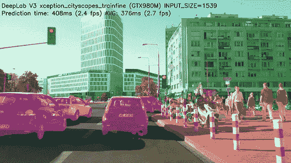
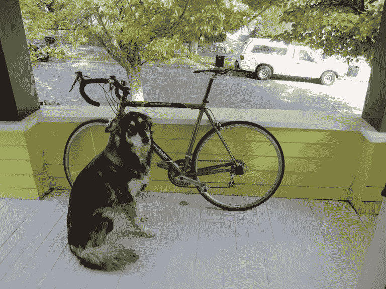
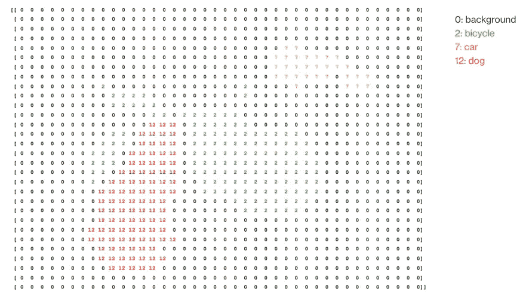
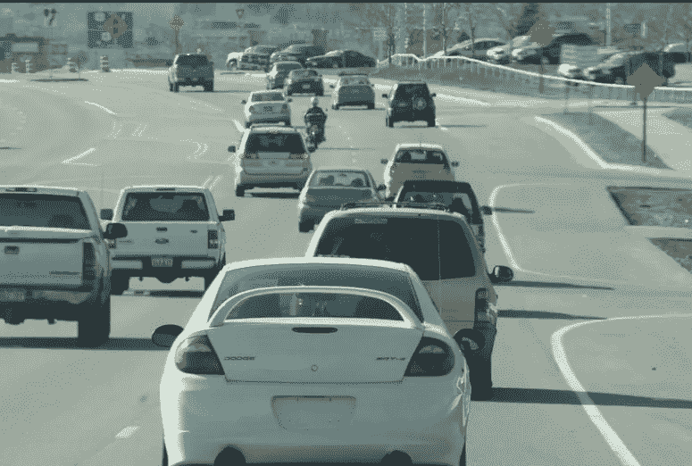
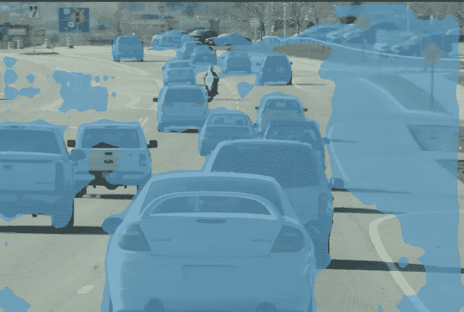
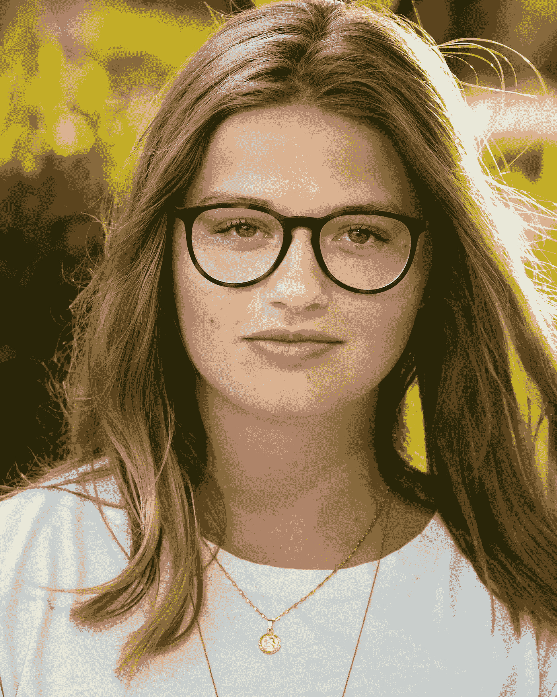
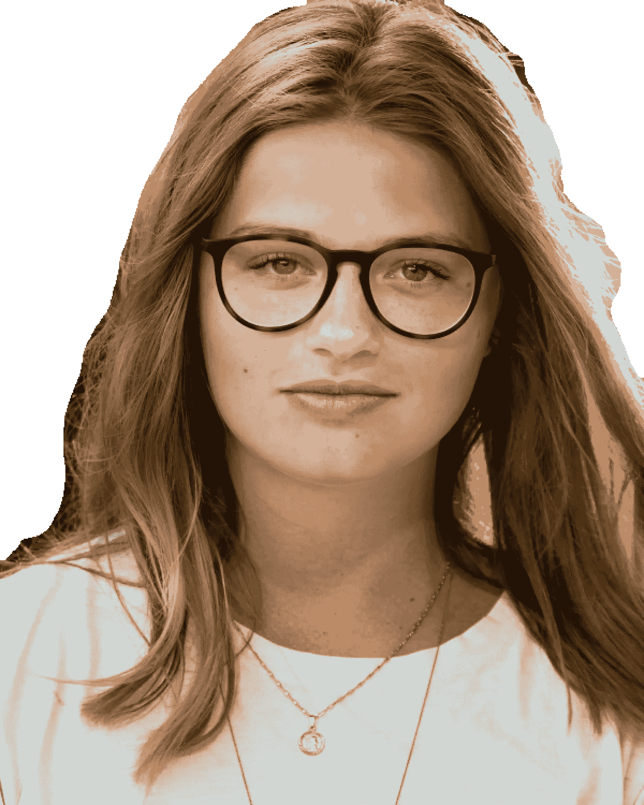
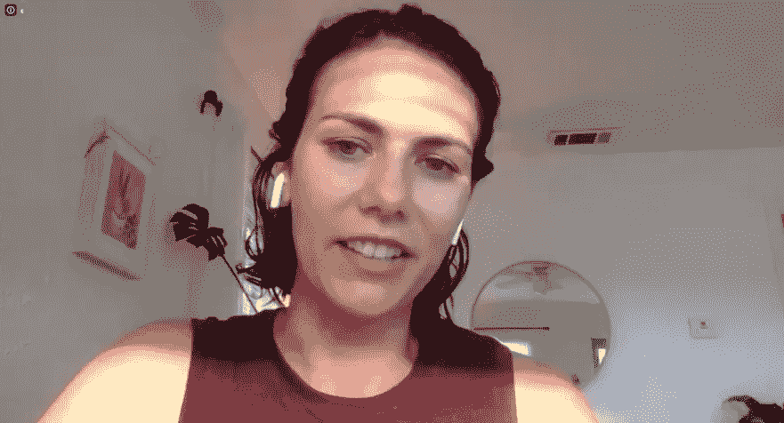
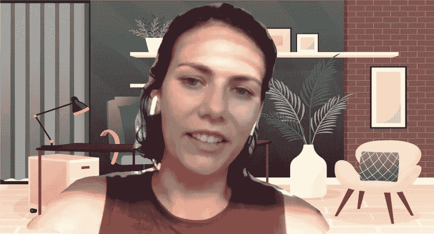

# 如何在 Java 中使用深度学习识别像素级别的对象

> 原文：<https://pub.towardsai.net/how-to-identify-objects-at-pixel-level-using-deep-learning-in-java-907dc482835e?source=collection_archive---------5----------------------->

**拥有深度 Java 库**

语义分割是深度学习中的一种强大技术，允许在像素级别识别图像中的对象。语义分割的目标是用相应的类别来标记图像的每个像素。在这篇博文中，我们将探讨如何在 Java 中使用语义分割来识别图像中的对象。

注意，语义分段不同于实例分段，实例分段能够区分属于同一个类的几个实例。因此，如果我们在输入图像中有两个相同类别的对象，分割图将为这两个对象给出相同的标签。要区分同一个类的单独实例，请参考[实例分割](https://en.wikipedia.org/wiki/Image_segmentation#Groups_of_image_segmentation)。

语义分割可以应用于广泛的用例，如自动驾驶汽车、视觉图像搜索、医学成像等。例如，语义分割可用于准确识别和分类环境中的不同对象，如行人、车辆、交通标志和建筑物。



自动驾驶汽车的语义分割([来源](https://www.youtube.com/watch?v=ATlcEDSPWXY))

[深度 Java 库(DJL)](https://github.com/deepjavalibrary) 是一个基于 Java 的深度学习(DL)框架。它可以用来创建和训练模型，以及运行推理。DJL 提供了丰富的功能来将语义分段应用到用例中。在本帖中，我们将演示如何利用这些功能来实现一些常见的用例。

# 先决条件

首先，我们需要在模块的`build.gradle`文件中声明 DJL 依赖关系:

```
dependencies {
    implementation "ai.djl:api:0.20.0"
    runtimeOnly "ai.djl.pytorch:pytorch-engine:0.20.0"
    runtimeOnly "ai.djl.android:pytorch-native:0.20.0"
}
```

# 运行推理

一旦我们建立了依赖关系，我们就可以开始编写代码来运行推理。在这个例子中，我们将使用 [DeepLabV3](https://paperswithcode.com/paper/rethinking-atrous-convolution-for-semantic) 模型，这是一个最先进的语义分割模型。

要运行语义分割的推理，首先要加载语义分割模型。然后用给定的`Model`和`Translator`创建一个预测器。在这种情况下，将使用`SemanticSegmentationTranslator`。

加载模型后，向模型提供一个图像，并接收一个“分割图”作为输出。这可以通过调用`Predictor.predict()`来完成。预测器将一个`Image`作为输入，并返回一个`CategoryMask`作为输出。`CategoryMask`包含一个代表原始图像中每个像素类别的 2D 数组。我们可以使用下面的代码来做到这一点:

```
String url = "https://mlrepo.djl.ai/model/cv/semantic_segmentation/ai/djl/pytorch/deeplabv3/0.0.1/deeplabv3.zip";
Criteria<Image, CategoryMask> criteria =
        Criteria.builder()
                .setTypes(Image.class, CategoryMask.class)
                .optModelUrls(url)
                .optTranslatorFactory(new SemanticSegmentationTranslatorFactory())
                .optEngine("PyTorch")
                .optProgress(new ProgressBar())
                .build();
try (ZooModel<Image, CategoryMask> model = criteria.loadModel();
        Predictor<Image, CategoryMask> predictor = model.newPredictor()) {
    CategoryMask mask = predictor.predict(img);
    // Do something with `mask`
}
```

例如，假设我们有一个 600x800x3 的 RGB 彩色图像:



输出`CategoryMask`包含一个 600×800×1 的掩码数组，将类标签表示为整数。下面是缩减采样蒙版阵列:



DJL 还提供了可视化语义分割结果的工具，例如在原始图像上覆盖分割图的能力，以突出显示模型分类为属于特定类别的区域。这些对于各种用例都很有用。

# 用例

## 用例 1:自动驾驶汽车

语义分割的一个用例是让自动驾驶汽车能够感知和理解周围的环境。例如，通过准确识别道路上其他车辆的位置，自动驾驶汽车可以就如何在交通中导航做出明智的决定。同样，通过准确识别行人和其他障碍物，自动驾驶汽车可以采取适当的行动来避免碰撞。

要识别图像中的物体，调用`Predictor.predict()`将下面的图像输入模型:

```
CategoryMask mask = predictor.predict(img);
```



街景([来源](https://www.flickr.com/photos/icanchangethisright/4711334546))

然后，为了可视化结果，调用`CategoryMask.drawMask()`在图像上高亮显示检测到的对象。

```
mask.drawMask(img, 180, 0);
```



## 用例 2:从照片中提取对象

语义分割的另一个用例是从护照应用程序的照片中提取对象的过程。例如，考虑这样一个场景，个人需要提交一张护照风格的照片作为其申请的一部分。在这种情况下，目标可能是使用语义分割从照片中提取个人的面部，并使用它来生成符合所需规范的护照风格的照片。

要提取图像中的人脸，调用`Predictor.predict()`将下图输入模型:

```
CategoryMask mask = predictor.predict(img);
```



肖像图像([来源](https://flickr.com/photos/86454466@N05/49985832511))

然后调用`CategoryMask.getMaskImage()`方法。注意 15 是这个人的职业 ID。

```
Image person = mask.getMaskImage(img, 15);
person = person.resize(img.getWidth(), img.getHeight(), true);
```



## 用例 3:替换视频会议的背景

语义分割的第三个用例是在视频会议中替换图像背景的过程中。例如，考虑一个场景，其中一个人正在参加视频会议，并希望用更专业或更吸引人的图像替换他们身后的背景。在这种情况下，我们可以使用语义分割从图像的背景中自动提取他们的前景(例如，他们的身体和他们拿着的任何物体)。

为了实现这一点，我们可以从图像的背景中提取出个人的前景。然后，提取的前景可以合成到新的背景图像上。这允许个人用更专业或更吸引人的图像替换图像中的背景，这对于个人想要呈现更优雅的外观的视频会议是有用的。

要提取图像中的前景，调用`Predictor.predict()`将下面的图像输入模型:

```
CategoryMask mask = predictor.predict(img);
```



视频会议现场([来源](https://www.flickr.com/photos/docsearls/49953501352))

然后用另一个图像替换背景:

```
Image background = ImageFactory.getInstance().fromFile(Paths.get("image_path"));
Image person = mask.getMaskImage(img, 15);
person = person.resize(img.getWidth(), img.getHeight(), true);
background.drawImage(person, true);
```



你可以在这里找到更多 DJL 示例代码[。](https://github.com/deepjavalibrary/djl/blob/master/examples/src/main/java/ai/djl/examples/inference/SemanticSegmentation.java)

DJL 还提供了一款带有语义分割功能的安卓应用，它可以拍照并运行语义分割，有多种选项。

# 结论

总之，使用 Deep Java 库，很容易加载深度学习模型进行语义分割，并使用它在像素级别识别图像中的对象。这对于自动驾驶汽车等应用非常有用，在这些应用中，准确检测和识别环境中的物体非常重要。有了 Deep Java 库，你就可以快速轻松地用 Java 运行深度学习模型，让它成为任何在计算机视觉领域工作的 Java 开发者的一个有价值的工具。