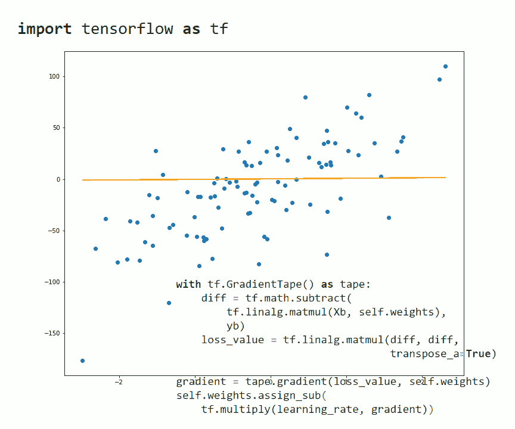
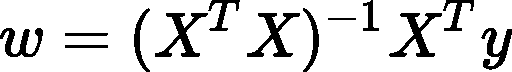
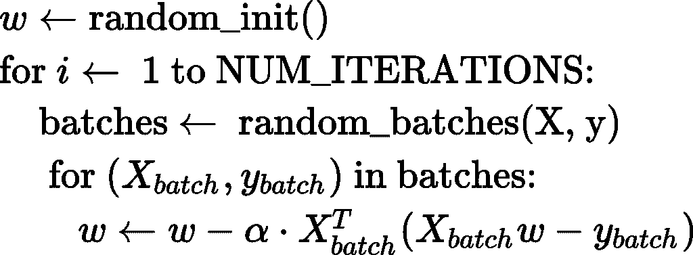
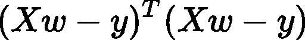
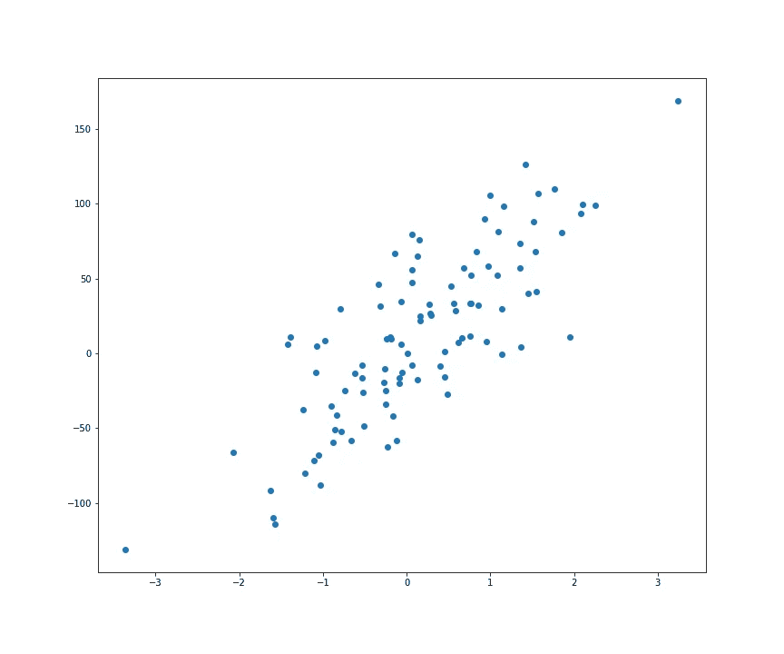
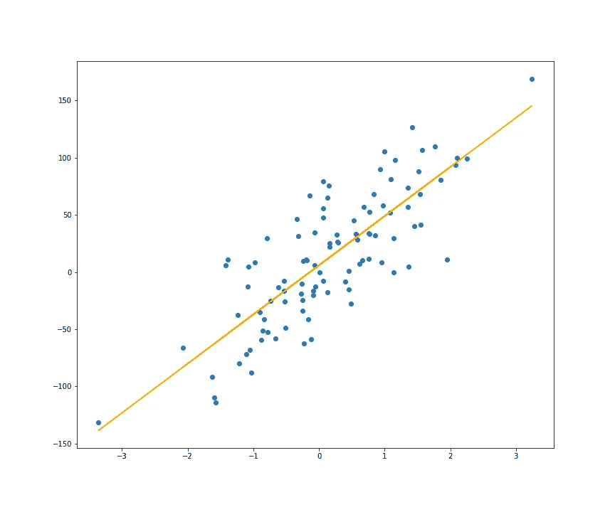
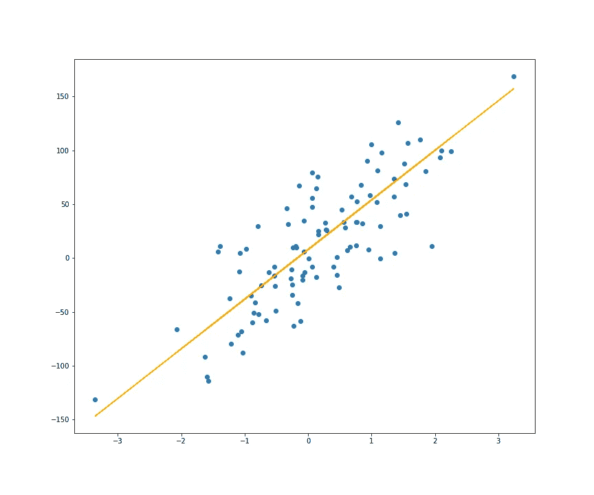

# 如何用 TensorFlow 实现线性回归

> 原文：<https://pub.towardsai.net/how-to-implement-linear-regression-with-tensorflow-406b2cff1ffa?source=collection_archive---------1----------------------->

## [机器学习](https://towardsai.net/p/category/machine-learning)

## 通过实施线性回归学习张量流基础知识



作者图片

我们先简单回忆一下什么是线性回归:

> *线性回归是通过一些其他已知变量以线性方式估计未知变量。视觉上，我们通过我们的数据点拟合一条线(或更高维的超平面)。*

如果你对这个概念不太适应，或者想更好地理解它背后的数学原理，你可以阅读我以前写的关于线性回归的文章:

[](https://towardsdatascience.com/understanding-linear-regression-eaaaed2d983e) [## 了解线性回归

### 线性回归背后的数学详细解释

towardsdatascience.com](https://towardsdatascience.com/understanding-linear-regression-eaaaed2d983e) 

很可能，用 TensorFlow 实现线性回归是大材小用。这个库是为神经网络、复杂的深度学习架构等更复杂的东西而创建的。尽管如此，我认为使用它来实现更简单的机器学习方法，如线性回归，对于那些想知道如何使用 TensorFlow 构建自定义内容的人来说是一个很好的练习。

TensorFlow 有很多 APIs 而且大部分入门课程/教程只讲解一个更高级的 API，像 Keras。但是这可能还不够，例如，如果您想要使用 Keras 中尚未实现的自定义丢失和/或激活功能。

在其核心，TensorFlow 只是一个类似于 NumPy 的数学库，但有两个重要的改进:

*   它使用 GPU 来加快运算速度。如果你有合适配置的兼容 GPU，TF 2 会自动使用；不需要更改代码。
*   它能够自动区分；这意味着，对于基于梯度的方法，您不需要手动计算梯度，TensorFlow 会为您完成。

你可以把 TensorFlow 想象成服用了类固醇的 NumPy。

虽然这两个功能对于我们在这里想要做的事情(线性回归)来说似乎不是很大的改进，因为这不是非常昂贵的计算，并且手动计算梯度非常简单，但它们在深度学习中有很大的不同，在深度学习中，我们需要大量的计算能力，并且手动计算梯度非常困难。

现在，让我们跳到实现。

首先，很明显，我们需要导入一些库。我们导入`tensorflow`，因为它是我们用于实现的主要内容，`matplotlib`用于可视化我们的结果，`sklearn`中的`make_regression`函数，我们将使用它来生成一个回归数据集作为示例，以及 python 的内置`math`模块。

```
import tensorflow as tfimport matplotlib.pyplot as pltfrom sklearn.datasets import make_regressionimport math
```

然后我们将使用以下方法创建一个`LinearRegression`类:

*   `.fit()` —该方法将对我们的线性回归模型进行实际学习；在这里，我们将找到最佳权重
*   `.predict()` —这个将用于预测；它将返回我们的线性模型的输出
*   `.rmse()` —用给定的数据计算我们的模型的均方根误差；这个指标有点像“从我们的模型估计值到真实 y 值的平均距离”

我们在`.fit()`中做的第一件事是将一个额外的 1 列连接到我们的输入矩阵 x。这是为了简化我们的数学，并将偏差视为一个始终为 1 的额外变量的权重。

`.fit()`方法将能够通过使用封闭形式的公式或随机梯度下降来学习参数。为了选择使用哪个，我们将有一个名为 method 的参数，该参数需要一个字符串“solve”或“sgd”。

当`method`设置为“求解”时，我们将通过以下公式获得模型的权重:



这要求矩阵 X 具有满列秩；因此，我们将检查这一点，否则我们会显示一条错误消息。

我们的第一部分`.fit()`方法是:

注意`method`之后的其他参数是可选的，仅在我们使用 SGD 的情况下使用。

该方法的第二部分处理`method = ‘sgd’`的情况，它不要求 X 具有完整的列秩。

我们的最小二乘线性回归的 SGD 算法概述如下:



我们将通过将 weights 类属性初始化为 TensorFlow 变量来开始此算法，tensor flow 变量是一个列向量，其值来自均值为 0、标准差为 1/(列数)的正态分布。我们将标准偏差除以列数，以确保在算法的初始阶段不会得到太大的输出值。这是为了帮助我们更快地收敛。

在每次迭代的开始，我们随机地打乱我们的数据行。然后，对于每一批，我们计算梯度并将其从当前权重向量中减去(乘以学习率),以获得新的权重。

在上面描述的 SGD 算法中，我们已经展示了手动计算的梯度；就是那个表达式乘以 alpha(学习率)。但是在下面的代码中，我们不会显式地计算这个表达式；相反，我们计算损失值:



然后我们让 TensorFlow 为我们计算梯度。

下面是我们`.fit()`方法的后半部分:

我们需要计算`with tf.GradientTape() as tape`块内部的损失值，然后调用`tape.gradient(loss_value, self.weights)`来获得梯度。要做到这一点，重要的是梯度所对应的量(`self.weights`)是一个`tf.Variable`对象。此外，当改变权重时，我们应该使用`.assign_sub()`方法而不是`-=`。

我们从这个方法返回`self`，以便能够像这样连接构造函数和`.fit()`的调用:`lr = LinearRegression().fit(X, y, ‘solve’)`。

`.predict()`方法非常简单。我们首先检查之前是否调用了`.fit()`，然后将一列 1 连接到 X，并验证 X 的形状允许与权重向量相乘。如果一切正常，我们只需返回 X 和权重向量相乘的结果作为预测。

在`.rmse()`中，我们首先使用`.predict()`获得模型的输出，然后如果预测期间没有错误，我们计算并返回均方根误差，该误差可以被认为是“从我们的模型估计值到真实 y 值的平均距离”。

下面是`LinearRegression`类的完整代码:

## 在示例中使用我们的 LinearRegression 类

为了展示我们的线性回归实现，我们将使用来自`sklearn`的`make_regression()`函数生成一个回归数据集。

```
X, y = make_regression(n_features=1, n_informative=1,
                       bias=1, noise=35)
```

让我们绘制这个数据集，看看它是什么样子的:

```
plt.scatter(X, y)
```



作者图片

`make_regression()`返回的 y 是平面向量。我们将把它重新整形为一个列向量，用于我们的`LinearRegression`类。

```
y = y.reshape((-1, 1))
```

首先，我们将使用`method = ‘solve’`来拟合回归线:

```
lr_solve = LinearRegression().fit(X, y, method='solve')plt.scatter(X, y)plt.plot(X, lr_solve.predict(X), color='orange')
```



作者图片

上述回归模型的均方根误差为:

```
lr_solve.rmse(X, y)
# <tf.Tensor: shape=(), dtype=float32, numpy=**37.436085**>
```

然后，我们也使用`method = ‘sgd’`，我们将让其他参数具有它们的默认值:

```
lr_sgd = LinearRegression().fit(X, y, method='sgd')plt.scatter(X, y)plt.plot(X, lr_sgd.predict(X), color='orange')
```



作者图片

如你所见，上面两幅图中方法“solve”和“sgd”的回归线几乎相同。

使用“sgd”时，我们得到的均方根误差为:

```
lr_sgd.rmse(X, y)
# <tf.Tensor: shape=(), dtype=float32, numpy=**37.86531**>
```

这是 Jupyter 笔记本，包含所有代码:

我希望这些信息对你有用，感谢你的阅读！

这篇文章也贴在我自己的网站[这里](https://www.nablasquared.com/how-to-implement-linear-regression-with-tensorflow/)。随便看看吧！