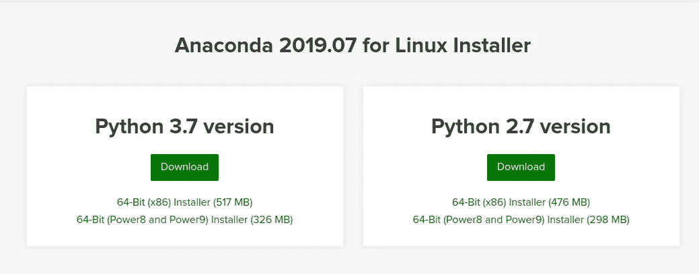
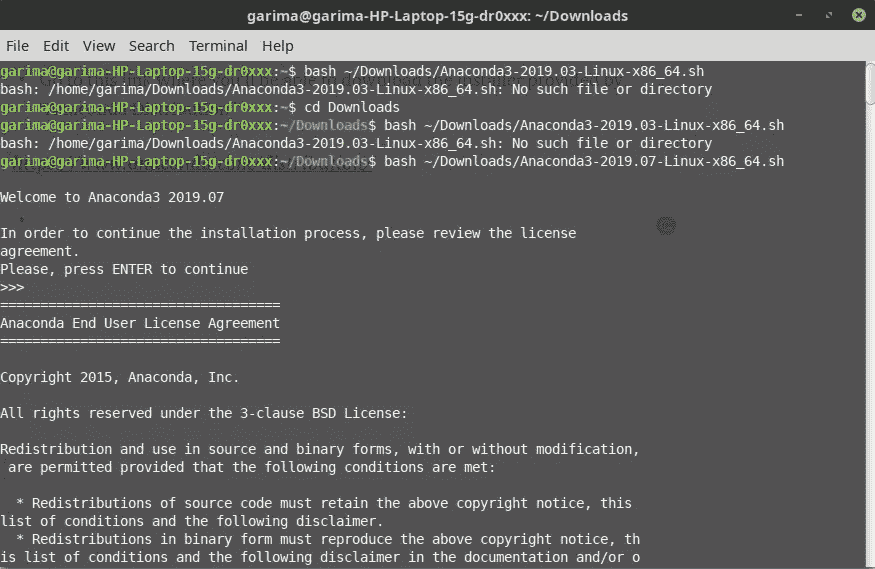
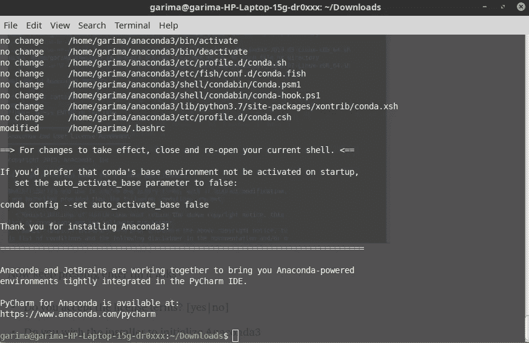
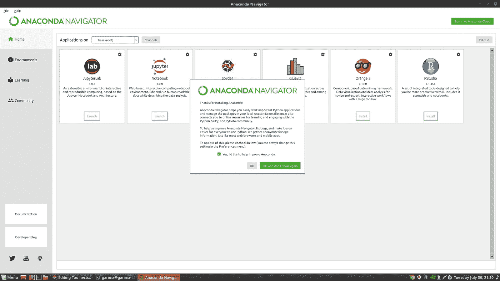

# 如何在 Linux Mint 中安装 Anaconda！

> 原文：<https://pub.towardsai.net/how-to-install-anaconda-in-linux-mint-ae8128b8d249?source=collection_archive---------0----------------------->

## [编程](https://towardsai.net/p/category/programming)，[系统](https://towardsai.net/p/category/systems)

## 太忙乱了？不再是了！

*   转到这个链接，您可以下载“Anaconda 发行版”提供的安装程序

> 【https://www.anaconda.com/distribution/】T5[T6](https://www.anaconda.com/distribution/)



我想要 Python 3.7 版本，但你可以选择其中任何一个。

*   稍后使用 ctrl+T 命令打开一个终端&转到下载文件夹。如果您没有下载到您的下载目录，请用您下载的文件的路径替换~/Downloads/
*   然后，您需要运行 bash 命令，如下所示:

```
bash ~/Downloads/Anaconda2-2019.07-Linux-x86_64.sh
```



现在继续按回车键，直到它问-

*   您接受许可条款吗？[是|否]
*   您希望安装程序通过运行 conda init 来初始化 Anaconda3
    吗？[是|否]

安装程序完成并显示“感谢您安装 Anaconda <2 or 3>！”



关闭并打开您的终端窗口以使安装生效，或者您可以输入命令

```
source ~/.bashrc
```

*   现在，打开一个终端窗口，键入 anaconda-navigator。如果 Navigator 打开，则您已经成功安装了 Anaconda。如果没有，请检查您是否完成了上述每个步骤，或者参考原始网站。



*   现在您可以按照[Anaconda 入门](https://docs.anaconda.com/anaconda/user-guide/getting-started/)中的说明开始使用 Anaconda。


[Gif](https://media.tenor.com/images/8fbe862dbf870e0ef2ba6c7e91df28de/tenor.gif)