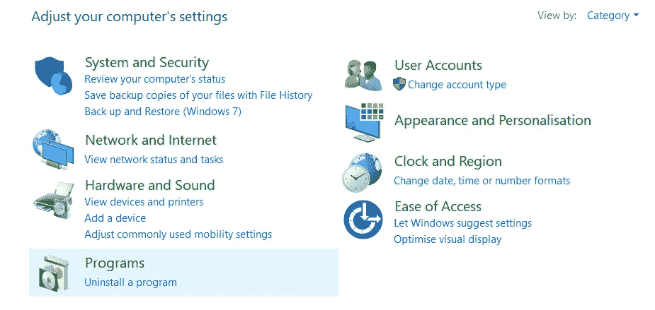
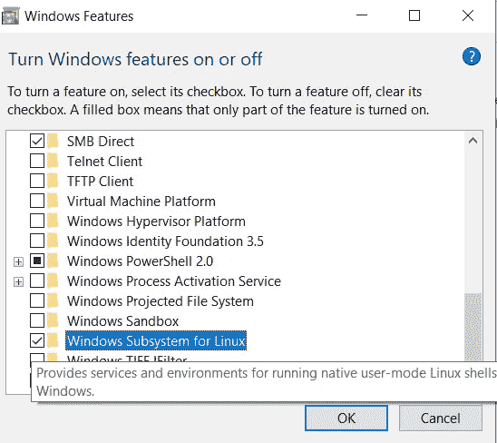
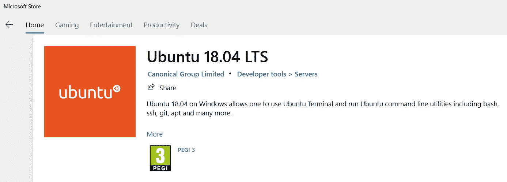
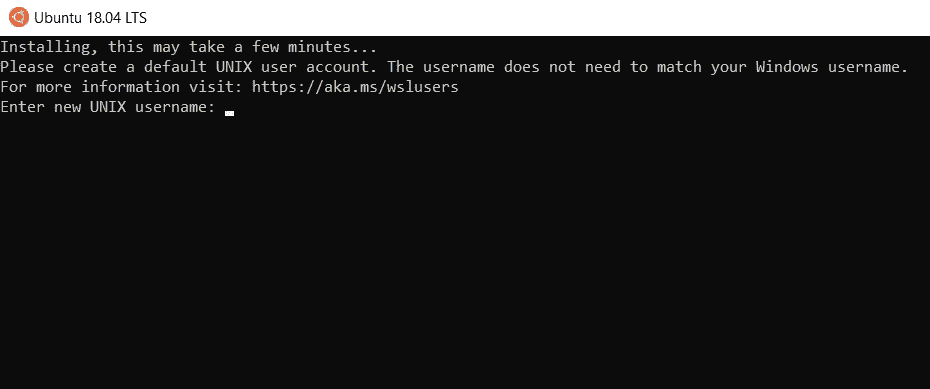
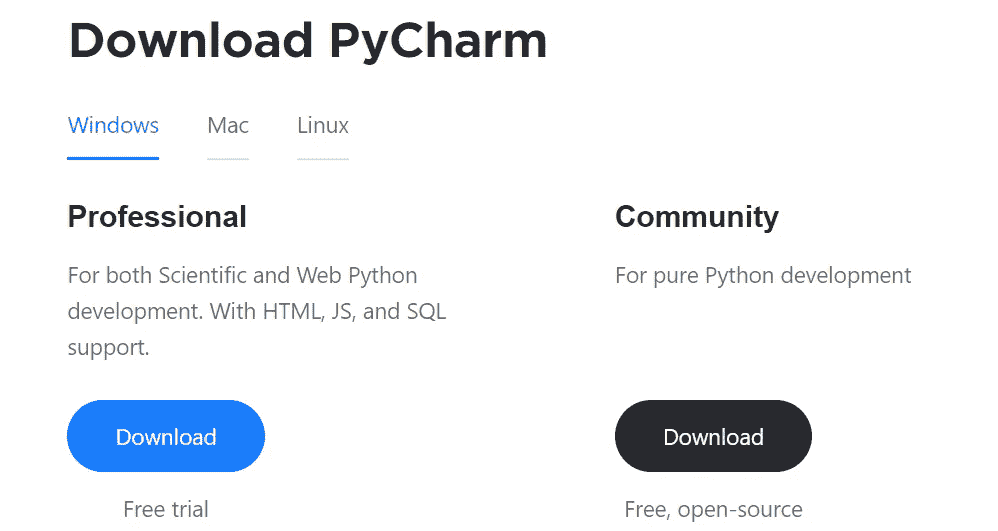
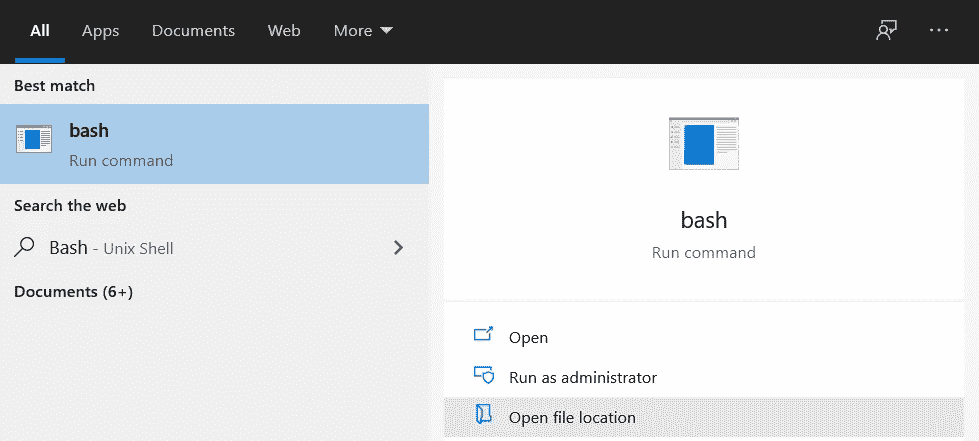
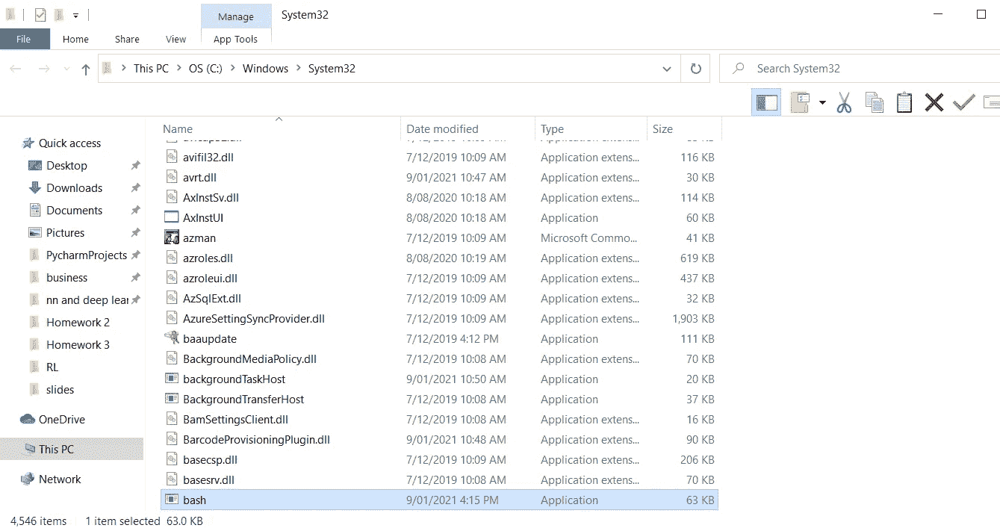
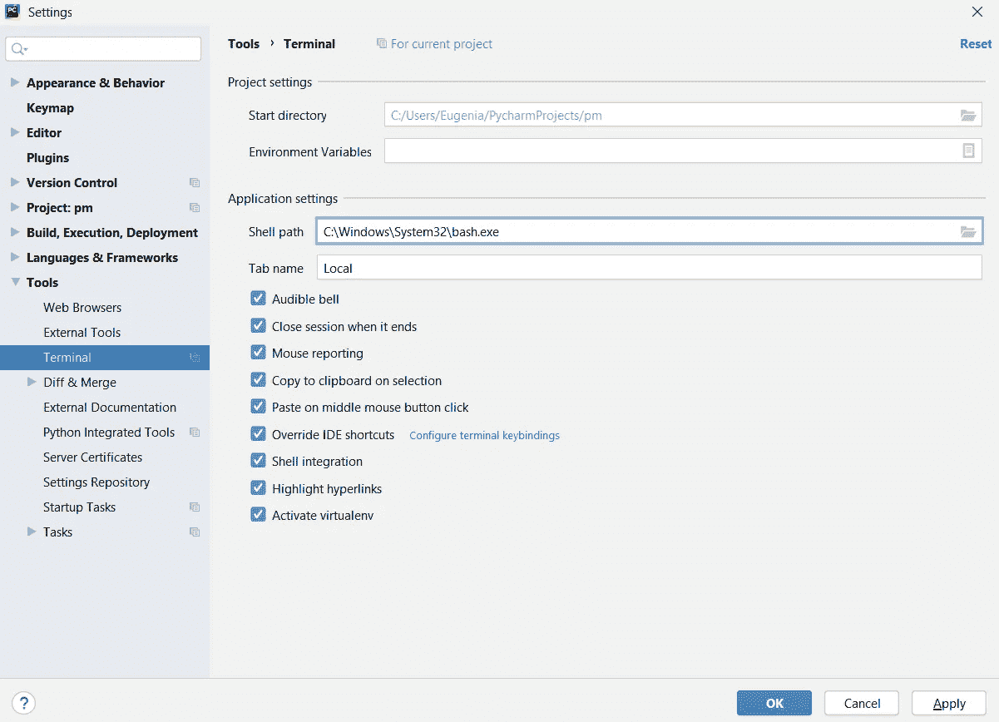
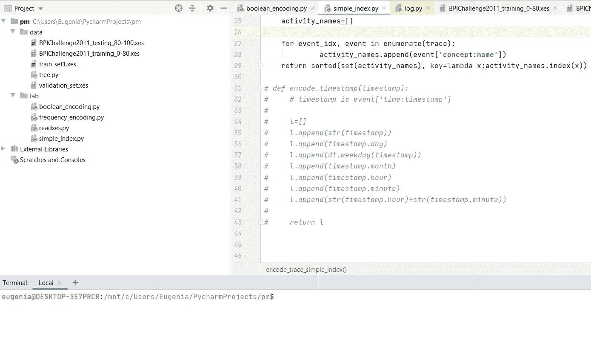

# 如何在 Windows 10 上安装 Ubuntu 终端

> 原文：<https://pub.towardsai.net/how-to-install-ubuntu-terminal-on-windows-10-716b6a64ad82?source=collection_archive---------2----------------------->

## [教程](https://towardsai.net/p/category/tutorial)

## 在 Pycharm 环境中将 Ubuntu shell 配置为终端


作者制作的图像

如果你有 windows 10，出于学习或工作目的需要安装 Ubuntu，那你来对地方了。你过去试过安装 Ubuntu VirtualBox 吗？如果你有，很可能你的电脑变得非常慢，它需要太多的努力来运行它，你失去了很多时间。

别提了。有一种方法不会填满你电脑的所有内存，而且使用起来非常快。你只需要从微软商店安装 Ubuntu shell 就搞定了！没有任何复杂的步骤。

在 Windows 上启用 Linux 环境后就可以安装 Ubuntu Shell 了，称为 Windows Subsystem for Linux。换句话说，可以在 Linux 上运行相同的终端。这样，您可以在 Windows 中运行 Linux 命令，而无需安装虚拟机或双引导 Linux 和 Windows。

**内容:**

1.  [**为 Linux 启用 Windows 子系统**](#91b5)
2.  [**从微软商店**](#c024) 安装 Ubuntu 18.04
3.  [**启动 Ubuntu 18.04 并创建凭证**](#71f0)
4.  [**在 Pycharm 上配置 Ubuntu 为终端**](#39fe)
5.  [**在 Ubuntu 终端安装 Python 包**](#a5f3)

# 步骤 1:为 Linux 启用 Windows 子系统



要执行此步骤，您需要转到控制面板，然后单击程序。按下按钮**后，打开或关闭 Windows 功能**。之后你寻找 **Windows 子系统对于 Linux**Windows 之间的特性。



一旦你这样做了，你需要重启电脑。这需要一点时间，在此期间你可以休息一下。

# 第二步:从微软商店安装 Ubuntu 18.04



你需要打开开始菜单，寻找微软商店应用，搜索 Ubuntu 18.04。在安装它之前，你应该检查你的操作系统是否满足要求。要了解您的设备运行的是哪个版本的 Windows，您需要按开始按钮，然后进入设置→系统→关于。在你确定它满足要求后，你可以点击“获取”按钮。

# 步骤 3:启动 Ubuntu 18.04 并创建凭证



Ubuntu 可以像其他任何 Windows 10 应用一样启动，比如之前的微软商店。你只需要在开始菜单中选择 Ubuntu Ubuntu。一旦你打开它，你需要创建你的 **UNIX 用户名**和你的 **UNIX 密码**。我建议你写一些容易记住的东西。如果你遵守了前面的所有步骤，你最终在 Windows 10 上激活了 Ubuntu 终端。

# 步骤 4:在 Pycharm 上将 Ubuntu 18.04 配置为终端



信用:[皮查姆](https://www.jetbrains.com/pycharm/download/#section=windows)

如果你没有 Pycharm，建议你从网站下载。你只需要专业版，完全免费。如果您已经有了它，请打开一个已经创建的项目，如果没有项目，请创建一个新项目。

在配置它之前，你需要访问你的 Ubuntu 路径。要检查路径，搜索 **bash** 并点击选项“打开文件位置”。



在我的例子中，我复制了以下路径:

```
C:\Windows\System32\bash.exe
```

在 Pycharm 中，你进入文件→设置→工具→终端

你只需要用你的 Ubuntu 路径修改 **Shell 路径**。按下应用按钮后。最后，您单击确定。



您需要关闭并重新打开 Pycharm，以便看到 Ubuntu 终端已经集成到您的 Python IDE 中。



# 步骤 5:在 Ubuntu 终端中安装 Python 包

这里有安装 Python 2 或 Python3 包的步骤。我会告诉你所有你需要模仿的命令。

```
### commands for python2sudo apt update
sudo apt-get install python-pip### commands for python3sudo apt-get update
sudo apt-get install -y python3-pip
```

要安装特定的软件包:

```
### commands for python2pip install PACKAGE-NAME### commands for python3pip3 install PACKAGE-NAME
```

# 最终想法:

我希望这篇教程能帮助你找到在 Windows 上安装 Ubuntu 的传统方法的替代方法。就我个人而言，在大学里，每当教授让我安装 Ubuntu 虚拟机，并且只为一门课程浪费这么多内存时，我都会遇到一些困难。在我发现了终端的可能性之后，它解决了我的人生。

Ubuntu 终端有很多优点。首先，您可以练习使用命令行并学习新的命令。此外，它比 Windows 更安全:每次在 Ubuntu shell 中安装东西时，你都需要输入密码。在 Windows 中，你不需要，而且它更自动化。我希望这个指南在某种程度上帮助了你。感谢阅读。祝您愉快！

你喜欢我的文章吗？ [***成为会员***](https://eugenia-anello.medium.com/membership) ***每天无限获取数据科学新帖！这是一种间接的支持我的方式，不会给你带来任何额外的费用。如果您已经是会员，*** [***订阅***](https://eugenia-anello.medium.com/subscribe) ***每当我发布新的数据科学和 python 指南时，您都可以收到电子邮件！***