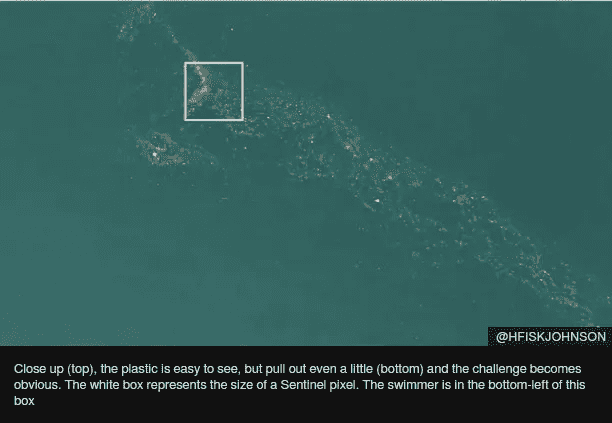
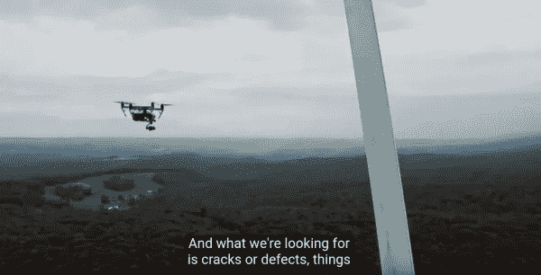
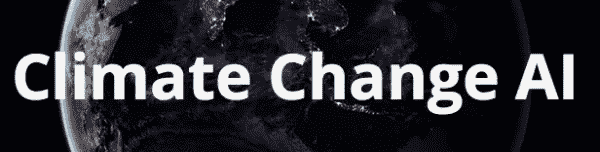

# 如何加入 AI for Good Movement

> 原文：<https://pub.towardsai.net/how-to-join-the-ai-for-good-movement-9b92f621d5cb?source=collection_archive---------3----------------------->

在过去的三个月里，我们在 Appsilon Data Science 建立了一个良好的人工智能计划，我们了解并观察到了许多关于这个似乎是新生的全球运动的情况。在本文中，我想与您分享我们收集的见解，包括机遇、挑战和您可以采取的实际行动，以帮助国际社会挖掘数据科学、机器学习和人工智能在为我们的星球而战中的潜力。

从一开始，我们就有直觉，在可持续发展的各个领域工作的国际组织、学术界和政府机构对数据科学服务有着巨大的需求。通过与从业者的交谈、通过我们的联系渠道收到的支持请求以及对我们与社区分享的材料和想法的总体兴趣，这一点得到了证实。

同样，也有大量的数据科学人才，他们渴望为重要的项目贡献自己的技能。在过去的几个月里，一系列事件使气候变化和环境问题深入到公众的讨论中。主要的国际出版物和媒体评论这一领域的发展，以及不可持续地使用地球资源所带来的威胁。科技界对这些信息的反应越来越强烈，显然存在对有趣项目的需求。

全球 AI for Good 计划背后的核心思想是将这两个不同的社区结合在一起。将最有影响力的项目与最优秀的人才联系起来，这样我们就可以一起解决人类在未来再也无法忽视的问题。是时候为我们的星球和子孙后代的福祉负起责任了。

利用卫星数据识别海洋中的塑料污染。来自 [BBC](https://www.bbc.com/news/science-environment-47910600)

这场运动的双方都面临的问题包括:

## 什么是“好”？

气候变化和可持续性努力正在成为一个数万亿美元的产业。技术社区很难找到有意义的项目。我们不一定应该将有限的资源用于那些最受公众关注、资金最多、符合常识的项目。市场可能会产生不正当的激励，尤其是在可持续发展领域，回报不容易量化，结果也不确定，往往需要很长时间才能实现。

## 我可以使用哪些数据科学工具来支持我的工作？我如何应用它们？

可持续发展各个领域的科学家和实践者经常面临资源限制，这限制了他们对工作核心活动的关注。他们没有时间去了解更多地利用新技术会给他们的工作带来的好处。即使他们有这样的理解，他们也可能没有资金来购买数据科学服务。

## 哪里可以找到有意思的项目？/哪里可以找到数据科学支持？

虽然有一些重叠，但两个社区自然地在各自的“气泡”中运作，有时很难沟通。这可以被称为一种市场失灵，项目和技能的需求和供应存在，但不匹配。

我们如何着手解决这些问题？简而言之，技术和可持续发展社区的所有参与者都必须在发展人工智能的良好运动中发挥积极作用。我们可以一起建造并跨越这座桥。接下来的三个部分提供了一些关于如何做到这一点的实用想法。

# 作为数据科学专家，我能做些什么？

从这些领域的从业者那里了解通向可持续未来的潜在途径，技术社区将从中获益最多。与其妄下结论或决定什么是最好的，有时最好的办法就是倾听。在 Appsilon，我们提倡所谓的[“探索性方法”](https://appsilon.com/ai-for-good-our-approach-to-tackling-climate-change-with-data-science/)，在这种方法中，我们后退一步，向社区征求意见。我们承认我们不具备决定什么是“好”的专业知识。当然，我们允许在这个过程中的自由裁量权，有时一个内部的想法可以促进进一步的研究，并导致一个有趣的项目。

## 网络

我们发现与可持续发展领域的个人建立联系具有巨大的价值。

首先，我们鼓励你在 Twitter 和其他社交媒体上关注感兴趣的个人和组织。今后，您可能会考虑参加特定领域的活动和会议。你可以在我们的[博客文章](https://appsilon.com/ai-4-good-data-science-for-biodiversity/)中读到我们在生物多样性社区的经历。

我们还发现了与其他数据科学专家联系的巨大价值。我与克里斯·桑卡兰(Kris Sankaran)的谈话非常鼓舞人心，他是开创性的[“用机器学习应对气候变化”](https://arxiv.org/abs/1906.05433)论文的作者之一，我们在另一篇《永远的人工智能》[博客文章](https://appsilon.com/ai-for-good-our-approach-to-tackling-climate-change-with-data-science/)中提到了这篇论文。我们同意分享联系方式和见解。感觉成为更大的跨国公司的一部分也很好。

## 听

使用在线资料，了解可持续发展领域的各种努力。我建议每周花几个小时来学习这些问题，这样你就有足够的知识在有机会的时候参与到社区中来。

当与从业者接触时，确保你允许他们充分解释他们的工作和挑战，而不是用你的解决方案压倒他们。我知道你可能有很好的想法，但过早介入可能会遗漏一些有趣的领域，让你从事一个项目，使问题适合你的解决方案，而不是相反。

## 教育和提供支持

有了这一警告，我强烈鼓励所有数据科学家参与教育工作，旨在提高可持续发展社区对数据科学可能为加强他们的努力带来的潜在影响的认识。

我相信最小的行动也很重要——与你的同事谈论人工智能的良好运动，并通过你的社交媒体分享有趣的项目。如果你或你的公司有足够的资源，可以考虑参加可持续发展各方面的活动和会议。你也可以发挥创意，例如，Appsilon 正在为生物多样性和相关社区计划一场关于数据科学应用的网络研讨会。

虽然所有这些行动将有助于建立运动，你的时间的直接贡献，当然，最受资源有限的组织。因此，考虑为这项事业贡献一些时间，并让你的组织内部为此投入一些资源。

# 作为可持续发展领域的从业者，我能做些什么？

首先，请放心，科技行业的个人和公司提供了大量资源，愿意为你的项目贡献他们的时间。

## 探索

关于数据科学、机器学习和人工智能的应用，已经存在大量的知识。到目前为止，这些工具主要是在商业活动中找到应用，但是这些可以很容易地作为你工作的灵感。一个简单的谷歌搜索就可以向你展示机会的广度，我强烈建议你联系数据科学家，以防你需要进一步的解释。您可以从本文最后一节链接的有趣资源开始。

[谷歌](https://www.youtube.com/watch?time_continue=135&v=lF-u7j1x0C0&feature=emb_logo)与 [AES](http://aes.com/) 合作，使用无人机和人工智能模型对风力涡轮机进行定期检查，并标记潜在的损害

## 请求支援

一旦你对 DS/ML/AI 在你的项目中的潜在应用有了想法，就联系数据科学社区。您可以通过各种社区找到感兴趣的专家，这些社区目前正在兴起(参见本文最后一节的链接)，或者通过研究提供此类服务的公司来找到。[有些公司，比如 Appsilon，提供无偿服务。](https://appsilon.com/ai-for-good/)

请确保在请求支持时，尽可能用通俗易懂的语言清楚地说明您的问题。你可能会发现你所在领域的概念不言自明，但对于非专业人士来说，它们可能是完全陌生的。我相信我可以代表整个数据科学界说，我们渴望深入了解我们凭借技能和解决方案所涉足领域的复杂性。然而，我们必须对我们在主要专业领域之外的参与程度持现实态度。

因此，一个结构良好的请求应该陈述项目的性质，提供可用数据和预期结果的描述，包括一个用例。顺便提一下，你可能会想到宣传项目结果的潜力，以帮助 AI for Good movement 获得牵引力，并为支持你的项目的公司或个人提供额外的价值。

# 我们都可以做些什么？

AI for Good 运动在汇集将确保我们星球和数据科学人才的未来的项目方面的影响取决于全球运动的发展。为此采取的所有行动，从在我们的网络中谈论信息技术到参与大型国际项目，都将有助于实现这一目标。这个过程中存在滚雪球效应。除了个人和组织之间的直接互动，新的社区正在发展，其重点是促进更大规模的交流。

因此，我强烈鼓励所有对构建 AI for Good movement、购买数据科学服务和寻找项目感兴趣的人注册并参与以下论坛:

为 AI for Good 倡议的双方参与者(非政府组织、政府参与者、可持续发展领域的学术界和 DS/ML/AI 实践者)提供讨论板和在线社区。一旦注册，你会在那里找到一些最著名的数据科学家。你也应该看看更广泛的气候变化人工智能倡议。

我们的星球没有 B 计划——A 计划使用数据来预测气候变化在哪里以及如何受到最严重的影响。它们为气候变化项目提供了一个众筹机制，并为利益攸关方提供了一个社区平台，为集体气候行动造势。他们通过他们的气候学院分享见解，并帮助公司变得可持续，了解他们的碳足迹和适应气候变化。他们的服务是任何希望更多了解我们的星球并参与运动的人的极好资源。

Mattermore.io 是一项即将推出的服务，旨在将关注的人和组织聚集在一起，将技术引入气候变化解决方案。一旦它们启动并运行，它们将帮助个人协作定义最紧迫的问题，发现有趣的工作项目以及要跟踪或加入的组织。与此同时，你可以加入他们的候选名单，思考你可以在 Mattermore 将关注的 9 个领域做出的贡献。

AI Commons 是 AI4G 领域的一个社区，他们的使命是:“AI Commons 将问题所有者与解决者社区联系起来，共同创建人工智能解决方案。”他们已经得到了各种营利性企业和非政府组织的支持。该倡议是由人工智能领域的一些最伟大的头脑建立的，包括 Yoshua Bengio。

我相信，随着我们的前进，这一领域的这些和其他组织和个人的不同努力将汇聚到一个共同的目标上——在技术、环境和社会领域之间建立一座桥梁，以确保我们星球的可持续未来。

感谢阅读。在 Twitter 上关注我，时间: [@tbaraslupski](https://twitter.com/tbaraslupski)