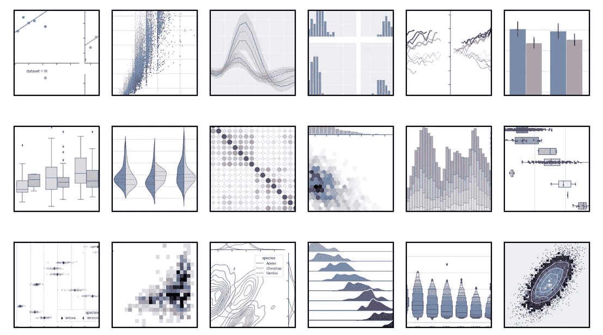
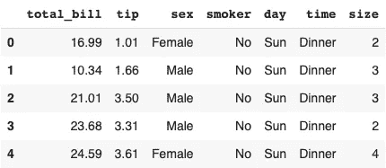
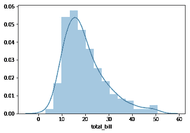
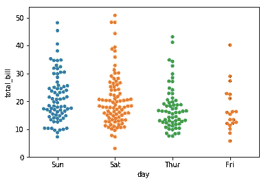
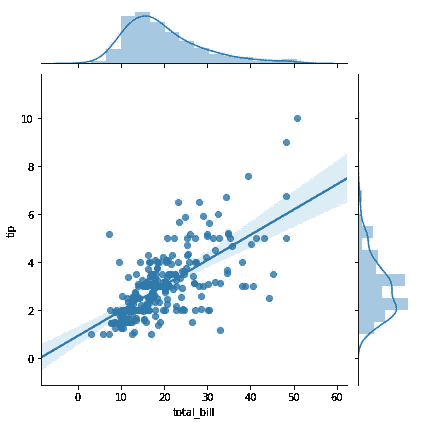
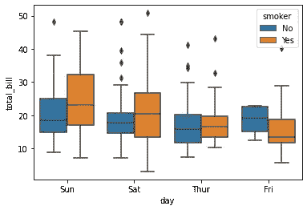
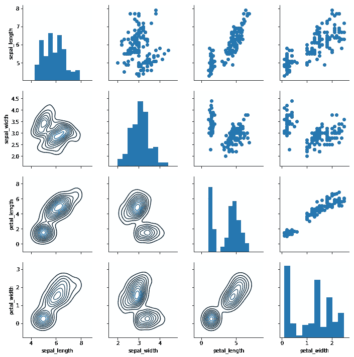
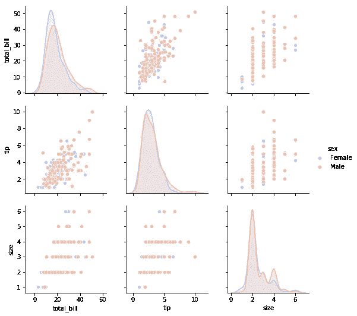
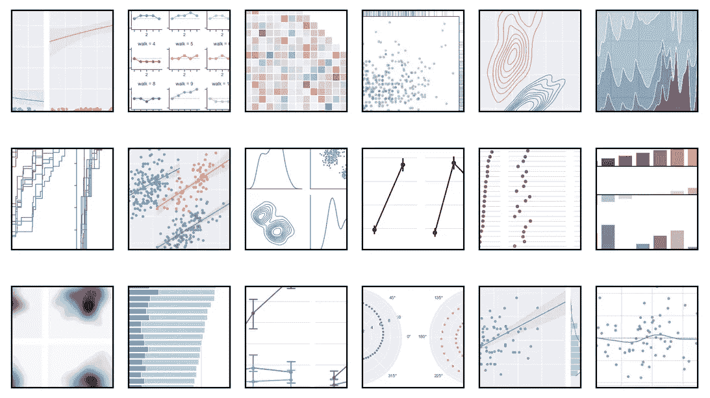

# 如何使用 Seaborn 提升数据科学家的级别

> 原文：<https://pub.towardsai.net/how-to-level-up-as-a-data-scientist-using-seaborn-f3fdaa0e34a0?source=collection_archive---------2----------------------->

## [数据科学](https://towardsai.net/p/category/data-science)

## 在竞争对手中脱颖而出，给客户留下深刻印象



[Seaborn 的](https://seaborn.pydata.org)示例图库第一部分

不同的工作公告需要不同的技能。作为一名数据科学家，你可能读过很多关于 Numpy、Matplotlib、Pandas、Tensorflow 等等。如果没有对这些 Python 库的深入了解，你可能很难参加数据科学家的面试。这不是一个秘密，大多数申请人知道他们应该有能力处理它们。那么，如何在竞争对手中脱颖而出，把你的成果以漂亮的方式呈现出来，让你的客户兴奋起来呢？使用 [seaborn](https://seaborn.pydata.org) ！

# 什么是 Seaborn？

收集数据和管理数据的过程已经够烦人的了。处理这些数据需要时间和精力。那么，为什么要在展示你真正努力工作的成果上妥协呢？

坚持住！有一个简单的方法可以打动你的观众:seaborn！

Seaborn 是 Python 的一个可视化库，不仅可以创建美丽的情节，还可以让您的生活更加轻松。它可以被看作是 matplotlib 库的扩展，可以很好地处理 pandas 数据结构。对于你拥有的每一个数据集，你都可以找到正确的图表。此外，结果看起来比其他情节更有吸引力。

# 是什么让 Seaborn 这么牛逼？

## 1.熊猫集成

由于您是一名智能数据科学家，您已经在使用 pandas 数据框。因此，导入必要的库，包括 seaborn 和 pandas:

```
import pandas as pd
import seaborn as sns
```

找到您选择的表格，导入它，您已经可以显示表格的表头了:

```
tips = pd.read_csv(‘tips.csv’)
tips.head()
```



图片由作者拍摄。

现在我们准备用一句简单的话来创造一个惊人的情节:

```
sns.distplot(tips[‘total_bill’])
```



图片由作者拍摄。

## 2.简单

没有比使用 seaborn 更简单的方法来以一种吸引人的方式呈现您的数据了。一旦您的数据被导入并准备就绪，您就可以在一行代码中更改和操作绘图！

```
sns.swarmplot(x="day", y="total_bill", data=tips)
```



图片由作者拍摄。

## 3.高级绘图

大多数其他标准库也可以创建简单而枯燥的直方图。但是一个让其他数据科学家几乎羡慕的情节怎么样？使用:

```
sns.jointplot(x=’total_bill’, y=’tip’, data=tips, kind=’scatter’)
```

不仅得到包括每个轴上的[核密度估计](https://en.wikipedia.org/wiki/Kernel_density_estimation)的直方图，还得到二维散点图，以及回归轨迹。



图片由作者拍摄。

还不是你要找的剧情？没问题，箱线图怎么样:

```
sns.boxplot(x=”day”, y=”total_bill”, hue=”smoker”, data=tips)
```



图片由作者拍摄。

甚至一个不同地块的网格也没什么大不了的。导入您选择的表格:

```
iris = pd.read_csv('iris.csv')
```

使用以下内容创建网格:

```
g = sns.PairGrid(iris)
```

最后，用数据填充网格:

```
g.map_diag(plt.hist)
g.map_upper(plt.scatter)
g.map_lower(sns.kdeplot)
```



图片由作者拍摄。

## 4.出现

厌倦了为你的图表寻找匹配的颜色？使用**调色板**参数，您可以修改整个外观，而无需考虑颜色匹配。他们就是这样！

```
sns.pairplot(tips,hue=’sex’, palette=’coolwarm’)
```



图片由作者拍摄。

# 你还在等什么？

如您所见，seaborn 在绘制数据时提供了大量新的机会。该库包括你可能不知道的图表，它们甚至存在。在[示例图库](https://seaborn.pydata.org/examples/index.html)中找到更多优秀的情节，并选择您需要修改的一行代码。



[Seaborn 的](https://seaborn.pydata.org)样板间第二部分

恭喜您，您刚刚晋升为数据科学家！