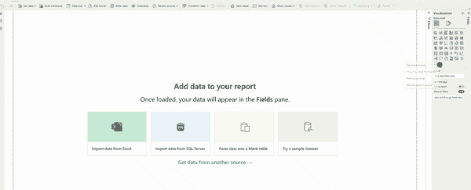
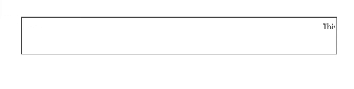
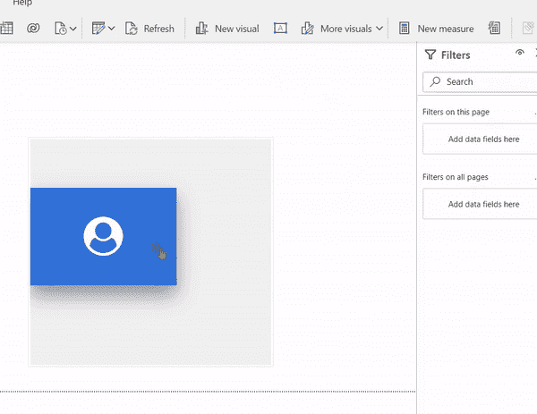

# 如何让 PowerBI 报表看起来像一个网站？

> 原文：<https://pub.towardsai.net/how-to-make-a-powerbi-report-look-like-a-website-c267727ab15f?source=collection_archive---------0----------------------->

Power BI 是一个业务分析工具，允许用户可视化和分析来自各种来源的数据。创建交互式仪表板和报告来洞察您的业务数据非常有用。

然而，我们有时会觉得 PowerBI 有一些局限性。尤其是 PowerBI 的 UI 元素有限，限制了我们在仪表盘中的想象力表达。本文介绍了各种技术，让 PowerBI 仪表板看起来像一个网站。阅读完本文后，您将能够在仪表板中放置更直观的 UI 元素。

# 1.背景常速滚动的电脑游戏

如果您需要向 PowerBI 报告添加公告，那么最好的选择是添加滚动消息，因为**滚动器**允许向用户呈现重要的消息、通知或 KPI，并且可以快速突出显示关键点。PowerBI 提供了一个添加滚动条的选项，我们可以很容易地在其中添加列信息。下面的屏幕截图提供了将滚动条添加到 PowerBI 工作区的步骤。



**内置滚动条的弊端**

但是，内置的 scroller 只允许显示列信息，而不允许显示其他细节，比如度量。此外，格式化选项是有限的。为了减轻这个限制，我遇到了 HTML 内容可视化。

**丹尼尔·马什-帕特里克的 HTML 内容**

Daniel Marsh-Patrick 的 HTML 内容允许我们快速添加带有自定义格式和任何我们想要的信息的滑块。本文档描述了添加 HTML 内容所需的过程和一些用例。

HTML 内容 powerBI 使得利用任何 HTML 脚本变得简单。HTML 内容 powerBI 为 HTML 脚本执行提供了一个平台。或更多关于 HTML 内容的信息，请访问 [HTML 内容](https://www.html-content.com/installation)

**使用 HTML 内容的步骤**

*   从“更多视觉效果”中获取 HTML 内容视觉效果
*   创建一个新的度量，然后在 HTML Content powerBI visual 中使用它来利用这个功能
*   将以下代码添加到 HTML 内容中:

```
message = "<marquee behavior= 'scroll' direction='left'> This is a test
for message scroll!!!!!!</marquee>"
```

这是一个简单的文本信息从右向左滚动的例子。检查下图中的输出:


# **2。将 HTML 与 DAX 公式结果合并**

## 目标

我们经常想用文本消息显示统计数据。

在 Power BI 中，您可以使用诸如卡片或表格之类的可视化工具在文本消息旁边显示一些汇总的统计数据。在 card visual 中，您可以将 **DAX 公式**的结果显示为值，将文本消息显示为标题。在可视化表格中，可以为 DAX 公式的结果添加一列，为文本消息添加一列。

给你的力量 BI 报告添加一个**卡片视觉**，

*   转到可视化效果窗格，并从可用视觉效果列表中选择卡片视觉效果。
*   然后，将包含 DAX 公式结果的字段拖放到值字段中，将包含文本消息的字段拖放到标题字段中。
*   然后，您可以自定义视觉效果的外观，例如更改字体大小和颜色，以及根据需要调整视觉效果的大小。

要将**表格可视化**添加到您的 Power BI 报告中，

*   转到“可视化效果”窗格，从可用可视化效果列表中选择表格可视化效果。
*   然后，将包含 DAX 公式结果的字段拖放到表的第一列，将包含文本消息的字段拖放到第二列。
*   您可以通过更改字体大小和颜色以及根据需要调整列的大小来自定义表格的外观。

但是，如果要求在文本消息旁边显示一些汇总的统计数据，即 DAX 公式的结果，那么您可以遵循以下步骤:

## 步伐

为了实现这一点，

*   拆分 DAX 公式前的文本，并用“&”将其连接起来
*   一旦 DAX 公式完成，用“&”连接文本。

```
message = "<marquee behavior= 'scroll' direction='left'>This is a test for aggregated data display. Total sales is <b> $" & SUM('Table'[Sales]) & ".</b></marquee>"
```

上述措施将提供以下输出。



# 3.记分卡

除了滚动消息之外，HTML 内容视觉效果还可以处理复杂的脚本，比如在悬停时展开的记分卡。



# 4.添加基于 CSS、javascript (D3.js 库)的图形

HTML 小部件可以将定制的 HTML、JavaScript 和 CSS 添加到您的 Power BI 报告中。它可以帮助集成第三方库，添加自定义可视化，并在您的 Power BI 报告中创建交互式体验。

下面是一个在 Power BI 中使用 HTML 小部件的例子:

假设您想在 Power BI 报告中添加一个条形图，按类别显示销售数量。您可以使用 Power BI 中的内置条形图可视化工具，但是您希望使用不同的库(比如 D3.js)来创建图表。

为此，

*   您需要通过向报告页面添加一个 **HTML 小部件**来将 D3.js 库包含在 Power BI 报告中。您可以通过转到 Visualizations 窗格并从可用视觉效果列表中选择 HTML 小部件来添加 HTML 小部件。
*   接下来，编写使用 D3.js 创建条形图的 JavaScript 代码。该代码需要包含 D3.js 库，指定图表的数据源(例如，Power BI 数据集)，并定义图表选项(例如，图表标题、轴标签等)。).
*   最后，使用 HTML 小部件属性中的文本编辑器选项将 JavaScript 代码添加到 HTML 小部件中。添加代码后，条形图将显示在您的 Power BI 报告中。

这只是如何在 Power BI 中使用 HTML 小部件的一个例子。您可以使用 HTML 小部件将任何定制的 HTML、JavaScript 或 CSS 添加到您的 Power BI 报告中，并创建各种各样的交互式体验。

# 5.可供选择的事物

Power BI 没有显示 HTML 内容的内置特性。但是，有几种方法可以解决这个限制。

一种选择是使用 **Web 内容可视化**，它允许您在 Power BI 报告中显示网页内容。为此，您需要在 web 服务器上托管 HTML 内容，然后向 Web 内容可视化提供页面的 URL。该视图将呈现页面，并将其显示在您的 Power BI 报告中。

另一个选择是使用 **R Script visual** ，它允许您在 Power BI 报告中执行 R 代码。您可以使用这个可视化工具将 HTML 内容转换成图像，然后在 Power BI 报告中显示该图像。为此，您需要使用一个 R 包，如 **webshot** 或 **HTML** 小部件，将 HTML 内容转换成图像，然后使用 R 脚本可视化在 Power BI 报告中显示图像。

虽然 Power BI 没有显示 HTML 内容的内置特性，但上述解决方法可以帮助您实现这一目标。

# 摘要

尽管 powerBI 没有提供显示 HTML 内容的内置特性，但我们可以在 PowerBI 中使用 HTML 内容或 R script visual 之类的建议选项来改善 PowerBI 报告的外观，它看起来像一个网站。

如果你觉得这篇文章很有趣，并且想了解专业人士用来创建仪表板的[设计指南，请阅读这篇](https://medium.com/datadriveninvestor/detailed-dashboard-design-guidelines-used-by-professionals-c4c612b6d92)[文章](https://medium.com/datadriveninvestor/detailed-dashboard-design-guidelines-used-by-professionals-c4c612b6d92)中的详细指南。别忘了在下面鼓掌评论提高我的文笔，知道你们的期待！

点击此处订阅 DIntel [。](https://ddintel.datadriveninvestor.com/)

请访问我们的网站:[https://www.datadriveninvestor.com](https://www.datadriveninvestor.com/)

在这里加入我们的网络:[https://datadriveninvestor.com/collaborate](https://datadriveninvestor.com/collaborate)