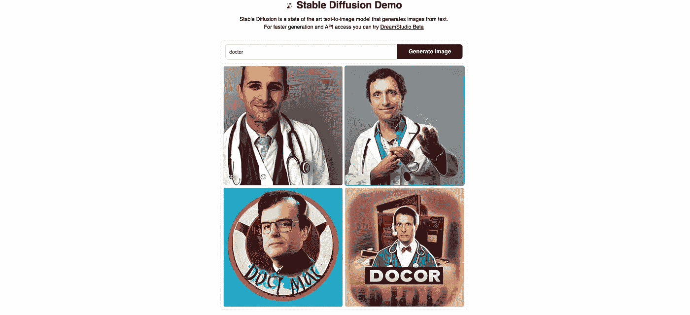
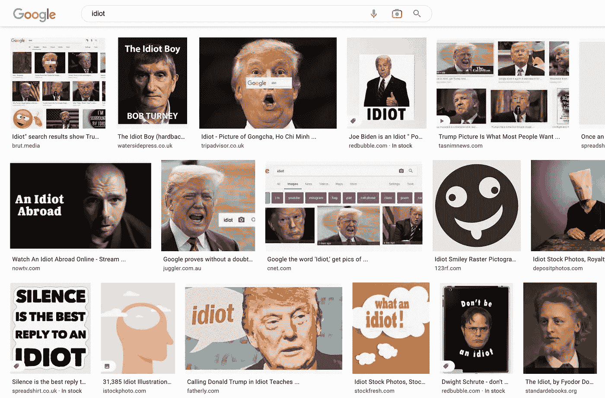
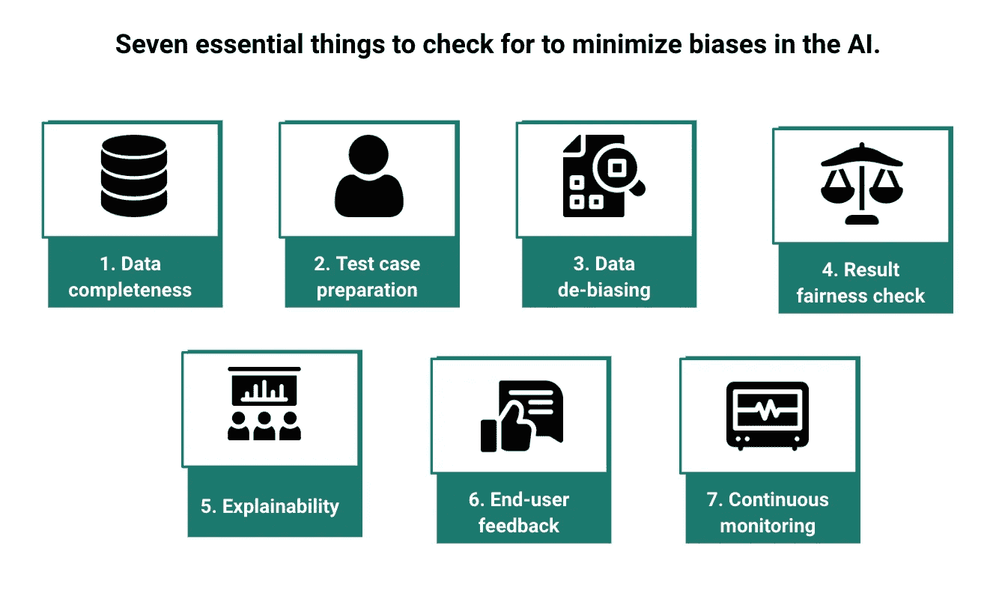
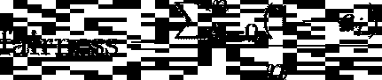

# 如何让 AI 公平一点，少一点偏见

> 原文：<https://pub.towardsai.net/how-to-make-ai-fair-and-unbiased-f11eee6219ff?source=collection_archive---------1----------------------->

## 减轻人工智能偏见和风险的实用框架

随着埃隆·马斯克在 Twitter 上解雇了整个“道德人工智能”团队[1]，我认为理解其影响以及社会对道德、公平和公正的人工智能的需求比以往任何时候都更重要。

我们希望利用人工智能无与伦比的准确性和超越人类的能力。我们希望数据支持的决策人工智能框架将是公平的，并消除人类的偏见。然而，这些算法(AI)往往会有偏见，甚至放大人类的偏见。例如，Twitter 发布了一份报告[2]，内容是其人工智能如何推广右倾新闻源多于左倾新闻源。这样的人工智能拥有塑造数百万人政治观点的力量——除非我们采取措施阻止它。

另一个有意思的无意偏向 AI 的例子是 Gild。Gild 为开发者创建了一个候选人选择系统，基于他们公开的代码和社会活动。虽然开发这个软件是为了减少招聘中的偏见，但人们意识到这个平台更喜欢倾向于在日本漫画网站上发表评论的候选人。鉴于该网站经常有性别歧视的内容，女性不太可能访问该网站。因此，当考虑选择类似的资料时，该软件传播了对女性的偏见。亚马逊的人工智能计算平台也存在类似的情况。人工智能偏见的另一个众所周知的例子是 IBM 和微软的人脸识别算法，这些算法一直被发现在女性、黑人、18-30 岁的受试者中表现最差[3]。

我通过例子探讨了偏见产生的原因，并提供了一个实用的框架来帮助减轻这些偏见。

# 探索人工智能中的偏见

虽然大多数偏见最终都可以归咎于设计人工智能系统的人类，但我们可以进一步将它们分类如下:

## 1.数据偏差

这些偏差是由训练数据中的偏差引起的。数据偏差的原因之一是少数数据点的代表性不足。我在最先进的图像生成人工智能中找到了这种偏见的一个例子——稳定扩散[4]。我要求稳定扩散产生一个医生的图像；它生成的所有图像都是男医生的。这将是有偏见的数据的结果，算法默认医生是男性。

稳定扩散中的数据偏差

当训练数据样本不能概括整个群体或数据不具有代表性时，就会出现这些偏差。例如，在上述人脸识别软件的情况下，数据未能代表重要的人口群体。

## 2.流行偏见

当算法被设计成以出现频率为特征时，这些偏差就会出现。几年前，当人们搜索单词*白痴*时，特朗普的照片开始出现。他今天仍然出现在搜索结果中。这是英国人操纵谷歌算法的结果，在他访问该国后，他们反复将这两个词联系在一起。

搜索引擎中的流行偏见

## 3.评估方法偏差

这意味着算法会因为我们如何评估它们的成功而变得有偏差。例如，如果精确度和/或召回率很低，那么对于有偏差的数据集的高度精确的算法将产生有偏差的结果。

现实世界的数据集往往是不平衡的。例如，选择准确性作为分类患者数据的矩阵，其中超过 95%的患者是健康的，这将是一个错误。原因是人工智能可以通过对所有健康患者进行分类来达到 95%的准确率。此外，传统算法针对准确度、精确度和召回率进行了优化。为什么偏见不能成为标准之一？

## 4.模型漂移引起的偏差

当当前数据偏离训练数据时会发生这种情况，即模型预测不再有效。例如，与几年前相比，今天的垃圾邮件已经完全改变，变得更加复杂。不考虑这些趋势会导致不正确的预测。

## **5。归因偏差**

当人工智能系统学习错误的推断时，就会出现这种偏差。例如，基于公司的当前特征，人工智能系统可以学习给予从某些学校毕业的人更多权重，并对那些没有毕业的人显示偏见，尽管他们的个人资料相同。

## 6.定义偏差

在动态的世界中，没有更新的目标定义会导致定义偏差的问题。

由于罢工，史基浦机场长时间排起了长队。机场有一个很棒的应用程序，它会通知你较长的等待时间(如果有的话)。随着应用程序动态适应当前的等待时间，它说“正常等待时间”，即使人们不得不排队等待约 3-4 个小时(而不是约 30 分钟前 COVID 和罢工)。

## 7.人类偏见

这可能是因为人类可能会不知不觉地使用或忽略可能会影响算法预测的输入特征。此外，当人类设计人工智能系统时，未能解释上述任何偏差都可以间接归咎于人类。

# 反对人工智能偏见的框架

最大限度地减少偏见对于确保人类对人工智能的信任至关重要。为此，我希望下面的框架有助于将它付诸实践。

## 1.使用完整的和完全有代表性的数据是可能的

我们总是可以用可接受的精度的可用数据来训练模型。确保数据是完整的，并代表了上述的边缘情况，将有助于建立一个公平的模型。数据科学家可以更进一步，建立额外的实验来确保数据的代表性。

## 2.预先准备测试用例

头脑风暴边缘案例甚至应该在训练算法之前就完成。一个例子是考虑算法是否会偏向于种族、年龄、性别和/或民族。除了帮助更好地设计功能，这将减少潜在的数据和人为偏见(如果有的话)。

## 3.消除数据偏差

所有标准的去偏差方法，如**过采样或欠采样、特征工程和重新加权**，都可以减轻数据偏差，并允许在算法中更好地表示少数群体(数据点)。然而，有必要分析这些变化是否影响边缘案例组，以及准确性和公平性之间的权衡是否合理。下一点中的公式可以帮助决定如何客观地评估这种权衡。

## 4.基于测试用例检查算法结果的公平性

检查结果是否有偏差的一个简单方法是绘制特征和结果之间的**相关性。**如果您发现算法结果与特征(如种族、年龄、性别和/或民族)之间有很强的相关性，则很可能是模型有偏差。基于公平性指数和准确性，可以决定这样的权衡。

示例公平性可以如上计算。这里，n 是要检查的特征的总数，c 是这些特征的相关系数。

## 5.检查算法的可解释性

在为您的用例投入复杂的算法之前，看看简单的算法结果是否可行总是一个很好的第一步。如果使用回归，可以检查哪些要素的权重更大。这已经能告诉你算法是否有偏差。

在使用更复杂的算法时，像 **LIME [5]** 或 **SHAP [6]** 值这样的技术会非常有帮助。如果你想深入了解你的算法是如何做出决策的，使用这些技术不应该是一个可有可无的练习，而是必须的。

## 6.征求最终用户的反馈

执行有针对性的测试，并收集真实用户的反馈，可以帮助评估经过训练的模型。

## 7.持续监控和检查数据漂移

尽管采取了所有的预防措施，但在这个动态的世界中，模型注定会漂移并产生有偏差的结果。根据最新数据重新定义目标和最终定义，并自动进行数据漂移监控和评估，可以避免这个陷阱。诸如 **DDM(漂移检测方法)、EDDM(早期 DDM)等标准方法或 Mercury** 等框架可用于数据漂移分析。

除了这些具体措施，从长远来看，需要整个组织范围的整体变革来打击人工智能偏见，包括数据团队本身的多样性。这也可能意味着让社会科学家或人文主义者参与一些关键项目。这带来了不同的视角，可以更好地塑造项目。确保数据团队受到鼓励并做好充分准备，以采取额外的步骤来确保他们的算法是公平和无偏见的，这是一个组织为 AI 执行其预期目的所能做的最起码的事情。

## 参考资料:

[1]2022 年 11 月，埃隆·马斯克在 wired.com 解雇了 Twitter 的“道德人工智能”团队。

[2]推特上政治的算法放大，Huszár 等人，Arxiv，2021 年 10 月。

[3]人脸识别性能:人口统计信息的作用，Klare 等，IEEE 信息取证与安全汇刊，第 7 卷第 6 期，2012 年 12 月。

[4]用潜在扩散模型合成高分辨率图像
罗宾·龙巴赫等， *CVPR 2022 口述。*

[5]“我为什么要相信你？”解释任何分类器的预测，Ribeiro 等人，ArXiv Aug 2016。

[6]解释模型预测的统一方法，Lundberg 等人，ArXiv，2017 年 11 月。