# 如何用熊猫制作剧情

> 原文：<https://pub.towardsai.net/how-to-make-plots-with-pandas-4cf609bdf100?source=collection_archive---------2----------------------->

## [数据可视化](https://towardsai.net/p/category/data-visualization)

## 熊猫绘图初学者指南


Debbie Molle 在 [Unsplash](https://unsplash.com?utm_source=medium&utm_medium=referral) 上拍摄的照片

当进行数据科学或机器学习工作时，您经常使用 pandas 来加载和结构化您的数据，并使用 matplotlib 或 seaborn 进行数据可视化。但是，如果我告诉你，你实际上也可以使用熊猫来创建情节和图形，所以你甚至不需要另外两个库。

在本指南中，我将向你展示熊猫提供的一些可视化功能以及如何使用它们。为了全面了解你能在 pandas 中做什么，你还应该查看库的[文档。](https://pandas.pydata.org/docs/)

> ***注意:** Pandas 实际上在幕后使用 matplotlib 进行它所有的剧情，那些剧情因此是 matplotlib 对象。

## 创建一些要使用的数据

在我们开始绘图之前，我们需要一些可视化的数据。为此，我们可以使用 NumPy 库创建一些随机变量。

首先，让我们创建一些 x 和 y 值。

```
x = np.arange(1, 21, 1)
y = [np.random.randint(100, 1000) for i in range(len(x))]
print(x)
print(y)>>[1  2  3  4  5  6  7  8  9 10 11 12 13 14 15 16 17 18 19 20]
>>[575, 579, 763, 472, 834, 803, 952, 955, 813, 793, 467, 271, 946, 311, 912, 756, 543, 881, 355, 518]
```

接下来，我们可以使用这些值创建一个数据框。

```
df = pd.DataFrame({
  'x': x,
  'y': y
})
df.head()
```

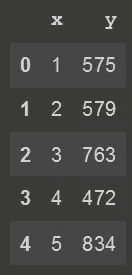

head()函数的输出—由作者创建

## 线形图

线形图是一种非常常见的图，可能是您经常使用的图。我们可以使用 pandas 通过以下代码为我们的数据框创建一个线图。我们为参数`x`和`y`提供字符串`'x'`和`'y'`，因为它们是我们的数据框的列名。

```
df.plot.line(x='x', y='y')
```

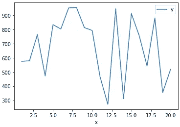

熊猫线状图——作者创作

实际上，线图是 pandas 将生成的默认图，因此您可以通过省略`line()`调用来实现相同的输出，并像这样简单地调用该函数。

```
df.plot(x='x', y='y')
```

请注意，我们直接从数据框中调用绘图函数。

plot 函数有一些有用的参数，您可以传递给它以增加绘图的趣味。在下面的代码示例中，您可以找到一些常用的。

```
df.plot.line(
  x='x',
  y='y',
 figsize=(12, 8),
  xticks=x,
  yticks=np.arange(100, 1100, 100),
  title='x by y',
  ylabel='y values',
  grid=True
)
```

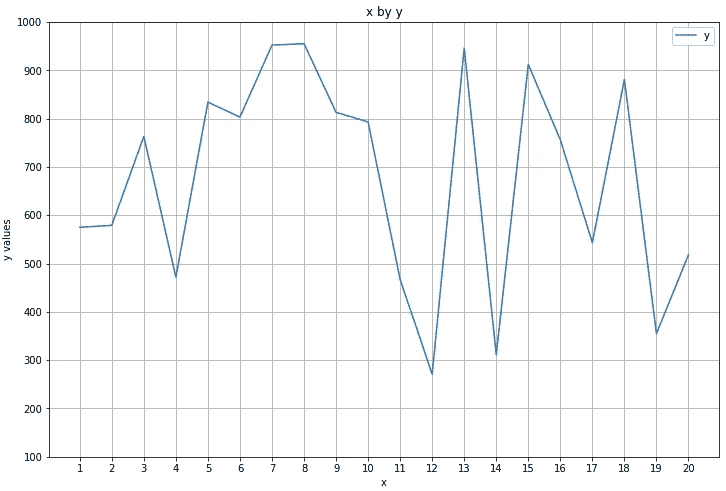

熊猫线剧情加香料——作者创作

这些参数大部分是不言自明的，但是`xticks`和`yticks`可能会引发问题。它们用于确定 x 和 y 轴上的值，您只需向它们传递一个 list 或 NumPy 数组。

**自动缩放轴** 如果你想让图一直延伸到边缘，你可以做的另一个修改是自动缩放轴。您可以通过在调用`plot()`之后调用`autoscale()`来实现这一点。

```
df.plot.line(
  x='x',
  y='y',
 figsize=(12, 8),
  xticks=x,
  yticks=np.arange(100, 1100, 100),
  title='x by y',
  ylabel='y values',
  grid=True
)**.autoscale(axis='both', tight=True)**
```

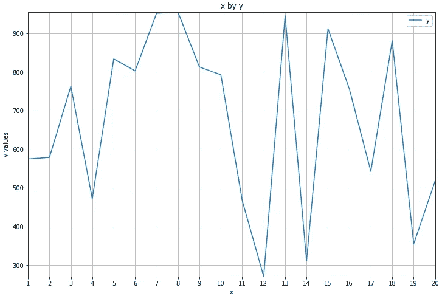

自动缩放线图-由作者创建

对于`axis`，您可以传入参数`'x'`、`'y'`或`'both'`来指定缩放哪些轴。`tight`参数指定线条应该延伸到绘图的边缘。

**线形图不需要 X 和 y 值** 您不需要直接提供 X 和 y 值。如果您忽略它们，图表将简单地将数据集中的每一列绘制为一条单独的线，并使用数据框的索引作为 x 轴。

下面的代码用一些虚构的数据点创建了另一个数据框来说明这一点。

```
another_df = pd.DataFrame(
  {
    'Birds': [7, 12, 16, 20, 18, 14, 10],
    'Mosquitoes': [40, 35, 27, 15, 10, 14, 18]
  },
  index=[1, 2, 3, 4, 5, 6, 7]
)
```

下面绘制了一个直接来自数据框的图表。

```
another_df.plot.line(
  figsize=(12, 8),
  title='Birds and mosquitoes',
  ylabel='Count',
  grid=True
)
```

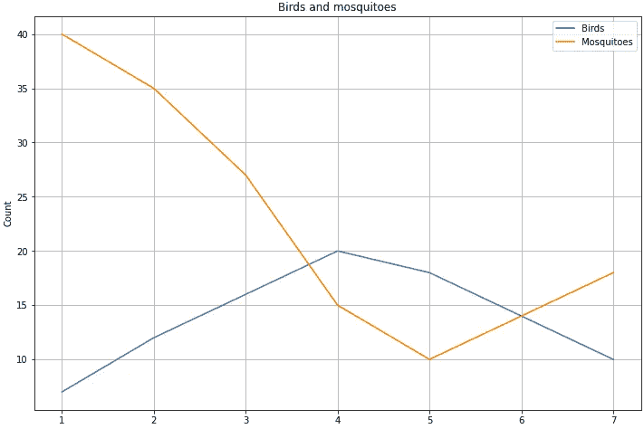

从数据框直接创建折线图，每列为一条线-由作者创建

## 散点图

使用第一个示例中的数据框，可以通过以下方式制作散点图。

```
df.plot.scatter(
  x='x',
  y='y',
  figsize=(12, 8),
  xticks=x,
  yticks=np.arange(100, 1100, 100),
  title='x by y scatter plot',
  ylabel='y values',
  xlabel='x values',
)
```

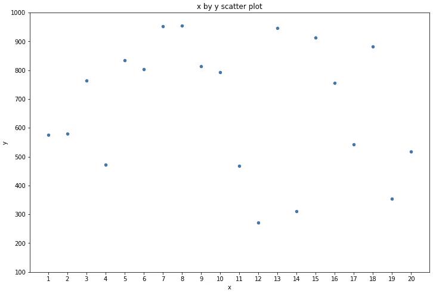

散点图—由作者创建

不幸的是，在笔记本中绘制时似乎有一个错误，x 轴和 y 轴上的标签没有显示出来。在我的情况下，我使用的是谷歌合作笔记本电脑熊猫 1.1.5 版。

要解决这个问题，您可以使用下面的方法，将从`plot()`函数调用返回的对象保存在一个变量中，然后在其上设置标签。

> 请注意，如果您在标准 python 环境中在笔记本之外工作，这应该不是问题。

```
**ax = df.plot.scatter(**
  x='x',
  y='y',
  figsize=(12, 8),
  xticks=x,
  yticks=np.arange(100, 1100, 100),
  title='x by y scatter plot',
)
**ax.set(xlabel='x values', ylabel='y values')**
```

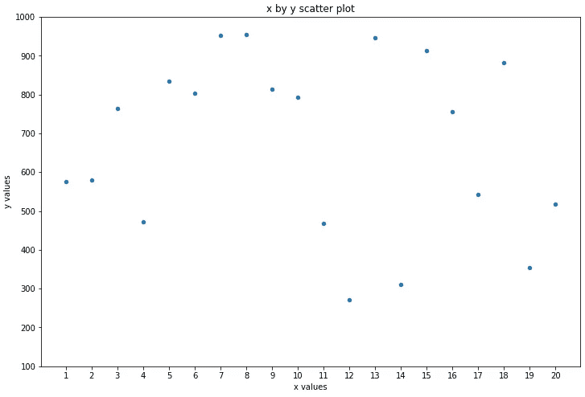

具有正确 x 和 y 标签的散点图-由作者创建

**表示第三个变量**
如果数据集有第三个维度，您可以使用`c`(颜色)和`colormap`属性来表示，如下所示。

```
z = [np.random.randint(0, 3) for i in range(len(x))]
df['z'] = zdf.plot.scatter(
  x='x',
  y='y',
 ** c='z',
  colormap='Oranges',**
  ylabel='y values',
  xlabel='x values',
  figsize=(12, 8),
  yticks=np.arange(100, 1100, 100),
  title='x by y scatter plot with coloring',
)
```

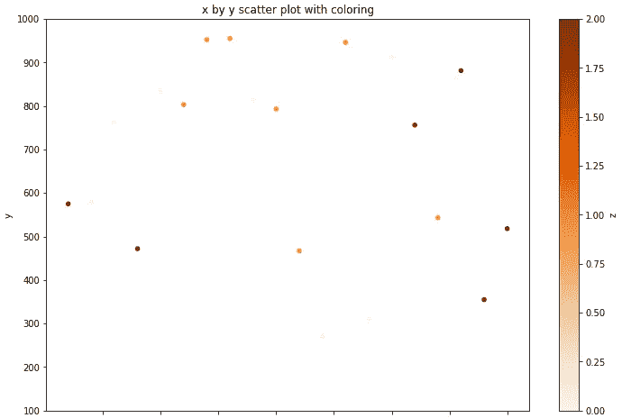

带颜色的散点图—由作者创建

不幸的是，在笔记本中输出时，使用`colormap`参数会引入另一个 bug。现在 x 轴上的记号也不见了。使用 matplotlib，通过创建如下所示的子情节，可以解决这个问题。

```
**import matplotlib.pyplot as plt****fig, ax = plt.subplots()**
df.plot(
  **kind='scatter',**
  x='x',
  y='y',
  c='z',
  colormap='Oranges',
  figsize=(12, 8),
  yticks=np.arange(100, 1100, 100),
  title='x by y scatter plot with coloring',
 **ax=ax,**
)
**ax.set_xlabel('x values')
ax.set_ylabel('y values')**
```

这将生成下图，其中 x 轴和 y 轴都正确显示。

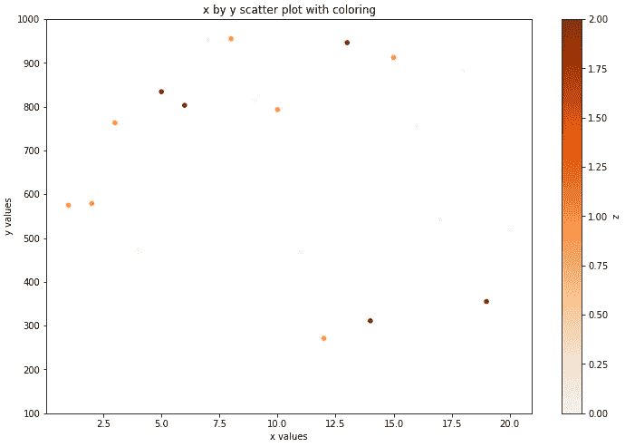

带有颜色和正确 x 轴和 y 轴的散点图—由作者创建

## 其他地块类型

除了折线图和散点图，pandas 还允许您直接从 pandas 数据框或 pandas 系列创建以下图:

`df['y'].plot.area()`

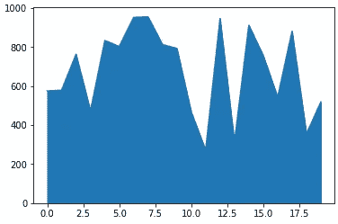

熊猫区图——作者创作

`df['y'].plot.bar()`

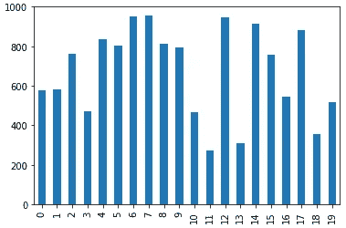

熊猫酒吧图——作者创作

`df['y'].plot.barh()`

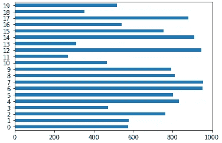

熊猫 barh 情节——作者创作

`df['y'].plot.box()`

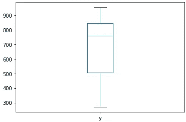

熊猫盒子情节——作者创作

`df.plot.hexbin('x', 'y')`

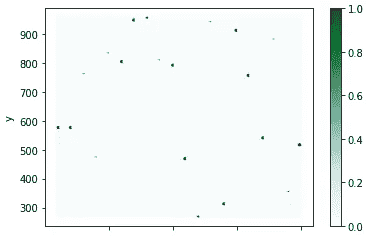

熊猫 hexbin 情节——作者创作

`df['y'].plot.hist()`

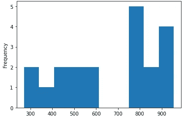

熊猫直方图——由作者创建

`df['y'].plot.pie()`


熊猫饼图——作者创作

我建议你查看一下官方文档，了解更多关于如何使用这些图的信息。

## 使用 matplotlib 进一步修改

熊猫可以让你直接从一个非常好的数据框中做出一些简单容易的图。但是，如果您需要一些额外的数据可视化的灵活性，那么您可能需要直接使用 matplotlib 或 seaborn。

例如，如果你想添加文本到你的图中，这可以是每个数据点的值作为例子，那么你需要创建支线图。这可以使用 matplotlib 来完成，(就像我们在上面使用正确输出的彩色散点图一样)。我在以前的一篇文章中解释了如何实现这一点。

[](https://towardsdatascience.com/how-to-label-the-values-plots-with-matplotlib-c9b7db0fd2e1) [## 如何用 Matplotlib 标记值图

### 标注地块的简单指南

towardsdatascience.com](https://towardsdatascience.com/how-to-label-the-values-plots-with-matplotlib-c9b7db0fd2e1) 

你可以用熊猫来创造简单的情节，这是很棒的。不幸的是，在笔记本环境中使用熊猫绘图有一些错误，这当然是一个缺点。然而，用于绘图的 API 和函数调用非常简单易用，非常好。我希望这些信息对你有用。

感谢阅读。