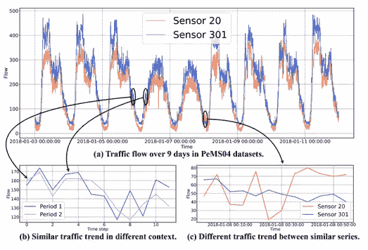
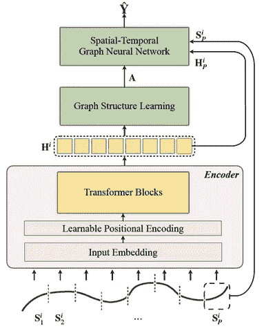
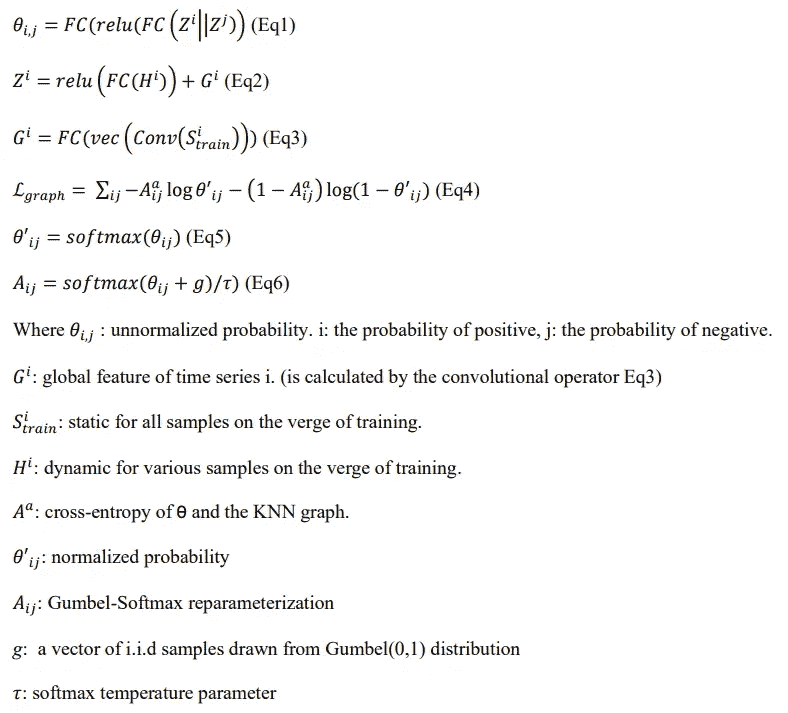
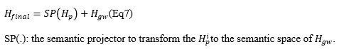
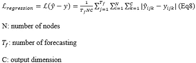
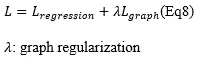
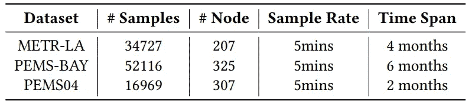
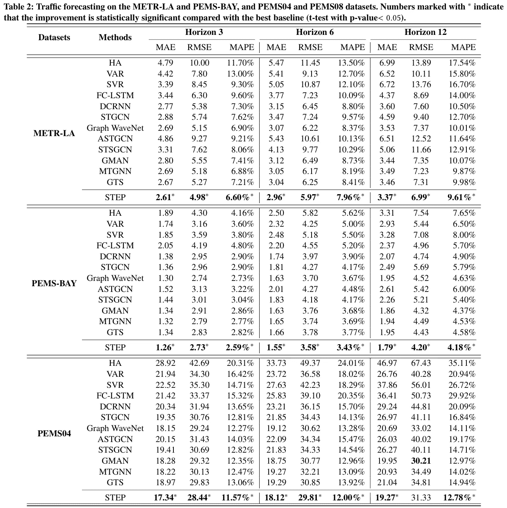

# 如何使 stg nns 能够预测长期多元时间序列数据？

> 原文：<https://pub.towardsai.net/how-to-make-stgnnscapable-of-forecasting-long-term-multivariate-time-series-data-9fe5efd77fa1?source=collection_archive---------0----------------------->

从能源到医疗保健，时间序列预测(TSF)数据在所有行业中都至关重要。研究人员通过开发 TFS 模型取得了一些重大进展。通过彻底考虑时间序列的模式及其关系，基于数据集中的长期依赖性的分析是必须的。这篇文章是关于在另一个模型的基础上设计一个新的模型来执行长期依赖和产生段级表示。这个模型站在 STEP 上，STGNN(时空图神经网络)的缩写+增强+预训练模型。

## 步骤:

首先，不要混淆:

*   **时空图数据=多元时间序列**

这里，使用的数据*(交通流量)*是由*传感器*记录的道路上的时间序列数据。

您看到上面图 1 中的两种模式了吗？？

**回答**:重复模式有两种:1。**日常** 2。**每周周期**

第一，STGNNs 是“时空图神经网络”的缩写，给那些不知道/知道微薄的人。(不难，只需要*Google 一下*；为不想浪费时间或分心的人提及)

**STGGNNs =序列网络+图形神经网络(GNNs)**

我们使用 *GNNs* 来处理时序和时序模型之间的关系，以指示时序*模式*。通过这两个术语的结合，我们可以把握 ***的杰出成果*** 。顺便说一句，正如研究人员所说，没有免费的午餐。这意味着**强大的模型**需要**复杂的架构**；因此(在大多数情况下)，**的计算成本随着输入长度的增加而增加**(*或*)。此外，不要忘记我们的时间序列的大小，这通常是相当可观的。 ***STGNNs*** 和其他模型一样，可以预测小窗口做出预测。这种依赖小窗口的能力使得模型不可靠。**

****问题** : 1。STGNNs 不能捕获长期依赖关系。**

**2.缺少依赖关系图。**

****解决方案**:步骤(STGNN 通过可扩展的时间序列预训练得到增强)**

**STGNNs 的修改版本**

****插图**:**

**两项举措:**

****1** 。提出**t 变压器**，一个基于变压器的模块，具有自动编码器(编码器-解码器)结构，作为无监督模型。这个转换器能够捕获长依赖关系。**

****2** 。提出一个**图架构学习器**来学习依赖图。**

**在提出这两个之后，我们只需要将它们焊接成一个联合模型，这就是最终的解决方案。就是这样！！听起来很容易？！让我们尽可能使它们简单。😉**

**让我们看看提议的架构:**

****

**从图 2 中可以看出，该模型包括两个阶段:**

****第一阶段)**预培训**

****

**图 3**

**该方案是一个屏蔽的自动编码模型，它是为依赖于变换块(TSFormer)的时间序列数据训练的。该模型能够捕获长依赖关系，并产生包含一些有价值信息的段级表示。**

****第二阶段)**预测**

****

**图 4**

**在此阶段，来自前一阶段的预训练模型(其捕获长期依赖性)用于修改下游 STGNN。此外，还设计了一个离散稀疏图学习器，以防预定义图丢失。**

**大体上我就做了这么多。因此，让我们更深入地了解这两个阶段的细节:**

# **1.训练前阶段**

**这种尝试，我的意思是使用预先训练的模型，是由于在 NLP 项目中应用它们的兴趣(当然，结果)的增加。虽然预训练模型在 NLP(序列数据)中被广泛采用，但与时间序列有一些**差异**。你可以在我之前的文章中读到它的完整描述:“ [***如何为时间序列设计一个预训练模型(TSFormer)？***](/how-to-design-a-pre-training-model-tsformer-for-time-series-c2a177ebb51d)**

# **2.预测阶段**

**这里的输入分为 ***P* 长度**的不重叠面片***L*。我们的 ***TSFormer*** 为预测阶段的每个输入( **S** i)产生指示。**stg ns**的一个特点是它们采用了最新的**。因此，根据***t 前*** 产生的指示，我们将修改 **STGNNs** 。**

# **从零开始|流程**

*   **这一阶段的编码器部分与 TSFormer 中的相同；这里不提供对它的描述，以免这篇文章太长。想了解详情可以看我完整演示过的另一篇文章( [*)如何为时间序列设计一个预训练模型(TSFormer)？*](/how-to-design-a-pre-training-model-tsformer-for-time-series-c2a177ebb51d) )。**

## **图形学习的结构**

****问题)**大多数图依赖**一个预定义的图**就是**不可用**或者**不够好**大多数情况下——还有，**混合****学习**的**方式(求节点之间的关系(对于 *ex。****I****和 *j* )的时序和 **STGNNs** 导致**极大的复杂性**。*****

****解决方案)**预培训的 TSFormer**

****解释)**提出**一个离散稀疏图**。怎么会？ **1。图形规则化**到*拟合* **监督信息**。 **2。一个 KNN 图**到*缰*的**稀疏度**。其配方总结如下:**

****

## **下游时空图神经网络**

****问题** ) **常用补丁** **输入** : **最后补丁** + **依赖图****

****解** ) **步骤**(将输入面片的表示添加到输入)**

****解读**)正如我们在我之前的文章《 [***如何为时间序列设计一个预训练模型(TSFormer)？***](/how-to-design-a-pre-training-model-tsformer-for-time-series-c2a177ebb51d) ”，**t former**捕捉**long-dependencies**；因此，它使得 **H 在**信息**方面更加丰富**。此外，WaveNet 被选为我们的**后端，**它有助于正确捕获多元时间序列。*但是如何？？*它将**图形卷积**与**扩张卷积**混合。因此，我们的**预测**得到了 **WaveNet 的输出潜在的、隐藏的表示**的支持。*如何？？*通过使用 **MLP** 。**

****Q)** 如果你观察预测阶段架构，你会看到**两个流**进入 ***时空图 NN 块*** 。那么，我们该如何应对呢？**

****A)** 通过使用 Eq7:**

****

**最后，MLP 做出了预测:**

****

**下游 STGNN 的输出:**

****

> **这次 STGNN 修改到此结束。希望你喜欢。其余的是真实世界数据集上的结果。**

## **结果:**

## ****数据:****

**该模型在美国三个地区的三个交通速度数据集上进行训练:**

1.  ****METR-拉****
2.  ****PEMS 湾****
3.  ****PEMS04****

****

**表 1。数据集的统计**

## **指标:**

1.  ****MAE ( *平均绝对误差* )****
2.  ****RMSE ( *均方根绝对误差* )****
3.  ****MAPE ( *平均绝对百分比误差* )****

****

# **结束了**

> ***出处是* [*本*](https://ui.adsabs.harvard.edu/abs/2022arXiv220609113S/abstract) *。***
> 
> ***你可以* ***联系*** *我上* ***推特*** [这里](https://twitter.com/reza__yazdanfar) *或者****LinkedIn***[这里](http://www.linkedin.com/in/rezayazdanfar) *。最后，如果你觉得这篇文章有趣又有用，可以* ***关注*** *我上* ***中*** *获取更多来自我的文章。***