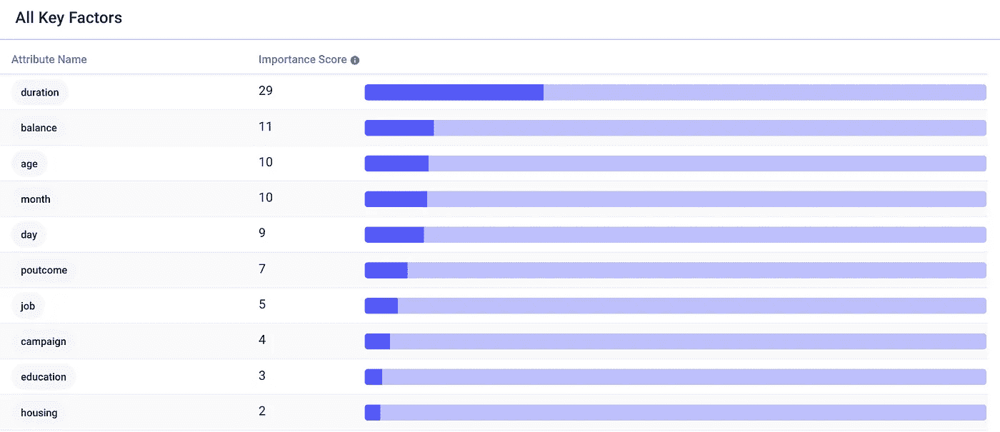
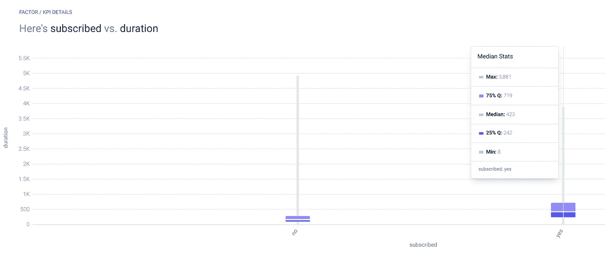
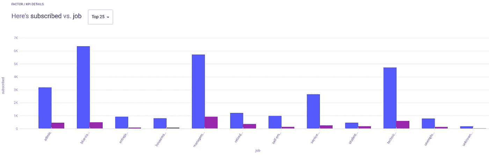
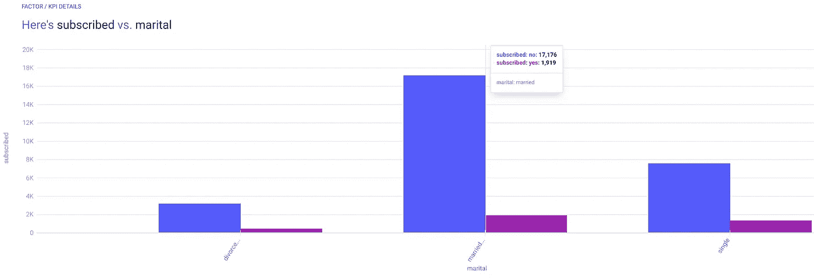

# 如何使用 AutoML 优化客户转化

> 原文：<https://pub.towardsai.net/how-to-optimize-customer-conversions-with-automl-3da2fc122c67?source=collection_archive---------2----------------------->

## [机器学习](https://towardsai.net/p/category/machine-learning)

## 银行数据集上的数据驱动销售。

照片由 [Cytonn 摄影](https://unsplash.com/@cytonn_photography?utm_source=medium&utm_medium=referral)在 [Unsplash](https://unsplash.com?utm_source=medium&utm_medium=referral) 上拍摄

81 百分比的销售线索未转化  。没有瞄准正确的线索和优化转化，获得更多的线索就像把水泵入漏桶。

在另一篇文章中，我探讨了如何使用机器学习来优化企业销售转化率。在这里，我们将探讨如何使用预测分析工具 [Apteo](http://apteo.co) 从银行[数据集](https://www.kaggle.com/prakharrathi25/banking-dataset-marketing-targets)中优化客户转化。

我们得到了客户的属性，比如年龄、工作类型、在公司的工作时间、账户余额等等，我们可以用这些属性来预测`subscribe`，或者客户是否订阅定期存款。

这是一个二元分类机器学习问题的例子，因为`subscribe`可以是“是”也可以是“否”

# 忠诚的顾客转化更多

客户与公司合作的时间越长，他们转向新产品或服务的可能性就越大。解释`subscribed`最重要的属性是`duration`列，或者简单地说，客户在该公司工作了多少天。

这适用于任何商业关系。任期较长的员工流失[的几率较低](https://medium.com/dataseries/how-to-measure-and-predict-attrition-a1f1feee755c)，任期较长的客户流失[的几率较低](https://medium.com/dataseries/how-to-build-a-dataset-to-predict-customer-churn-c4bc2984a83c)。下面，我们可以看到，回答“是”的普通客户与公司合作的时间比回答“不是”的客户长得多

# 越富有的顾客转化越多

或许并不令人惊讶的是，银行账户里有更多钱的客户转换的速度更快。平均而言，回答“是”的客户比回答“否”的客户银行账户中的存款多 78%。

由于定期存款的目的是为你的资本赚取更高的利息，所以拥有更多资本的人转换更多是有道理的。他们有更多的收获。

# 经理转换更多

与上一点类似，从事管理工作的客户转化率更高，约为 14%，至少部分原因是他们的账户余额更高。

蓝领工人的转化率不到这个数字的一半。

# 单个客户的转化率略高

大约 10%的已婚客户转变了信仰，而单身客户的这一比例为 15%。单个客户的转化率可能更高，因为只有一个人需要说服，而不是一对夫妇共同做出财务决策。

# 摘要

有了这些认识，银行可以更好地瞄准销售线索，例如通过根据销售线索转化的可能性对其进行评分。总的来说，忠诚的、富有的和单身的顾客更有可能转化。

给定一个具有 KPI 列(在本例中为`subscribed`)和描述该 KPI 的属性列的水平表，任何公司都可以轻松地优化销售流程并相应地对销售线索进行优先级排序。