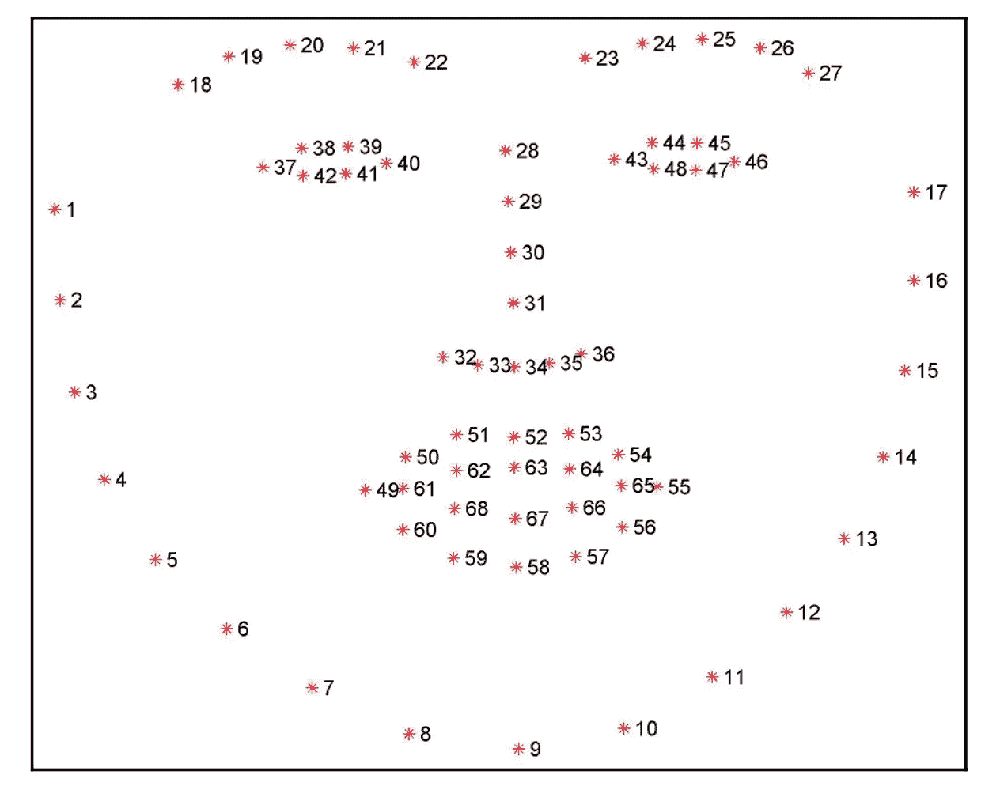
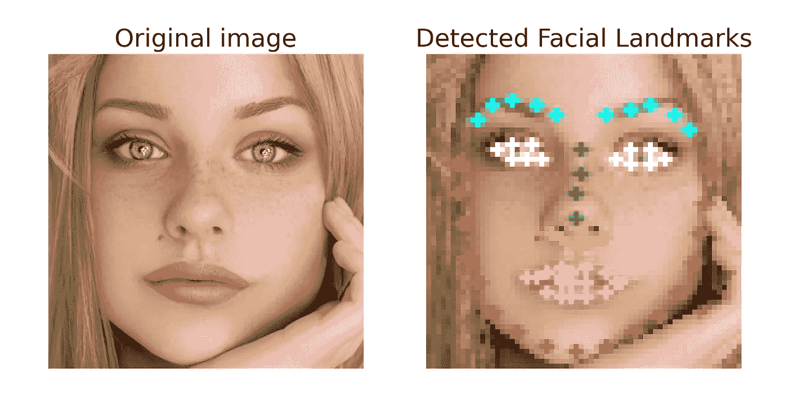

# 如何使用 Keras 执行面部标志检测

> 原文：<https://pub.towardsai.net/how-to-perform-a-facial-landmark-detection-with-keras-eb6b4e7a2722?source=collection_archive---------0----------------------->

## [深度学习](https://towardsai.net/p/category/machine-learning/deep-learning)

## 面部标志检测编程快速指南



从面部提取的标志

你学得快吗？

这篇文章的目的是通过使用预先训练好的模型从零开始，用`Keras`库快速引导你检测面部标志(面部几何结构)。

*   ***面部地标是什么？***
*   ***下载模型***
*   ***怎么做？***
*   ***测试图像***
*   ***关闭思想***

# 面部标志检测是什么

面部标志用于定位和表示面部的重要区域(例如，眼角、鼻尖、下颌线等)。

有没有想过面部标志检测？面部标志检测是检测面部关键标志并跟踪它们的任务。您应该知道实现检测的几种不同方法，如 Keras 和 Dlib 库。

# 下载预先训练的模型

你必须在这里下载预训练的重量文件[(23.2 MB)](https://raw.githubusercontent.com/junhwanjang/face_landmark_dnn/master/landmark_model/Mobilenet_v1.hdf5)。或者只运行这个:

```
wget [https://raw.githubusercontent.com/junhwanjang/face_landmark_dnn/master/landmark_model/Mobilenet_v1.hdf5](https://raw.githubusercontent.com/junhwanjang/face_landmark_dnn/master/landmark_model/Mobilenet_v1.hdf5) 
```

它将`[Mobilenet_v1.hdf5](https://raw.githubusercontent.com/junhwanjang/face_landmark_dnn/master/landmark_model/Mobilenet_v1.hdf5)`文件保存在磁盘上。你也可以把这个文件移到`models`文件夹。

# 创建虚拟环境

当您想要处理多个项目时，使用虚拟环境非常重要。我们可以通过输入以下代码来创建一个新的虚拟环境。

```
python -m venv venv
source venv/bin/actice
```

# 安装并导入所需的库

键入以下命令。几分钟后，库将安装到您的环境中。

## NumPy

```
pip3 install numpy
```

## OpenCV

```
pip3 install opencv-python
```

## 克拉斯

```
pip3 install keras
```

## 准备好

导入以下库，开始制作此食谱。

```
import numpy as npimport matplotlib.pylab as plt
import tensorflow as tf
from keras.models import load_model
from keras import backend as K
from keras.utils.generic_utils import custom_object_scope
import cv2
```

# 如何检测面部标志？

我们将采取以下步骤开始。

*   加载样本图像
*   加载预训练模型
*   预测面部标志
*   显示结果

## 使用 OpenCV 加载图像

在这篇文章中，我决定使用 Unsplash 的免费酷图作为输入，使用`opencv-python`库来检测上面的地标。


照片由 [Aggy Wide](https://unsplash.com/@agnaes?utm_source=medium&utm_medium=referral) 在 [Unsplash](https://unsplash.com?utm_source=medium&utm_medium=referral) 上拍摄

我们将从磁盘读取输入(`girl.jpg`文件)，调整图像大小，并将其转换为灰度。

*   从特定目的地读取图像并调整其大小。

```
image_color = cv2.resize(cv2.imread(‘images/girl.jpg’), (64, 64))
```

*   在 RGB/BGR 和灰度之间转换图像。

```
image_gray = cv2.cvtColor(image_color, cv2.COLOR_BGR2GRAY)
```

*   获取图像大小(宽度，高度)。

```
w, h = image_gray.shape
```

## 加载 Keras 模型并预测

注意，预测地标位置的问题被构造为回归问题。

*   加载 Keras 模型(`Mobilenet_v1.hdf5`文件)。
*   预测灰度输入面中的界标。

```
model = "models/Mobilenet_v1.hdf5"
with custom_object_scope({'smoothL1': smoothL1, 'relu6': relu6, 
    'mask_weights': mask_weights, 'tf': tf}):
    pr_model = load_model(model)
    predictions = pr_model.predict_on_batch(np.reshape(image_gray, (1, w, h, 1)))
```

这个面部标志预测器在一个人的脸上生成 68 个点。

## 显示预测的结果

我们使用下面几行代码检测灰度图像中的标记。

*   脸上有印子。

```
marks = np.array(predictions).flatten()
marks = np.reshape(marks, (-1, 2))
```

*   显示原始图像

```
mage = image_color.copy()
plt.figure(figsize=(10,5))
plt.subplot(121), plt.imshow(cv2.cvtColor(image, cv2.COLOR_BGR2RGB)), plt.axis(‘off’), plt.title(‘Original image’, size=20)
```

最后，我们将显示带有地标的预测图像。

*   颚板(1–17)

```
for mark in marks[:17]:
    cv2.circle(image, (int(w*mark[0]), int(h*mark[1])), 1, (0,0,255), -1, cv2.LINE_AA)
```

*   眉毛(18-27 岁)

```
for mark in marks[17:27]:
    cv2.circle(image, (int(w*mark[0]), int(h*mark[1])), 1, (255,255,0), -1, cv2.LINE_AA)
```

*   鼻子(28-36 岁)

```
 for mark in marks[27:31]:
    cv2.circle(image, (int(w*mark[0]), int(h*mark[1])), 1, (0,255,0), -1, cv2.LINE_AA)for mark in marks[31:36]:
    cv2.circle(image, (int(w*mark[0]), int(h*mark[1])), 1, (0,255,255), -1, cv2.LINE_AA)
```

*   眼睛(37-48 岁)

```
for mark in marks[36:48]:
    cv2.circle(image, (int(w*mark[0]), int(h*mark[1])), 1, (255,255,255), -1, cv2.LINE_AA)
```

*   唇(49–68)

```
for mark in marks[48:]:
    cv2.circle(image, (int(w*mark[0]), int(h*mark[1])), 1, (255,0,255), -1, cv2.LINE_AA) 
```

*   绘制结果

```
plt.subplot(122), plt.imshow(cv2.cvtColor(image, cv2.COLOR_BGR2RGB)), plt.axis('off'), plt.title('Detected Facial Landmarks', size=20)
plt.show()
```

# 用各种图片测试程序

你运行程序，得到一个图像。下图显示了女孩脸上的 68 个地标。



表面有 68 个地标

# 结束语

很简单，对吧？在这篇文章中，我们看到了如何使用预先训练的模型实现面部标志检测。如果你想改进这个程序，作为一个规则，试着训练你自己的模型或者实现一个新的模型。