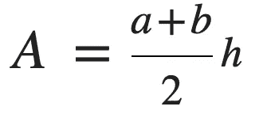
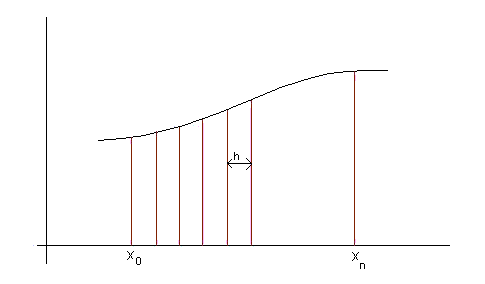

# 如何用 SQL 进行微积分运算？

> 原文：<https://pub.towardsai.net/how-to-perform-calculus-in-sql-f2e63121bf4?source=collection_archive---------5----------------------->

## [数学](https://towardsai.net/p/category/mathematics)

## “什么是数学？这只是一种解决自然难题的系统努力”

在极少数情况下，你想求曲线下的面积，或者从数学上说，通过 SQL 对曲线求积分——我有一个解决方案！

# 问题:

*根据汽车的速度和位移，在 SQL 中找出汽车行驶的距离。*

# **背景知识**

**数学**

首先，让我们回顾一些高中数学:

*积分:求积分的过程。它是在图上寻找由函数限定的区域的过程。两类积分；定积分和不定积分。它也被认为是微积分中微分的反义词，是一个反导数(一个给定函数的导数)*

现在，让我们回顾一下梯形面积的公式:



接下来让我们回顾一下梯形法则:

*通过将曲线分割成更小的梯形并计算曲线中所有梯形的总和来计算曲线下面积的近似方法。*



来源:[谷歌图片](https://www.google.com/url?sa=i&url=https%3A%2F%2Frevisionmaths.com%2Fadvanced-level-maths-revision%2Fpure-maths%2Fcalculus%2Ftrapezium-rule&psig=AOvVaw1eYKQgQFhVJ4fP0NEk-7bu&ust=1628095113482000&source=images&cd=vfe&ved=0CAsQjRxqFwoTCJD8pYyllfICFQAAAAAdAAAAABAD)

*分割成梯形的曲线示例*

我们将在数据中应用这一理论。

[**SQL**](https://www.w3schools.com/sql/)

我们将在 SQL 中使用`[LEAD](https://www.sqltutorial.org/sql-window-functions/sql-lead/)`操作符。`LEAD`操作符从下一行获取值。

# **解决方案**

最后，让我们应用我们现在所学的知识，找出车辆在不同速度下行驶的距离，以及由汽车中的 ECU 记录的时间戳。

```
velocity_time as (SELECT speed,distance
FROM vehicle_speedometer
ORDER BY session_id, time)displacement as (SELECT session_id,((LEAD(speed) + speed)/2)*(LEAD(time)-time)) as area_of_trapezium
FROM vehicle_speedometer
GROUP BY session_id)SELECT session_id,SUM(area_of_trapezium) as total_displacement
FROM displacement
GROUP BY session_id
```


我的梦想之车；)

最初，我是一名机械工程师，但一直对数学和人工智能充满热情，后来我在这两个领域都找到了理想的职业，成为一名数据科学家。我热衷于将这些学科的严谨性应用于复杂的分析问题。我热爱教学，我兼职辅导 A-Level 数学、物理和化学。我也是一个受自然启发的优化爱好者(查看我的 [*发表的 pape*](https://www.researchgate.net/publication/317803017_An_Experimental_Study_on_Competitive_Coevolution_of_MLP_Classifiers) *r)和一个板球和网球的超级粉丝。在*[*LinkedIn*](https://www.linkedin.com/in/rahullalchandani-)*上找我！*