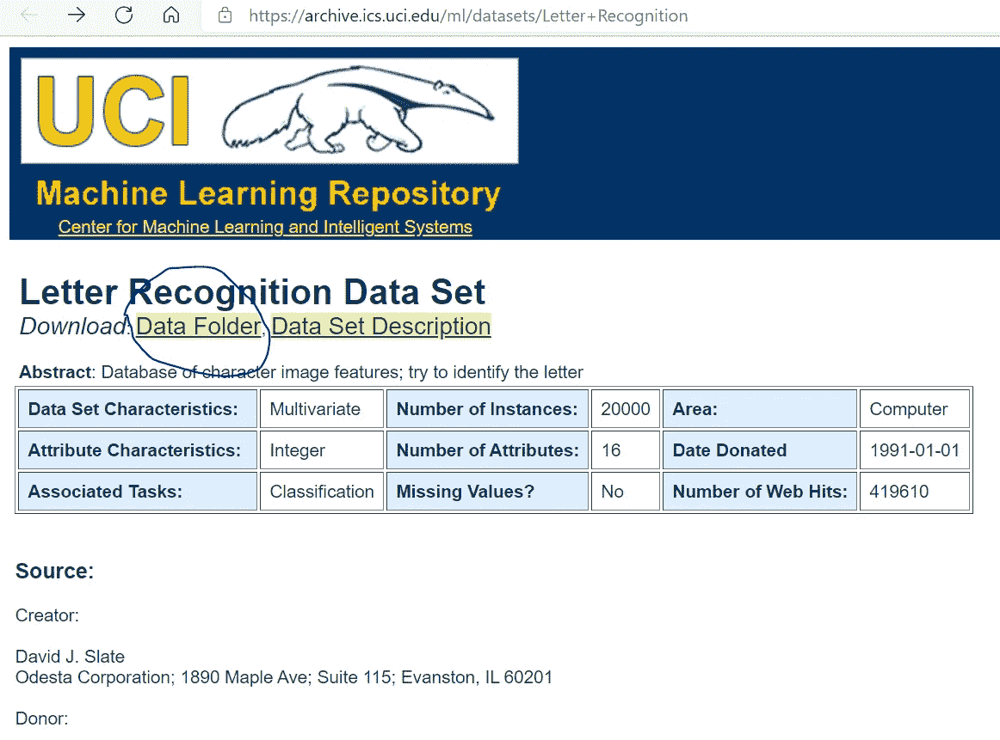
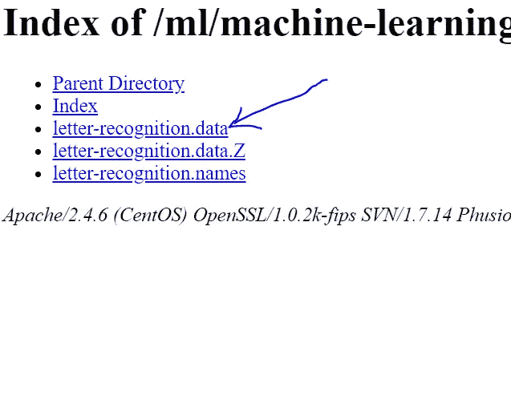
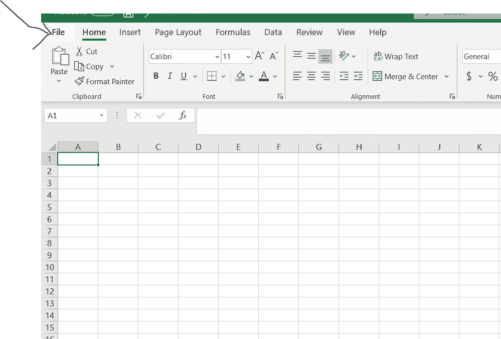
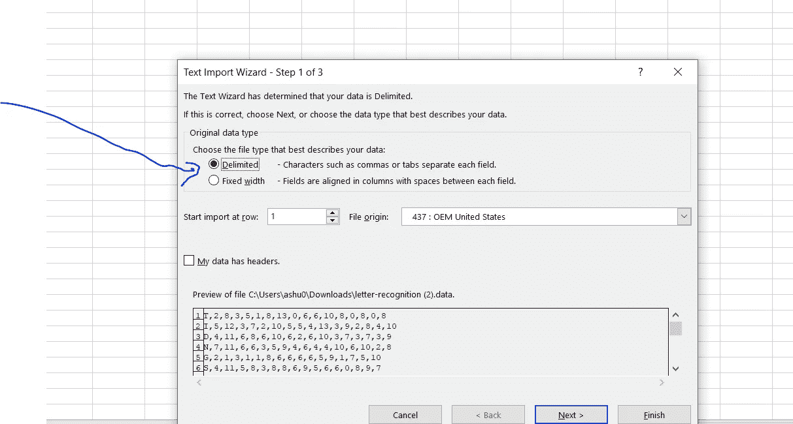
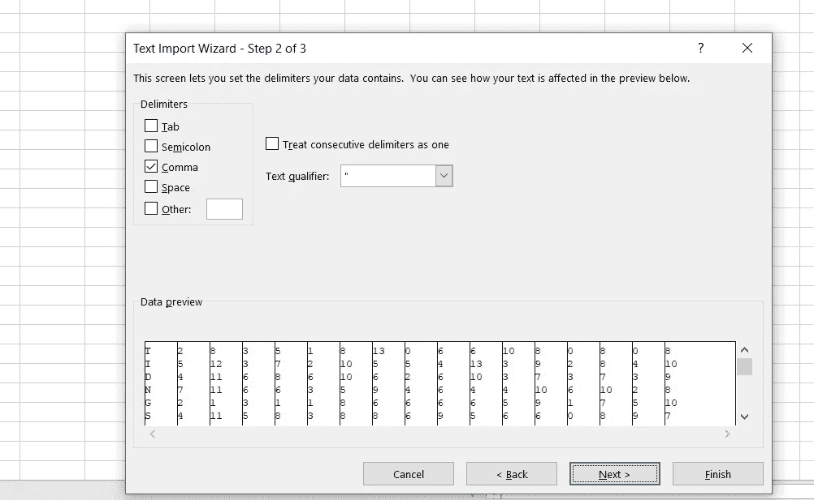
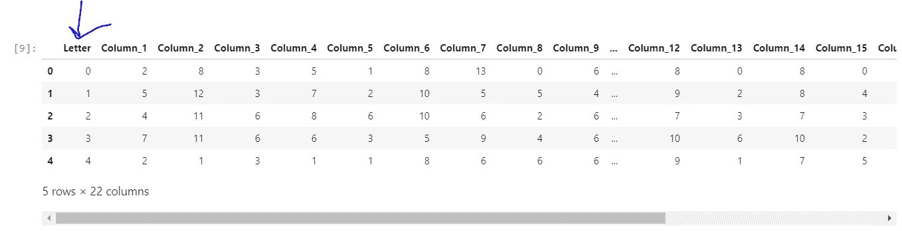
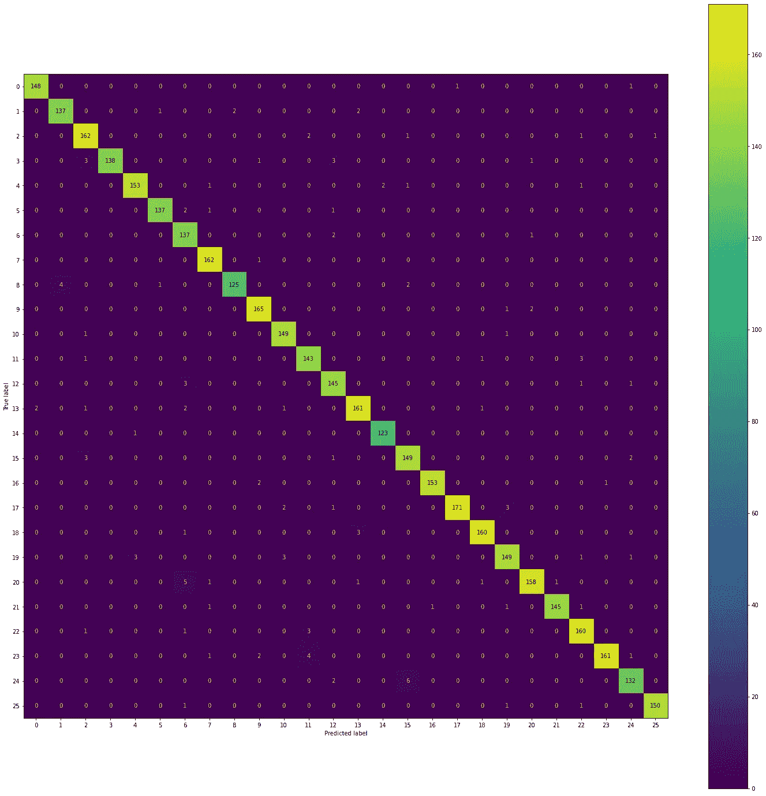

# 如何使用随机森林分类器在 Python 中执行字母识别

> 原文：<https://pub.towardsai.net/how-to-perform-letter-recognition-in-python-using-random-forest-classifier-cdaca6a58e31?source=collection_archive---------3----------------------->


Jayson Hinrichsen 在 [Unsplash](https://unsplash.com/s/photos/letter-girl?utm_source=unsplash&utm_medium=referral&utm_content=creditCopyText) 上拍摄的照片

## [机器学习](https://towardsai.net/p/category/machine-learning)

这是使用随机森林分类器完成这项任务的指南

如果您想了解更多关于随机森林代码的信息，请访问数据教授在[https://www.youtube.com/watch?v=XmSlFPDjKdc](https://www.youtube.com/watch?v=XmSlFPDjKdc)的视频

## 目录:

一、数据集信息
二。下载数据
III。为提高准确性做一些前期数据准备
四。实施
五、准确性
六。混乱矩阵
VII。代码
VIII 的 Github 信息。参考

# 一.数据集信息

本文中使用的测试和训练数据集可以在以下位置找到:

[UCI 机器学习知识库:字母识别数据集](https://archive.ics.uci.edu/ml/datasets/Letter+Recognition)

网站上列出了以下信息，并在此引用:

**来源:**

创建者:

大卫 j .斯莱特
奥德斯塔公司；枫树大道 1890 号；115 套房；伊利诺伊州埃文斯顿，邮编 60201

捐赠者:

大卫·j·斯莱特(戴夫**' @ '**math.nwu.edu)(708)491–3867

**数据集信息:**

目标是将大量黑白矩形像素显示器中的每一个识别为英语字母表中 26 个大写字母中的一个。字符图像基于 20 种不同的字体，这 20 种字体中的每个字母都被随机扭曲，以产生一个包含 20，000 种不同刺激的文件。每个刺激被转换成 16 个原始的数字属性(统计矩和边数),然后被缩放以适应从 0 到 15 的整数值范围。我们通常对前 16000 个项目进行训练，然后使用结果模型来预测剩余 4000 个项目的字母类别。更多细节见上面引用的文章。

**属性信息:**

1.字母大写字母(从 A 到 Z 的 26 个值)
2。x-box 盒子的水平位置(整数)
3。y-box 盒子的垂直位置【整数】
4。
框的宽度(整数)5。
盒子的高度(整数)6。on pix total # on pixels(整数)
7。x-bar 表示盒子中像素的 x 值(整数)
8。y-bar 表示盒子中像素的 y 值(整数)
9。x2bar 均值 x 方差(整数)
10。y2bar 均值 y 方差(整数)
11。xybar 均值 x y 相关(整数)
12。x * x * y(整数)的 x2ybr 均值
13。xy2br x * y * y(整数)的均值
14。x-ege 平均边数从左到右(整数)
15。x-ege 与 y(整数)的 xegvy 相关性
16。y-ege 从下到上的平均边数(整数)
17。y-ege 与 x(整数)的 yegvx 相关性

# 二。下载数据



单击上图中圈出的数据文件夹按钮，下载下面标有蓝色箭头的内容:



# 三。提高精度的一些前置数据准备

这一节讲的是我用过的一种技术。如果没有这种技术，模型的准确性将达到大约 95%，而使用这种技术将提高到 96.8%。

打开 excel。点击文件→打开→浏览→点击你刚从 UCI 下载的文件。



现在，您接下来会看到这个屏幕:



单击定界→然后单击下一步按钮。



确保逗号被选中，如上图所示。

然后单击完成。您的数据将被加载。

在数据顶部插入一行，并从左到右输入这些名称作为列标题:

```
random Letter//Column_1// Column_2// Column_3// Column_4// Column_5// Column_6// Column_7// Column_8// Column_9// Column_10// Column_11// Column_12// Column_13// Column_14// Column_15// Column_16
```

转到最后一列，再添加五列。

这些列将是:

```
Average Kurtosis Skew Variance Product
```

在每列中输入以下公式。这些公式包括除类别列(即字母列)之外的所有列的范围:

```
=AVERAGE(C2:R2)
=KURT(C2:R2)
=SKEW(C2:R2)
=VAR(C2:R2)
=PRODUCT(S2,T2,U2,V2)
```

将公式拖过所有数据行。(单元格引用会自动更改)

将文件保存为 CSV 文件。我把我的命名为→ letter Class.csv

# 四。履行

我用 Jupyter 笔记本做这个项目。让我们开始编码:

a.导入包

```
from sklearn import datasets
from sklearn.model_selection import train_test_split
from sklearn.ensemble import RandomForestClassifier
from sklearn.datasets import make_classification
import pandas as pd
```

b.把文件带进来:

```
letter_Class_csv = pd.read_csv(‘letter Class.csv’)
```

c.对类别列中的标签进行编码。这个类目前由字母 A-Z 组成，但是，对于随机森林，我们必须将这个类编码为一个数字。

一个快速的方法是使用熊猫因子分解。

```
letter_Class_csv['Letter'] = pd.factorize(letter_Class_csv['Letter'])[0]
```

现在让我们把随机森林的数据分成两部分:x 和 y。

x 变量将包含用于执行预测的所有列，y 变量将包含要预测的类:

```
x = letter_Class_csv[['Column_1','Column_2','Column_3','Column_4','Column_5','Column_6','Column_7','Column_8','Column_9','Column_10','Column_11','Column_12','Column_13','Column_14','Column_15','Column_16'
]].values # independent variable
y = letter_Class_csv[['Letter']].values.flatten() # dependent variable
```

接下来，我们可以使用 head 方法来查看我们的数据:

```
letter_Class_csv.head()
```



正如您在上面看到的，字母列没有字母，它有从 0 开始的数字来代替字母 A-Z。

让我们检查 x 和 y 的形状。注意，y 变量必须是一个一维数组，这样才能工作:

```
y.shape
```

这将返回(20000，)

```
x.shape
```

这将返回(20000，16)

现在，调用分类器并将其赋给变量 rf。

```
rf = RandomForestClassifier()rf.fit(x,y)
```

将数据分为. 8 和. 2，使用以下标准代码进行测试和训练:

```
X_train, X_test, Y_train, Y_test = train_test_split(x, y, test_size=0.2)
```

根据训练数据训练模型:

```
rf.fit(X_train, Y_train)
```

您可以在此查看预测与实际情况:

打印(rf.predict(X_test))
打印(Y_test)

# 动词 （verb 的缩写）准确(性)

最后，我们谈到了准确性。我们想知道模型是否做了它应该做的事情:

```
print(rf.score(X_test, Y_test))
```

这将返回 0.968，实质上意味着该模型在识别字母时的准确率为 96.8%。

# 不及物动词混淆矩阵

为了进一步了解准确性，我们可以构建一个混淆矩阵。

```
import matplotlib.pyplot as plt
from sklearn.metrics import plot_confusion_matrixfig, ax = plt.subplots(figsize=(25, 25))
plot_confusion_matrix(rf, X_test, Y_test,ax=ax)  
plt.show()
```

这将返回您正在寻找的矩阵:



感谢阅读。

参考资料:

1.  石板，D. J .(未注明)。UCI 机器学习知识库:字母识别数据集。检索于 2021 年 3 月 27 日，来自[https://archive.ics.uci.edu/ml/datasets/Letter+Recognition](https://archive.ics.uci.edu/ml/datasets/Letter+Recognition)
2.  Python 中的机器学习:建立分类模型。(2020 年 3 月 11 日)。检索于 2021 年 3 月 27 日，发自 https://www.youtube.com/watch?v=XmSlFPDjKdc