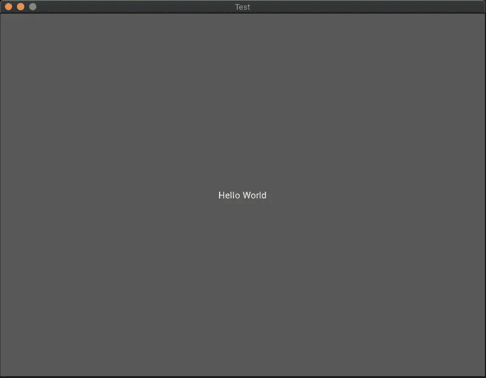
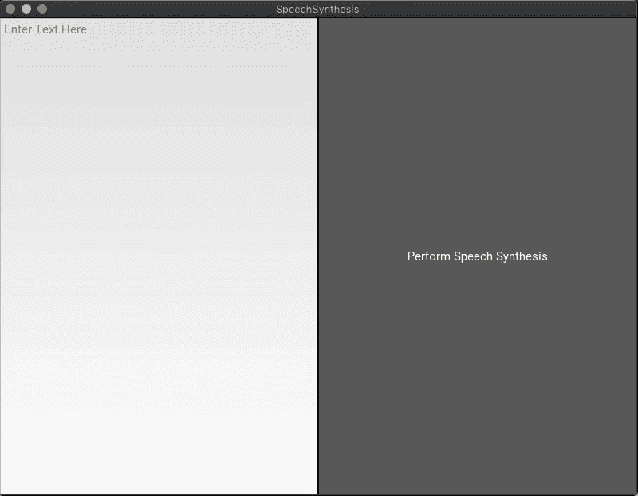

# 如何在 Python 中执行语音合成

> 原文：<https://pub.towardsai.net/how-to-perform-speech-synthesis-in-python-7784a2f43f89?source=collection_archive---------0----------------------->

## Python 中的文本到语音转换(TTS)简介，用于执行有用的任务


在 [Unsplash](https://unsplash.com?utm_source=medium&utm_medium=referral) 上由 [Michal Czyz](https://unsplash.com/@digitalmike?utm_source=medium&utm_medium=referral) 拍摄的照片

**文本到语音** (TTS)是使用软件以语音的形式创建音频输出。程序用来将页面上的文本转换成语音的音频输出的程序通常是文本到语音引擎。机器翻译结果的音频输出需要 TTS 引擎。

TTS 软件被谷歌、苹果、微软、亚马逊等重要公司广泛使用。谷歌开发了谷歌助手，苹果开发了 Siri，微软开发了 Cortana，亚马逊开发了 Alexa。所有这些先进的软件都使用了大量的 ML 技术和算法。

当你问 Siri 一些事情时，它会使用机器学习处理一个答案，然后使用 TTS，它会用语音回答你。

今天我们将不构建语音助手。相反，我们将首先介绍 Python 中的 **TTS** ，然后介绍如何创建一个可以朗读文本文件的程序。

最后，我们将把我们的文本到语音的基本功能嵌入到用 Kivy 制作的 GUI 中。

# Pyttsx3

今天，为了进行语音合成，我们将使用 [pyttsx3 python 包](https://pypi.org/project/pyttsx3/)。要通过[***pip***](https://pip.pypa.io/en/stable/)安装它，我们打开终端并键入:

```
pip install pyttsx3
```

安装了这个包之后，我们就可以开始执行文本到语音的转换了

# 第一个语音合成程序

在这一段中，我们将学习如何创建一个非常简单的 TTS 脚本，它根据给定的输入执行文本到语音转换:

这里我们:导入[pyttsx 3](https://pypi.org/project/pyttsx3/)(**Line 1**)，使用 [pyttsx3](https://pypi.org/project/pyttsx3/) 模块( **Line 2** )创建引擎对象。在**第 5/6 行，**我们对字符串进行语音合成。

相当简单！现在，在构建另一个 TTS 程序之前，让我们对这段代码做一些改进。

这里我们定义了函数，所以我们可以随时使用 TTS 在这种情况下，我们在循环中使用它。对于我们给程序的每个文本，它将对其进行语音合成。很酷，但仍然没有多大用处。

让我们看看如何应用语音合成来完成一些有用的任务。

# 有用的应用

你曾经不得不在第二天阅读那份文件吗？那份又长又无聊的文件？嗯，我不得不。

> 我们是程序员，有问题吗？解决它！

在我学会使用 TTS 后，我首先想到的是，我们之前看到的问题本可以得到解决。听东西比读东西要快得多，也轻松得多，尤其是当它很无聊或太长的时候。

因此，对于给定的文本文件，我选择使用 TTS 来听它而不是读它:

在这个简单的脚本中，我们读取了 *example.txt* 文件的内容。然后，我们使用之前讨论过的 say 函数将文本到语音应用到 *example.txt* 文件*的内容。*

## 重要的

当您使用这个脚本时，确保用您想要大声朗读的文件替换(**第 3 行**)这个 *example.txt* 文件。

# 在 GUI 中嵌入 TTS 基本功能

这一步非常重要。知道如何将程序的功能嵌入到 GUI 中真的会有所不同，即使是一个简单的 GUI。正如我在介绍段落中所说，我们将使用 [Kivy](https://kivy.org/#home) 。它是一个开源的 Python 库，允许我们快速开发具有创新图形的 GUI 应用程序。更多关于 [Kivy](https://kivy.org/#home) 的信息可以在[这里](https://kivy.org/#home)找到。

首先，让我们用它创建一个 hello-world 应用程序:

如您所见，代码非常简单:

**第 1/2 行:**导入的 Kivy.app 和 Kivy 按钮

**第 4/6 行:**创建了 TestApp 类，它返回给我们一个带有 hello world 按钮的 GUI。

**第 8 行:**运行应用程序

这个简单的脚本输出如下:



## 把...嵌入

现在，我们可以将 TTS 功能嵌入到 GUI 中:我们想要一个 GUI 应用程序，它可以针对给定的文本执行语音合成。

在这个简单的 30 行代码中，我们:

1.  导入所需模块→第 1/5 行
2.  粘贴`say()`我们在前面步骤中创建的函数→第 8/13 行
3.  构建我们的 GUI:

*   使用 [Kivy 的方框布局创建布局](https://kivy.org/doc/stable/api-kivy.uix.boxlayout.html) →第 18 行
*   生成了一个文本输入对象，我们将在这里输入我们的文本→第 19 行
*   生成一个按钮，当按下时，执行我们将在第 25 行定义的功能。→第 20 行
*   将我们生成的对象添加到布局中→第 21/22 行
*   返回带有文本输入和按钮对象的布局→第 23 行
*   定义了`self.perform()`函数，一旦按下，它将获取 TextInput 对象的文本，并使用第 8 行定义的`say()`函数对其执行 TTS。→第 25/27 行

4.执行 GUI 应用程序

执行这段代码后，您应该会看到如下输出:



通过在那里输入您的文本并单击执行语音合成按钮，应用程序将启动给定文本的 TTS。

# 结论

今天我们已经看到了 Python 中语音合成的工作原理。因此，我们在一个有用的大声朗读文档的应用程序中实现了文本到语音的转换。TTS 应用程序近年来增长显著，学习如何构建这种类型的应用程序绝对是提高编程技能的好方法。知道实现语音合成也适用于日常代码；例如，您可以在测试代码时使用 TTS 来接收在代码执行期间发生的事情的语音通知。