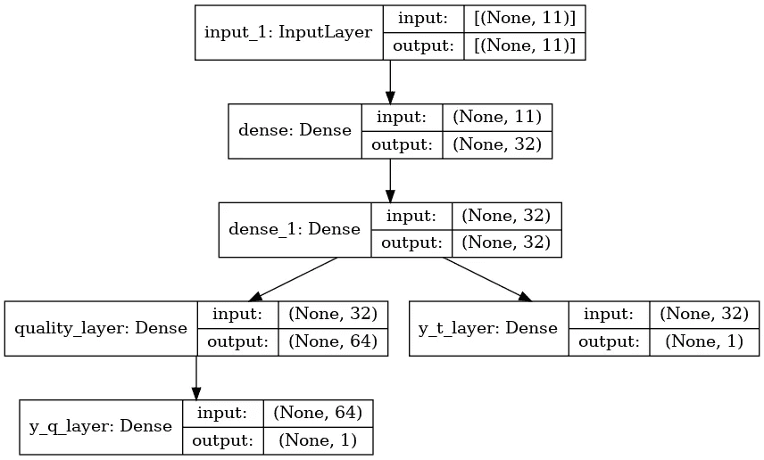
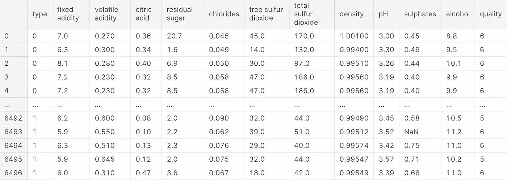

# 如何用一个模型预测多个变量？还有为什么！

> 原文：<https://pub.towardsai.net/how-to-predict-multiple-variables-with-one-model-and-why-31e6a8efc09e?source=collection_archive---------6----------------------->

## 你想节省时间和成本吗？就像创建一个能够通过相同的训练和相同的预测过程预测多个变量的模型一样简单。

在文章中，我将展示一些代码，但如果你想查看完整的代码，可以在 [Kaggle](https://www.kaggle.com/code/peremartramanonellas/guide-multiple-outputs-with-keras-functional-api) 和 [GitHub](https://github.com/oopere/TensorFlow_Advanced/blob/main/guide-multiple-outputs-with-keras-functional-api.ipynb) 上找到。在那里您可以派生、修改和执行它。

[](https://www.kaggle.com/code/peremartramanonellas/guide-multiple-outputs-with-keras-functional-api) [## 指南:使用 Keras Functional API 的多输出

### 使用 Kaggle 笔记本探索和运行机器学习代码|使用葡萄酒质量数据

www.kaggle.com](https://www.kaggle.com/code/peremartramanonellas/guide-multiple-outputs-with-keras-functional-api) 

图片由[内森·杜姆劳](https://unsplash.com/ja/@nate_dumlao?utm_source=unsplash&utm_medium=referral&utm_content=creditCopyText)在 [Unsplash](https://unsplash.com/es/s/fotos/two-ways?utm_source=unsplash&utm_medium=referral&utm_content=creditCopyText) 拍摄

当我们开始使用 TensorFlow 时，我们通常使用顺序格式通过 Keras 库创建模型。

有了序列模型，我们可以解决深度学习各个领域的很多问题。无论是图像识别或分类、自然语言处理，还是序列预测……它们都是强大到足以用于大多数问题的模型。

**但是有时我们需要在 TensorFlow 中使用 Keras。因此，我们可以使用 API 来创建模型**，这为我们打开了一个广阔的世界，提供了更多使用顺序模型时所没有的可能性。

在本文中，**我们将看到一个模型的创建，它能够使用相同的数据和相同的学习过程预测两个不同的变量**，共享大部分层。

也就是说，我们将创建一个具有两层分支的多输出模型。正如我们在图像中看到的:



该模型由一个输入层和两个密集层组成。这三层是模型的公共部分。从这里开始，模型分为两个不同的分支。在其中一个分支中，我们找到了分类变量的输出层。另一个分支由密集图层和预测回归变量的输出图层组成。

请注意，在右分支中，模型预测分类变量，而在左分支中，要预测的变量是回归变量。

在本文中，我们将只看到如何生成和执行模型。模型的数据处理和后续评估，以及如何改进的思路，可以在 [Kaggle 笔记本](https://www.kaggle.com/code/peremartramanonellas/guide-multiple-outputs-with-keras-functional-api)中找到。

# 简要介绍数据和解决的问题。

我使用了一个包含葡萄酒信息的 Kaggle 数据集。它们是表格格式的数据，有 11 列可以被认为是特性，两列是我们的标签。

作为第一个标签，我选择了葡萄酒的质量(quality)，从 0 到 9。我决定把它当作一个回归变量，而不是一个分类变量。既然是显示酒变好的变量。

第二个标签是葡萄酒的种类(type)，表示葡萄酒是白葡萄酒还是红葡萄酒。这显然是一个分类变量。



作者图片

所以，我们在一个模型中有两个不同类型的变量要预测。

看到数据集后，我们开始构建模型。

正如您所看到的，创建这种类型的模型一点也不复杂，如果我们将它与顺序模型进行比较，它会打开一个新的可能性的世界。

你在代码的注释中有所有的信息，但是我想指出一些事情。

我通常使用相同的名称作为层的内部名称和包含层的变量的名称。不仅是为了让代码更清晰，而且当我们指出损失函数和度量时，必须指出层的内部名称。当报告模型的输出时，我们必须指出包含层的变量的名称。对我来说总是用同一个名字更容易。

不同的损失函数和度量可以用于每个输出变量。

我们必须在两个列表中指出它们。一个用于损失函数，另一个用于度量，在这里我们将它们与层的名称相关联。

```
model.compile(optimizer=optimizer, 
              loss = {'y_t_layer' : 'binary_crossentropy', 
                      'y_q_layer' : 'mse'
                     },
              metrics = {'y_t_layer' : 'accuracy', 
                         'y_q_layer': tf.keras.metrics.RootMeanSquaredError()
                       }
             )
```

# 多输出模型有什么用？

我不会假装给出一个完整的答案，因为这只是我的看法，更有经验的数据科学家可以找到它们的更多用途。

在必须使用大量数据进行定期训练以预测多个变量的环境中，这种类型的模型非常有用。如果我们将其与培训两个或三个不同的模型进行比较，节省的时间可能非常显著，不仅在时间上，而且在成本上。

也广泛用于计算机视觉，特别是物体识别。一个输出是所识别的对象的类型，而另一个输出是对象在图像中的位置。

在需要重复执行大量预测且预测结果不止一个变量的环境中，它们可以节省大量时间和流程。

另一方面，它们的调整成本更高，因为，例如，更难找到对所有变量都最优的学习率。

本文是关于 TensorFlow 和 Keras 中的高级主题的系列文章的一部分，**如果您喜欢，可以考虑关注我的** [**中的**](https://medium.com/@peremartra) 以获取关于新文章的更新。当然，也欢迎你在 [**LinkedIn**](https://www.linkedin.com/in/pere-martra-0310631) 上**与我连线。**


[佩雷·马特拉](https://medium.com/@peremartra?source=post_page-----31e6a8efc09e--------------------------------)

## 张量流超越基础

[View list](https://medium.com/@peremartra/list/tensorflow-beyond-the-basics-24c4c6a844d8?source=post_page-----31e6a8efc09e--------------------------------)3 stories