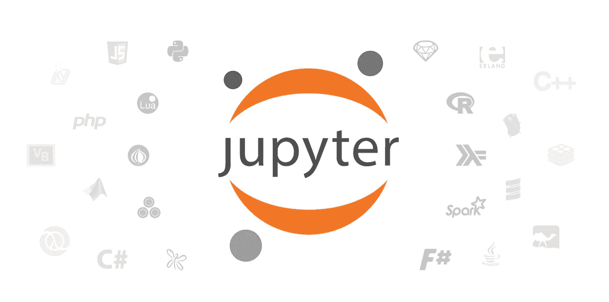
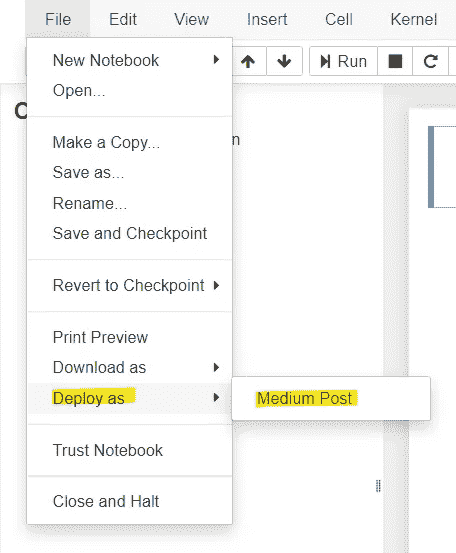
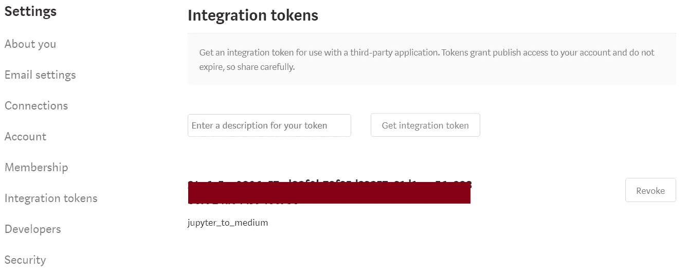
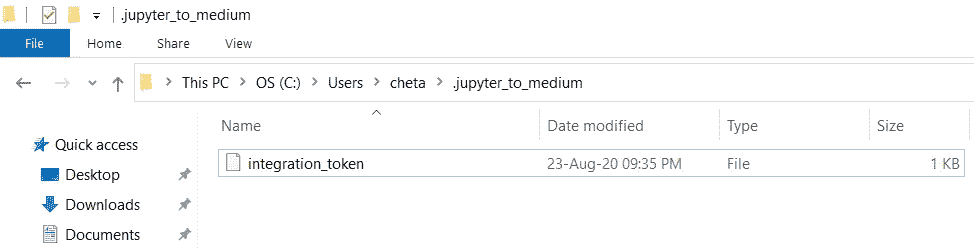
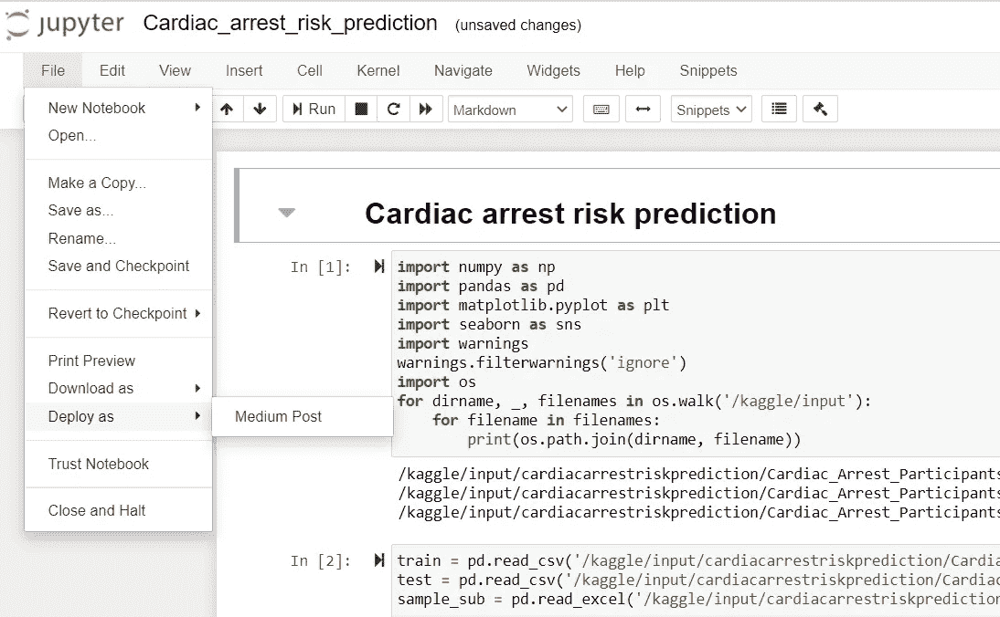
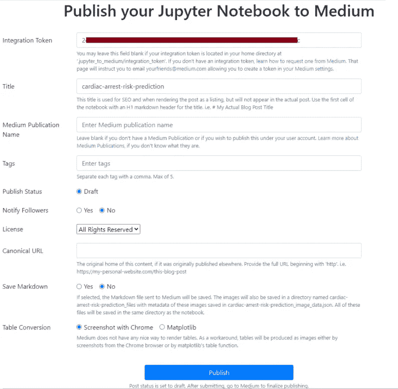
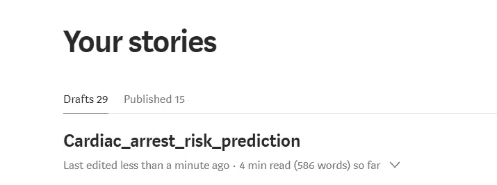

# 如何将 Jupyter 笔记本发布为媒体博客

> 原文：<https://pub.towardsai.net/how-to-publish-a-jupyter-notebook-as-a-medium-blogpost-f390d0877c9d?source=collection_archive---------0----------------------->

## [数据科学](https://towardsai.net/p/category/data-science)

## 了解如何通过 jupyter-to-medium 库将 Jupyter 笔记本作为媒体文章发布



[https://jupyter.org/](https://jupyter.org/)

我最近开始在 Medium 上写关于数据科学和 Python 的文章。在撰写任何技术文章时，一项耗时的工作就是提供支持性的可复制代码。我一直在使用 GitHub Gist，有时会使用 Jupyter Notebook 或其他 Python 编辑器中的代码截图。但是这需要时间，因为我们需要在 Medium 编辑器和 Gist 或另一个 Python 编辑器之间切换。

如果我们可以直接将 Jupyter 笔记本作为草稿导入到 Medium 中，怎么样？是的！！在最近发布的`jupyter-to-medium`库的帮助下，这是可能的。现在，我们可以开始使用 Jupyter 笔记本写故事，并可以快速导入到媒体中作为故事草稿。然后进行必要的更改，然后提交出版物。

# 装置

```
pip install jupyter_to_medium
```

安装后，通过检查如下扩展进行确认。如果它没有出现，您可以重新启动 Jupyter 笔记本，并尝试运行以下命令来手动启用扩展。

```
jupyter bundlerextension enable — py jupyter_to_medium._bundler — sys-prefix
```



作者图片

# 来自媒体的集成令牌

转到`settings` == > `Integration tokens`。然后为集成令牌提供一个描述，并单击`Get Integration token`。我用`jupyter_to_medium`来形容它。



作者图片

> 我找不到**。我的主目录中的 jupyter _ to _ medium/integration _ token '**。所以我在我的主目录下手动创建了一个 **jupyter_to_medium** 文件夹。然后，创建没有任何文件扩展名的 **integration_token** 文件，并添加来自上述步骤的 **Integration token** 。这一步很重要，因为当我们在下一步将笔记本发布到介质时，它将在此位置查找集成令牌。



作者图片

# 发布到笔记本中的媒体

有三种不同的方法可以完成这一步。你可以选择你觉得合适的选项。

## 1.使用命令行

从存储笔记本的文件夹中运行下面的命令。如果处理成功，并且在您的媒体帐户中创建了一个草稿故事，您将会看到下面的消息。

```
jupyter_to_medium “Cardiac_arrest_risk_prediction.ipynb”
```


作者图片

## 2.使用 Python 脚本

在存储要在介质上发布的原始笔记本的同一文件夹中创建一个新笔记本。接下来，运行下面的代码。

```
import jupyter_to_medium as jtm
jtm.publish('Cardiac_arrest_risk_prediction.ipynb',
            integration_token=None,
            pub_name=None,
            title=None,
            tags=None,
            publish_status='draft',
            notify_followers=False,
            license='all-rights-reserved',
            canonical_url=None,
            chrome_path=None,
            save_markdown=False,
            table_conversion='chrome'
            )
```

如果脚本已经成功执行，那么你会看到下面的消息，一个草稿故事会在你的介质帐户中创建。

## 3.使用 Jupyter 笔记本

接下来，打开你的 Jupyter 笔记本，点击如下所示的 Medium Post。



作者图片

在下一个屏幕中，提供您的集成令牌并单击 Publish。如果您已经更新了**中的令牌，您可以跳过添加集成步骤。' jupyter _ to _ medium/integration _ token '。**您可以根据需要选择更新其他字段。最后，点击发布。



作者图片

如你所见，一个名为`Cardiac arrest risk prediction`的故事草稿在我的媒体账户中创建。瞧啊。！



作者图片

# 结论

希望这篇文章对你有用。如果您想阅读关于 Python 和数据科学的有趣文章，请关注我的 Medium。

*阅读更多关于 Python 和数据科学的此类有趣文章，* [***订阅***](https://pythonsimplified.com/home/) *到我的博客*[***www.pythonsimplified.com***](http://www.pythonsimplified.com/)***。*** 你也可以通过[**LinkedIn**](https://www.linkedin.com/in/chetanambi/)**联系我。**

# 参考

[](https://github.com/dexplo/jupyter_to_medium) [## dexplo/jupyter_to_medium

### 在 jupyter_to_medium 的帮助下，直接从您的笔记本中将 Jupyter 笔记本发布为中型博客文章。你……

github.com](https://github.com/dexplo/jupyter_to_medium)