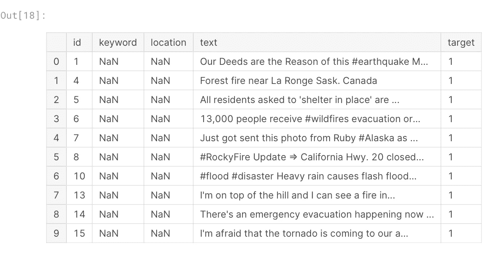
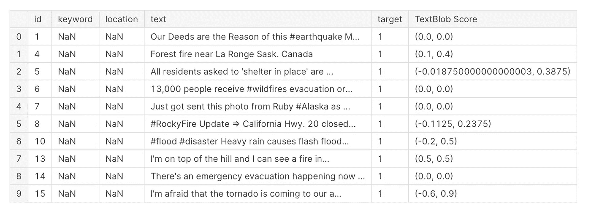
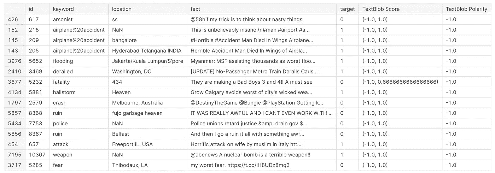

# 如何量化情感以测量量级:使用 TextBlob 的 NLP

> 原文：<https://pub.towardsai.net/how-to-quantify-sentiment-to-measure-magnitude-nlp-with-textblob-27861559f7a5?source=collection_archive---------1----------------------->


作为确定某事是积极还是消极的一部分，建立一个分析实施策略可能会很方便，通过对每个相应的开放式自由文本进行额外的定量**测量**来告知积极/消极结果(1/0)。一种方法是使用 TextBlob。

1.  安装 TextBlob 包:

`conda install -c conda-forge textblob`

2.导入熊猫和 TextBlob:

```
import pandas as pd 
from textblob import TextBlob 
```

3.引入一个数据集并把它转换成熊猫的数据框架:让我们用一个关于“灾难推特”的 Kaggle 数据集比赛的链接可以在这里找到:[https://www . ka ggle . com/competitions/NLP-getting-started/data？select=train.csv](https://www.kaggle.com/competitions/nlp-getting-started/data?select=train.csv) 。我将导入“train.csv”文件:

```
trainsub=pd.read_csv('/kaggle/input/nlp-getting-started/train.csv')
trainsub.head(10)
```



```
print(trainsub.shape)
(7613, 5)
```

4.创建一个新列，打印基于 TextBlob 的定量分数。该栏将包括(1)极性和(2)主观性得分。

```
*#iterate in rows for TextBlob scores for both polarity and subjectivity scores*
measurements_blob=[]

for x **in** range(0,trainsub.shape[0]):
    QuantTextBlob=TextBlob(trainsub.iloc[x][3])
    measures=QuantTextBlob.sentiment
    measurements_blob.append(measures)

trainsub["TextBlob Scores"]=measurements_blob *#add new column to DF*
```

5.查看更新的。csv 文件:

```
trainsub.head(10)
```



6.创建另一个新列，只打印极性分数。简单地或以更复杂的方式做这件事是有变化的；这里的目的是展示不同的、独立的 Python 代码，以告知此类用例。

```
measurements2_blob=[]

for x **in** range(0,trainsub.shape[0]):
    QuantTextBlob2=TextBlob(trainsub.iloc[x][3])
    measures2=QuantTextBlob2.sentiment.polarity *#add polarity*
    measurements2_blob.append(measures2)

trainsub["TextBlob Polarity"]=measurements2_blob *#add new column to DF*
```

7.查看更新的。csv 文件:



使用案例:

让我们假设你建立了一个机器学习模型，它可以告知某样东西是正的(1)还是负的(0)。为了实现这个构建的结果，您依赖于一个机器学习实现。这种实现允许您训练和测试您的数据。在部署模型之前，您进行了模型验证，以评估模型在预测 1 或 0 时的性能。

非常关注和强调对这种模型进行微调，这种模型专门用于相应的数据，而不是应用*多个*模型来通知原始模型。通过引入另一种 NLP 功能，如 TextBlob 管道，您可以进一步管理您的方法，更精确地确定某事是积极的还是消极的。怎么会？

负面情绪可能仅仅反映了自由文本是负面的(虽然它是假正面的:它不是关于自然灾害的——对于这个 Kaggle 用例的目的来说),或者是正面的，以开始通知某事是否确实更有可能是正面的或负面的。与此同时，你有机会训练你的机器学习模型在预测真或假阳性的实际发生时的准确性。两件不同的事情，需要两种不同的方法(如果你正在探索引入额外的模型来通知情绪幅度测量)。

例如:

**推文**:天空着火了！(并上传了一张天空的照片，照片中的云呈现出红色)

```
Testing**=**TextBlob("The sky is on fire, the clouds are so scary looking, and I am scared!!!")
print(Testing.sentiment)Sentiment(**polarity=-0.9765625,** subjectivity=1.0)
```

这是自然灾害吗？ **No (0)**
这是否定的吗？也许，也许，很可能——正因为如此，这就是我们试图预测的原因——因此，是的:因此，你看到的极性得分是-0.98(范围是-1.0 到 1.0 到 1.0)。)

通常，情绪代表积极和消极的严重性，但它们绝对不是真正积极的迹象。如果您的用例可以进一步接收定量结果来通知您的机器学习管道，那么在确定这种严重性方面有一席之地。