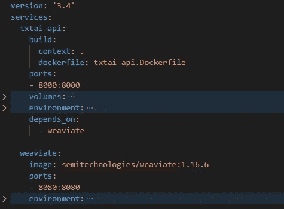
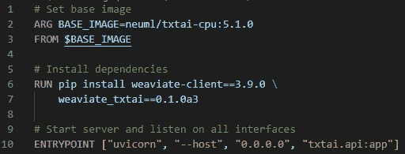
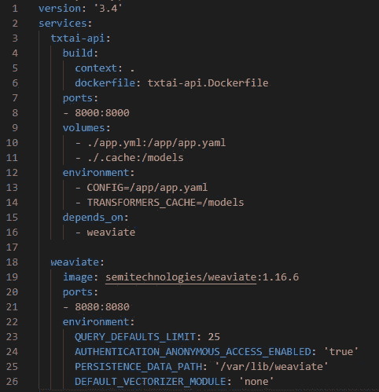

# 如何用 txtai 和 Weaviate 快速构建语义搜索系统

> 原文：<https://pub.towardsai.net/how-to-quickly-build-a-semantic-search-system-with-txtai-and-weaviate-fd4084e93aaa?source=collection_archive---------1----------------------->

## weaviate-txtai 图书馆简介



# 介绍

在本文中，我将解释如何使用 docker compose 和以下工具/库快速构建基于机器学习的语义搜索引擎:

1.  [txtai](https://github.com/neuml/txtai) :一个运行机器学习工作流来转换数据和构建人工智能支持的语义搜索应用的框架。
2.  [weaviate](https://github.com/semi-technologies/weaviate) :矢量搜索引擎
3.  txt-weaviate :一个小的库，使 weaviate 与 txtai 的集成变得容易

重现这个解决方案的代码可以在[这里](https://github.com/hsm207/txtai-weaviate-docker-compose)找到。

# 设置

我们只需要按照 3 个步骤开始:

*   步骤 1:为 txtai API 服务器定义映像
*   步骤 2:定义 txtai 配置
*   步骤 3:使用 docker compose 进行部署

## 步骤 1:为 txtai API 服务器定义映像

txtai API 服务器需要一些库才能与 weaviate 交互。我们可以使用由 [neuml](https://hub.docker.com/u/neuml) 提供的图像之一作为起点:



图 1:为 txtai API 服务器构建定制的容器

正如我们在图 1 中看到的，我们需要的唯一额外依赖项是 [weaviate-client](https://pypi.org/project/weaviate-client/) 和 [weaviate_txtai](https://pypi.org/project/weaviate-txtai/) 包。

## 步骤 2:定义 txtai 配置

我们将使用 txtai 的[工作流](https://neuml.github.io/txtai/workflow/)特性来构建语义搜索引擎。

我们只需要两个工作流，即`index`和`search`。下面是我们如何使用 yaml 文件定义这些工作流:

```
embeddings:
  path: sentence-transformers/all-MiniLM-L6-v2

nop:

weaviate_txtai.client.Weaviate:
  url: http://weaviate:8080

workflow:
  index:
    batch: 2500
    tasks:
    - action: [nop, transform]
      unpack: False
    - action: weaviate_txtai.client.Weaviate
      unpack: False
  search:
    tasks:
    - action: transform
    - action: weaviate_txtai.client.Weaviate
      args: [search]
```

上面的配置使用拥抱脸的模型中枢中的[句子-变形金刚/all-MiniLM-L6-v2](https://huggingface.co/sentence-transformers/all-MiniLM-L6-v2) 模型将文本转换为嵌入内容(在搜索和索引期间)。

## 步骤 3:使用 docker compose 进行部署

这是构建和部署语义搜索引擎的整个 docker 合成文件:



图 2:部署语义搜索引擎的 docker 合成文件

关于`txtai-api`服务需要注意的要点是:

1.  我们将在上一步中定义的工作流配置文件挂载到容器中的`/app/app.yaml`(第 10 行)
2.  我们还挂载一个文件夹来缓存模型、数据集等。这是从 Hugging Face 的模型中心下载的，这样我们就不必在每次重启容器时重新下载它们(第 11 和 14 行)

用`docker-compose up`调出这些服务。

# 使用

让我们使用`[ag_news](https://huggingface.co/datasets/ag_news)`数据集来展示语义搜索系统的价值。

## 索引

这是一个简单的脚本，使用数据集库下载`ag_news`数据集，然后使用 txtai API 服务器的`index`工作流端点将其上传到 weaviate:

```
from datasets import load_dataset
import requests

URL = "http://localhost:8000"

ds = load_dataset("ag_news", split="train")

payload = {
    "name": "index",
    "elements": ds["text"]
}

r = requests.post(f"{URL}/workflow", json=payload)
```

## 搜索

现在我们可以使用 txtai API 服务器的`search`工作流对我们索引的数据运行一些查询。

由于数据集是关于来自 2，000 多个新闻来源的新闻文章，让我们尝试以下查询:

*   关于德国的金融新闻
*   关于德国的体育新闻
*   德国健康新闻

这次让我们使用`curl`来执行查询，使用`jq`来解析输出:

```
curl --request POST \
  --url http://localhost:8000/workflow \
  --header 'content-type: application/json' \
  --header 'user-agent: vscode-restclient' \
  --data '{"name": "search", 
           "elements": [
              "Financial news about Germany", 
              "Sports news about Germany", 
              "Health news about Germany"
              ] 
            }' | \
  jq '.[] | .data.Get.Document | .[0].content' 
```

## 结果

这些是上一节中`curl`请求的结果:

1.  “德国官员的增长前景更好(美联社)美联社——德国金融专业人士对该国的经济增长前景变得不那么悲观，但仍然担心欧元对美元的创纪录高位将拖累出口，周二的一项月度调查显示。"
2.  “斗篷和匕首多特蒙德那些试图通过检查德国媒体来了解德甲联赛的人将度过令人困惑的一周，因为很少有人谈论足球。”
3.  一项调查显示，在欧洲，德国、荷兰和芬兰的员工请病假最多

很明显，第一、第二和第三个结果分别是关于德国的金融、体育和健康新闻。

第二个和第三个查询的结果特别值得注意，因为它们不包含各自查询中的任何单词(除了“德国”)，但从语义上来说，它们是“正确的”。

这说明了机器学习驱动的语义搜索系统的关键优势:我们不再需要构建手工制作的功能来提取用户查询背后的意义。

# 结论

本文展示了如何使用 txtai 和 weaviate 快速开始构建语义搜索引擎。我希望这激发了您对这项技术的好奇心，并期待看到您将构建什么样的应用程序！