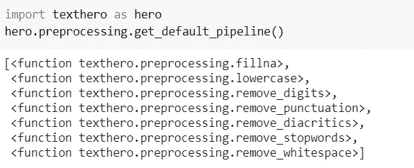
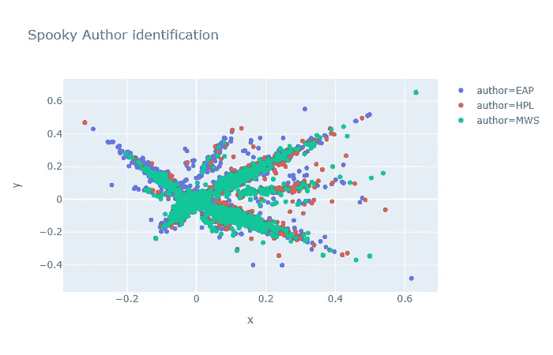
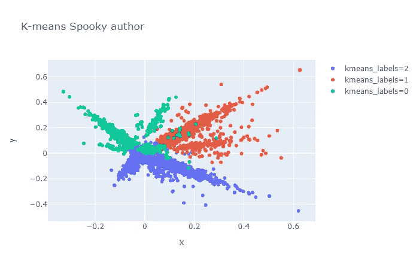
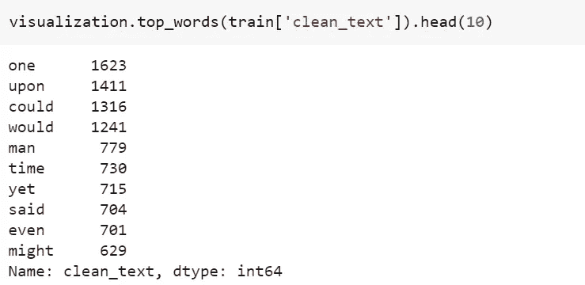

# 如何用 TextHero 快速预处理和可视化文本数据

> 原文：<https://pub.towardsai.net/how-to-quickly-preprocess-and-visualize-text-data-with-texthero-c86957452824?source=collection_archive---------1----------------------->

## [自然语言处理](https://towardsai.net/p/category/nlp)

## TextHero 库简介，用于快速预处理和可视化 Python 中的文本数据


照片由[丘特尔斯纳普](https://unsplash.com/@chuttersnap)在 [Unsplash](https://unsplash.com/photos/PVO_tj2APuM) 上拍摄

当我们在任何 NLP 项目或比赛中工作时，我们会花大部分时间对文本进行预处理，如删除数字、标点符号、停用词、空格等，有时还会进行可视化。在对几个 NLP 数据集进行实验之后，我发现这个库对于预处理和可视化非常有用。这将为我们节省一些编写自定义函数的时间。你不兴奋吗！！？所以让我们开始吧。

我们将把本文中将要学习的技术应用于 Kaggle 的`Spooky Author Identification`数据集。你可以在这里找到数据集[。文章末尾给出了完整的代码。](https://www.kaggle.com/c/spooky-author-identification/data)

> 注意:TextHero 仍处于测试阶段。该图书馆可能会发生重大变化。因此，下面的一些代码片段或功能可能会发生变化。

# 装置

```
pip install texthero
```

# 预处理

顾名思义`clean`是用来清理文字的方法。默认情况下，`clean`方法对文本应用 7 个`default pipelines`。

```
from texthero import preprocessing
df[‘clean_text’] = preprocessing.clean(df[‘text’])
```

1.  菲尔娜
2.  小写字母
3.  移除数字()
4.  删除标点符号()
5.  移除 _ 音调符号()
6.  remove _ 停用字词()
7.  remove _ white 空格()

我们可以通过下面的代码来确认使用的默认管道:



除了上面的 7 个默认管道，`TextHero`还提供了更多我们可以使用的管道。参见完整列表[此处](https://texthero.org/docs/api-preprocessing)的描述。这些是非常有用的，因为我们在文本预处理过程中处理所有这些。

根据我们的要求，我们还可以定制管道，如下所示。在这个例子中，我们使用了两条管道。但是，我们可以使用任意多的管道。

```
from texthero import preprocessing custom_pipeline = [preprocessing.fillna, preprocessing.lowercase] df[‘clean_text’] = preprocessing.clean(df[‘text’], custom_pipeline)
```

# 自然语言处理

到目前为止，这个 NLP 功能只提供了`named_entity`和`noun_phrases`方法。请参见下面的示例代码。由于`TextHero`还在测试中，我相信，以后会有更多的功能加入。

**命名实体**

```
s = pd.Series(“Narendra Damodardas Modi is an Indian politician serving as the 14th and current Prime Minister of India since 2014”)print(nlp.named_entities(s)[0])**Output:**
[('Narendra Damodardas Modi', 'PERSON', 0, 24),  
('Indian', 'NORP', 31, 37),  
('14th', 'ORDINAL', 64, 68),  
('India', 'GPE', 99, 104),  
('2014', 'DATE', 111, 115)]
```

**名词短语**

```
s = pd.Series(“Narendra Damodardas Modi is an Indian politician serving as the 14th and current Prime Minister of India since 2014”)print(nlp.noun_chunks(s)[0])**Output:**
[(‘Narendra Damodardas Modi’, ‘NP’, 0, 24), 
(‘an Indian politician’, ‘NP’, 28, 48), 
(‘the 14th and current Prime Minister’, ‘NP’, 60, 95), 
(‘India’, ‘NP’, 99, 104)]
```

# 表现

此功能用于将文本数据映射到`vectors` (词频，TF-IDF)，映射到`clustering` (kmeans，dbscan，meanshift)，还映射到`dimensionality reduction` (PCA，t-SNE，NMF)。

让我们看一个例子，在幽灵作者识别数据集上有`TF-TDF`和`PCA`。

```
train['pca'] = (
    train['text']
    .pipe(preprocessing.clean)
    .pipe(representation.tfidf, max_features=1000)
    .pipe(representation.pca)
)visualization.scatterplot(train, 'pca', color='author', title="Spooky Author identification")
```



# 形象化

该功能用于绘制**散点图**、**单词云**，也用于从文本中获取**前 n 个单词**。参考下面的例子。

**散点图示例**

```
train['tfidf'] = (
    train['text']
    .pipe(preprocessing.clean)
    .pipe(representation.tfidf, max_features=1000)
)train['kmeans_labels'] = (
    train['tfidf']
    .pipe(representation.kmeans, n_clusters=3)
    .astype(str)
)train['pca'] = train['tfidf'].pipe(representation.pca)visualization.scatterplot(train, 'pca', color='kmeans_labels', title="K-means Spooky author")
```



## Wordcloud 示例

```
from texthero import visualization
visualization.wordcloud(train[‘clean_text’])
```


## 热门词汇示例



# 完全码

# 结论

我们已经完成了`TextHero`提供的大部分功能。除了 NLP 功能，我发现其余的功能都非常有用，我们可以在下一个 NLP 项目中尝试使用它们。

*阅读更多关于 Python 和数据科学的此类有趣文章，* [***订阅***](https://pythonsimplified.com/home/) *到我的博客*[***www.pythonsimplified.com******。*** 你也可以在](http://www.pythonsimplified.com/)[**LinkedIn**](https://www.linkedin.com/in/chetanambi/)**上联系我。**

# 参考

[](https://github.com/jbesomi/texthero) [## JB osmi/text hero

### 从零到英雄的文本预处理、表示和可视化。从零到英雄*安装*获取…

github.com](https://github.com/jbesomi/texthero)