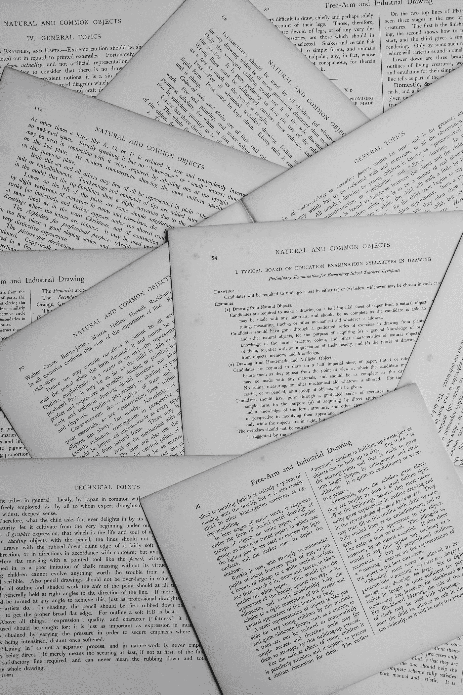

# 如何有效阅读机器学习论文

> 原文：<https://pub.towardsai.net/how-to-read-machine-learning-papers-effectively-9c2df7906516?source=collection_archive---------0----------------------->

机器和深度学习领域发展非常快，每天都有新的研究成果。因此，你将需要阅读论文，以便与该领域的新算法和技术保持同步。阅读研究论文非常重要，因为它可以增加你的知识，让你对某个主题有更深的理解，是保持你所在领域领先地位的关键因素，尤其是如果你是一名研究人员。吴伟雄说:

> 如果你读了某个主题的 5 -20 篇论文，比如物体检测，你会对它有一个基本的了解，而如果你读了 50 -100 篇论文并理解了其中的大部分，你会对某个领域有很好的了解，甚至可能掌握它。

因此，对于每个机器学习研究人员或从业者来说，养成阅读研究论文的习惯并能够有效地做到这一点至关重要。在这篇文章中，我将讲述如何有效和高效地阅读一篇研究论文，而不失去兴趣或投入太多时间和精力而没有任何好处。

由[安妮·斯普拉特](https://unsplash.com/@anniespratt?utm_source=medium&utm_medium=referral)在 [Unsplash](https://unsplash.com?utm_source=medium&utm_medium=referral) 上拍摄

## 目录:

1.  你为什么阅读研究论文
2.  探索一篇研究论文
3.  增长你的知识
4.  应用
5.  建立在
6.  结束语
7.  参考

**如果你想免费学习数据科学和机器学习，看看这些资源:**

*   免费互动路线图，自学数据科学和机器学习。从这里开始:[https://aigents.co/learn/roadmaps/intro](https://aigents.co/learn/roadmaps/intro)
*   数据科学学习资源搜索引擎(免费)。将你最喜欢的资源加入书签，将文章标记为完整，并添加学习笔记。[https://aigents.co/learn](https://aigents.co/learn)
*   想要在导师和学习社区的支持下从头开始学习数据科学吗？免费加入这个学习圈:[https://community.aigents.co/spaces/9010170/](https://community.aigents.co/spaces/9010170/)

**如果你想在数据科学&人工智能领域开始职业生涯，但你不知道如何开始。我提供数据科学指导课程和长期职业指导:**

*   长期指导:[https://lnkd.in/dtdUYBrM](https://lnkd.in/dtdUYBrM)
*   辅导会议:[https://lnkd.in/dXeg3KPW](https://lnkd.in/dXeg3KPW)

***加入*** [***中等会员***](https://youssefraafat57.medium.com/membership) ***计划，只需 5 美元，继续无限制学习。如果你使用下面的链接，我会收到一小部分会员费，不需要你额外付费。***

# 1.你为什么阅读研究论文

阅读机器学习论文变得越来越重要，不仅对于研究人员，而且对于每个机器学习实践者。随着该领域研究的发展，如果不定期阅读研究论文，就很难跟踪该领域的新发现和算法。

埃文·丹尼斯在 [Unsplash](https://unsplash.com?utm_source=medium&utm_medium=referral) 上拍摄的照片

我们可以将阅读研究论文的目的分为四大类:

*   **探索论文:**这是决定这篇论文是否是你要找的。这一步通常是第一步，除非你因为某个推荐或作者或实验室而对论文感兴趣。
*   增加你的知识/保持更新:阅读论文的另一个目的是增加你的知识和保持更新。这是非常重要的，尤其是在你的研究领域或专业领域(总结，并保存在数据库或树中，这样你可以很容易地在那之后返回)。
*   **应用:****阅读研究论文的第三个目的是将论文中的算法应用到你的研究工作或实际项目中。这是一个非常常见的目的，在你的职业生涯中，你会需要很多，尤其是如果你在研究岗位上工作。**
*   **阅读研究论文的最后一个常见目的是在此基础上建立你的研究。如果你是一名研究人员，这是很常见的。这将需要对研究和模型的架构有深刻的理解，以便能够实现它，并对数学有很好的理解。**

**这是你阅读论文的共同目的。让我们来探索每一种方法，看看实现每一种方法的最佳途径是什么。**

# **2.探索一篇研究论文**

**阅读研究论文的第一个方法是探索它，并决定你是否应该继续下去。在这里你要决定它是否是一篇适合你的项目的好论文。此外，如果你正在阅读，是否会引起你的兴趣，以保持更新或增加你在某个主题上的知识。**

**不好的方法是从第一个词读到最后一个词，因为这将消耗太多的时间和精力，所以你将无法浏览大量的论文，最终你将花费太多的时间而没有任何产出。然而，更好的策略是有两个通道:**

*   **第一遍，阅读标题、摘要和数字(论文的关键数字)**
*   **第二遍:再次仔细阅读引言、结论和图表，并略读其余部分。因为它们很好地概括了论文的内容。如果你正在研究这个主题，并且有很好的背景知识，可以浏览相关的作品。但是，如果你不是，就很难理解这一节。值得注意的是，有时作者会将审稿人的论文放在这一部分，以增加他们被接受的概率。**

**现在你可以决定是否要看报纸了。这一步应该是所有阅读目的的共同步骤，除非你因为任何原因必须阅读一篇论文。**

# **3.增长你的知识**

****

**金伯利农民在 [Unsplash](https://unsplash.com?utm_source=medium&utm_medium=referral) 上拍摄的照片**

**阅读论文的第二个目的是增加你的知识，并与新算法和研究成果保持同步。这对每一个机器学习从业者来说都是非常重要的。你应该先做上一节讨论的论文探索，略读论文，然后决定是否继续阅读。如果你决定阅读它，你可以遵循以下策略，以确保从文章中获得最大收益:**

1.  ****慢慢来:****

*   **它们很复杂，要花很多年才能写出来，不要指望在短时间内就能掌握它们。**
*   **这会让这个过程更容易，降低你的期望值。**

**2.**从摘要、结论、数据和结果部分开始:****

*   **摘要:它会给你一个论文的概述，让你知道它的目的，以及它是否新颖。还有，你会看一下关键词，就知道是不是你要找的。**
*   ****结论:**更好地理解主要成果、未来工作及其成果的意义。**
*   ****数据:**你会知道用来得到论文中结果的数据，以及用来训练论文中使用的模型的数据。**
*   ****结果:**与其他基准测试相比，以及与执行相同任务的著名模型相比，该模型有何改进。**

**这将很好地概述论文、其目标、所用数据和结果。完成此过程后，尝试回答这些问题，以确保您理解了本文:**

*   **作者试图完成什么？**
*   **关键要素是什么？**
*   **自己能用什么？**
*   **您还想关注哪些参考资料？**

# **4.应用**

****

**在 [Unsplash](https://unsplash.com?utm_source=medium&utm_medium=referral) 上 [Magnet.me](https://unsplash.com/@magnetme?utm_source=medium&utm_medium=referral) 拍照**

**你阅读论文的第三个目的是将它应用到你的项目中。这通常发生在前两个目的之后。所以通常，你首先要研究这篇论文，以确保它适合你的项目，并涵盖你所期待的内容，然后按照上一节讨论的方法，对论文中的主要概念有一个很好的理解。现在是时候将论文中的算法应用于您项目中的数据了。你可以这样做:**

****1。检查纸张数据和代码的可用性:****

**看一下 [**代码为**](https://paperswithcode.com/) 的论文网站，看看这篇论文的代码和数据有没有。也可以在 GitHub 和 Kaggle 中搜索纸质实现。找到纸面实现将使这个过程变得更容易，因为它将有助于理解它是如何构建的，并且如果您想要在它的基础上构建，尤其是如果您想要在新数据上使用它，它将对您有所帮助。这将为你节省大量时间。**

****2。隔离模型的构建方式****

**如果论文中没有可用的代码，您将需要从头开始实现模型。您可以通过以下方式实现这一点:**

*   ****模型架构:**几乎每篇论文都会有架构图。理解这一点将有助于更好地理解模型是如何工作的以及它在做什么**
*   ****输入&输出:**了解模型的输入和输出将使您更好地了解模型及其功能。查看输出，无论是概率、分割图、包围盒等等**
*   ****新的或新颖的图层:**看一下模型中使用的新技术或图层将非常有助于了解本文的新增内容。除此之外，本文的代码或实现可能会关注这些新的层。因此，您应该对这些新层有很好的理解，以便能够实现它们。**
*   ****损失计算:**在文中，会有一个数学公式说明损失是如何计算的。在实施之前注意和理解这一点很重要，因为它会影响您的结果。此外，你需要了解它是根据什么选择的，因为它会影响你，因为你可能需要改变它以适应你的项目。**
*   ****模型训练:**了解如何训练模型和使用超参数、批量大小和模型配置**

****3。知道自己不懂的内容****

*   **突出你不理解的需要进一步阅读或研究的地方。研究论文是建立在彼此之上的。所以，期望你对所读论文有一定的背景和相关知识。突出并记下你不理解的地方，并寻找对你有帮助的参考资料和资源，它们可能已经在你正在阅读的论文中被引用了。**

****4。尝试一下****

*   **要真正理解该模型，您应该在纸面数据(如果可用的话)上训练该模型，并在可能的情况下尝试复制结果。这将有助于理解模型是如何工作的，还将培养您构建自定义图层和开发适合您的任务和数据的自己的损失度量的技能。**
*   **有时，即使数据可用于对整个数据重新训练模型，这也会很困难，因为这将花费太多时间，所以您可以仅对数据的子集应用模型，以确保实现的模型按预期工作，然后您可以将它应用到您的数据。**

****5。将其应用于您的数据****

*   **最后一步是将模型应用于您的数据。您可以应用与本文中相同的模型而不做任何修改，或者您可能需要修改它以适合您的项目或将其应用于您的数据。**

# **5.建立在**

****

**由 [Andrik Langfield](https://unsplash.com/@andriklangfield?utm_source=medium&utm_medium=referral) 在 [Unsplash](https://unsplash.com?utm_source=medium&utm_medium=referral) 上拍摄的照片**

**阅读论文的最后一种方式或目的是在此基础上产生新的研究成果。当然，你的研究将基于大量的论文，但主要思想可能建立在某项研究的某篇论文上。有时，您可能处理类似的任务和数据，并希望改善结果，或者您可能需要优化某个模型或架构，或者在新任务中使用某个模型。在这种情况下，你需要对论文有深刻的理解。解决这个问题的最好方法是遵循前面的三种方法，然后从头开始推导模型的数学。这可能很难，但这将是确保您已经很好地理解了模型并能够在此基础上构建和改进它们的最佳方式。**

# **6.结束语**

**永远记住**稳步**胜过**临时抱佛脚**。每周阅读两到三篇研究论文比在漫长的周末或假期阅读大量论文要好。**

**如果你想在不熟悉核心概念的情况下阅读一篇研究论文:**

*   **如果你是这个领域的新手，或者对这个主题没有预先的了解，你可以遵循研究链。阅读引言和背景部分中的参考文献(如果有的话),这将有助于你理解所需的和缺少的背景知识。**
*   **谷歌和阅读未知的关键字或主题。**
*   **理解数学方程式，寻找数学符号和研究区域的生态系统。**

**最后，这里有一些查找研究论文和了解最新研究成果的资源:**

*   **Twitter(关注研究人员、研究实验室和大学)**
*   **商务化人际关系网**
*   **机器学习子编辑**
*   **顶级会议，如 NIPS/ICML/ICLR**
*   **关系、同事和朋友**

# **7.参考**

1.  **[**阅读吴恩达的研究论文**](https://www.youtube.com/watch?v=733m6qBH-jI)**
2.  **[掌握 ML 试卷而不丢掉你的 Sh*t](https://www.youtube.com/watch?v=JuG6ZcNe_3Q)**
3.  **[我如何阅读和组织学术(机器学习)论文](https://www.youtube.com/watch?v=CvptMsQ5PHc)**

***感谢阅读！如果喜欢文章，一定要鼓掌(最多 50！)并在*[*LinkedIn*](https://www.linkedin.com/in/youssef-hosni-b2960b135/)*上与我联系，并在* [*上关注我，以了解我的新文章*](https://youssefraafat57.medium.com/)**

** [## 加入我的介绍链接媒体-优素福胡斯尼

### 阅读 Youssef Hosni(以及媒体上成千上万的其他作家)的每一个故事。您的会员费直接支持…

youssefraafat57.medium.com](https://youssefraafat57.medium.com/membership)**