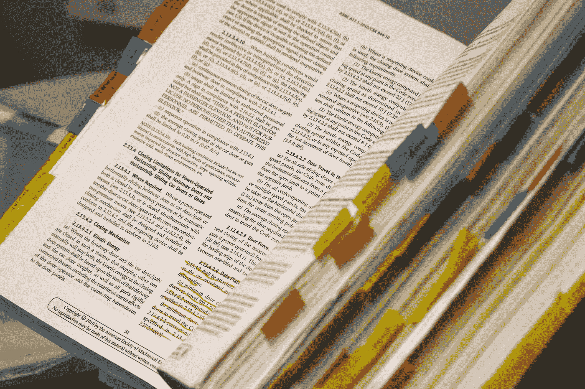
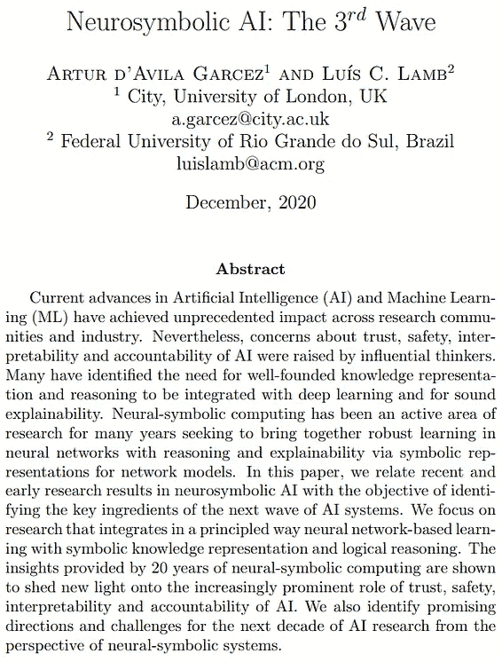
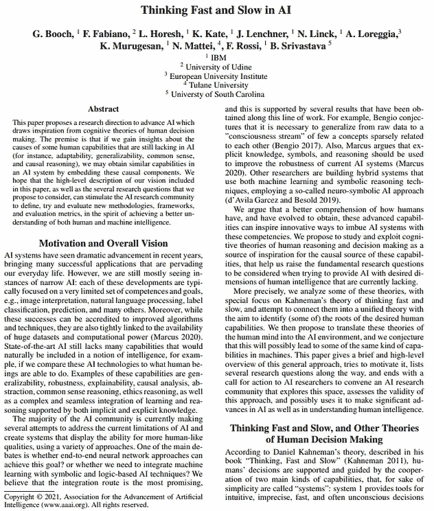
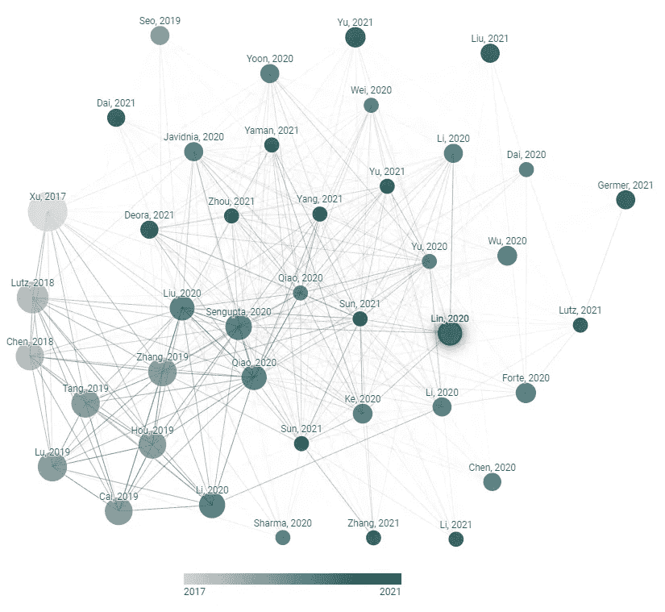
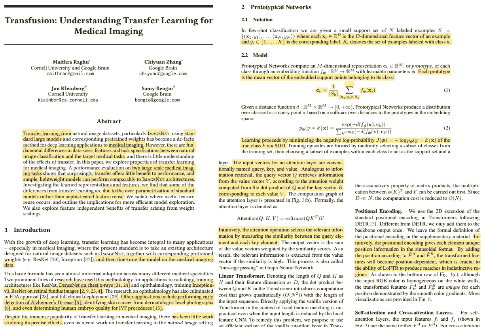
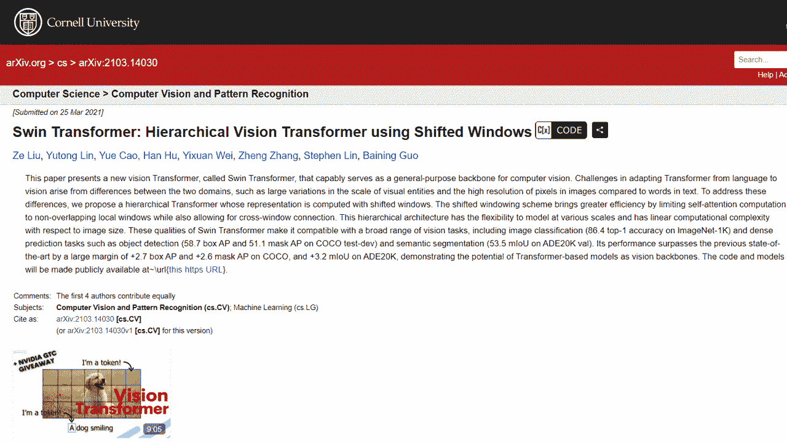

# 每个机器学习从业者应该使用的最佳工具

> 原文：<https://pub.towardsai.net/how-to-read-more-research-papers-7737e3770d7f?source=collection_archive---------0----------------------->

## [研究](https://towardsai.net/p/category/research)

## 你读研究论文吗？乍一看可能会让人不知所措，但是下面的方法可以让它变得更加友好和高效。

> 原载于 [louisbouchard.ai](https://www.louisbouchard.ai/research-papers/) ，前两天在[我的博客](https://www.louisbouchard.ai/research-papers/)上看到的！

照片由[拉斯沃德](https://unsplash.com/@rssemfam?utm_source=medium&utm_medium=referral)在 [Unsplash](https://unsplash.com?utm_source=medium&utm_medium=referral) 上拍摄

两年前，我不得不阅读我的第一篇研究论文。我记得它看起来有多旧，里面的数学是多么令人沮丧。这看起来确实像研究人员在电影中所做的工作。公平地说，这张纸是上世纪 50 年代的，但从那以后就没怎么变过。快进到今天，在去年阅读了几百篇论文，试图跟上计算机视觉的新闻之后，我获得了很多阅读它们的经验。尽管如此，我知道第一次阅读是多么令人难以接受，尤其是第一次阅读你的第一篇研究论文。这就是为什么我想分享我的最佳技巧和实用工具，我每天用它们来简化我的生活，在寻找和阅读有趣的研究论文时更有效率。

## 如何找到适合自己的论文？

在阅读研究论文之前，你必须找到一个。因此，我将分享一些我在为我的用例或我正在制作的视频寻找有趣的论文时使用的工具。如果你想了解阅读技巧，请直接进入下一部分！

首先，你需要一个话题。假设你想研究变形金刚如何应用于计算机视觉。然后，考虑到这个话题，我会使用 [42 篇论文](https://42papers.com/search?q=vision%20transformer)或 [Arxiv Sanity](http://www.arxiv-sanity.com/search?q=vision+transformer) 和[type in " vision transformers "](http://www.arxiv-sanity.com/search?q=vision+transformer)来收集一些论文。这两个网站都收集了令人惊叹的 Arxiv 论文，为你的生活提供便利。假设你有一个特定的任务，比如“图像抠图”，这是指去除图片的背景，只留下感兴趣的对象作为前景。在这种情况下，您可以直接使用代码为的[论文，就像我在这里使用](https://paperswithcode.com/task/image-matting)[的](https://paperswithcode.com/task/image-matting)一样，这非常有用，可以为您想要解决的任务提供当前最好的论文及其代码实现。同样，我会选择一些最好的论文来完成这项任务。

如果你心中没有一个主题，你可以很容易地在这些神奇的工具中选择一篇有趣的论文:我刚刚讨论的 42 篇论文或显示 Twitter 上所有趋势论文的日报。这是非常酷的！

## 我有几篇研究论文要看，现在怎么办？

最近看的一些很有意思的研究论文，强烈推荐阅读。

现在你的阅读清单上已经有几篇研究论文了，请不要一篇一篇看完。相反，我邀请你试试我的方法，它可以节省你很多时间。

首先，我会检查参考文献，确认论文是否值得一读。如果只是一些不恰当的引用，这不是一个好现象。同样，帮助判断一篇文章是否值得一读的一个快速提示是可视化引用。要做到这一点，你可以使用一个叫做 [Connected Papers](https://www.connectedpapers.com/) 的神奇工具，它绘制出你的论文的所有来源之间的联系，只给出论文的名称。这太酷了！如果它们相互关联且广为人知，就有可信度。当然，这只是对一篇论文是否有趣和制作精良的一个快速指示，因为它表明它花了时间来研究当前的方法和调查它们。但是你不应该只根据论文被引用的次数来判断它，因为[“不可复制的出版物被引用的次数比可复制的多，”](https://advances.sciencemag.org/content/7/21/eabd1705)而可复制性是质量的一个明确衡量标准。

CVPR2021 **最佳学生论文荣誉奖**[实时高分辨率背景抠图](https://arxiv.org/abs/2012.07810)的连接论文图

一旦它通过了第一个测试，并且有可信的引用，你就通过了所有论文的第一关:阅读标题、摘要、关键词和结论。看看它们是否真的是你想要的。它会给你一个关于这篇文章的基本概念，并帮助你决定是否要继续读下去。

第二，再做一遍！这一次，再深入一点。看图表，阅读它们的标题。也可以快速浏览简介和相关著作，看看是否觉得有趣，做得好，但不要马上一头扎进方法和实验中。这需要时间去消化和理解。你需要确定这是适合你的论文。这第二遍将帮助你获得论文的清晰，到那时，你已经能够总结它和结果了。

既然你知道这是给你的报纸，名单一定缩小了。唯一剩下的事情就是阅读那些第三次通过的论文！第三步很明显:你读报纸。但是不要只是读它。**潜进去**。拿起你的铅笔、荧光笔或批注工具，开始默默地阅读。对于这一点，我个人更喜欢直接打印它们，并在实际的纸张上进行注释。尽管如此，我还是过渡到呆在电脑屏幕上使用 PDF 阅读器工具 Adobe Acrobat Reader 来高亮显示、绘制和评论 PDF。我默认使用这个工具，我喜欢它，但是如果你知道这个用例的更好的工具，请告诉我！我将检查它，尝试它，并编辑我的文章，以添加更好的工具。

当作者提到其他人的实现时，您当然也应该 Google 一下您不理解的单词和概念，并检查一下引文。跳过这些会影响你在最后一次阅读时对整篇论文的理解。你可能需要重复阅读才能完全理解信息，尤其是如果你是一个“初级读报者”，记下你的问题，并突出任何看起来有点复杂或不清楚的地方。你可以马上用谷歌搜索这些问题，但是如果在第二次阅读后它们仍然存在，不要停留在那里！**问朋友**，或者如果你没有该领域的朋友可以帮助你，**问社区**或论坛！有几十个令人惊叹的社区，在那里你可以全天候提问并得到答案，比如 Discord、Reddit、Linkedin、脸书、Slack 等等。加入一个或多个并与研究员交流！

现在你知道我个人是如何在几个月的改进过程后找到并阅读研究论文的，你可能想继续阅读几分钟，因为我将分享改变我作为人工智能研究者生活的**工具** …

## 任何数据科学家/人工智能研究者应该拥有的最佳工具

我已经谈到了我使用的令人惊讶的搜索工具:Arxiv Sanity Preserver、42 论文和带代码的论文，但这些对理解论文没有用处。我发现，主要是因为我自己在做，许多人在 YouTube 视频中解释这些研究论文。事实上，一些了不起的人，如[扬尼克·基尔彻](https://www.youtube.com/channel/UCZHmQk67mSJgfCCTn7xBfew)、[什么是人工智能](https://www.youtube.com/channel/UCUzGQrN-lyyc0BWTYoJM_Sg)、[莱蒂西亚](https://www.youtube.com/channel/UCobqgqE4i5Kf7wrxRxhToQA)深入研究新的研究论文，并清楚地解释它们。当然，为了在不深入理论的情况下快速浏览，经典的[两分钟论文](https://www.youtube.com/user/keeroyz)做得非常好。这可能会有很大的帮助，节省你很多时间和问题，这就是为什么我经常在阅读之前先看报纸的视频。更好的是，不仅像扬尼克和我这样的人会在 YouTube 上发布研究论文，而且你再也不用谷歌了。使用我最近发现的名为 [crossminds.ai](https://crossminds.ai/video/swin-transformer-hierarchical-vision-transformer-using-shifted-windows-606d0de375292b321dd08f80/) 的谷歌 Chrome 插件，视频将直接出现在你想阅读的报纸的 Arxiv 页面上。多酷啊。！这里有一个例子，crossmind 视频直接出现在最近一篇名为“Swin Transformer”的论文的页面上，该论文是关于一种应用于视觉应用的变压器架构。

[微软研究院](https://crossminds.ai/video/swin-transformer-hierarchical-vision-transformer-using-shifted-windows-606d0de375292b321dd08f80/)关于 [Swin Transformer 论文的 crossmind](https://arxiv.org/abs/2103.14030) 用例示例

我必须说，crossmind 让我发现了很棒的 YouTube 频道，并在节省宝贵时间的同时帮助我理解研究论文。毫无疑问，这是我 2020 年最好的发现。

同样，使用[媒介](https://whats-ai.medium.com/membership)是找到论文摘要和精彩解释的好方法，无论是从[到 AI](https://pub.towardsai.net/) 还是从[到数据科学出版物](https://towardsdatascience.com/)。我也在那里分享我自己的文章，我爱这个平台。如果你想同时支持我，你可以用我的链接[订阅媒体。](https://whats-ai.medium.com/membership)

另一个非常神奇的工具与实施这些文件更相关。显然，如果你达到了我的指南的第三关，这很可能意味着这篇论文值得你去阅读，但我也愿意用我的右臂打赌，你愿意实施它并使它发挥作用。如果你在有代码的纸上找到了你的论文，那么你已经准备好了。否则，你可能需要一些谷歌搜索来找到正式的实现，或者只是一个非正式的实现。同样，这个[令人敬畏的插件](https://www.catalyzex.com/)消除了谷歌搜索的需要，并给你任何 Arxiv 研究论文的代码，*如果适用的话*。这款珍贵的附加软件名为 CatalyzeX，在谷歌 Chrome 和 Firefox 上都有。它直接在 Arxiv 页面上给你代码的链接，就像 crossmind 一样，非常实用。

[catalyst ex](https://www.catalyzex.com/)微软研究院 [Swin 变压器论文的用例示例](https://arxiv.org/abs/2103.14030)

这里是我为你找到最合适的研究论文的所有最佳技巧和工具，尽可能高效地阅读它们，同时保留尽可能多的信息。对我来说，**重复无疑是学习的最好方法，这就是为什么我建议如果你真的想理解它们的话，就多读几遍论文。不同学习资源的重复也是学习新东西的一个不可思议的优势。在我们的情况下，我们可以很容易地从 YouTube 中获利。事实上，你可以简单地听别人免费向你解释这篇论文，让你的大脑有其他的感官队列来接收更多的信息。这是这个领域难以置信的优势，你必须利用它！**

一旦你发现了一篇有趣的论文，我强烈建议你将其保存在一个参考管理软件中，如 [Zotero](https://www.zotero.org/) 。它是完全免费的，允许你组织你的论文，轻松地导出参考文献，保存 pdf 文件，等等。这是一个已经在 Word 和 Google Docs 中实现的便捷工具，可以自动生成您的书目。

## 谈一谈偏见和信任

除了仔细阅读和分析实验部分，看看它是否符合方法论之外，没有其他方法来检测一篇论文的可信度。你永远不应该免费接受作者写的东西，因为即使他们是真诚的，从那以后事情可能已经发生了变化，或者他们可能在实验过程中或根据他们的结果得出结论时犯了错误。同样，你也不要盲目相信实验部分。你还应该仔细检查图表和表格，看看比例是否相同，以确保作者没有试图欺骗读者，让我们误以为他们明显更好。最后，如你所知，结论仅仅是作者从他们的结果中得出的结论。这意味着，即使这是一个很好的快速理解论文内容的方法，结论也会有错误和作者偏见。这也意味着你可以从相同的实验和结果中得出不同的结论。

## 结论

总而言之，要想更好地阅读论文，提高效率，唯一的方法就是阅读论文。所以不要害怕，投入进去吧！你读得越多，你就会变得越好。从关于研究论文的视频开始，然后带着新的解释一头扎进去。之后就好办多了。

感谢您的阅读！如果你有任何我可能错过的，我可以从中受益的提示，请告诉我，永远渴望学习！

—路易

来我们的 [**Discord 社区与我们聊天:** **一起学习 AI**](https://discord.gg/learnaitogether)和*分享你的项目、论文、最佳课程、寻找 Kaggle 队友，等等！*

如果你喜欢我的工作，并想了解人工智能的最新动态，你绝对应该关注我的其他社交媒体账户( [LinkedIn](https://www.linkedin.com/in/whats-ai/) ， [Twitter](https://twitter.com/Whats_AI) )，并订阅我的每周人工智能 [**简讯**](http://eepurl.com/huGLT5) ！

# 支持我:

*   支持我的最好方式是成为这个网站的成员，或者如果你喜欢视频格式，在 [**YouTube**](https://www.youtube.com/channel/UCUzGQrN-lyyc0BWTYoJM_Sg) 上订阅我的频道。
*   在经济上支持我在 [**地区**](https://www.patreon.com/whatsai) 的工作
*   在 [**中**](https://whats-ai.medium.com/) 跟我来

## 参考

*   [42 篇论文](https://42papers.com/) —查找趋势论文
*   Arxiv 理智保护者—Arxiv 论文策展列表
*   [带代码的论文](https://paperswithcode.com/) —为你的任务寻找带代码的论文！
*   [日报](https://papers.labml.ai/papers/daily)——在 Twitter 上查找热门报纸
*   [Crossminds.ai](https://crossminds.ai/video/swin-transformer-hierarchical-vision-transformer-using-shifted-windows-606d0de375292b321dd08f80/) —多篇 Arxiv 论文的视频讲解
*   [catalyst ex](https://www.catalyzex.com/)—大多数 Arxiv 文件的代码实现
*   [相关论文](https://www.connectedpapers.com/) —用你论文的引用关系创建一个可视化图表。
*   [Zotero](https://www.zotero.org/) —参考管理软件
*   Yannic kil cher——覆盖人工智能论文的优秀 youtube 频道
*   [什么是人工智能](https://www.youtube.com/channel/UCUzGQrN-lyyc0BWTYoJM_Sg)——涵盖人工智能论文的优秀 youtube 频道
*   [Letitia](https://www.youtube.com/channel/UCobqgqE4i5Kf7wrxRxhToQA)——覆盖人工智能论文的优秀 youtube 频道
*   [两分钟论文](https://www.youtube.com/user/keeroyz)——YouTube 上一个很棒的频道，可以快速浏览人工智能论文