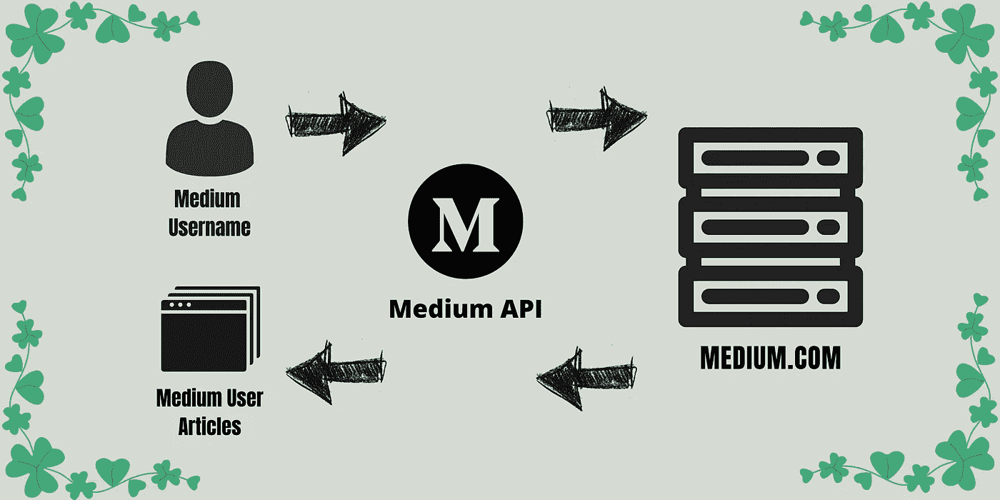
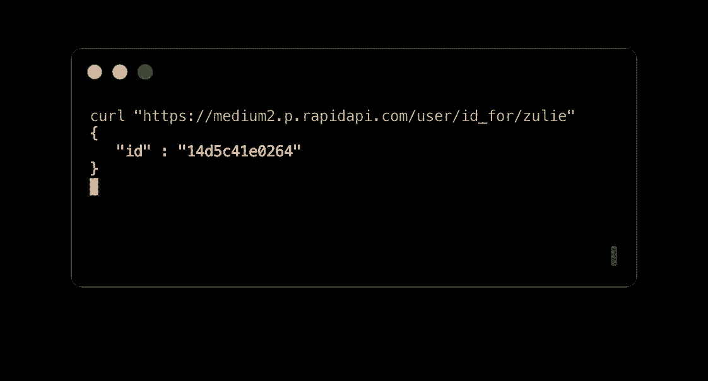
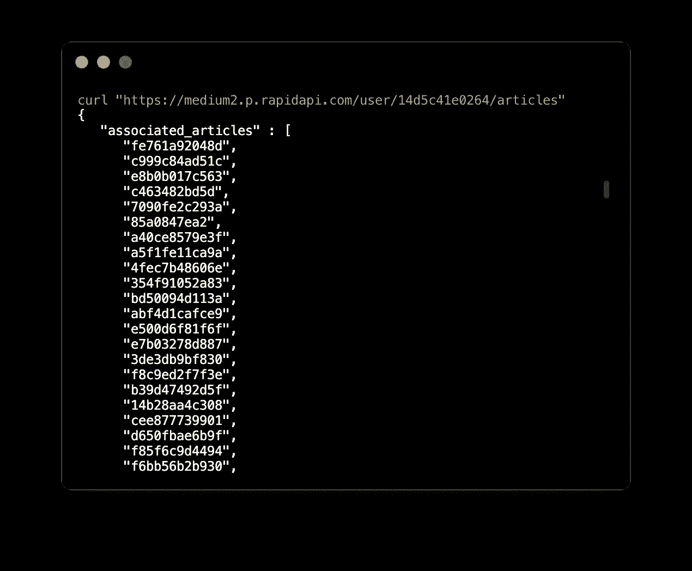
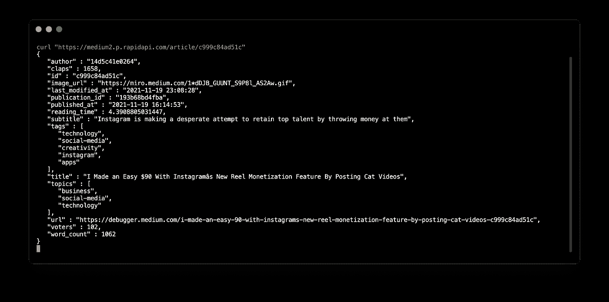
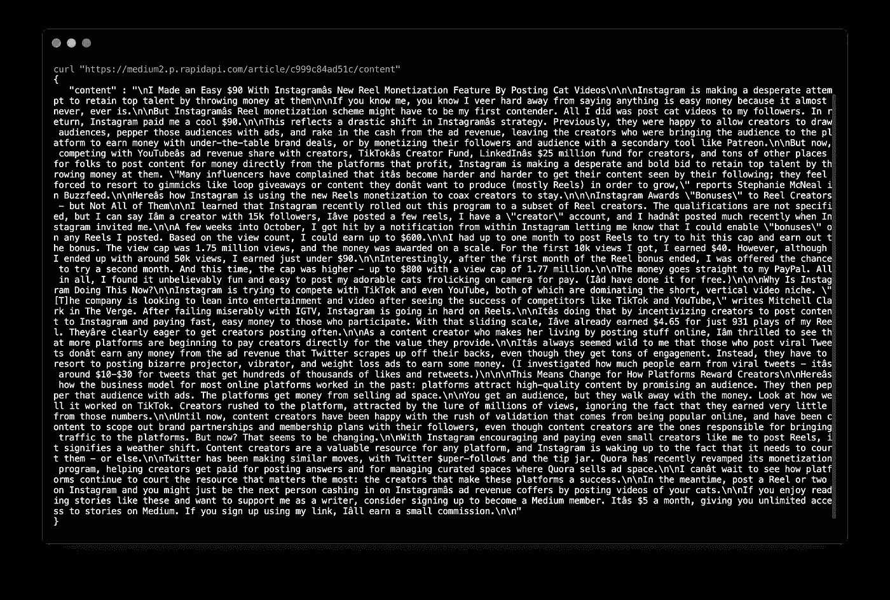

# 如何从 API 中为用户检索媒体报道？

> 原文：<https://pub.towardsai.net/how-to-retrieve-medium-stories-of-a-user-using-apis-fcdb1576558a?source=collection_archive---------1----------------------->

## [编程](https://towardsai.net/p/category/programming)

## 废弃任何用户编写的中型文章的最简单方法，使用中型 API



作者图片

M 我将向您展示如何通过 **3 个简单的步骤获取任何用户的媒体故事。**

在这里，出于演示的目的，我将获取 [Zulie Rane](https://medium.com/u/14d5c41e0264?source=post_page-----fcdb1576558a--------------------------------) 的文章，但是您也可以为任何其他作者或您自己做同样的事情。

如果你被困在某个地方，请查看这个简单易懂的文档

[](https://nishu-jain.medium.com/medium-api-documentation-90a01549d8db) [## 中等 API —文档

### 中型 API 入门

nishu-jain.medium.com](https://nishu-jain.medium.com/medium-api-documentation-90a01549d8db) 

> 注册到 [RapidAPI](https://rapidapi.com/nishujain199719-vgIfuFHZxVZ/api/medium2) 获取[**YOUR _ API key**](https://docs.rapidapi.com/docs/keys)**(*不会很久的，相信我！*)**

**所以让我们开始吧！**

> ****注意:**为了避免重复，我省略了 curl 请求中的 header 参数。使用 curl 时，请在标题中添加您的 API 密钥。例子—**

```
# curl **-H “x-rapidapi-key: YOUR_KEY”** “https://medium2.p.rapidapi.com/user/id_for/nishu-jain”
```

> ****注意:**如果你是 Python 开发者，那么我为你准备了一个**特别教程**。请点击下面的链接:**

**[](/medium-api-get-posts-using-python-126d6d859ca8) [## 中型 API:使用 Python 获取帖子

### 用户撰写的文章、发布文章和顶级订阅源

pub.towardsai.net](/medium-api-get-posts-using-python-126d6d859ca8)** 

# **第一步:获得你想要的作者的用户 ID**

**为了得到`user_id`，你需要`username`。我知道 Zulie Rane 的用户名是“ **zulie”，**，所以我可以得到她唯一的`user_id`，并用它来获取她写的所有文章。**

**端点—**

> **GET /user/id_for/{username}**

****

**作者图片**

```
**user_id = "14d5c41e0264"**
```

# **第二步:获取用户写的文章**

**端点—**

> **获取/user/{ user _ id }/文章**

**这个端点返回一个`article_ids`列表，我们将使用它来获取与每篇文章相关的信息。**

****

**作者图片**

*****截至 2021 年 11 月 25 日，祖烈已经写了 600+篇文章！*****

# **第三步:获取文章的信息和内容**

**我不会获取所有的故事(因为有这么多)，但我会用她的一篇文章来演示它。 ***你可以把*** `***article_ids***` ***列表放入一个循环中取出所有的文章。*****

**端点—**

> **GET /article/{article_id}**

****

**作者图片**

**正如你在上面的图片中所看到的，你会得到文章的相关信息，如 ***标题、副标题、鼓掌声、投票者、标签、主题、作者(*** `***user_id***` ***)、发表日期、*** 等**

**如果您还想提取文章的文本内容，请使用下面的端点**

> **GET/article/{ article _ id }/content**

****

**作者图片**

**哒哒！您已经成功提取了大量高质量的中型文章，这些文章可用于存储在数据库中、执行分析、收集见解以及做出明智的商业决策。**

***希望你喜欢！***

# **针对 Python 开发人员的特殊(更高级)教程🐍**

**如果你是一名 python 程序员，那么你很幸运。**

**我已经发布了一个 python 包，叫做`**medium-api**` **，**来简化整个过程。**

**您可以使用以下命令安装它—**

```
**pip install medium-api**
```

**按照本教程获取由用户撰写的中型帖子，在出版物下发布的帖子，以及基于标签的最新和趋势帖子。**

**媒体 API 获取帖子—作者提供的视频**

**[](/medium-api-get-posts-using-python-126d6d859ca8) [## 中型 API:使用 Python 获取帖子

### 用户撰写的文章、发布文章和顶级订阅源

pub.towardsai.net](/medium-api-get-posts-using-python-126d6d859ca8)** 

# **其他资源的链接🔗 —**

**什么是 Medium API(非官方)？—作者的视频(可选观看)**

*   ****RapidAPI 上市**——[http://hub.mediumapi.com](http://hub.mediumapi.com)**
*   ****链接到 swagger 文档**——[https://docs.mediumapi.com](https://docs.mediumapi.com)**

**[](https://nishu-jain.medium.com/medium-api-documentation-90a01549d8db) [## 中等 API —文档

### 中型 API 入门

nishu-jain.medium.com](https://nishu-jain.medium.com/medium-api-documentation-90a01549d8db) [](https://blog.devgenius.io/medium-api-get-posts-using-python-e8ca4331845e) [## 中型 API:使用 Python 获取帖子

### 仅带有“请求”库！

blog.devgenius.io](https://blog.devgenius.io/medium-api-get-posts-using-python-e8ca4331845e) 

**PS:** 我们发布与 Medium 和 Medium API 相关的教程、视频、代码片段和见解。所以一定要跟着我们

*   推特:[**twitter.com/medium_api**](https://twitter.com/medium_api)
*   领英:[**www.linkedin.com/company/medium-api**](https://www.linkedin.com/company/medium-api)

如果你喜欢阅读这些故事，那么我相信你会很乐意成为一名中等付费会员。每月只需 5 美元，你就可以无限制地接触成千上万的故事和作家。你可以通过 [***注册使用此链接***](https://nishu-jain.medium.com/membership) ，*来支持我，我将赚取一点佣金，这将帮助我成长并出版更多像这样的故事。***