# 在 Windows 操作系统中创建一个虚拟环境，并在本地运行 Flask 应用程序

> 原文：<https://pub.towardsai.net/how-to-run-a-flask-application-locally-by-using-a-virtual-environment-in-windows-os-509540e0e3dd?source=collection_archive---------1----------------------->

## [编程](https://towardsai.net/p/category/programming)，[系统](https://towardsai.net/p/category/systems)

## 轻松为您的项目创建虚拟世界

## 什么是虚拟环境？

虚拟环境为一个项目创造了一个独立的空间，在一个确定的地方有它的依赖关系。这种环境对于特定的项目来说是独特的，不会干扰其他项目的依赖关系。

## 虚拟环境的优势？

> 虚拟环境创建自己的依赖项和空间，而不是干扰本地环境。
> 
> 激活虚拟环境后，它提供了冻结环境包当前状态的功能。
> 
> 虚拟环境提供了安装任何软件包以及笔记本电脑的工具。

## 动机

每个人都可能会遇到这个术语叫做**虚拟环境**。适用于在本地主机上处理多个项目的人员。由于每个项目的需求，在同一个本地主机中混淆所有包的可能性更大。这导致所有包的不正确组织和所有包的混淆。调试项目是一个耗时的过程。

如果您想在您的本地主机上检查和运行其他人的项目。您需要安装与相应项目相关的依赖项和包。因此，在处理多个项目时。最好创建虚拟环境，而不是干扰本地环境和依赖关系。

**简单来说，我举个例子:**

所以，你已经创建了一个 flask 应用程序，它是机器学习模型和网站的接口。您使用 scikit_learn 包版本 0.21.3 来创建 pickle 文件。您的朋友要求您检查他/她的项目，该项目包含包含 scikit_learn 包版本 0.23.1 的 pickle 文件。为了帮助你的朋友，你已经安装了那个项目的所有需求，你帮助了你的朋友。但是，第一个项目不行。因为你已经安装了一些其他版本的软件包。所以你需要一些时间来重新安装你的软件包，让你的第一个项目正常工作。与其面对这些类型的问题，不如在处理多个项目时创建虚拟环境。

## 入门指南

本文指导您创建一个虚拟环境，并使用各种方法在包含 Windows 操作系统的本地主机上运行 flask 应用程序:

> 命令提示符
> 
> Anaconda 提示
> 
> Ubuntu 应用程序

## 使用命令提示符创建虚拟环境

1.  Python 和 pip 的安装:

打开命令提示符。检查你的笔记本电脑是否安装了 Python 和 pip。使用以下命令检查它们。你应该像图中一样写两个连字符。python 的最新版本包含 pip pre_installed，仅适用于需要手动安装的旧版本。

> python 版本
> 
> pip —版本

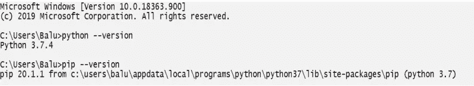

如果你的电脑 [**里没有 python，在这里**](https://www.python.org/downloads/) 下载，并添加环境变量的路径。如果您的计算机上没有安装 pip[**请在此处**](https://bootstrap.pypa.io/get-pip.py) 将其下载到您计算机上的一个文件夹中，并以相同的名称“**get-pip . py”**保存。打开命令提示符并导航到包含 get-pip.py 安装程序的文件夹。

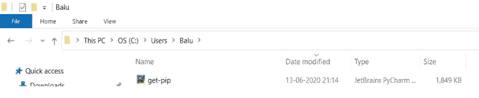

运行以下命令:

> python get-pip.py

2.导航到包含 Flask 应用程序的目录。

确保您的 flask 文件夹包含在您的笔记本电脑上运行所需的所有文件。

使用这些命令导航命令提示符:

要从当前路径向后导航一步，请使用:

> 激光唱片..

要从当前路径移动到文件夹，请使用:

> 光盘<space>[指定 _ 文件夹]</space>

这是我笔记本电脑上 flask 应用程序的路径。

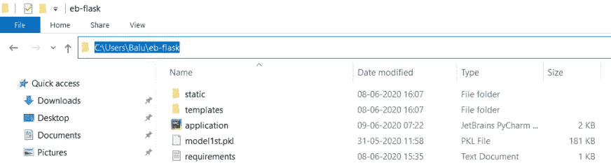

使用上述命令并导航到 flask app 文件夹。

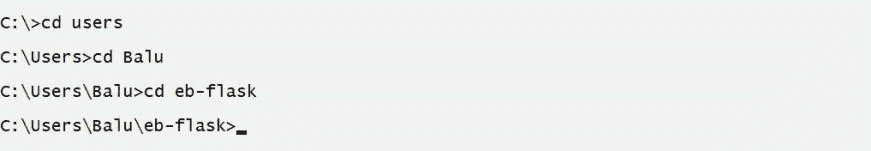

**(或)**

2.从 GitHub 克隆目录。

如果你的电脑没有安装 Git[**在这里**](https://git-scm.com/downloads) 下载。使用以下命令克隆存储库。运行第一个命令时，会在您指定的路径中创建(克隆)一个文件夹。

> git 克隆[库的链接]
> 
> CD[存储库名称]

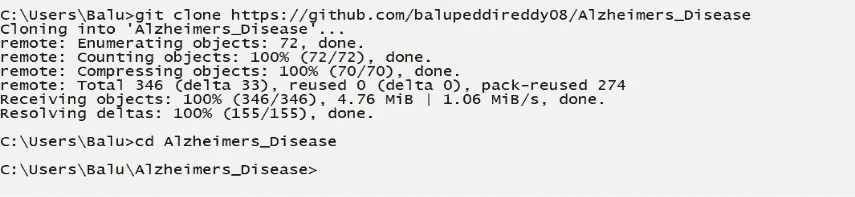

3.使用以下命令检查 flask app 文件夹中的文件列表:

> 目录

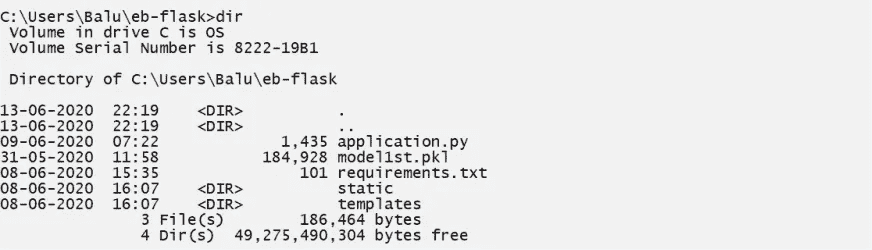

4.使用以下命令在您的文件夹中安装虚拟环境:

> pip 安装虚拟设备

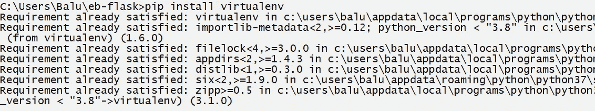

5.使用以下命令命名您的虚拟环境:

> 虚拟环境名称

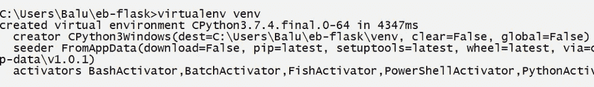

6.导航到您的虚拟环境文件夹，在那里您会看到脚本文件夹。

该文件夹包含虚拟环境的所有操作，并使用命令“**激活**”您的 venv:

> 使活动

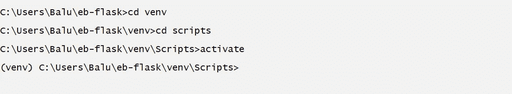

您将在终端左侧的括号中看到一个名称。由此，虚拟环境被激活。

## 你的工作完成了…！！！🔥🔥🔥

7.如果您想在本地运行 flask 应用程序，您需要在虚拟环境中安装所有的需求，而这些依赖关系并不反映您的笔记本电脑中的依赖关系。

请确保您必须有一个需求文本文件，其中包含所有依赖关系以及版本。

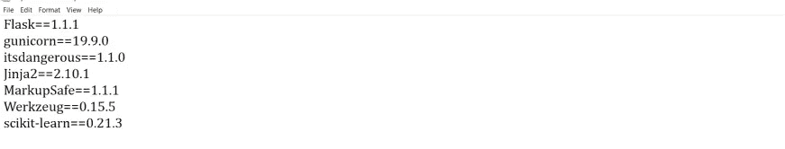

8.导航回包含 requirements.txt 文件的文件夹，并使用以下命令在虚拟环境中安装所有要求:

> pip 安装-r 要求. txt

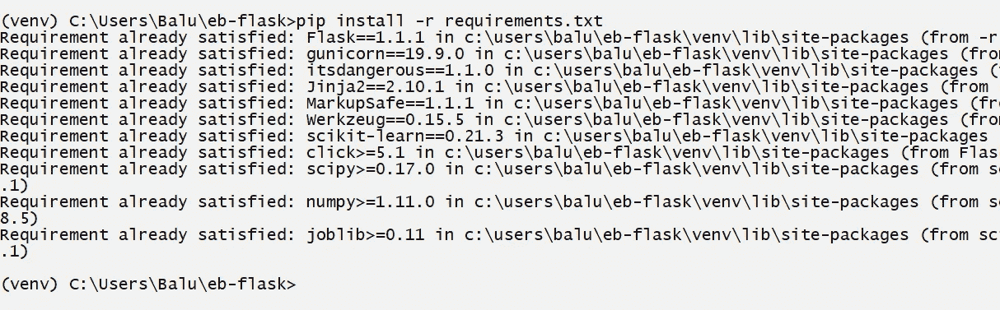

9.通过以下命令运行 python 文件以查看应用程序:

> python [python_file_name]。巴拉圭

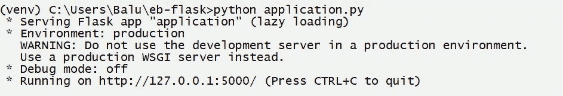

10.复制 URL 并粘贴到浏览器中。您将看到 flask 应用程序在您的本地主机上运行。

## 使用 Anaconda 提示符创建虚拟环境

1.  打开 Anaconda 命令提示符。检查你的笔记本电脑是否安装了 Python 和 pip。使用下面的命令来检查它们。你应该写两个连字符如图所示。python 的最新版本包含 pip pre_installed，仅适用于需要手动安装的旧版本。

> python 版本
> 
> pip —版本

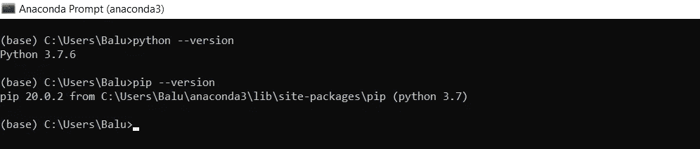

使用以下命令查看可用版本列表:

> 康达搜索 python

使用以下命令安装特定版本的 python:

> 康达安装 python =[版本]

使用以下命令在 Anaconda 命令提示符下安装 pip:

> 康达安装管道

2.导航到包含 Flask 应用程序的目录。

确保您的 flask 文件夹包含在您的笔记本电脑上运行所需的所有文件。

使用以下命令导航 Anaconda 命令提示符:

要从当前路径向后导航一步，请使用:

> 激光唱片..

要从当前路径移动到文件夹，请使用:

> 光盘<space>【指定 _ 文件夹】</space>

这是我笔记本电脑上 flask 应用程序的路径。

使用上述命令并导航到 flask app 文件夹。

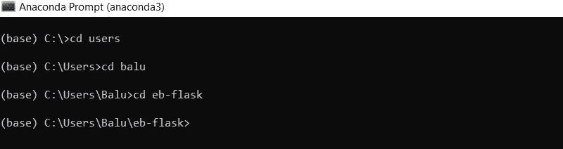

**(或)**

2.从 GitHub 克隆目录。

如果你的电脑里没有安装 Git[**在这里下载**](https://git-scm.com/downloads) 。使用以下命令克隆存储库。运行第一个命令时，会在您指定的路径中创建(克隆)一个文件夹。

> git 克隆[库的链接]
> 
> CD[存储库名称]

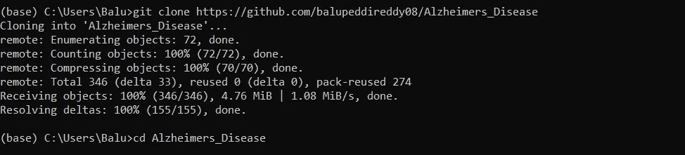

3.使用以下命令检查 flask app 文件夹中的文件列表:

> 目录

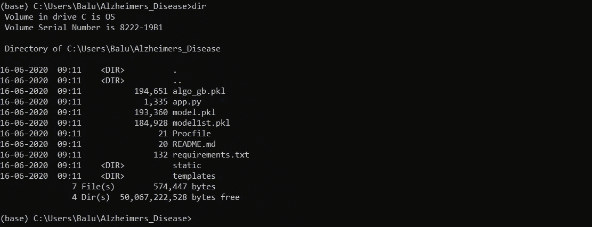

4.使用以下命令在您的文件夹中安装虚拟环境:

> 康达安装虚拟

5.使用以下命令命名您的虚拟环境:

> 虚拟环境名称

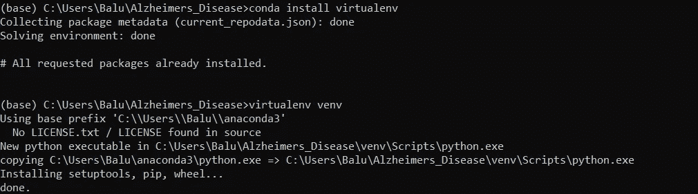

6.导航到您的虚拟环境文件夹，在那里您会看到脚本文件夹。

该文件夹包含虚拟环境的所有操作，并使用命令“**激活**”您的 venv:

> 使活动

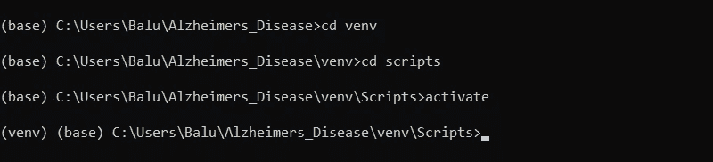

您将在终端左侧的括号中看到一个名称。由此，虚拟环境被激活。

## 你的工作完成了…！！！🔥🔥🔥

7.如果您想在本地运行 flask 应用程序，您需要在虚拟环境中安装所有的需求，而这些依赖关系并不反映您的笔记本电脑中的依赖关系。

请确保您必须有一个需求文本文件，其中包含所有依赖关系以及版本。

8.导航回包含 requirements.txt 文件的文件夹，并使用以下命令在虚拟环境中安装所有要求:

> pip 安装-r 要求. txt

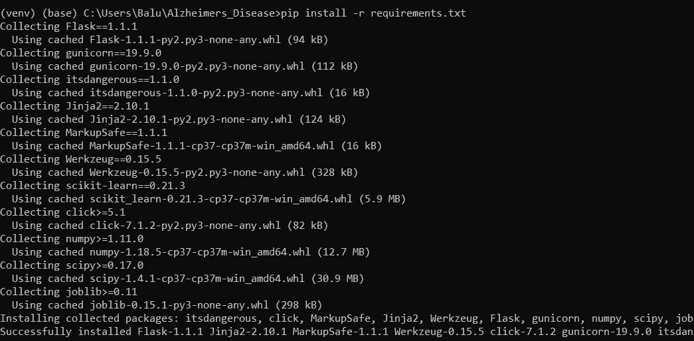

9.通过以下命令运行 python 文件以查看应用程序:

> python [python_file_name]。巴拉圭

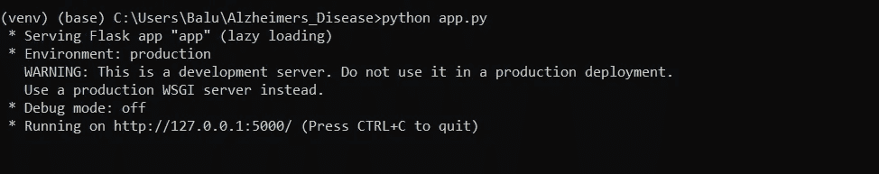

10.复制 URL 并粘贴到浏览器中。您将看到 flask 应用程序在您的本地主机上运行。

## 使用 Ubuntu 应用程序创建虚拟环境

这种方法主要推荐安装包和笔记本不做项目。您可以按照类似的过程在 Linux 中创建一个虚拟环境。

1.  打开 Windows Powershell 应用程序，并以管理员身份运行。

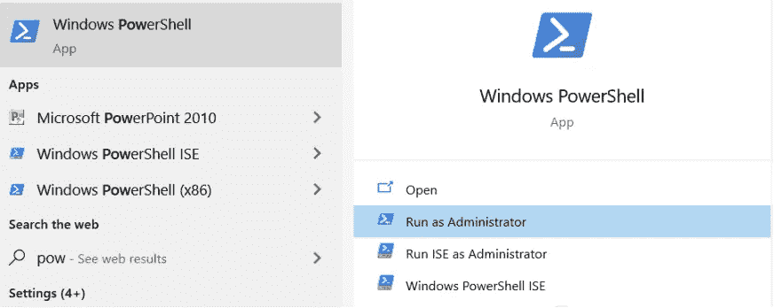

首先，使用以下命令在 Windows Powershell 应用程序中启用“ **Windows Subsystem for Linux** ”功能。

> enable-Windows optional feature-Online-feature name Microsoft-Windows-Subsystem-Linux

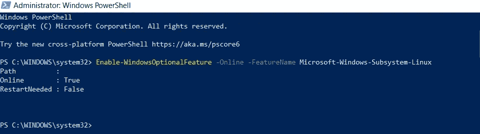

出现提示后，重新启动您的笔记本电脑。

2.从 Windows 应用商店下载 Ubuntu 应用程序。本文使用 Ubuntu 20.04LTS 进行演示。

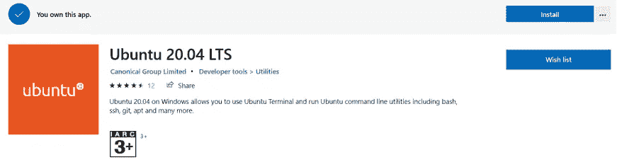

午餐 Ubuntu App，确保打开 Windows PowerShell。因为 Ubuntu App 是代表 Windows PowerShell App 运行的。

3.设置新的用户名和密码，并记住您的密码。它将进一步用于安装包。

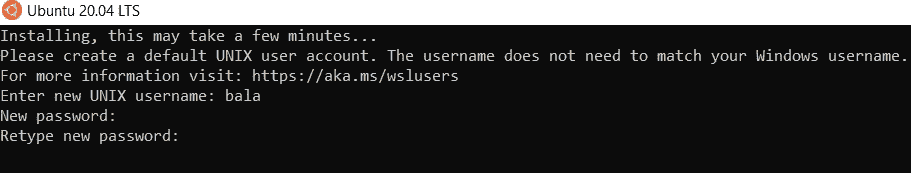

为了**在 Ubuntu 中粘贴命令**使用:

> 右键单击
> 
> Ctrl +Shift+v

4.使用以下命令更新和升级您的 Ubuntu 软件包:

> sudo apt 更新和 sudo apt 升级

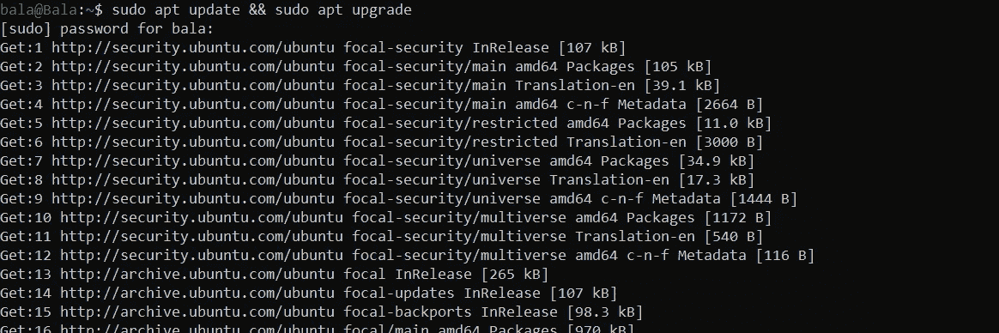

5.现在，使用以下命令安装 python 的所有依赖项，以创建虚拟环境并在 Ubuntu 应用程序中运行 pip:

> sudo apt-get install-y libstdc++ 6 python-setup tools

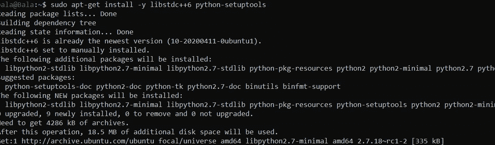

> sudo apt-get 安装 python3-pip

6.使用以下命令克隆存储库。运行第一个命令时，会在您指定的路径中创建(克隆)一个文件夹。

> git 克隆[库的链接]

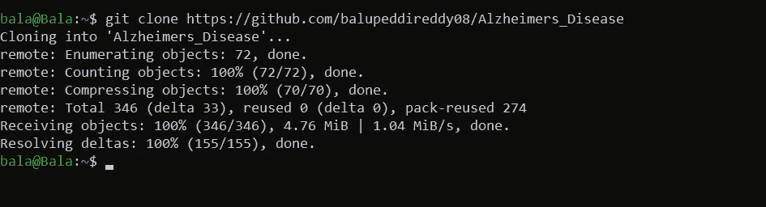

> CD[存储库名称]

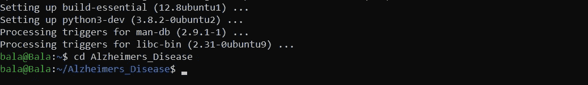

7.使用以下命令在 flask app 文件夹中安装虚拟环境:

> sudo pip3 安装虚拟

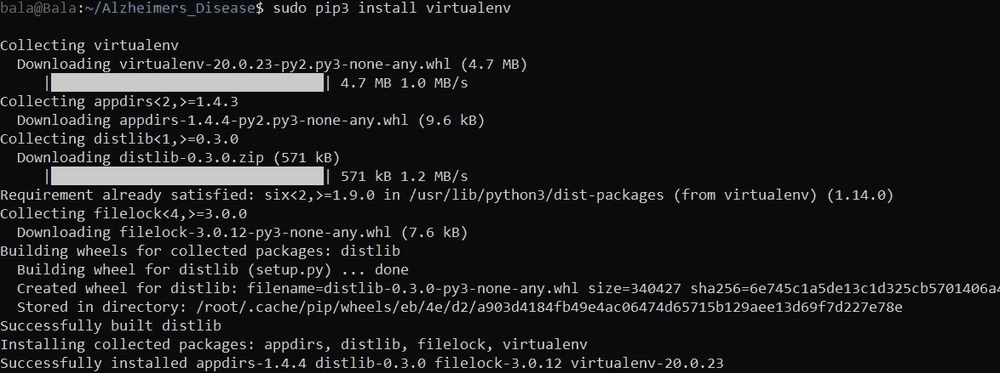

8.使用以下命令相应地命名您的虚拟环境:

> 虚拟环境名称

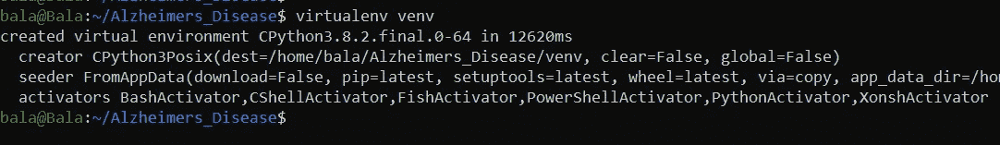

9.使用以下命令激活虚拟环境:

> 源 venv/bin/激活

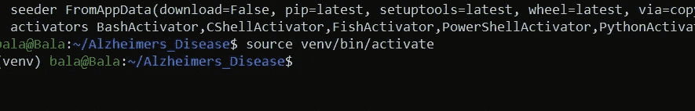

## 你的工作完成了…！！！🔥🔥🔥

10.在虚拟环境中安装要求。

如果您想在本地运行 flask 应用程序，您需要在虚拟环境中安装所有的需求，而这些依赖关系并不反映您的笔记本电脑中的依赖关系。

请确保您必须有一个需求文本文件，其中包含所有的依赖项以及版本。

> pip 安装-r 要求. txt

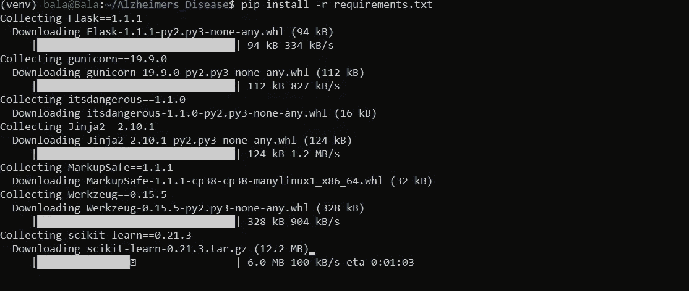

11.通过以下命令运行 python 文件以查看应用程序:

> python [python_file_name]。巴拉圭

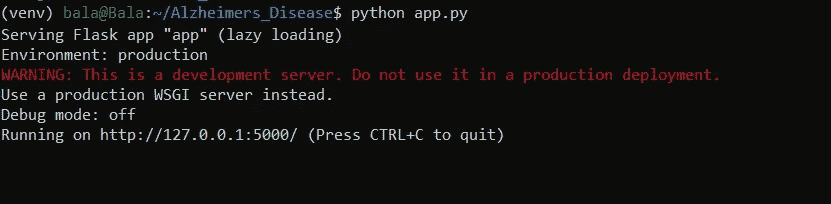

12.复制 URL 并粘贴到浏览器中。您将看到 flask 应用程序在您的本地主机上运行。

这篇文章对你做项目和课程有帮助。我建议按照这种方式区分你所有的系统依赖项目，并以一种有组织的方式放置它们。

我希望，你做得很好，如果有什么不对的地方请纠正我…！！！🤝🤝🤝

# 快乐学习！😎