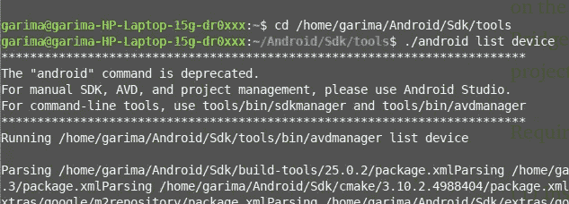
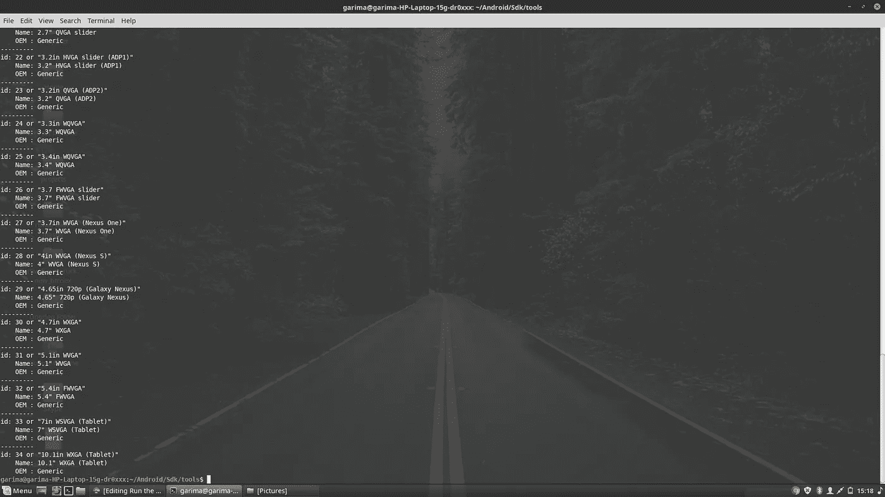
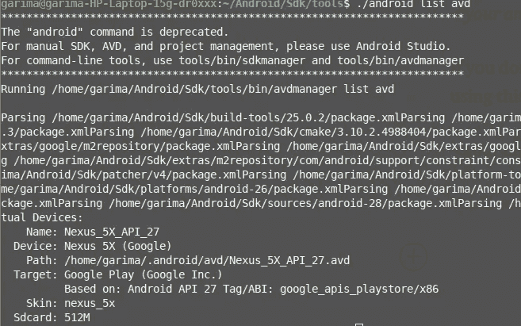

# 如何从命令行运行 Android 应用程序！

> 原文：<https://pub.towardsai.net/how-to-run-an-android-application-from-command-line-e139eda62867?source=collection_archive---------0----------------------->

## Android，[编程](https://towardsai.net/p/category/programming)


图片提供:[谷歌](https://www.google.co.in/url?sa=i&source=images&cd=&ved=2ahUKEwi1ufK5397iAhV57HMBHQWfCDoQjRx6BAgBEAU&url=https%3A%2F%2Fwww.vecteezy.com%2Fvector-art%2F71469-android-logo&psig=AOvVaw0JfgATU5bmKnbnc9J8W95Y&ust=1560250148856993)

> 你有没有厌倦过在使用 IDE 的时候电脑内存太低？
> 还是？
> 
> 您是否曾经希望运行一个脚本，同时运行所有的应用程序？

# 如果任何一个问题的答案是肯定的，那么你就来对地方了！您将不再需要任何 IDE 来运行您的 android 应用程序！别再挂电话了！

## 是不是很神奇？让我们开始吧！

本文概述了在命令行上用于 Android 开发的流行工具的用法，特别是 Android、Android Debug Bridge (ADB ),以及如何利用它们来构建 Android 应用程序项目，以及如何使用命令行安装和调试 Android 应用程序。

## 要求:

1.  安装 Oracle 最新的 [Java 开发套件(JDK)](https://www.java.com/en/download/) 。
2.  安装最新的 Android SDK。如果你还没有这样做，你可以在 [Android Developers](https://developer.android.com/sdk) 上下载 Android SDK。

让我们开始吧:

*   打开终端。
*   要开始该过程，首先，显示当前配置的可用 Android 设备列表，复制以下命令:

```
<your android sdk directory>/tools/android list devices
```

然后你会看到这样的东西:



然后您会看到设备列表:



现在你可以监控你的“ANDROID 模拟器”

```
<your android sdk directory>/tools/emulator -avd <name of avd>
```

如果你还不知道你的 avd 的名字，不要担心！您可以使用以下命令找到它:

```
<your android sdk directory>/tools/android list avd
```

您会看到类似这样的内容:



因此“Name”部分将用于替换命令行中 avd >的 *<名称:*

```
<your android sdk directory>/tools/emulator -avd <name of avd>
```

> 我在这里假设你已经创建了你的 android 项目。

**现在我们来编译 android 项目:**

在编译项目之前，您必须连接到互联网，以便 Gradle wrapper 脚本下载适当的 Gradle 软件组件。准备就绪后，要编译您的 Android 项目，请在命令行上导航到您的项目目录(更改目录)，并执行以下操作:

对于 Mac 或 Linux-

```
***.***/gradlew build ()
```

对于 Windows:

```
gradlew.bat build
```

现在从你的电脑上传一个指定的 APK 文件到一个模拟器/设备。

```
<your android sdk directory>/platform-tools/adb install -r <your APK file>
```

如果这不起作用，那么使用亚行推动 APK:

```
adb push *<your android app directory>*/build/outputs/apk/debug/app-debug.apk /data/local/tmp/org.tensorflow.lite.examples.classification
```

然后启动启动器:

```
adb shell am start -n “org.tensorflow.lite.examples.classification/org.tensorflow.lite.examples.classification.ClassifierActivity” -a android.intent.action.MAIN -c android.intent.category.LAUNCHER
```

ADB 的 logcat 命令用于显示正在运行的 Android 操作系统的系统信息(无论是设备还是仿真器)。这对于发现应用程序或设备发生了什么非常有帮助。

```
<your android sdk directory>/platform-tools/adb logcat
```

这就是你从命令行运行的 android 应用程序！


欢呼雀跃了吗？