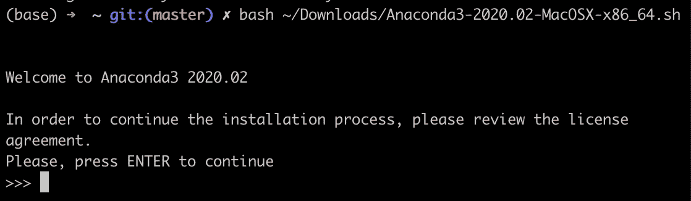
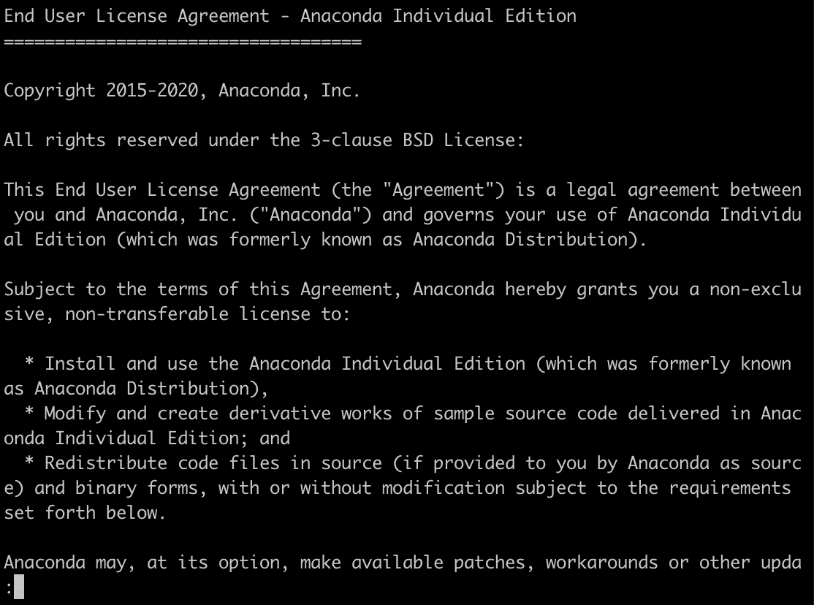
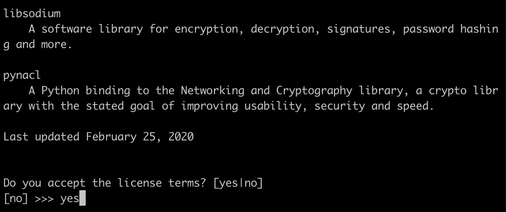

# 如何在 MacOS Catalina 上运行 Jupyter 笔记本——四个步骤

> 原文：<https://pub.towardsai.net/how-to-run-jupyter-notebook-on-macos-catalina-in-four-steps-f7cc4e2cc270?source=collection_archive---------0----------------------->


在我之前的博客中，我向你展示了运行 jupyter 笔记本的所有步骤。如果你是一名数据科学家或开发人员，并且升级到了 macOS Catalina 10.15，那么你可能会面临 jupyter 笔记本的一些问题。最新版本的 Mac Catalina 功能与以前的 s 版本不同。按照以下步骤在最新的 Catalina 版本上配置和运行 jupyter 笔记本。

配置 jupyter 笔记本有四个简单的步骤。

**第一步:安装 anaconda 发行版。**

更好的方法是使用命令行安装程序，而不是图形。

使用此链接下载 CLI[https://repo . anaconda . com/archive/anaconda 3-2020.02-ma cosx-x86 _ 64 . sh](https://repo.anaconda.com/archive/Anaconda3-2020.02-MacOSX-x86_64.sh)

下载完成后，进入终端并运行。

```
shasum -a 256 /Downloads/Anaconda3-2020.02-MacOSX-x86_64.sh
```

下一步是用 python3 安装 anaconda，而不是 python2，因为它现在已经过时了。

要开始安装，请在终端中运行以下命令。

```
bash ~/Downloads/Anaconda3-2020.02-MacOSX-x86_64.sh
```

> 不要下载，使用 anaconda 发行版的安装路径，同样用您的文件名替换 anaconda 3–2020.02-ma cosx-x86 _ 64 . sh。

屏幕显示如下:



你需要在这里按*回车*，



*阅读许可协议并滚动到底部*。



输入*是*。接下来，它会询问安装位置。


再次按下*回车。*

一旦你按下回车键，信息提示，“你希望安装程序通过运行 conda init 来初始化 Anaconda3 吗？”

输入*是*

Catalina 的默认 shell 是 zsh，所以我们的下一步是安装 Zsh

## 第二步:用 Zsh 设置 macOS 终端

为了卡特琳娜

首先设置 Xcode 命令行工具，也称为 Xcode-select

```
xcode-select --install
```

如果有问题，尝试运行下面的脚本。

```
xcode-select — reset
```

然后你需要安装一个 macOS 的软件包管理系统，也就是家酿。

运行下面的命令。

`/usr/bin/ruby -e "$(curl -fsSL https://raw.githubusercontent.com/Homebrew/install/master/install)"`

下一步是为 Catalina 安装一个默认的 shell，即 zsh。
brew 安装 zsh

```
brew install zsh
```

现在我们需要在 iterm2 中集成 zsh。如果您没有 iterm2，请使用 brew 安装它。

```
brew cask install iterm2
```

对于 zsh-ITER m2 集成，

```
sh -c "$(curl -fsSL https://raw.githubusercontent.com/robbyrussell/oh-my-zsh/master/tools/install.sh)"
```


## 第三步:Conda、Pip 和 Jupyter 安装

使用 brew 安装 conda，运行以下命令。

```
brew cask install miniconda
```

将 conda 更新至最新版本。

```
conda update conda
```

对于 pip，您可以使用 conda 或 easy install。

康达路

```
conda install pip
```

简单的安装方式

```
sudo easy_install **pip**
```

对于 nbextensions，运行以下命令

```
conda install -c conda-forge jupyter_contrib_nbextensions
```

最后，对于 jupyter 安装使用，brew。

```
brew install jupyter
```

## 步骤四:创建一个虚拟环境并将其链接到 ipykernel

我总是喜欢为我的项目创建一个虚拟环境，以避免包依赖的冲突。

要创建虚拟环境，请传递环境的名称以及要使用的 python 版本。假设我们想要创建一个名为 Cat 的环境，并且想要使用 Python 3.8.2 版本。

运行以下命令创建“Cat”环境。

```
conda create -n Cat python**=**3.8.2 anaconda
```

要激活环境，请将 Cat 传递给 conda activate。

```
conda activate Cat
```

打开一个新的 Zsh 窗口并安装 ipykernel。

```
pip install — user ipykernel
```

下一步是将内核链接到虚拟环境。

```
python -m ipykernel install --user --name=Cat
```

如果您想显示环境的名称，请说“Cat_Virtual”，使用下面的命令。

```
python -m ipykernel install — user — name Cat — display-name “Cat_Virtual”
```

转到 iterm2 并运行。

```
jupyter notebook
```

打开任何笔记本；看起来是这样的，


尽情享受吧！😊