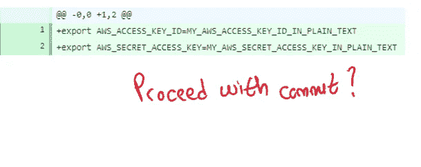
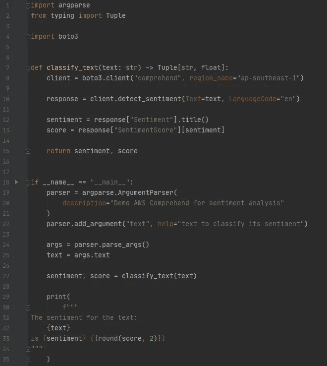
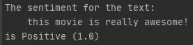
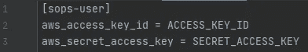
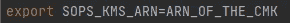
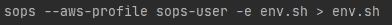
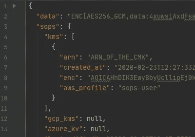
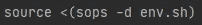

# 如何将您的云凭证提交给版本控制系统

> 原文：<https://pub.towardsai.net/how-to-safely-commit-your-aws-credentials-to-github-21d3bf7771e7?source=collection_archive---------0----------------------->

## 将您的云凭据安全地提交给版本控制系统

# 介绍

在本文中，我将分享一种安全地将敏感信息提交给版本控制系统(VCS)的方法。重点将是提交 AWS 凭证，但该方法也适用于 Azure 和谷歌云平台(GCP)。

重现结果的代码可以在[这里](https://github.com/hsm207/secure_credentials)找到。

本文面向数据科学家；您没有软件开发背景，因此不了解软件工程的最佳实践。然而，从这个[搜索结果](https://github.com/search?p=2&q=removed+password&type=Commits)来看，似乎总的来说开发者也能受益。

# 动机

假设您是一名初级数据科学家，负责构建一个管道来分析文本数据。自然，这个任务包括在 S3 桶周围移动文件，并调用各种 AWS 服务来做诸如情感分析、命名实体识别、主题建模等事情。

您将获得一组允许您访问这些服务的凭据。您决定通过环境变量进行身份验证，因此您编写了一个名为`env.sh`的脚本，它执行以下操作:

图 1:导出环境变量以认证 AWS 服务的脚本

你应该把这个剧本交给你的 VCS 吗？

提交这个脚本可以方便您的同事从您停止的地方继续工作。他们不需要搜索合适的凭证。他们只需要克隆你的回购，一切都将开箱即用。

但是，提交该脚本存在安全风险。想象一下，有人入侵/泄露了你公司 VCS 服务器的内容。或者，也许你的公司有一天决定开源这个回购协议，从而意外地将他们的私人信息暴露给全世界，因为他们忘记了将它从回购协议的历史中抹去。

有没有兼顾便利性和安全性的解决方案？

# 问题陈述

为了使事情更加具体，我们将使用下面的脚本`main.py`:

图 2:main . py 的内容

用`python main.py "this movie is really awesome!"`调用`main.py`会调用亚马逊领悟为文本`"this movie is really awesome!"`产生一个情感分类和置信度评分，像这样:

图 3:main . py 的示例输出

本文中与`main.py`相关的部分是第 8 行，它为所需的服务创建了一个客户机，并依赖于`AWS_ACCESS_KEY_ID`和`AWS_SECRET_ACCESS_KEY`环境变量的存在来进行认证。因此，您需要在运行`main.py`之前执行`source env.sh`。

现在的问题是:我们应该如何承诺`env.sh`？

# 解决办法

## 概观

解决方案包括使用名为 [sops](https://github.com/mozilla/sops#sops-secrets-operations) 的工具对`env.sh`进行加密，并使用 [AWS KMS](https://aws.amazon.com/kms/) 来管理加密和解密过程的密钥。Sops 可以在 Windows、Linux 和 Mac 上运行，并且可以与 AWS KMS 以及 Azure 和 GCP 的类似服务很好地集成。

在使用 sop 加密`env.sh`之前，我们需要经历几个步骤。

## 先决条件

就 AWS 服务而言，您需要访问 AWS KMS 的客户管理密钥(CMK)。一种方法是让您的帐户管理员为您创建和管理此密钥，并创建另一个 IAM 用户，其唯一目的是能够使用此密钥进行文件加密/解密。我们姑且称这个用户为`sops-user`。

作为普通帐户用户，您只需遵循以下步骤:

1.  安装 sop。点击[此处](https://github.com/mozilla/sops/releases)为您的机器下载相关软件包。
2.  更新您的 AWS 凭证文件以包含`sop-user`的凭证:

图 4:插入 AWS 凭证文件的额外内容

3.定义`SOPS_KMS_ARN`环境变量，以便 sop 知道在哪里可以找到 CMK:

图 5:如何告诉 sop 使用哪个 CMK

解决了这个问题，我们现在准备加密`env.sh`。

## 加密敏感信息

加密`env.sh`只是一个执行的问题:

图 6:如何加密 env.sh

这是加密过程后`env.sh`的样子:

图 7:加密后的 env.sh 片段

## 解密敏感信息

运行`source env.sh`将会抛出一个错误，因为`env.sh`不再是一个有效的 shell 脚本。

在调用`source`之前，您需要解密`env.sh`。你可以这样做:

图 8:如何获得加密的 env.sh

# 分析

让我们花点时间来考虑一下上一节中的解决方案实现了什么。

加密形式的`env.sh`(图 7)仍然可读，但实际上是乱码。因此，它可以安全地提交给贵公司的 VCS。

如果这个回购被黑或者泄露给公众会怎么样？如果没有正确的密钥来解密，几乎不可能恢复存储在中的凭据，因为只有密钥可以访问它。请注意，`sops-user`的凭证永远不会提交给回购。

在合作方面，你的同事只需要知道`sops-user`的凭证就可以解密`env.sh`，继续开发`main.py`。

因此，这种解决方案是方便性和安全性之间的一个很好的折衷。

# 结论

本文介绍了一种提交敏感信息的简单方法，即使用名为 sops 的工具，并利用云服务提供商提供的服务。

如果你有任何问题或者想分享替代方法，请在评论中告诉我。