# 如何为 Spark 设置环境

> 原文：<https://pub.towardsai.net/how-to-set-up-your-environment-for-spark-7820b84491ef?source=collection_archive---------0----------------------->

## [数据工程](https://towardsai.net/p/category/data-engineering)


由[伊利亚·巴甫洛夫](https://unsplash.com/@ilyapavlov)在 [Unsplash](https://unsplash.com/photos/OqtafYT5kTw) 上拍摄

Spark 是一个非常受欢迎的开源大数据框架，业内许多公司都在使用它。这里我想向你展示如何在 Linux 机器上设置 Spark 环境(我用的是 **Ubuntu 20.04.3** )。

# 装置

这是我们需要安装的东西的列表:

1.  JDK
2.  想法
3.  斯卡拉
4.  火花
5.  PySpark(可选)
6.  Hadoop

## 1.JDK

JDK 是 Java 开发工具包的缩写，是 Java 的开发环境。Spark 是用 Scala 写的，Scala 是一种和 Java 非常相似的语言，也运行在 JVM (Java 虚拟机)上，所以我们需要先安装 JDK。在这里我安装了 **JDK 11.0.13** 。

要安装 JDK，请运行:

```
$ sudo apt install default-jre
```

接下来，检查安装是否完成:

```
$ java -version
```

它应该输出以下内容:

```
openjdk version "11.0.13" 2021-10-19
OpenJDK Runtime Environment (build 11.0.13+8-Ubuntu-0ubuntu1.20.04)
OpenJDK 64-Bit Server VM (build 11.0.13+8-Ubuntu-0ubuntu1.20.04, mixed mode, sharing)
```

## 2.想法

IntelliJ IDEA 是最流行的 Java/Scala IDE。我们需要它来编写和运行代码。

在这里下载并安装 IDEA 的最新版本:[https://www.jetbrains.com/idea/download/#section=linux](https://www.jetbrains.com/idea/download/#section=linux)。我选择了免费社区版。

## 3.斯卡拉

Scala 是常用于编写 Spark 程序的语言(还有 Python！).如果你想学习如何用 Scala 编程，我强烈推荐这门课程:[https://www.coursera.org/specializations/scala](https://www.coursera.org/specializations/scala)。如果你不懂 Scala，可以用 Python，但是还是要安装 Scala！

在这里下载 Scala:[https://www.scala-lang.org/download/scala2.html](https://www.scala-lang.org/download/scala2.html)。您可以选择“下载用于 UNIX 的 Scala 二进制文件”并在本地解压缩二进制文件，或者通过选择“[IntelliJ](https://docs.scala-lang.org/getting-started/intellij-track/getting-started-with-scala-in-intellij.html)中的 Scala 入门”使用 IDEA 安装 Scala。我做了后者，在我的机器上安装了 **Scala 2.12.11** 。

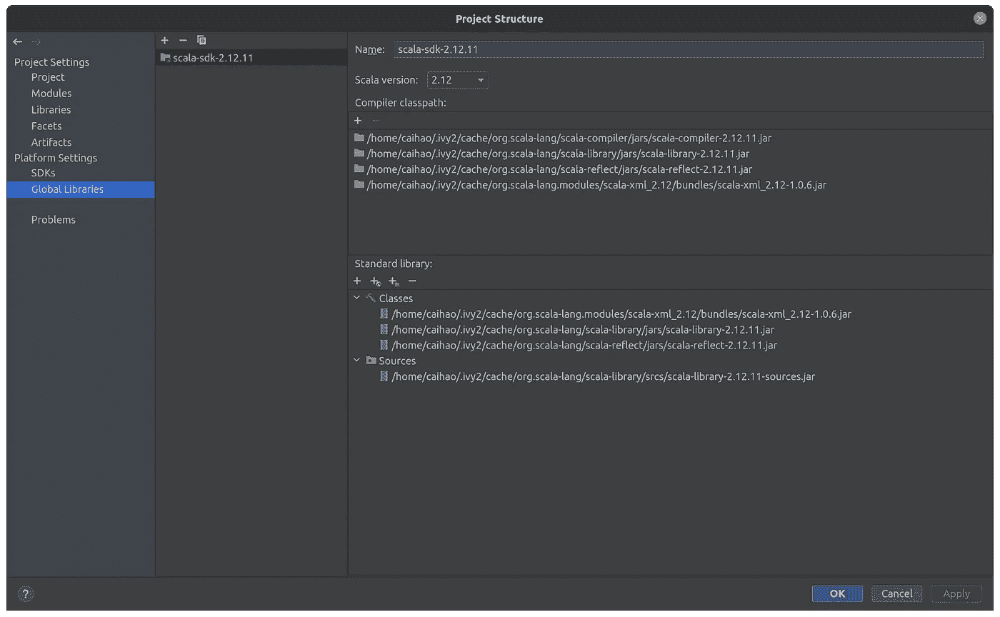

## 4.火花

在这里下载 Spark:[https://spark.apache.org/downloads.html](https://spark.apache.org/downloads.html)。这里我选择了为 **Apache Hadoop 3.3** 预建的**最新版本(3.2.0)** 。

然后打开包并将其移动到您的首选文件夹:

```
$ tar -zxvf spark-3.2.0-bin-hadoop3.2.tgz
$ mv spark-3.2.0-bin-hadoop3.2 /opt/spark
```

然后，您需要修改 bash 配置文件(`~/.bashrc`或`~/.bash_profile`或`~/.zshrc`)，并在您的路径中添加 Spark:

```
export SPARK_HOME=/opt/spark
export PATH=$PATH:$SPARK_HOME/bin:$SPARK_HOME/sbin
```

最后，您需要再次运行配置文件以使其工作:

```
$ source ~/.bashrc
```

现在你可以在你的机器上运行 Spark 了！转到`/opt/spark/bin/`并运行:

```
$ ./spark-shell
```

如果你看到下面的结果，这意味着你已经为 Spark 做好了准备！

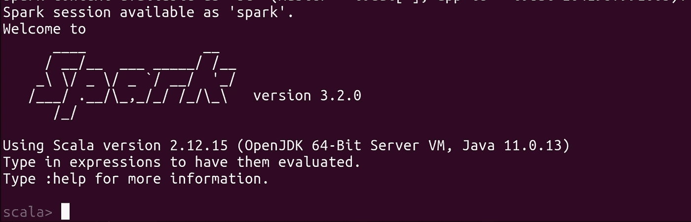

## 5.PySpark(可选)

简单来说，PySpark 就是 Spark 的 Python 版本。不用学 Scala，用 PySpark 就能写出 Python 风格的 Spark 代码。要使用 [PyPI](https://pypi.org/project/pyspark/) 安装 PySpark，请运行:

```
$ pip install pyspark
```

## 6.Hadoop

Hadoop 是 Spark 之前的“上一代”大数据框架。尽管 Spark 很棒，但从某种意义上来说，它实际上是建立在 Hadoop 之上的，并且仍然依赖于 Hadoop 的组件。关于他们关系的更多细节可以在[这篇文章](https://www.geeksforgeeks.org/difference-between-hadoop-and-spark/)中找到。在这里，我想在 Hadoop 集群上运行 Spark 作业，并使用 YARN (Hadoop 的资源管理和调度工具)和 HDFS (Hadoop 的数据文件系统)，因为它们真的很容易使用，所以安装 Hadoop 是必须的。

要安装 Hadoop，请在这里下载:[https://hadoop.apache.org/releases.html](https://hadoop.apache.org/releases.html)。这里我选的是 **3.2.2 版本**。

然后打开包并将其移动到您的首选文件夹:

```
$ tar -zxvf hadoop-3.2.2.tar.gz
$ mv hadoop-3.2.2.tar.gz /usr/local/hadoop/
```

然后您需要修改您的 bash 配置文件(`~/.bashrc`或`~/.bash_profile`或`~/.zshrc`)，并将 Hadoop 添加到您的路径中:

```
export HADOOP_HOME=/usr/local/hadoop/hadoop-3.2.2/
export HADOOP_PREFIX=$HADOOP_HOME
export PATH=$HADOOP_HOME/bin:$HADOOP_HOME/sbin:$PATH
export HADOOP_CONF_DIR=$HADOOP_HOME/etc/hadoop
```

然后再次运行配置文件使其工作:

```
$ source ~/.bashrc
```

现在你可以在你的机器上运行 Hadoop 了！转到`/usr/local/hadoop/hadoop-3.2.2/bin`并运行:

```
$ hadoop version
```

如果你看到下面的结果，这意味着 Hadoop 已经成功安装！

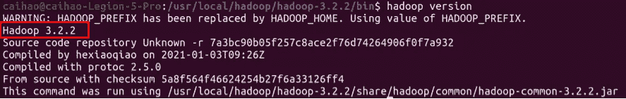

# 配置

## 1.配置 Hadoop 分布式模式(HDFS 和纱线设置)

## 1.1 SSH 验证设置

首先，您需要按照“安装”中的步骤确保您的机器中有 Java。然后，我们需要设置分布式身份验证密钥对，以便主节点可以轻松地连接到工作节点。使用以下命令在您的计算机上安装 SSH:

```
$ sudo apt install openssh-client
$ sudo apt install openssh-server
```

然后在每个节点上使用以下命令生成一个公共 ssh-key:

```
$ ssh-keygen -t rsa -P ''
```

然后将公钥发送到集群中的每台机器:

```
$ cat ~/.ssh/id_dsa.pub >> ~/.ssh/autorized_keys
```

运行`ssh localhost`检查是否仍然登录键。如果你看到下面，你的 SSH 设置就完成了！

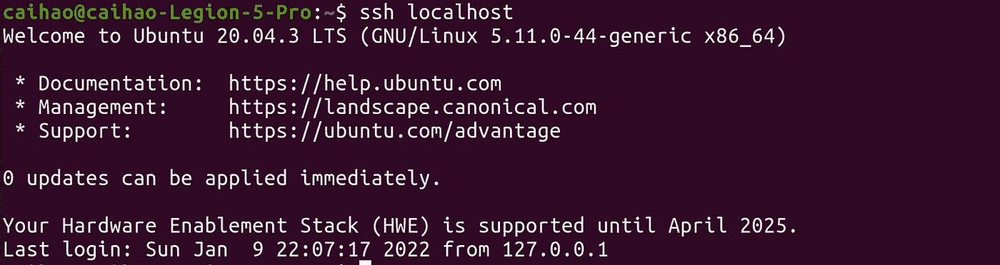

## 1.2 NameNode 位置设置

更新您的`/hadoop/etc/hadoop/core-site.xml`以设置 NameNode 位置:

```
<configuration>
    <!-- specify communication address for namenode>
    <property>
        <name>fs.defaultFS</name>
        <value>hdfs://localhost:9000</value>
        <description>The name of the default file system.</description>
    </property>
    <!-- specify storage directory of temorary files generated during Hadoop run>
    <property>
        <name>hadoop.tmp.dir</name>
        <value>file:/usr/local/hadoop/hadoop-3.2.2/tmp</value>
        <description>A base for other temporary directories.</description>
    </property>
</configuration>
```

## 1.3 HDFS 路径设置

更新您的`hadoop/etc/hadoop/hdfs-site.xml`以设置 HDFS 路径:

```
<configuration>
    <!-- specify how many times data is replicated in the cluster>
    <property>
        <name>dfs.replication</name>
        <value>1</value>
    </property>
    <property>
        <name>dfs.namenode.name.dir</name>
        <value>file:/usr/local/hadoop/hadoop-3.2.2/tmp/dfs/name</value>
    </property>
    <property>
        <name>dfs.namenode.data.dir</name>
        <value>file:/usr/local/hadoop/hadoop-3.2.2/tmp/dfs/data</value>
    </property>
</configuration>
```

## 1.4 配置纱线

首先，编辑`hadoop/etc/hadoop/mapred-site.xml`将 YARN 设置为 MapReduce 操作的默认框架:

```
<configuration>
    <property>
        <name>mapreduce.framework.name</name>
        <value>yarn</value>
    </property>
    <property>
        <name>yarn.app.mapreduce.am.env</name>
        <value>HADOOP_MAPRED_HOME=$HADOOP_HOME</value>
    </property>
    <property>
        <name>mapreduce.map.env</name>
        <value>HADOOP_MAPRED_HOME=$HADOOP_HOME</value>
    </property>
    <property>
        <name>mapreduce.reduce.env</name>
        <value>HADOOP_MAPRED_HOME=$HADOOP_HOME</value>
    </property>
</configuration>
```

然后，编辑`hadoop/etc/hadoop/yarn-site.xml`:

```
<property>
        <name>yarn.nodemanager.aux-services</name>
        <value>mapreduce_shuffle</value>
    </property> <property>
        <name>yarn.nodemanager.aux-services.mapreduce.shuffle.class</name>
        <value>org.apache.hadoop.mapred.ShuffleHandler</value>
</property>
```

## 1.5 格式 HDFS

设置完成后，您需要通过运行以下命令来格式化 HDFS:

```
$ hadoop namenode -format
```

如果你看到下面，格式化完成了！


## 1.6 运行 HDFS 和纱线

现在你可以经营 HDFS 和纱线服务！转到`/usr/local/hadoop/hadoop-3.2.2/bin`并运行:

```
$ start-all.sh
```

使用`jps`命令查看 HDFS 和纱线是否成功运行:

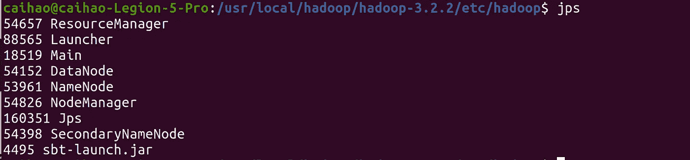

毕竟，您的作业已经完成，您可以通过转到`/usr/local/hadoop/hadoop-3.2.2/bin`并运行以下命令来终止 Hadoop 服务:

```
$ stop-all.sh
```

## 2.在 IDEA 中创建和运行 Scala 代码

## 2.1 创建新的 Scala 项目

正如我前面提到的，IDEA 是一个非常流行的 Scala IDE。原因之一是用 IDEA 为 Scala 项目建立开发环境非常容易。以下是方法:

首先，下载后打开 IntelliJ IDEA。点击**文件- >新建- >项目**。选择 **Scala - > sbt** ，点击**下一步**:

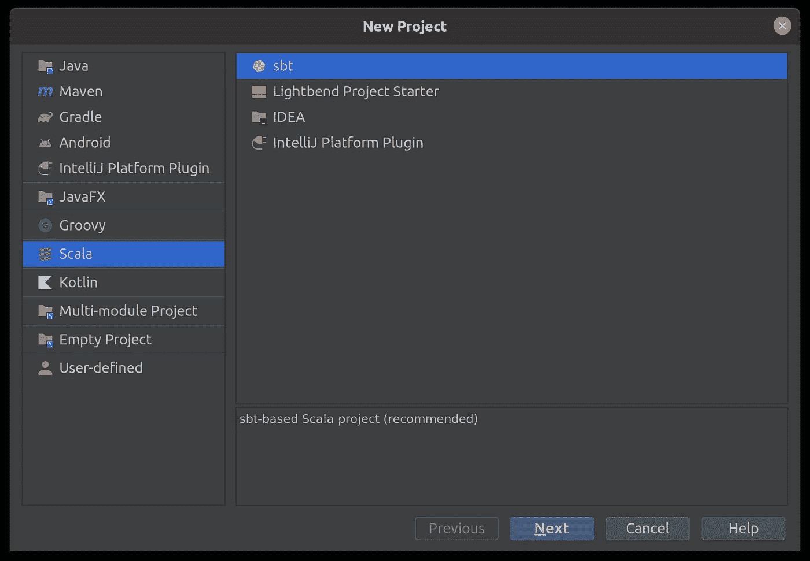

然后，命名您的项目并选择正确的 JDK、SBT 和 Scala 版本。确保版本与我们之前安装的一致！

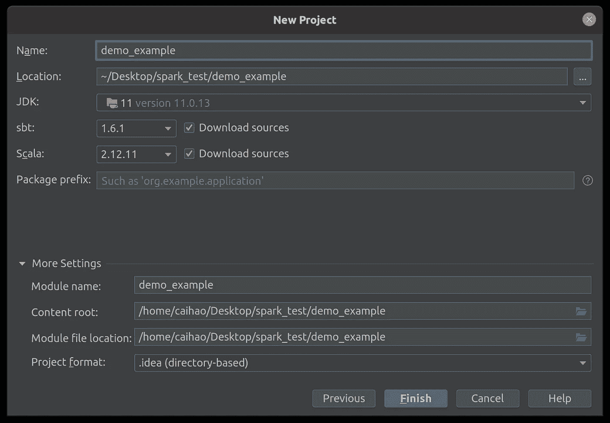

然后点击**完成**，您将看到项目视图:

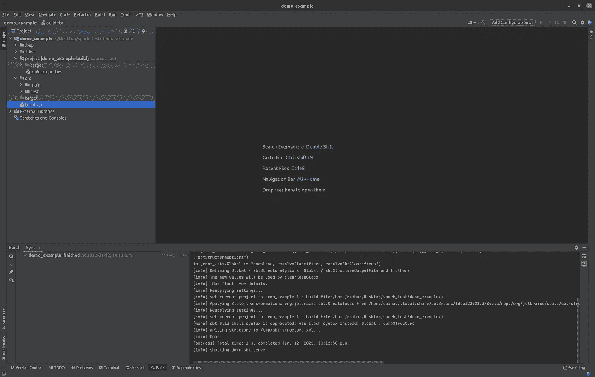

打开 **build.sbt** 文件，修改如下:

```
name := "demo_example"scalaVersion := "2.12.11"version := "1.0"libraryDependencies += "org.scala-lang.modules" %% "scala-parser-combinators" % "1.1.2"
libraryDependencies += "org.apache.spark" %% "spark-core" % "3.2.0"
libraryDependencies += "org.apache.spark" %% "spark-mllib" % "3.2.0"
libraryDependencies += "org.apache.spark" %% "spark-sql" % "3.2.0"
libraryDependencies += "org.apache.spark" %% "spark-hive" % "3.2.0"
```

最后四行添加 Spark 包作为 Scala 依赖项。一旦你的编辑被保存，你会看到三个选项，**刷新项目**，**启用自动导入，**和**忽略**。点击**启用自动导入**，以便 IDEA 开始下载依赖项。它还会在每次对 build.sbt 进行更改时构建您的项目。一旦完成，您将在左侧窗格的外部库中看到所有 spark 依赖项。

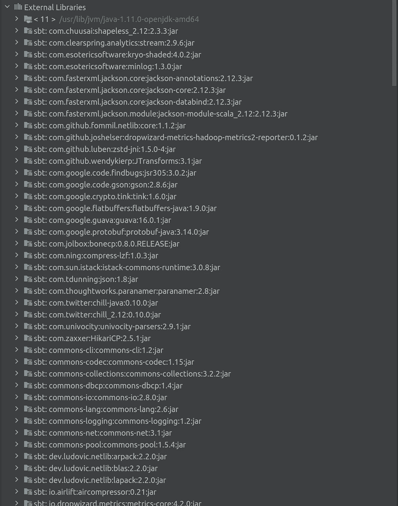

## 2.2 创建并运行示例 Scala/Spark 脚本

现在我们可以在这个项目中编写一些 Scala 代码。进入左侧窗格的**src->main->Scala**目录，右键选择 **New - > Scala Class** ，然后选择 **Object** 并输入类名为 **Demo** ，点击 **OK** 。

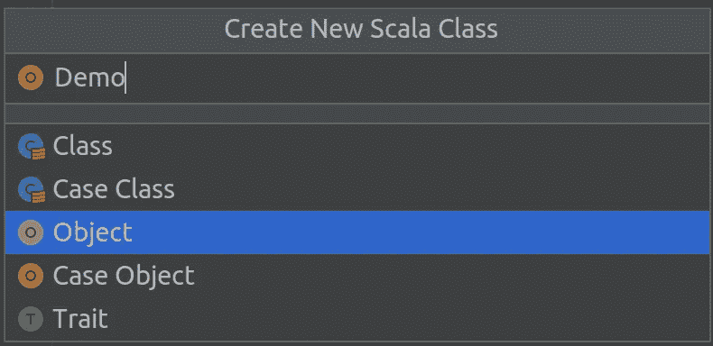

将以下代码添加到 **Demo.scala** 文件中:

```
import org.apache.spark.rdd.RDD
import org.apache.spark.{SparkConf, SparkContext}object Demo {
  def main(args: Array[String]) = {
      val sparkConf: SparkConf = new SparkConf().setMaster("local").setAppName("WordCount")
      val sc = new SparkContext(sparkConf) // 1\. read file, get data by line
      val lines: RDD[String] = sc.parallelize(Array("Hello World Jack", "Hello World Luna", "Hello World Jack")) // 2\. break each line to words
      val words: RDD[String] = lines.flatMap(_.split(" ")) // 3\. split data based on words
      val wordGroup: RDD[(String, Iterable[String])] = words.groupBy(word => word) // 4\. convert data after splitting
      val wordToCount = wordGroup.map {
        case (word, list) => {
          (word, list.size)
        }
      } // 5\. collect the results and print
      val array: Array[(String, Int)] = wordToCount.collect()
      array.foreach(println) // close connection
      sc.stop()
  }
}
```

这段代码做的是对三个句子进行字数统计:“Hello World Jack”、“Hello World Luna”、“Hello World Jack”，并在控制台上打印出结果。右键点击**运行‘演示’**即可运行。在 Spark 的几个日志之后，您应该会看到输出。

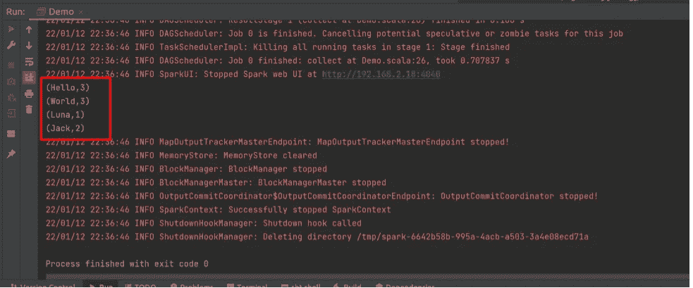

就是这样！现在，您已经运行了您的第一个 Spark 程序！

## 2.3 将 Scala 脚本打包到 jar 文件中

为了提交用 Scala 编写的 Spark 作业，您必须将您的 Scala 代码打包成一个可执行的 Jar 文件。下面是我们的字数统计示例。

点击**文件- >项目结构- >工件- > + - > JAR - >从有依赖关系的模块**。

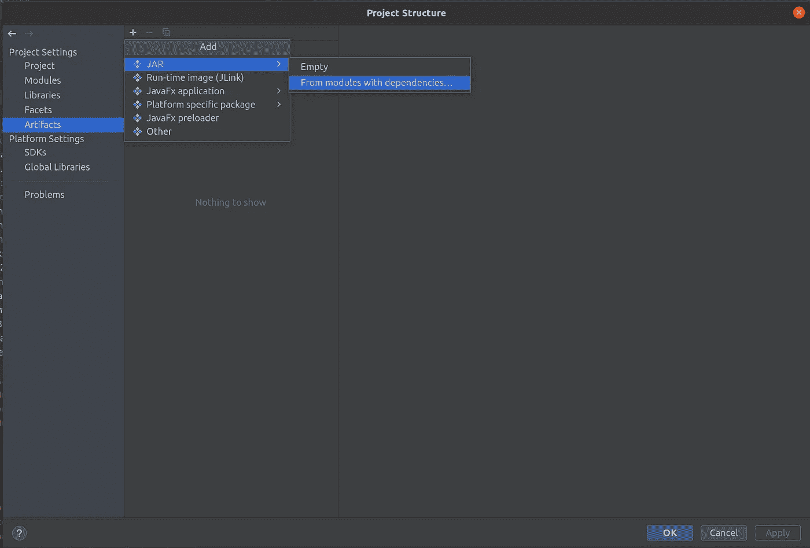

选择**模块:demo_example** 和**主类:Demo** ，点击 **OK** 。

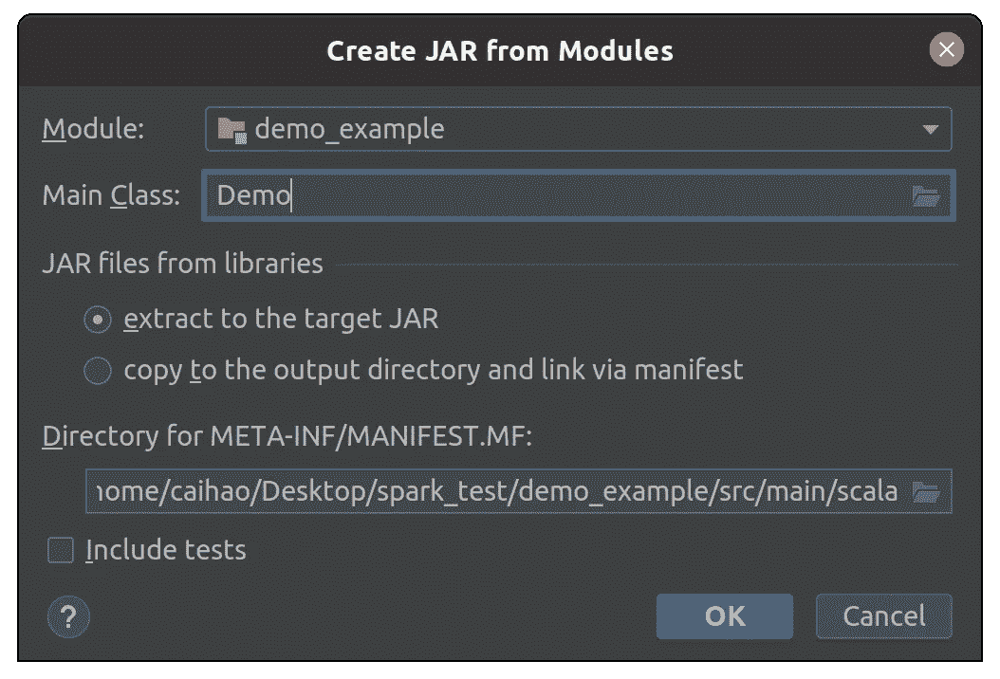

然后，移除**输出布局**中的外部 lib 包支持，只保留**‘demo _ example’编译输出**。点击**确定**。

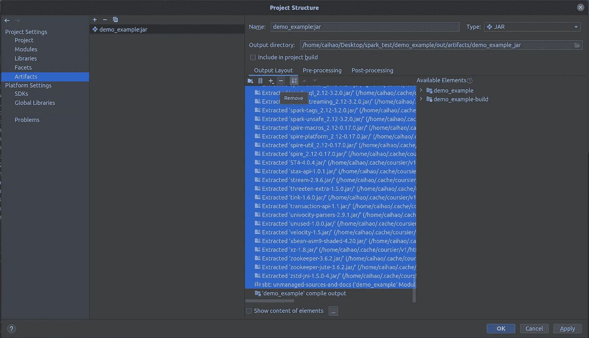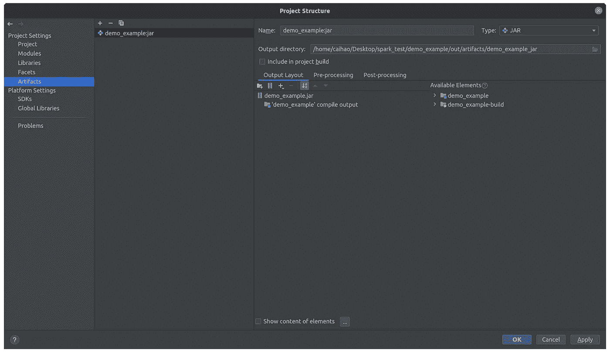

最后，通过点击**Build->Build Artifacts->demo _ example:Jar->Build**，编译生成 Jar 文件。您将在左侧面板的`out/artifacts/demo_example_jar/`中看到一个 **demo_example.jar** 文件。这是你的 Jar 文件！

现在您可以将这个 jar 文件提交给 Spark 并查看它的运行情况:

```
spark-submit --class Demo --master local your/path/to/demo_example.jar
```

如果您看到下面的内容，这意味着您刚刚成功打包并提交了您的 Scala 应用程序到 Spark。

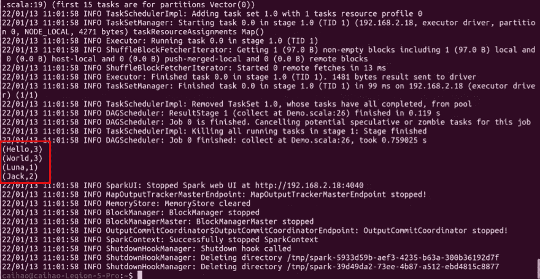

恭喜你！您只是为 Spark 设置了您的环境。现在，您可以编写任何 Spark 应用程序并在集群中运行它们。编码快乐！

Github 回购:[https://github.com/haocai1992/SparkDemo](https://github.com/haocai1992/SparkDemo)

[](https://github.com/haocai1992/SparkDemo) [## GitHub-haokai 1992/spark demo:使用 IntelliJ 创建的 spark 项目的演示示例

### 此时您不能执行该操作。您已使用另一个标签页或窗口登录。您已在另一个选项卡中注销，或者…

github.com](https://github.com/haocai1992/SparkDemo)