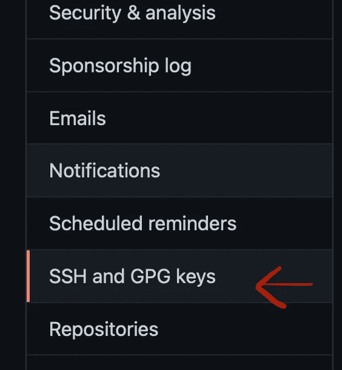
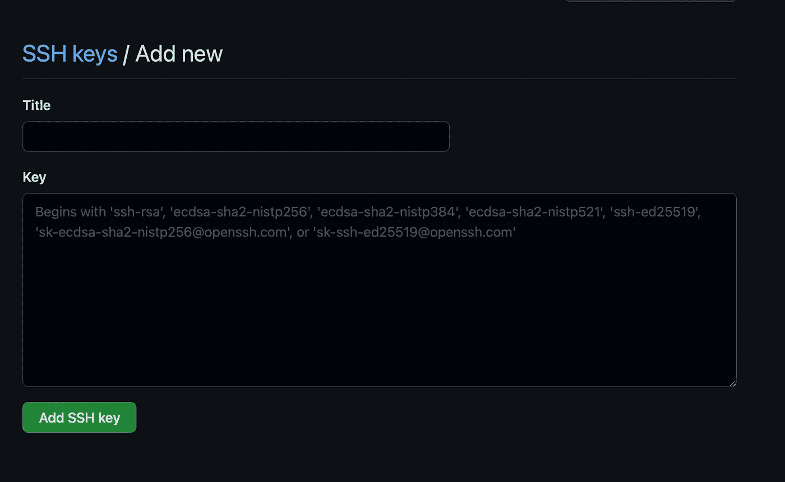
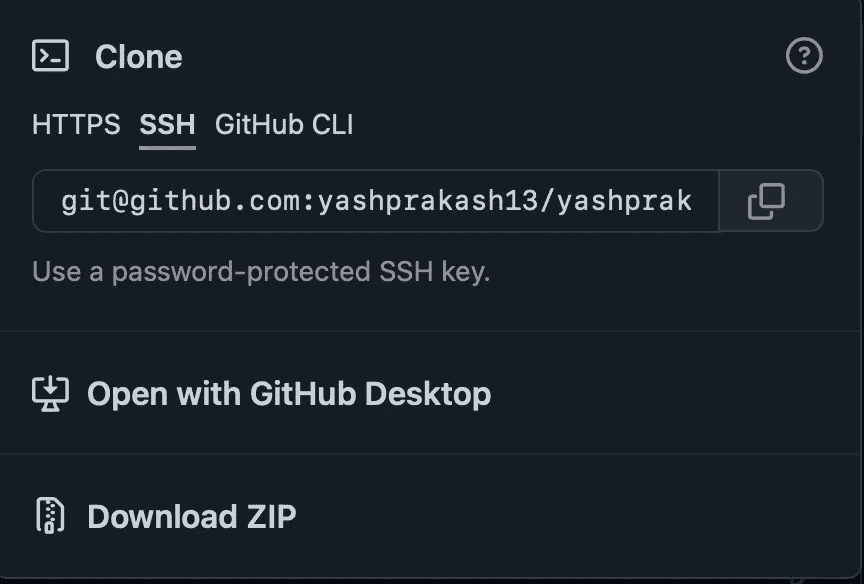

# 如何在一台机器上设置两个或更多 Github 帐户

> 原文：<https://pub.towardsai.net/how-to-setup-2-or-more-github-accounts-on-one-machine-c2b1ff0ea435?source=collection_archive---------3----------------------->

## [编程](https://towardsai.net/p/category/programming)

然后在您的项目中无缝地使用这些帐户！


丹尼·米勒在 [Unsplash](https://unsplash.com?utm_source=medium&utm_medium=referral) 上的照片

作为涉足数据科学的开发人员，我们经常每天使用不止一个 GitHub 帐户。

这些帐户可能与一个工作电子邮件和你的个人帐户相关联，或者甚至与你可能在工作之余使用的第三个电子邮件相关联，你可能需要定期在它们之间切换。

> 本文关注于让[您的数据科学工作流](https://towardsdatascience.com/how-to-use-bash-to-automate-the-boring-stuff-for-data-science-d447cd23fffe) **而不是**被中断，或者更糟，被搞乱，这是由于低效的 GitHub 帐户管理和在可能需要它们的不同项目的备用帐户之间痛苦的切换。

你只需要**四个**简单的步骤来设置它们，而且不会花你超过二十分钟的时间。

我们开始吧👇

# 步骤 0。备份您当前的 SSH 密钥

转到您的终端并键入:

```
$ cd && ls -a
```

**cd** 命令会将您带到您的主用户目录，而 **ls** 命令会显示其中的文件和文件夹列表，包括隐藏的文件和文件夹。

您现在应该寻找一个名为`**.ssh**`的目录。找到它并复制它的所有内容，然后继续阅读本指南。如果您一直使用 GitHub 或任何其他远程服务器登录，您可能有多个 ssh 密钥。首先备份它们是很重要的。

如果你在那里没有内容，不用担心。让我们更进一步。

现在，我们可以进入本教程的第一步了。

# 第一步。创建新的 SSH 密钥并注册它们

您可以通过键入并运行以下命令来创建新的 ssh 密钥:

```
ssh-keygen -t rsa -b 4096 -C “your email address”
```

请确保在显示的空白处填写您的第一个 GitHub 账户的电子邮件地址**。**

现在，在提示符下，确保输入要保存新 ssh 密钥的文件的完整路径。例如，`**~/.ssh/id_rsa_personal_github.ssh**` 可以是你个人 GitHub 账号 ssh 密钥的路径。

现在，再次键入命令，但使用您的备用 GitHub 电子邮件地址:

```
ssh-keygen -t rsa -b 4096 -C “your alternate email address”
```

您可以将此文件保存为:`**~/.ssh/id_rsa_alternate_github.ssh**`

> 既然你已经这样做了，如果你需要第三封邮件的话，再做一次。

现在，**向你的 ssh-agent 注册**你的每一个密钥。

使用以下命令执行此操作:

```
ssh-add ~/.ssh/id_rsa_alternate_github.ssh# and then,ssh-add~/.ssh/id_rsa_personal_github.ssh# and again for a third one if you have it.
```

一旦你完成了这个，让我们继续前进到第 2 步。

# 第二步。创建一个全局 git-config 文件

这样做是为了确保您可以轻松地克隆和使用您已经向 ssh-agent 注册的每个电子邮件的项目。

1.  创建新的 git 配置文件:

```
touch ~/.ssh/config
```

请注意，该文件没有关联的扩展名。 ***不包括*** 中的一个’。' txt '分机误接。

## 现在，您只需通过这段代码将每封 GitHub 电子邮件与您的 ssh 密钥关联起来:

```
Host **personal.github.com** # change this for each account you have
HostName github.com 
PreferredAuthentications publickey 
IdentityFile ~/.ssh/**id_rsa_personal_github** # change this also
```

这将确保将您的个人帐户与您在上一步中创建的个人 ssh 密钥相关联。

继续在文件中为您的备用电子邮件添加相同的内容，如果您有第三封电子邮件，也可以添加。

一旦完成，就到了最后一步。

# 第三步。将 SSH 密钥添加到相应的 GitHub.com 帐户设置中

这是在 web 浏览器中完成的，您首先需要导航到 GitHub 帐户的帐户设置。

这是您需要进入的选项卡:



GitHub 设置 ssh 选项卡

现在，点击 ***【添加新键】***

现在，继续复制您的公共 ssh 密钥——扩展名为**的那个。pub** 并粘贴到此处:



将您的 ssh 密钥内容粘贴到这里

现在，对您的备用帐户和第三个帐户进行同样的操作。

然后…你完成了！

就是这个。我们现在可以测试我们的设置了！

# 第四步。测试我们的工作流程——使用 SSH 克隆

导航到任何 GitHub 存储库并复制 ssh 地址。



使用 SSH 克隆

在这里，要用您的个人帐户克隆它，例如，在终端中您可以键入并运行:

```
git clone [git@**personal.github.com**](mailto:git@github.com):your_username/repository_name.git
```

这里，**粗体的**部分是您的主机名(`***Hostname***`)，与您在上一步中在配置文件中定制的主机名相同。

现在，使用不同的电子邮件地址也可以轻松做到这一点！

很方便，不是吗？😄

# 一些总结性的想法…

我记得过去曾多次搞砸我的存储库克隆和提交，因为我忘记了首先编辑我的 git 配置文件。这让我很头疼，也促使我去寻找更好的做事方法。

我希望这篇文章也能对你有所启发。如果您愿意，现在也可以继续探索更多的途径来更好地利用它。

感谢您的阅读！:)

> 另外，如果您觉得这篇文章很有帮助，[请关注我，获取更多关于数据科学、编程和生产力的定期见解！](https://ipom.medium.com/subscribe)

我的几篇类似的文章引起了你的兴趣:

[](https://towardsdatascience.com/the-easy-way-to-prettify-your-terminal-24da896b031a) [## 美化终端的简单方法

### 以确保你是有效率的，同时，让眼睛放松。

towardsdatascience.com](https://towardsdatascience.com/the-easy-way-to-prettify-your-terminal-24da896b031a) [](https://towardsdatascience.com/the-reusable-python-logging-template-for-all-your-data-science-apps-551697c8540) [## 适用于所有数据科学应用的可重复使用的 Python 日志模板

towardsdatascience.com](https://towardsdatascience.com/the-reusable-python-logging-template-for-all-your-data-science-apps-551697c8540)