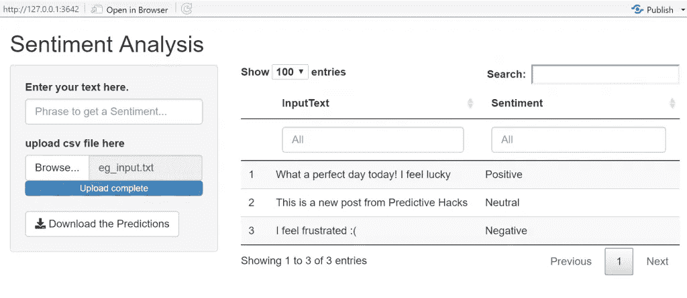
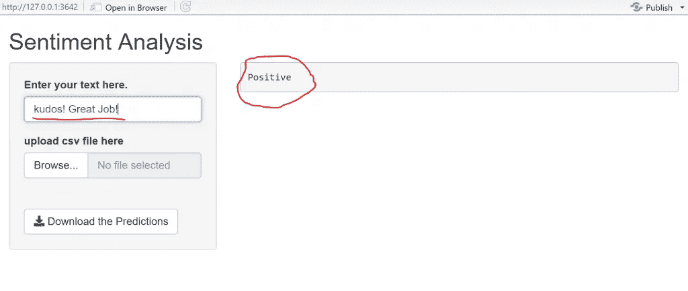
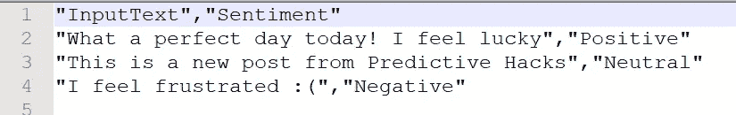

# 如何与 Shiny 共享 Flask APIs

> 原文：<https://pub.towardsai.net/how-to-share-flask-apis-with-shiny-3442cd1bdca8?source=collection_archive---------5----------------------->



## [编程](https://towardsai.net/p/category/programming)， [R](https://towardsai.net/p/category/programming/r)

## 关于如何与 R Shiny 共享 python Flask APIs 的实践教程

作为一名数据科学家，您可能同时使用 R 和 Python，对于某些特定的任务来说，更喜欢一种语言而不是另一种语言是很常见的。例如，对于统计、数据清理和数据可视化，您可能更喜欢 R；对于 NLP 任务和深度学习，您可能更喜欢 Python。此外，当谈到 Restful APIs 时，Python Flask APIs 比 [R Plumber 和 rest serve](https://predictivehacks.com/rest-api-in-r-using-restrserve-plumber/)更有优势。

## 场景

假设您已经用 Python 构建了一个模型，并在此基础上构建了一个 Flask API。关于 UI，你更喜欢使用 Shiny。因此，场景是您想要使用 R Shiny 共享您的 Python Flask API。让我们通过一个实际操作的例子来看看如何做到这一点。

## 烧瓶 API

我们提供了一个用于情感分析的 [Flask API 的例子](https://predictivehacks.com/how-to-deploy-ml-models-into-aws-with-elastic-beanstalk/)。为了方便起见，我们提供了以下代码:

`**requirements.txt**`文件如下:

```
certifi==2020.12.5
chardet==4.0.0
click==7.1.2
Flask==1.1.2
idna==2.10
itsdangerous==1.1.0
Jinja2==2.11.3
MarkupSafe==1.1.1
requests==2.25.1
urllib3==1.26.3
vaderSentiment==3.3.2
Werkzeug==1.0.1
```

`**application.py**`文件:

```
from flask import Flask, request, jsonify
from vaderSentiment.vaderSentiment import SentimentIntensityAnalyzer

analyzer = SentimentIntensityAnalyzer()

application = Flask(__name__)

def get_sentiment(my_text):
    vs = analyzer.polarity_scores(my_text)

    sentiment = ''
    if vs['compound'] >= 0.05:
        sentiment = 'Positive'
    elif vs['compound'] <= -0.05:
        sentiment = 'Negative'
    else:
        sentiment = 'Neutral'

    return(sentiment)

[@application](http://twitter.com/application).route("/endpoint", methods=['GET','POST'])
def sentiment_endpoint():
    if request.method == 'POST':
        json_dict = request.get_json()
        if 'my_text' in json_dict:
            result = get_sentiment(json_dict['my_text'])
            return jsonify({'output' : result})
        else:
            return jsonify({
                "status": "failed",
                "message": "parameter 'my_text' is required!"
            })

    if request.method == 'GET':

        my_text = request.args.get('my_text')
        result = get_sentiment(my_text)
        return jsonify({'output' : result})

if __name__=='__main__':
    application.run()
```

## 用 R 调用 API

我们将提供一个例子，说明如何使用 r 调用上述 Flask API。对于这个例子，我们在本地运行 API，这就是为什么 URL 是`http://127.0.0.1:5000`和情感分析，路由是`endpoint`，这就是为什么我们将调用`http://127.0.0.1:5000/endpoint` URL。

让我们来体会一下这句话的含义:

> 多棒的体验啊！我觉得真的很开心🙂

```
library(jsonlite)
library(httr)url="[http://127.0.0.1:5000/endpoint](http://127.0.0.1:5000/endpoint)"body<-list(my_text="What a great experience! I feel really happy :)")b<-POST(url, body = body, encode = "json")t1<-content(b, type="application/json")t1
```

**输出:**

```
$output [1] 
"Positive"
```

不出所料，这句话的感情是 ***正*** 。

# 构建闪亮的应用程序

我们已经提供了一个[如何与 Shiny](https://predictivehacks.com/how-to-share-your-machine-learning-models-with-shiny/) 分享你的机器学习模型的例子。因为我们将应用相同的架构，所以看一看它会很有帮助。

闪亮的应用程序将有两个功能

*   获得一个短语作为输入，并返回情感，例如“**正**”、“**中性**”、“**负**”。
*   To 可以选择**上传**一个`.txt`文件，用制表符分隔许多短语，并通过添加情感列返回一个. txt 文件。

让我们构建闪亮的应用程序:

```
library(shiny)
library(DT)
library(tidyverse)
library(jsonlite)
library(httr)# Define UI for application that draws a histogram
ui <- fluidPage(

    # Application title
    titlePanel("Sentiment Analysis"),

    # Sidebar with a slider input for number of bins 
    sidebarLayout(
        sidebarPanel(

            textInput("caption", label="Enter your text here.", value="", placeholder = "Phrase to get a Sentiment..."),
            verbatimTextOutput("value"),

            # Input: Select a file ----
            fileInput("file1", "upload csv file here",
                      multiple = FALSE,
                      accept = c("text/csv",
                                 "text/comma-separated-values,text/plain",
                                 ".csv")), 

            # Button
            downloadButton("downloadData", "Download the Predictions")
        ),

        # Show the table with the predictions
        mainPanel(
            verbatimTextOutput("Sentiment"),
            DT::dataTableOutput("mytable")
        )
    )
)# Define server logic required to draw a histogram
server <- function(input, output) {

    reactiveDF<-reactive({
        req(input$file1)
        df <- read.csv(input$file1$datapath, sep="\t", stringsAsFactors = FALSE)

        url="[http://127.0.0.1:5000/endpoint](http://127.0.0.1:5000/endpoint)"

        fdf<-NULL
        for (i in 1:nrow(df)) {
            body<-list(my_text=df[i,1])
            b<-POST(url, body = body, encode = "json")
            t1<-content(b, type="application/json")
            tmpdf<-data.frame(InputText=df[i,1], Sentiment=t1$output)

            fdf<-rbind(fdf, tmpdf)                   
        }
        return(fdf)

    })

    output$mytable <- DT::renderDataTable({
        req(input$file1)

        return(DT::datatable(reactiveDF(),  options = list(pageLength = 100), filter = c("top")))
    })

    reactiveInput<-reactive({
        req(input$caption)

        url="[http://127.0.0.1:5000/endpoint](http://127.0.0.1:5000/endpoint)"

        body<-list(my_text=input$caption)

        b<-POST(url, body = body, encode = "json")

        t1<-content(b, type="application/json")

        df<-data.frame(Sentiment=t1$output)

        return(df)

    })

    output$Sentiment<-renderText({

        req(input$caption)
        reactiveInput()$Sentiment

    })

    # Downloadable csv of selected dataset ----
    output$downloadData <- downloadHandler(
        filename = function() {
            paste("data-", Sys.Date(), ".csv", sep="")
        },
        content = function(file) {
            write.csv(reactiveDF(), file, row.names = FALSE)
        }
    )

}# Run the application 
shinyApp(ui = ui, server = server)
```

## 获得感悟

让我们看看闪亮的应用程序是如何工作的。

**以互动的方式获取文档的情感**

让我们给出以下输入作为输入:

> *太棒了！干得好！*

正如我们所看到的，这个闪亮的应用程序给了我们一个输入的机会，并且它以一种互动的方式返回情感



**交互式获取多个文档的情感**

如果我们有很多文档，比如成千上万的评论，我们希望获得每一篇评论的情感，这个闪亮的应用程序给我们提供了上传数据的选项，它还可以下载这些数据，并有一个额外的情感得分栏。

**输入文件**


让我们把它上传到 Shiny 并得到结果:


正如我们所看到的，它接受 txt 文件作为输入，并返回带有预测情绪的输入文本。我们也可以下载以下文件:



# 外卖

要点是，您可以使用 Python 和 Flask APIs 作为后端，使用 Shiny 作为前端，将您的模型作为应用程序共享。所以，让我们记住，Shiny 可以成为 Flask jinja 的替代品。

*原载于*[*https://predictivehacks.com*](https://predictivehacks.com/how-to-share-flask-apis-with-shiny-applications/)*。*