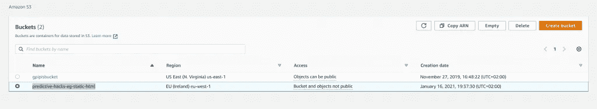
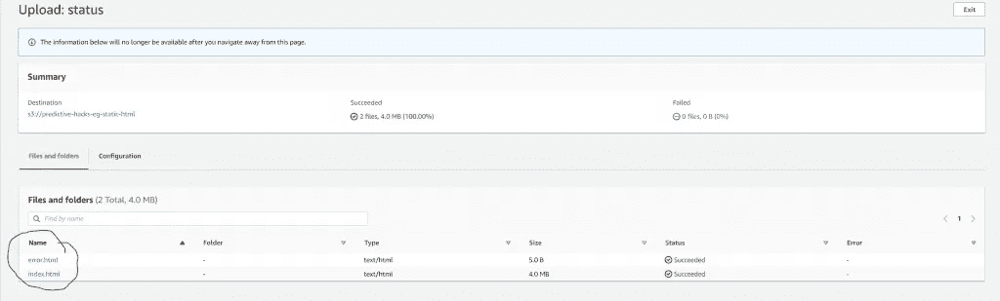
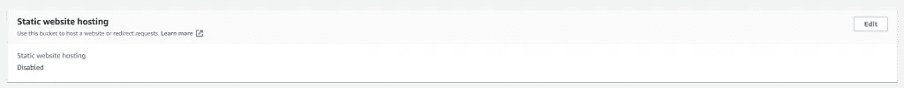
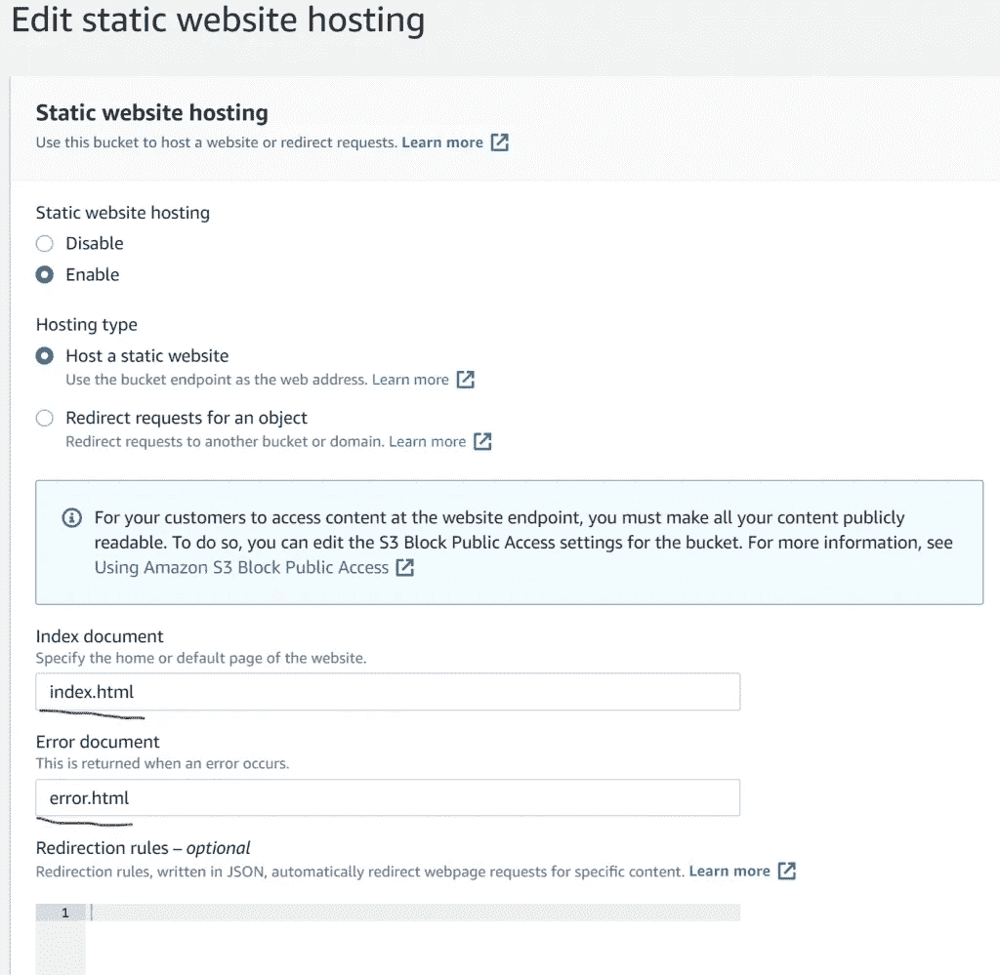
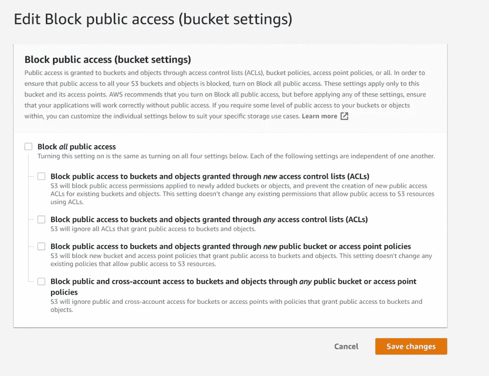
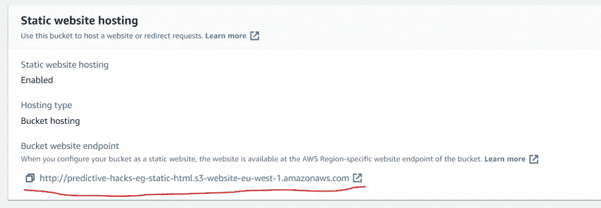
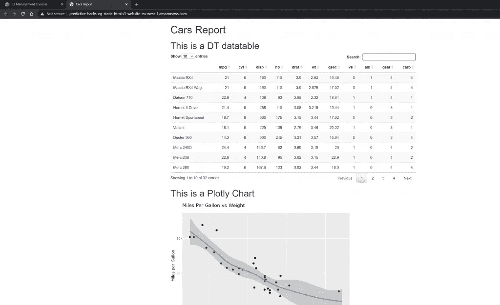

# 如何将您的笔记本作为静态网站与 AWS S3 共享

> 原文：<https://pub.towardsai.net/how-to-share-your-notebooks-as-static-websites-with-aws-s3-c119242c5d40?source=collection_archive---------3----------------------->

## [编程](https://towardsai.net/p/category/programming)

## 如何将报告作为静态网站与 AWS S3 共享的演练示例


数据科学家过去常常使用像 **Jupyter** 和 **RMarkdown** 这样的笔记本。通过笔记本，他们可以轻松地以 HTML 格式分享他们的分析。但是，当需要公开共享笔记本电脑时，该怎么办呢？在这种情况下，最方便的方法是配置一个亚马逊 S3 桶作为一个静态网站。在本教程中，我们将为您提供一个演示示例，演示如何通过 AWS S3 将您的笔记本作为静态网站进行共享。

# 创建您的报告

报告应该是 HTML 格式的。让我们使用 RMarkdown 在 R 中创建一个虚拟报表。让我们创建 Rmd 报告:

```
---title: "Cars Report"output: html_document---```{r setup, include=**FALSE**}knitr::opts_chunk$set(echo = **FALSE**, warning = **FALSE**, message = **FALSE**)```# This is a DT datatable```{r}# Load the librarieslibrary(DT)library(tidyverse)library(plotly)DT::datatable(mtcars, options=list(pageLength = 10))```# This is a Plotly Chart```{r}my_plot <- ggplot(mtcars,aes(x=wt,y=mpg)) + geom_point()+ ggtitle("Miles Per Gallon vs Weight") +xlab('Weight (x 1000lbs)') + ylab('Miles per Gallon') + geom_smooth()ggplotly(my_plot)```
```

最后，我们把它编织成 HTML，并存储在本地。

# 创建您的 S3 桶

现在您必须登录到 AWS 控制台并创建一个新的 bucket。在我的例子中，我创建了`predictive-hacks-eg-static-html`



然后，您需要上传您的 HTML 报告，名为“index.html”和一个“错误”,以便在出现错误时返回。在我的例子中，我称之为“error.html”



现在，你需要去 S3 桶，去属性和编辑静态网站托管。



您可以启用网站托管，并分别指定索引和错误文档。



然后，您需要转到 bucket Permissions，取消选中“阻止所有公共访问”，然后单击“保存更改”



然后，您需要通过输入以下内容来编辑存储桶策略:

```
{
    "Version": "2012-10-17",
    "Statement": [
        {
            "Sid": "PublicReadGetObject",
            "Effect": "Allow",
            "Principal": "*",
            "Action": [
                "s3:GetObject"
            ],
            "Resource": [
                "arn:aws:s3:::predictive-hacks-eg-static-html/*"
            ]
        }
    ]
}
```

其中`predictive-hacks-eg-static-html`是我的桶。你应该写你的。

现在你应该准备好了。如果你去桶属性，你会看到你的公共网址链接。



我这里是[**http://predictive-hacks-eg-static-html . S3-website-eu-west-1 . Amazon AWS . com**](http://predictive-hacks-eg-static-html.s3-website-eu-west-1.amazonaws.com/)。如果你点击链接，你应该可以看到我的报告。



最后，请注意，亚马逊 S3 不支持 HTTPS 访问网站。如果你想使用 HTTPS，你可以使用亚马逊 CloudFront 服务于亚马逊 S3 上的一个静态网站。

最初由[预测黑客发布](https://predictivehacks.com/how-to-share-your-notebooks-as-static-websites-with-aws-s3/)