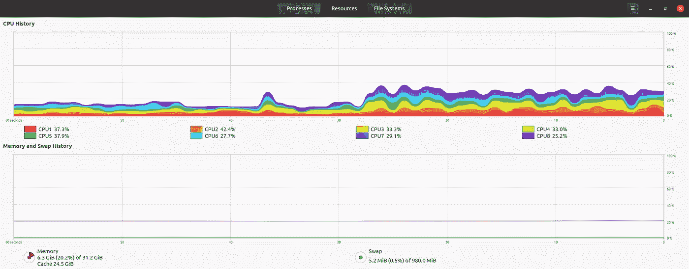
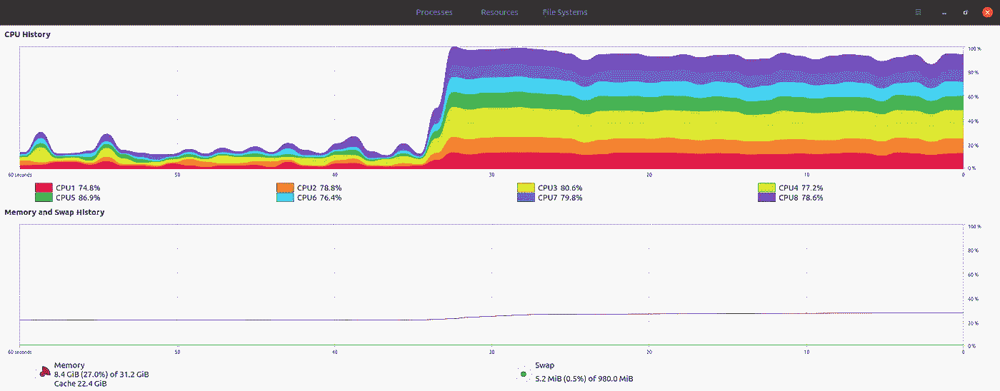

# 如何将网格搜索速度提高 60 倍

> 原文：<https://pub.towardsai.net/how-to-speed-up-your-grid-search-60x-fec2a8250517?source=collection_archive---------3----------------------->

包括示例笔记本和数据集


照片由[威廉·基瑟林](https://unsplash.com/@pictorious?utm_source=medium&utm_medium=referral)在 [Unsplash](https://unsplash.com?utm_source=medium&utm_medium=referral) 上拍摄

# 示例笔记本

在本文中，我们将使用一个名为 GridSearchCV 的笔记本，它是使用来自 GeeksforGeeks 网站上的[帖子](https://www.geeksforgeeks.org/hyperparameter-tuning-using-gridsearchcv-and-kerasclassifier/)的代码创建的。我们将调整 Keras 分类器的网格搜索超参数。

以下是您自己下载和运行笔记本所需的文件:

*   [笔记本](https://drive.google.com/file/d/1PiCEL8SwmMx7Hvzrk_zK8rA6Y6aYgmab/view?usp=sharing)
*   [数据集](https://drive.google.com/file/d/1mGqI-SZAcD8aPheTAXxqCswGRNqfD96H/view?usp=sharing)

# 网格搜索刷新程序

网格搜索是一种技术，通过系统地测试超参数的不同组合，帮助数据科学家找到模型的最佳设置。

例如，假设您正在训练一个神经网络来对手写数字的图像进行分类。您可能希望试验不同数量的隐藏层和每层中不同数量的神经元。网格搜索不是随机猜测这些超参数的不同值，而是允许数据科学家系统地尝试不同的值组合，并查看哪一个给出最佳结果。

# 基线性能

由于网格搜索是本例中计算量最大的部分，我们将只关注包含网格搜索的单元格(单元格#5)。

为了获得单元运行时的基线性能，我们使用了一台具有 8 个 CPU 内核和 32gb RAM 的笔记本电脑。细胞在 26 分 43 秒内完成。

# 我们的增强功能

让我们对这种细胞有更多的了解，并研究加速它的方法。

1.  **并行化网格搜索**

默认情况下，网格搜索只使用 1 个 CPU 内核，笔记本电脑上的其他 7 个内核处于空闲状态。这可以通过并行化来改善，网格搜索非常适合并行化。

下面的屏幕截图显示了笔记本电脑的资源利用率，您可以看到不到一半的内核正在使用。



使用 1 个内核的网格搜索

第一个增强是最低限度的，只需要对代码做一点小小的调整。我们将 GridSearchCV 调用中的 n_jobs 参数设置为-2，以便使用除 1 个内核之外的所有内核。剩下的 1 个核心是为其他计算机进程留出回旋的空间，这通常是一种好的做法。

我们的代码行应该如下所示:

```
GridSearchCV(estimator=model, param_grid=params, cv=10, n_jobs=-2)
```

我们在之前实验使用的同一台笔记本电脑上运行，该单元在 7 分 34 秒内完成。



使用所有 7 个核心进行网格搜索

**2。利用更大的机器**

第二个增强是非侵入性的，不需要修改代码。相反，由于网格搜索现在能够在给定的尽可能多的内核上并行运行，我们在一台拥有 120 个内核的更大的机器上运行了它。

正如预期的那样，该单元使用了 119 个内核，并在 27 秒内完成—比第一次运行时提高了 60 倍！

> 🏎27 秒后

# 关键要点

那么，在前进的道路上，我们应该记住什么？

*   网格搜索是非常并行的任务(因为没有一个训练实验是相互依赖的)，但是一开始我们没有利用这个属性。单核处理是某些软件包中的默认设置，因此请确保检查您笔记本电脑的资源利用率。
*   从 1 核到 119 核，性能一路提升。由于网格搜索的并行性，在其他网格搜索情况下，可以预期类似的缩放。然而，数据集的大小可能会产生影响(例如，如果您使用的是大型数据集，将会有更多的 RAM 开销)，并且可能会有一个收益递减点(例如，300 个内核可能会降低网格搜索的速度)。

# 解决方案选项

最后，完成本文中的目标需要什么工具或资源？

要获得与上面类似的结果，您需要一台拥有 120 个 CPU 内核的机器。除非你或你的公司有一个现成的，否则你的选择可能是:

*   自己调配一个云实例。
*   请 DevOps 或 IT 部门调配云实例。
*   使用提供云实例的 ML 服务。确保您正在评估的服务可以访问您需要的实例类型。

快乐实验🧪