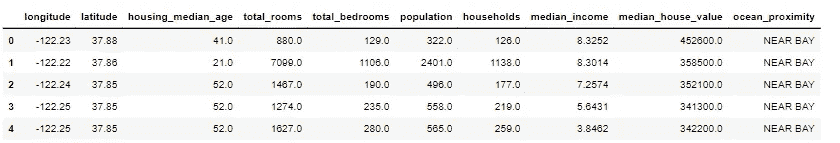
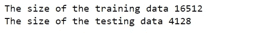
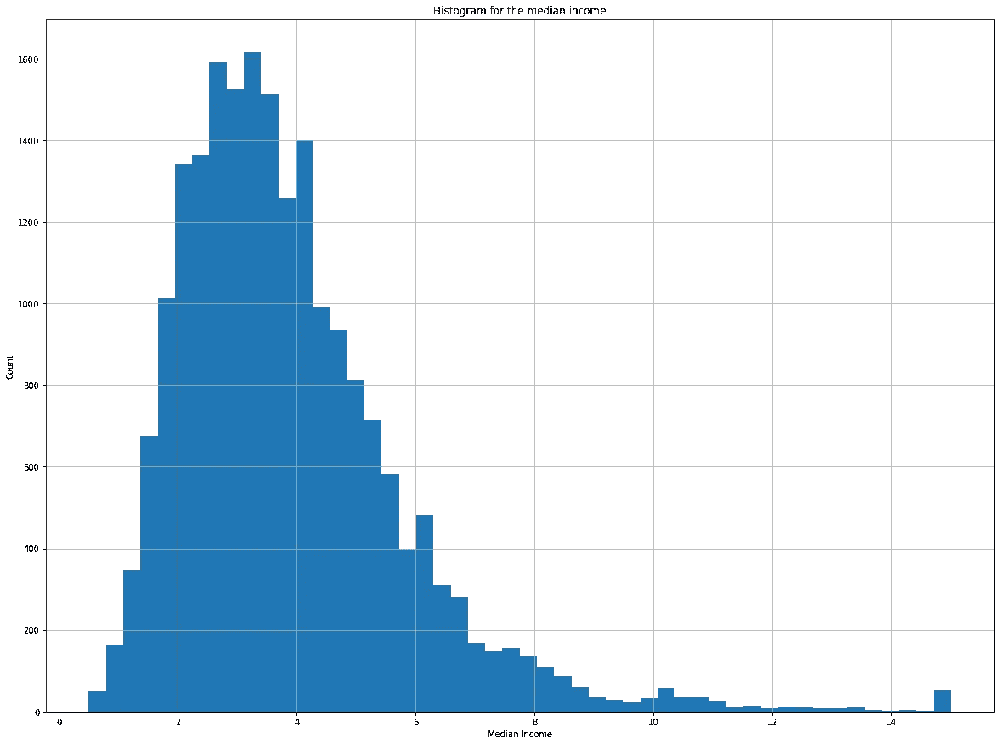
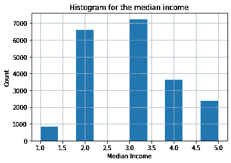
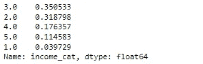
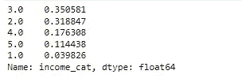

# 如何为您的数据科学项目有效地拆分数据

> 原文：<https://pub.towardsai.net/how-to-split-the-data-effectively-for-your-data-science-project-a9cb6a387b70?source=collection_archive---------0----------------------->

对于任何数据科学项目来说，数据都是最重要的资源之一。但是如果你不能有效地使用它，那么丰富的数据又有什么用呢？毕竟，作为一名数据科学家，你的成功取决于你如何熟练地操纵和分析数据，从中得出可操作的见解。

收集数据后，数据科学项目中的一个常见步骤是将数据分为训练和测试。虽然这一步看起来很简单，但如果以有效的方式完成，它可能会影响你的结果，并导致不切实际的模型。考虑到这一点，作为一名数据科学家，本文将带您完成有效分割数据的步骤。这些提示将帮助您了解如何为不同类型的分析拆分数据。我们还将探讨拆分数据的一些潜在问题，并给出一些在执行此过程时要遵循的一般规则。请继续阅读，了解更多信息！

由[班农·莫里西](https://unsplash.com/@bannon15?utm_source=medium&utm_medium=referral)在 [Unsplash](https://unsplash.com?utm_source=medium&utm_medium=referral) 上分割你的数据/照片

## 目录:

1.  **为什么要拆分数据？**
2.  **拆分比例应该是多少？**
3.  **年初拆分**
4.  **一致拆分**
5.  **避免采样偏差**
6.  **参考文献**

**您可以在 GitHub 资源库中找到本文中使用的代码:**

 [## GitHub-youssefHosni/机器学习-实用指南

### 此时您不能执行该操作。您已使用另一个标签页或窗口登录。您已在另一个选项卡中注销，或者…

github.com](https://github.com/youssefHosni/Machine-Learning-Practical-Guide) 

如果你想免费学习数据科学和机器学习，看看这些资源:

*   免费互动路线图，自学数据科学和机器学习。从这里开始:[https://aigents.co/learn/roadmaps/intro](https://aigents.co/learn/roadmaps/intro)
*   数据科学学习资源搜索引擎(免费)。将你最喜欢的资源加入书签，将文章标记为完整，并添加学习笔记。[https://aigents.co/learn](https://aigents.co/learn)
*   想要在导师和学习社区的支持下从头开始学习数据科学吗？免费加入这个学习圈:[https://community.aigents.co/spaces/9010170/](https://community.aigents.co/spaces/9010170/)

如果你想在数据科学&人工智能领域开始职业生涯，但你不知道如何开始。我提供数据科学指导课程和长期职业指导:

*   长期师徒:【https://lnkd.in/dtdUYBrM】T2
*   辅导会议:【https://lnkd.in/dXeg3KPW 

***加入*** [***中等会员***](https://youssefraafat57.medium.com/membership) ***计划，只需 5 美元就可以无限制地继续学习。如果你使用下面的链接，我会收到一小部分会员费，不需要你额外付费。***

# 1.为什么要拆分数据？

法德赫拉官员在 [Unsplash](https://unsplash.com?utm_source=medium&utm_medium=referral) 上的照片

将数据分割成训练和测试或分割成训练、验证和测试是监督机器学习项目中的常见步骤。训练集用于拟合和训练模型，而测试集用于评估已训练的模型，以便更好地了解模型在新数据上的表现以及它在生产环境中的表现。因此，测试数据需要与生产中预期看到的数据相似。

另一种常见的拆分技术是将数据拆分成三个数据集:训练、验证和测试数据集。验证数据集将用于为您的项目选择最佳超参数。

# 2.拆分比例应该是多少？

照片由[卡里姆·曼吉拉](https://unsplash.com/@karim_manjra?utm_source=medium&utm_medium=referral)在 [Unsplash](https://unsplash.com?utm_source=medium&utm_medium=referral) 上拍摄

测试数据的百分比取决于许多因素，这就是为什么没有最佳分割百分比。您必须选择符合项目目标的分割百分比，考虑因素包括:

*   **训练模型的计算成本:**如果训练模型的成本很高，这可能会影响我们评估多个模型的能力，尤其是当我们将使用验证数据集时。
*   **数据的大小:**如果我们有一个小数据集，这是一个非常重要的因素，因此我们可能无法分割数据。另一个好的选择是使用 k 倍交叉验证进行评估。如果数据的大小非常大，那么分割一小部分数据并将其用作测试数据集就足够了。

但是，有一些常见的分割百分比:

*   培训:80%，测试:20%
*   培训:67%，测试:33%
*   培训:50%，测试:50%
*   培训 90%，测试 10 %
*   训练 95%，测试 5%

# 3.一开始就分开了

由[张晞彤·基弗](https://unsplash.com/@yanneskiefer?utm_source=medium&utm_medium=referral)在 [Unsplash](https://unsplash.com?utm_source=medium&utm_medium=referral) 上拍摄的照片

一个重要的实用技巧是在收集数据后，在项目的早期阶段直接拆分数据。虽然在您的数据科学项目的早期阶段，甚至在数据探索之前就自愿留出一部分数据听起来可能很奇怪。这是因为你的大脑是一个惊人的模式检测系统，这意味着它非常容易过度拟合:如果你查看测试集，你可能会在测试数据中偶然发现一些看似有趣的模式，导致你选择一种特定的机器学习模型。因此，当您在训练模型后使用测试集来估计泛化错误时，您的估计会过于乐观，并且您会将系统投入生产，而该系统的性能不会像预期的那样好。这被称为**窥探数据偏差**或**数据泄漏**。

# 4.一致分裂

[腾雅特](https://unsplash.com/@tengyart?utm_source=medium&utm_medium=referral)在 [Unsplash](https://unsplash.com?utm_source=medium&utm_medium=referral) 上拍照

虽然创建一个测试集在理论上很简单:你可以随机选择一些实例，通常是数据集的 20%,并把它们放在一边，如下面的代码所示，但是在此之前，让我们加载我们将要使用的数据。在本文中，我们将使用加利福尼亚房价数据集:

加利福尼亚住房数据集的前五行。

现在，让我们定义拆分函数，将数据拆分为训练集和测试集:

这种方法是可行的，但是它有一个主要的伪像。如果您再次运行代码，它将生成一个不同的测试集！随着时间的推移，你(或你的机器学习算法)将会看到整个数据集，这是你想要避免的。有一些潜在的解决方案可以避免这种情况:

*   一种解决方案是将第一次运行时的测试集保存在一个单独的文件中，然后在后续运行中加载它。
*   另一个选项是在调用 np.random.permutation()之前设置随机数生成器的种子(例如， **np.random.seed(42)** )，以便它总是生成相同的混洗索引。

**然而，这两种解决方案都将在您下次获取更新的数据集时失效**。一个更好、更可靠的解决方案是使用每个实例的标识符来决定它是否应该进入测试集(假设实例有一个惟一的、不可变的标识符)。例如，您可以计算每个实例标识符的散列值，如果该散列值小于或等于最大散列值的 20%,则将该实例放入测试集中。这可以确保测试集在多次运行中保持一致，即使刷新数据集也是如此。新的测试集将包含 20%的新实例，但它不包含以前在训练集中的任何实例。

下面是一个可能的实现:

不幸的是，我们的住房数据集没有标识符列。最简单的解决方案是使用行索引作为 ID:

但是，需要注意的是，如果使用行索引作为唯一标识符，则需要确保新数据被追加到数据集的末尾，并且不会删除任何行。如果这是不可能的，那么你可以尝试使用最稳定的特性来建立一个唯一的标识符。例如，在住房数据集中，地区的纬度和经度是非常好的选择，因为它们保证在几百万年内保持稳定，所以您可以将它们组合成如下所示的 ID:

**Scikit-Learn** 提供了一些函数来以各种方式将数据集分割成多个子集。最简单的函数是 **train_test_split** ，它与之前定义的函数 split_train_test 做了几乎相同的事情，并增加了一些特性。首先，有一个 random_state 参数，允许您按照前面的说明设置随机生成器种子；其次，您可以将它传递给具有相同行数的多个数据集，它将在相同的索引上拆分它们(这非常有用，例如，如果您有一个单独的数据帧用于标注):

# 5.避免采样偏差

到目前为止，我们已经考虑了获取和分割测试数据的纯随机抽样方法。如果数据集足够大(尤其是相对于属性的数量而言)，这通常没什么问题，但如果不是这样，就有引入显著采样偏差的风险。

照片由 [Shubham Dhage](https://unsplash.com/@theshubhamdhage?utm_source=medium&utm_medium=referral) 在 [Unsplash](https://unsplash.com?utm_source=medium&utm_medium=referral) 上拍摄

让我们考虑一个调查公司，它决定打电话给 1000 个人问他们几个问题，他们不只是在电话簿里随机挑选 1000 个人。他们试图确保这 1000 人代表整个人口。例如，美国人口由 51.3%的女性和 48.7%的男性组成，因此一项在美国进行的良好调查将试图保持样本中的这一比例:513 名女性和 487 名男性。当分割数据集时，我们应该尝试做同样的事情。

这被称为**分层抽样，**在分层抽样中，人口被分成称为阶层的同质子群，并且从每个阶层中抽样正确数量的实例，以保证测试集代表总体人口。所以在前面的例子中，如果他们使用纯粹的随机抽样，将有大约 12%的机会抽样一个女性少于 49%或多于 54%的倾斜测试集。无论哪种情况，调查结果都会有很大偏差。

让我们回到这篇博客中使用的房价数据集。我们可以假设中位收入是预测中位房价的一个非常重要的属性。因此，我们应该确保测试集能够代表整个数据集中的各种收入类别。

由于中值收入是一个连续的数字属性，您首先需要创建一个收入类别属性。让我们绘制一个中值收入特征的直方图，并仔细观察它:

我们可以看到，大多数收入中值都聚集在 2 到 5 左右(即 2 万美元到 5 万美元)，但一些收入中值远远超过 6(即 6 万美元)。在数据集中为每个地层提供足够数量的实例非常重要，否则对地层重要性的估计可能会有偏差。这意味着你不能有太多的阶层，每个阶层都要足够大。

下面的代码创建了一个收入类别属性，方法是将收入中值除以 1.5(以限制收入类别的数量)，并使用 ceil 进行舍入(以获得离散的类别)，然后只保留低于 5 的类别，并将其他类别合并到类别 5 中:

现在你可以根据收入类别进行分层抽样了。为此，我们将使用 Scikit-Learn 的 **StratifiedShuffleSplit** 类:

让我们看看这是否如预期的那样起作用。首先，您可以查看分层测试集中的收入类别比例，并将其与总体数据集中的比例进行比较:

您还可以按如下方式测量完整数据集中收入类别的比例:

如您所见，使用分层抽样生成的测试集的收入类别比例几乎与完整数据集中的相同。

# 参考资料:

1.  使用 Scikit-Learn、Keras 和 Tensorflow 进行机器实践学习
2.  本文中使用的代码可以在这个 GitHub 资源库中找到

 [## GitHub-youssefHosni/机器学习-实用指南

### 此时您不能执行该操作。您已使用另一个标签页或窗口登录。您已在另一个选项卡中注销，或者…

github.com](https://github.com/youssefHosni/Machine-Learning-Practical-Guide) 

*感谢阅读！如果你喜欢这篇文章，一定要鼓掌(高达 50！)并在* [*LinkedIn*](https://www.linkedin.com/in/youssef-hosni-b2960b135/) *上与我联系，并在*[*Medium*](https://youssefraafat57.medium.com/)*上关注我的新文章。*